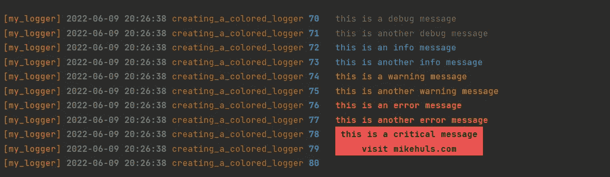

# Python 的彩色日志

> 原文：<https://medium.com/geekculture/colored-logs-for-python-2973935a9b02?source=collection_archive---------1----------------------->

## 将彩色消息打印到控制台

Adding some color to our console logs! (image by author)

日志记录是开发应用程序的一个重要组成部分，它可以让你快速调试，并对应用程序中发生的事情有更广泛的了解。在这篇简单而简短的文章中，我们将通过添加一些颜色来使我们的控制台日志更加清晰。我们来编码吧！

## 准备