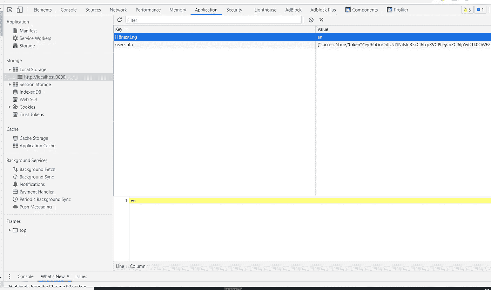

# 将后端和前端与 NodeJs 和 ReactJs-Logout 结合起来(第 7 部分)

> 原文：<https://medium.com/geekculture/combining-back-end-and-front-end-with-nodejs-and-reactjs-logout-part-7-5c851ed8b5ab?source=collection_archive---------13----------------------->


在本文中，我将解释如何在注销页面中组合 NodeJs 和 ReacJs。这将是 7。关于后端文章，如果您想阅读以前的文章，请访问:

[](/geekculture/signup-login-application-with-nodejs-express-and-mongodb-658498e580cf) [## 用 NodeJs、Express 和 MongoDB 注册/登录应用程序(第 1 部分)

### 在本文中，我将讲述如何用 NodeJs 和 MongoDB 创建一个注册项目。我们开始吧。

medium.com](/geekculture/signup-login-application-with-nodejs-express-and-mongodb-658498e580cf) [](/geekculture/logout-with-nodejs-express-and-mongodb-9b73e8b01137) [## 用 NodeJs、Express 和 MongoDB 注销(第 2 部分)

### 在以前的文章中，我写过如何用 NodeJs、Express 和 MongoDB 创建注册和登录应用程序。的…

medium.com](/geekculture/logout-with-nodejs-express-and-mongodb-9b73e8b01137) [](/geekculture/email-verification-with-nodejs-part-3-e004787391e3) [## NodeJs 电子邮件验证(第 3 部分)

### 在这篇文章中，我写了如何在注册应用程序中验证电子邮件。为此，我用我的旧代码，邮递员…

medium.com](/geekculture/email-verification-with-nodejs-part-3-e004787391e3) [](/geekculture/forgot-password-in-signup-application-with-nodejs-and-mongodb-part-4-51378dddd716) [## 用 NodeJs 和 MongoDB 注册应用程序时忘记了密码(第 4 部分)

### 在本文中，我们将继续注册应用程序。在这一部分，我会写忘记密码，发送电子邮件…

medium.com](/geekculture/forgot-password-in-signup-application-with-nodejs-and-mongodb-part-4-51378dddd716) [](/geekculture/combining-back-end-and-front-end-with-nodejs-and-reactjs-signup-part-5-e9d0797aeedf) [## 用 NodeJs 和 ReactJs-SignUp 组合后端和前端(第 5 部分)

### 当我开始后端编码时，我的主要问题是结合后端和前端。在这篇文章中，我将写关于…

medium.com](/geekculture/combining-back-end-and-front-end-with-nodejs-and-reactjs-signup-part-5-e9d0797aeedf) [](/geekculture/combining-back-end-and-front-end-with-nodejs-and-reactjs-login-part-6-1c8cb6bf4b91) [## 将后端和前端与 NodeJs 和 ReactJs-Login 结合起来(第 6 部分)

### 在本文中，我将继续登录部分。对于以前的文章，你可以去个人资料。我们开始吧。

medium.com](/geekculture/combining-back-end-and-front-end-with-nodejs-and-reactjs-login-part-6-1c8cb6bf4b91) 

如果你都读完了，那就开始吧！

我不编码前端部分，所以我只是给你一个简单的代码，你可以编码，如果你想。但首先，我们将从后端部分开始。实际上在我的其他文章中，我给了你一个注销代码，但是当我开始组合后端和前端时，我意识到我需要一个布尔变量(login)来理解登录和注销。所以我的代码是这样的:

```
*exports*.logout = async (*req*, *res*, *next*) => {*res*.cookie('token', 'none', {httpOnly: true,});user = await User.findOne({login: true}); // returns informations about login: true usersuser.login = false;user.save()*res*.status(200).json({success: true,
data: {},});};
```

我将它写入控制器文件夹的 auth.js 文件。我的意思是，它在 controllers/auth.js 文件中。在这个文件中，我在这里编写了注册、激活帐户、登录、注销、getMe、forgotPassword 和 resetPassword 以及排序函数。我将在本教程中解释它们！

之后，我们将转到前端文件夹，创建名为 Logout 的函数，如下所示:

```
export default function Logout() {
}
```

在这个函数中，你知道，我们有回报。我们的前端部分在那里。我会把它像骷髅一样给你，你可以随意改变它:

```
<button *className*="outbtn" *onClick*={logout}><a *href*="/">{t('Popup.logout')}</a></button><button *className*="exitButton"><*Link* *to*="/"><span>{t('Popup.exit')}</span></*Link*></button>
```

在 function 中，我们将创建一个名为 logout 的异步函数。在注销中，我们将用 let(我们可以更改它)创建一个变量，命名为 result。最重要的是“拿来”。我们会像邮递员一样给它一个 url、方法和头。方法是“获取”。如果我们让它那样，它会在结合时出现问题，但我会解释它。所以看起来会是这样的:

```
let result = await fetch("http://localhost:5000/logout",{method: "GET",headers: {"Authorization":"Baerer " + localStorage.getItem('user-info')}}).then(localStorage.removeItem("user-info")).then(history.push("/"))result = await result.json()
```

我们将使用 console.log 并在控制台上打印结果以供检查。因此，在这些之后，我们将返回部分，并使用我们在按钮中编写的函数。

```
*onClick*={logout}
```

至此，我们的编码部分就结束了。现在我们将运行我们的后端:

```
npm run dev
```

和前端:

```
npm start
```

后端启动 localhost:5000，前端启动 localhost:3000，这个重要。

在网上，我们必须登录。在这之后，我们将检查页面。在这里，你可以看到一个应用。



你可以看到用户信息。这些 json 数据，成功和令牌。为了注销，我们必须销毁它。您可以通过点击并删除或通过代码来销毁。在这个代码的

```
.then(localStorage.removeItem("user-info"))
```

部分，我们在注销时删除了这些信息。

所以就这样吧，暂时没什么好解释的。在我的下一篇文章中，我会告诉你如何忘记和重置密码，这比那要难一点。

感谢阅读！