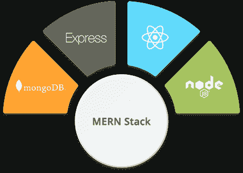
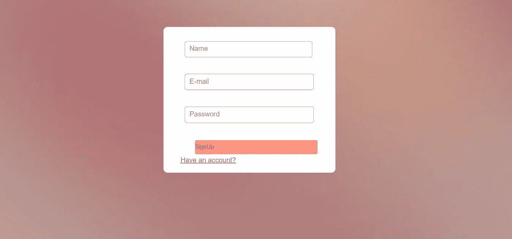

# 用 NodeJs 和 ReactJs-SignUp 组合后端和前端(第 5 部分)

> 原文：<https://medium.com/geekculture/combining-back-end-and-front-end-with-nodejs-and-reactjs-signup-part-5-e9d0797aeedf?source=collection_archive---------12----------------------->



当我开始后端编码时，我的主要问题是结合后端和前端。在这篇文章中，我将写这个问题。为此，我将使用我以前的代码与注册代码的小变化。你可以在链接中阅读我以前的文章:

注册/登录应用程序(第一部分):[https://medium . com/nerd-for-tech/sign up-log in-Application-with-nodejs-express-and-MongoDB-658498 e 580 cf](/nerd-for-tech/signup-login-application-with-nodejs-express-and-mongodb-658498e580cf)

注销(第二部分):[https://medium . com/nerd-for-tech/logout-with-nodejs-express-and-MongoDB-9b 73 E8 b 01137](/nerd-for-tech/logout-with-nodejs-express-and-mongodb-9b73e8b01137)

邮件验证(第三部分):[https://medium . com/nerd-for-tech/email-Verification-with-nodejs-Part-3-e 004787391 e 3](/nerd-for-tech/email-verification-with-nodejs-part-3-e004787391e3)

忘记密码(第四部分):[https://medium . com/nerd-for-tech/forget-Password-in-sign up-application-with-nodejs-and-MongoDB-Part-4-51378 dddd 716](/nerd-for-tech/forgot-password-in-signup-application-with-nodejs-and-mongodb-part-4-51378dddd716)

对于这篇文章，我们需要网站的前端代码。我没有写这些代码，所以我将分享注册和登录页面，使用它们并向你展示结果。开始吧！

首先，我们需要一个名为注册的功能，作为回报，我们将编写 HTML 代码。他们在这里:

```
export function SignUp(){ <div className="wrapper1">
<div className="form-wrapper">
<form ><div className="firstName"><label  htmlFor="firstName"></label><inputtype="text"className=""placeholder="Name"type="text"name="name"/></div><div className="email"><label   htmlFor="email"></label><inputtype="text"className=""placeholder="E-mail"type="email"name="email"/></div><div className="password"><label  htmlFor="password"></label><inputtype="text"className=""placeholder="Password"type="password"name="password"/></div><button onClick={signUp}value = "Submit">SignUp</button><Link to="/login" >{"Have an account?"}</Link></form></div></div>}
```

很基础但是很有用。使用一些 CSS，我们的注册页面看起来像这样:



现在在主要部分，我们将像这样使用状态:

```
const [name, setName] = useState("")const [email, setEmail] = useState("")const [password, setPassword] = useState("")
```

我们将在函数注册中创建一个异步函数，名为 SignUp。这是最重要的部分，我们将在按钮中使用它。

在这个函数中，我们将创建一个带字母的变量，并使其等于{name，email，password}并将它们写入控制台，只是为了尝试。然后另一个变量结果。我们将使用 fetch 向数据库发送数据。为此，我们需要一个链接来连接数据库，并前往注册部分。如果你看了我以前的文章用了，这个链接就像“http://localhost:5000/signup”。这些是关于后端的路线。在获取中，我们有 3 个部分:

```
method: "POST",body:JSON.stringify(item),headers: {"Content-Type":"application/json","Accept":"application/json"
```

结果变量如下所示:，

```
let result = await fetch("http://localhost:5000/signup",{method: "POST",body:JSON.stringify(item),headers: {"Content-Type":"application/json","Accept":"application/json"}}).then(history.push("/"))result = await result.json()
```

可以看到 history . push(“/”)。这是用于现在去主页。当本教程结束时，它将转到另一个文件。

之后，我们会将结果写入控制台进行检查。

现在，我们将在返回部分使用它。为此，在第一次输入时，我们将编写 onChange 并等于:

```
onChange = {(e) => setName(e.target.value)}
```

这会将输入设置为名称。同样，我们将在其他输入中使用 setEmail 和 setPassword。

在这些之后，我们将回到第一个输入，并写:

```
value = {name}
```

我们将编写类似这样的其他输入，然后转到按钮。在按钮中，当我们点击它时，我们想使用信号功能。为此，我们将写:

```
onClick={signUp}
```

就是这样。现在，我的代码正在发送电子邮件进行验证。但是我会像这样更改 controllers/auth.js 中的注册函数:

```
const { name, email, password, point, randomCode } = req.body;const user = await User.create({name,email,password,point,randomCode})const id = user.getId();sendTokenResponse(user, 200, res, id);
```

现在，我们需要保存所有的更改，用 npm 运行开发运行后端部分，用 npm 启动运行前端部分。

当我们在表格中写下信息并进入 MongoDB Compass 时，我们将会看到我们写下的记录。

原来如此！现在，您可以创建您的全栈项目的注册部分。在下一篇文章中，我们将继续讨论登录部分。感谢阅读！

注意:在后端，我们将使用端口:5000，但在前端，我们将使用端口:3000。他们是不同的，一开始我认为他们需要相同，但那不是真的！