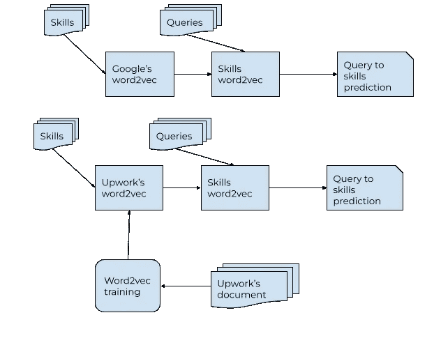
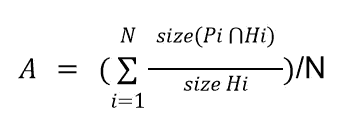

# 结合本体和机器学习提高匹配度

> 原文：<https://medium.com/geekculture/combining-ontology-and-machine-learning-to-improve-match-1013719c6859?source=collection_archive---------4----------------------->

最终，Upwork 需要解决一个问题:匹配雇主和雇员。匹配的细节随着用户的意图和工作的性质而变化。例如，用来匹配客户和自由职业者的算法不同于用来帮助自由职业者找工作的算法。然而，目前所有的算法都是基于匹配的“技能”。

# 介绍

这里我需要谈一谈 Upwork 使用的本体的结构(查看以前的帖子了解更多细节)。让我们把本体想象成一组相互连接的分类法，其中每个分类法都类似于一棵具有单个根节点和多个分支的树。本体的最底层(叶节点)是“技能”。技能被组合成“技能组”。本体的更高层次的结构与这篇文章无关。人们可以认为“技能”是完成一项工作或由自由职业者实践的真正技能。比如“Java”(作为编程语言)或者“视频剪辑”都是技能。技能和技能组通过多对多关系连接在一起。也就是说，一项技能可以是多个组的成员，一个组包括许多技能。例如，“视频编辑”是“媒体编辑和制作”组中的一员，该组还包括“摄像机操作”、“音频转换”和其他一些内容。我们出于各种目的创建技能组。一个技能组可以代表一项可以为某项工作执行的服务(“文案服务”)，或者将具有类似目的的事物(“软件产品”)组合在一起，或者提供其他功能。

现在我需要谈谈搜索查询，因为最终这都是关于工作与能做这些工作的人的匹配，以及技能组如何参与匹配过程。任何自重(和尊重用户)的网站都会在用户界面上花费过多的精力，以帮助用户产生更好的搜索查询或缩小搜索结果。Upwork 的网站也不例外。然而，在我们查看了最流行的搜索查询后，我们意识到这些查询中有很大一部分并不十分具体。比如“播客”或者“devops”。很明显，任何将这样的查询映射到技能，然后将技能匹配到与工作、简档、目录项目或任何其他东西相关联的技能的尝试都会产生不稳定的(随着算法中的最小变化而变化)并且通常是无用的结果。我们需要另一种方法。

# 研究

为了模拟 Upwork 的技能映射算法，我决定使用 word2vec 模型。Upwork 算法的一个主要组成部分是一组 ML 模型，尽管是不同的矢量化类型，但建立在连续单词包的相同原则上。我选择 word2vec 是因为它非常容易使用，这要感谢 gensim 工具包([https://radimrehurek.com/gensim/](https://radimrehurek.com/gensim/))。它的行为是众所周知的，并且有一个巨大的由谷歌预先训练的模型([https://radimrehurek . com/gensim/auto _ examples/tutorials/run _ word 2 vec . html](https://radimrehurek.com/gensim/auto_examples/tutorials/run_word2vec.html))。我认为后者可以帮助我解决任何与培训相关的问题。然后我通过谷歌训练的 word2vec 模型运行了 Upwork 的所有技能。在这个过程中，一个有趣的细节浮出水面:谷歌训练的模型，尽管训练了 1000 亿个单词，但显示了它的年龄。在该模型发布后的 10 年里，大量新技术(以及相应的技能)涌现出来。该模型无法定位大约 25%的技能集。

Model generation and skills’ processing

我将 Google 的 word2vec 模型中的技能嵌入存储在一个单独的模型文件中。然后，我使用该文件来计算查询的嵌入，并找到最相似的技能。我通过比较由相似性标准预测的技能和为查询精心挑选的技能来计算预测准确性。我比较了每个查询的前 3 项技能，所有查询的准确率约为 20%。也就是说，所有正确预测的技能总数除以所有手工挑选的技能总数大约是 0.2，这是相当低的。如果 *Pi* 是前 3 个预测技能的集合，并且 *Hi* 是每个查询的前 3 个精选技能的集合，并且 *N* 是查询的总数，则准确度 A 表示为:

Accuracy calculation formula, size Hi is always 3

下一步，我基于 Upwork 的一组有代表性的自由职业者资料训练了一个 word2vec 模型。然后，我生成了所有技能的嵌入，就像我以前做的一样，但是使用这个新的训练模型，而不是谷歌的模型。这种模式也遗漏了大量技能，尽管大约是谷歌模式遗漏的一半。由相同公式计算的准确度也在 20%的水平上。这些模型的预测是不同的(例如，谷歌模型预测的查询技能与 Upwork 的文档训练模型预测的技能不同)，但总体准确性没有显著变化。作为一个有趣的信息，Upwork 的文档训练模型(以磁盘上的矢量文件的形式)的大小不到 30MB，而谷歌的模型大小远远超过 1GB。

到目前为止，这个模型遵循了技能预测不稳定性的已知事实。下一部分是关于做出更好的预测。我推断这些模型预测了相同查询的不同技能，但是这些技能应该大致相同。Upwork 表达大概的方式就是我上面提到的技能组。换句话说，模型预测的技能和手工挑选的技能必须是同一技能组的成员。为了证明这一假设，我检索了每个查询的预测和精选技能的技能组，然后计算了它们的交集。如果 *Pi* 是预测技能组的集合，并且 *Hi* 是每个查询的精选技能组的集合，并且 *N* 是查询的总数，那么准确度 A 表示为:

Accuracy calculation formula

大约是 30%,比技能预测的准确度高 10%绝对或 50%相对。

# 结论

很明显，20–30%范围内的绝对精度数字并不太好。然而，它们表明的从技能到技能组的跳跃显然值得关注。直观地说，只要有数据库，使用非特定查询的人并不真正关心他们的后端开发人员将使用的数据库是 MySQL 还是 Postgress，这很容易解释。同样重要的是，在这种情况下，一个非常小且训练不足(就训练集的大小和数据准备而言)的特定模型与一个非常大的通用模型表现得一样好(或一样差)。