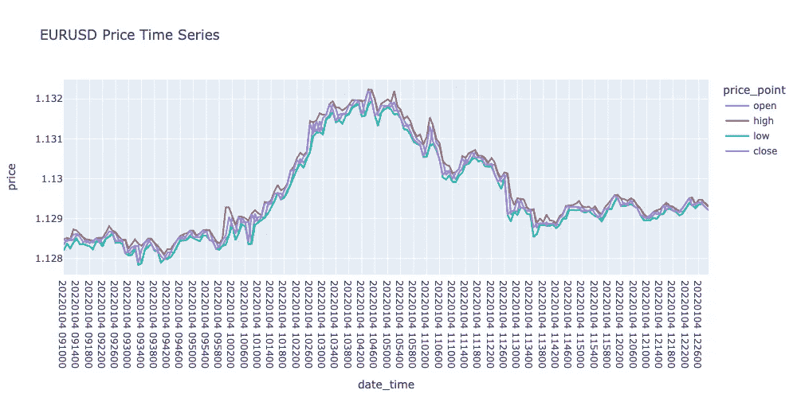
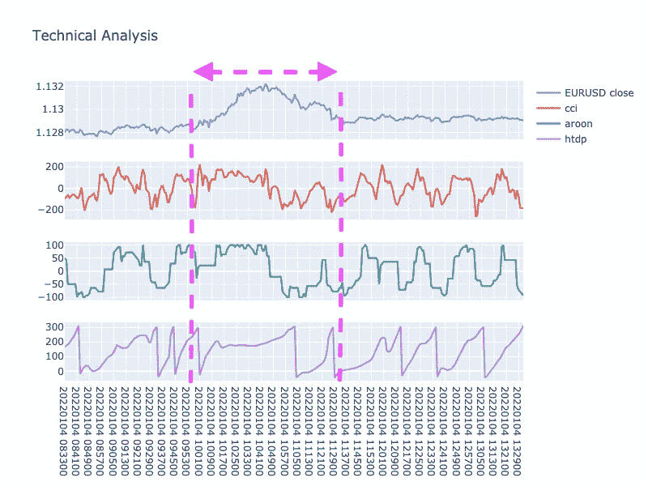
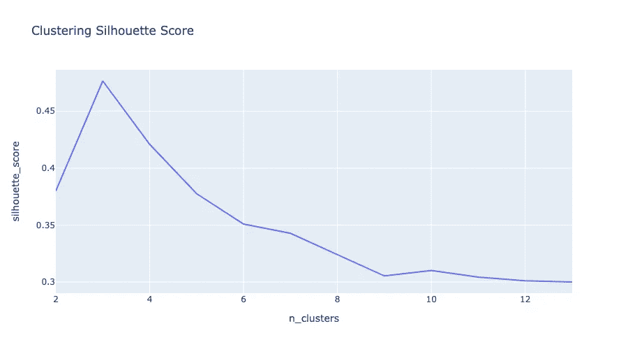
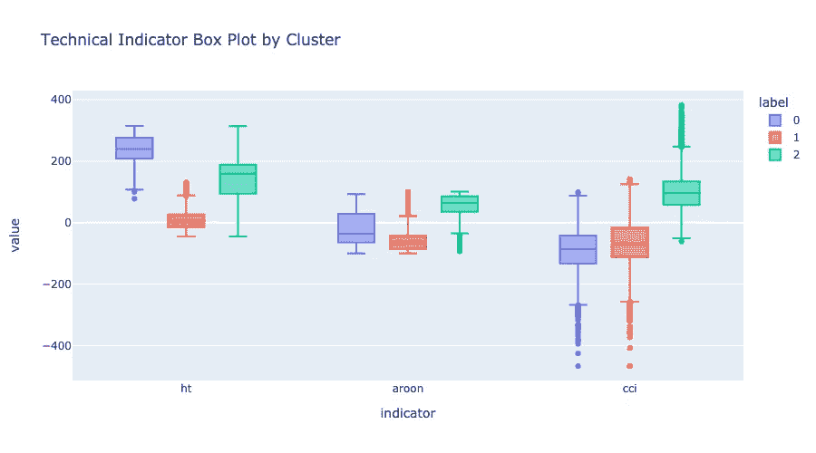
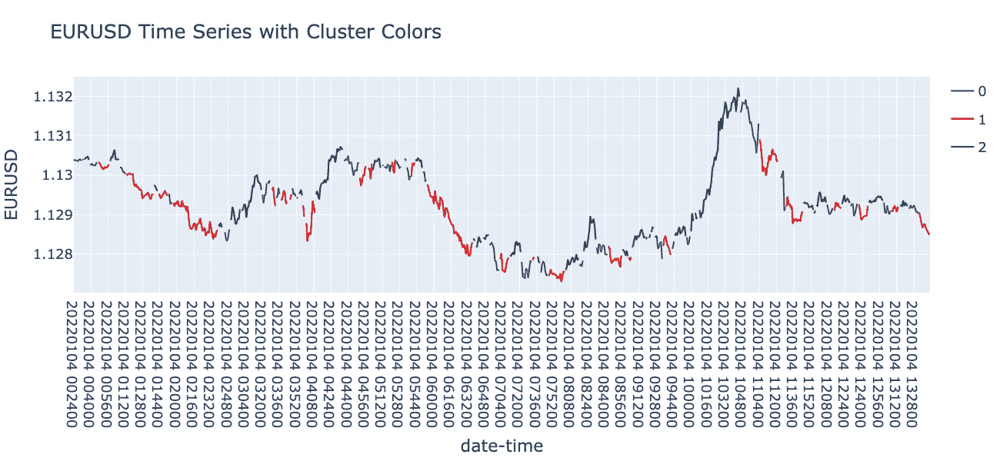
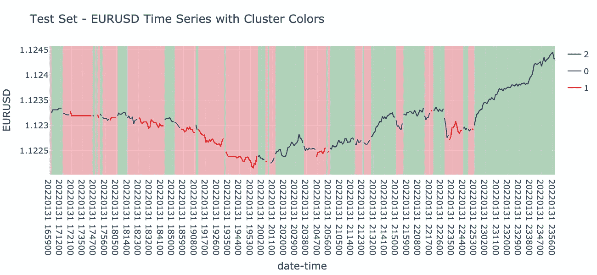

# 结合技术分析和 K-Means

> 原文：<https://medium.com/geekculture/combining-technical-analysis-with-k-means-1cae26562049?source=collection_archive---------0----------------------->

一种将定价数据分类为市场状态的技术

Photo by [Maxim Hopman](https://unsplash.com/@nampoh?utm_source=medium&utm_medium=referral) on [Unsplash](https://unsplash.com?utm_source=medium&utm_medium=referral)

🐍代码库发现[在这里](https://github.com/CharlieShelbourne/classifying-market-conditions/blob/master/market_state_classification.ipynb)

# 🙋‍♂️简介

柯蒂斯·费思的《海龟之道》是一本让我重新审视交易方式的书。它让我想到交易是一个系统，由可以建立和测试的规则定义。作为一名工程师，这是一个好消息，因为系统是熟悉的领域。我之前参与的任何交易都是诱人的猜测。

柯蒂斯告诉我们，好的交易策略能让交易者在市场上获得优势。然而，随着市场的变化和适应，这种优势可能会随着时间的推移而消失。因此，必须修改战略。建议是从简单开始，彻底回测你的系统，以确保它是一个成功的系统。

这篇文章详细介绍了我用技术分析和聚类建立交易系统的一些实验。

技术分析(TA)是金融分析的一个领域，它试图预测价格的变动。这些类型的转换已经在系统的交易策略中使用。TA 完全基于历史数据，并给出进入或退出市场的潜在好机会的指示(称为信号)。

[Investopedia 对技术分析的定义](https://www.investopedia.com/terms/t/technicalanalysis.asp)

Curtis 给出了利用 TA 产生信号的例子。策略可以简单到计算市场的价格移动平均线。当价格穿过移动平均线时，就产生了进场和出场的信号。或者，信号生成可能更复杂，将多个技术指标组合起来生成单个信号。

这篇文章描述了一种选择多种技术指标来捕捉市场变化的方法。然后将它们组合成一个对市场状况进行分类的单一输出。

💡注意，风险管理超出了这篇文章的范围，但是非常重要！

# 🪖员额目标

1.  生成时序定价数据的技术分析。
2.  使用 k-means 对技术分析特征进行聚类，并标记定价数据。
3.  查看结果。

# 🌦市场条件的类型

1.  趋势，是指上升趋势或下降趋势。在上升趋势中，我们看到价格攀升到更高的高点和更高的低点。同时，下降趋势由更低的高点和更低的低点来描述。 [Investopedia 趋势定义](https://www.investopedia.com/terms/t/trendtrading.asp)
2.  波动，是指价格在上限和下限之间循环，没有明显的上升或下降趋势。[投资范围定义](https://www.investopedia.com/terms/t/tradingrange.asp)

# 💿数据

在这篇文章中，我们将使用外汇定价数据，因为它很容易获得。然而，所使用的技术可以应用于任何类型的时间序列定价数据。

使用的数据是欧元兑美元货币对，每隔 1 分钟采集一次。[HistData.com](http://histdata.com/)是这些数据的提供者，并警告不要使用这些数据来通知任何交易决策，因为准确性效率低下。

# 💶价格

下图是数据的一个片段。每一分钟间隔有四种价格。

1.  开盘价-开盘价(区间的起始价格)。
2.  高-区间内的最高价格。
3.  low 区间内的最低价格。
4.  收盘——收盘价(下一个区间前的最终价格)。

# 🎪数据示例

在这个数据片段中，有一个明显的山丘型特征。这是市场周期的一个例子。价格以一个区间容量开始，移动到一个上升趋势(积累)，到达一个峰值(分布)，然后反转到一个下降趋势(标记下降)，以一个区间状态结束。

[Investopedia 市场周期定义](https://www.investopedia.com/trading/market-cycles-key-maximum-returns/)

# 🧐技术分析

# 🐍Python 库

TA-Lib 是用于生成技术分析的 Python 库。它提供了 70 多种功能，包括重叠、动量、循环、模式识别等类别。

💡链接到 TA-Lib 文档[这里](https://mrjbq7.github.io/ta-lib/)

# 👍选择功能

**主成分分析** (PCA)用于选择本帖使用的 TA 函数。这些函数捕捉到了数据中的大量差异。只有 3 个被选择来保持分析的可解释性。

该组合包括 2 个动量指标:商品通道指数和 Aroon 振荡指标。和 1 个循环指示器，希尔伯特变换-主要循环阶段。然而，也可能有其他表现良好的组合。

# 🚚势头指标

通常，动量指标给出趋势价格稳定的信号。例如，如果价格随着时间的推移而上涨，使用以前价格的窗口，动量指标会发出新价格稳定或可能反转的信号。 [Investopedia 动量指标定义](https://www.investopedia.com/investing/momentum-and-relative-strength-index/)

# 📺商品频道指数(CCI)

CCI 使用涨跌率来确定一种货币或股票是超买还是超卖。这些状态导致价格修正，价格运动可以逆转。

其输出在-200 和 200 之间波动。其中-200 表示超卖状态，200 表示超买状态。在上升趋势中，CCI 通常显示正值。而在下跌趋势中，它通常显示负值。

💡CCI 进一步解释了[这里的](https://www.fmlabs.com/reference/default.htm?url=CCI.htm)

# 🔺🔻阿伦振荡器

在-100 和 100 之间波动。其中-100 信号超卖，100 信号超买。艾伦比 CCI 更敏感。因此，似乎更适合指示趋势，而不是波峰和波谷。

💡阿隆进一步解释了[这里的](https://www.fmlabs.com/reference/default.htm?url=AroonOscillator.htm)

# 🚴‍♂️循环指示器

用于挑选出被称为周期的重复循环模式；发出周期开始或结束的信号。TA-Lib 上提供的周期指示器都使用希伯特变换。这是一种技术，也用于信号处理，将信号分解为组成整个输入的分量信号。[维基希尔伯变换定义](https://en.wikipedia.org/wiki/Hilbert_transform)

# 🧞‍♂️希尔伯特变换——主循环阶段(HTDP)

跟踪定价数据中主要周期的阶段。它的范围从 0 到 360 度(包括圆的所有角度)，据说是最可能的周期信号。当主周期的相位达到 360°并从 360°跃至 0°时，表示新周期开始。

💡HTDP 在这里进一步解释了

# 🧐技术指标分析

这是对下图中粉色线之间的技术分析的回顾。这是价格显示一个清晰的周期的地方。

# 🚚动力

在粉色线之间，CCI 和阿伦都从正值变为负值，表明趋势从上升变为下降。在价格反转之前，我们看到两个信号都接近上限，表明价格超买。

# 🚴‍♂️循环

我们的周期指标(HTDP)在粉色线之间显示了两个周期。首先，它标志着较大的周期，然后是较小的周期。与价格相比，我们看到一个大周期中潜在的小周期，处于下降趋势。

# 🧩增加了复杂性

这个市场周期的例子使得分析这三个指标变得相对容易。事实上，价格变动和模式通常在视觉上并不明确。

因此，从这些指示器读取信号变得更加复杂。此外，如果我们想在组合中添加更多指标，我们的分析可能会变得非常耗时。

# 👩‍💻k 均值聚类

使用 k-means，我们可以将技术分析的结果组合成一个单一的指标，对市场状态进行分类。因此，简化分析使其更容易解释。

使用这种分类的无监督学习的好处是，我们不需要标记数据的劳动密集型步骤。

K-means 是聚类的一个很好的第一步方法。这是一种相当简单的聚类算法，通常在探索数据集以了解数据的共性时使用。

由于其简单性，k-means 算法要求用户在运行聚类之前指定均值的数量。

# 🥇最佳聚类数

为了最好地分割数据，我们的目标是将我们的数据点标记为紧密且彼此远离的簇。

因此，为了决定平均的最佳数量，使用轮廓分数是一个好的选择。分数结合了聚类之间的距离和聚类内数据点的距离。聚类内的小距离和聚类之间的大距离给出较高的分数，表明更好的拟合。

我们可以看到轮廓分数图在 3 个平均值处达到峰值。因此，分割数据时，3 个聚类是最佳选择。

💡剪影进一步解释[此处](https://scikit-learn.org/stable/modules/generated/sklearn.metrics.silhouette_score.html)

# 🧐聚类分析

使用下面的方框图，我们可以分析我们的数据点是如何根据它们的特征进行聚类的。

**集群 0** :

*   HTDP (ht)值主要分布在 200–360 之间，表明大多数数据点出现在一个周期的末尾。
*   Aroon 值处于中间范围，平均值为负值，表明区间价格趋于下降趋势。
*   与其他聚类相比，CCI 显示了最大的负值，这表明数据点呈下降趋势，并出现在一个周期的末尾，此时价格反转发生。

**集群 1** :

*   HTDP 平均值在 0 左右。因此，这一组数据点通常处于新周期的开始。
*   Aroon 显示了所有集群中最负的平均值，表明它标志着下跌趋势，导致超卖价格可能反转。
*   CCI 平均为负，类似于聚类 0，表明数据点呈下降趋势。然而，这一组不太可能显示价格反转。

**集群 2** :

*   HTDP 在集群中分布最广，但平均来说处于中等范围，表明该集群通常由中期数据点组成。
*   Aroon 值为正值，很少有负异常值，表明上涨趋势和超买价格可能反转。
*   CCI 得分平均为正，表明上升趋势。包括大的正异常值，警告超卖位置价格的价格反转。

# ⏳时序视图中的聚类

用颜色标出聚类的价格有助于揭示聚类行为。与箱线图分析类似，聚类 1 和聚类 2(红色和绿色)突出显示上升和下降趋势。同时，聚类 0(蓝色)表示一个周期的结束，表明价格正在巩固。

当价格波动很大时，趋势市场状态中的聚类看起来很明确。同时，一个波动的市场更难显示。

在日期时间 20220104 113600 之后，接近图的末端出现的价格显示了一个区间市场，在 1.1289 和 1.1295 之间波动。然而，没有单个类发出测距状态的信号。相反，我们的类别经常切换，因为模型似乎会挑出价格中的小周期。

# 测试数据的🧪分类

下图显示了对最后 1%的价格数据的聚类预测。这在我们的模型训练步骤中被忽略了。对于分类 2(上升趋势和峰值)，该图突出显示为绿色；对于分类 1 和分类 0(下降趋势和周期价格整合结束)，该图突出显示为红色。

测试数据显示了一个下降趋势，然后是一个上升趋势。我们不能真正看到一个重要的测距状态。虽然该模型对上涨趋势和下跌趋势进行了分类，但如果我们将 20220132 202000 之前的任何日期时间视为下跌趋势，而将之后的任何价格视为上涨趋势，则该模型不会始终如一地进行分类。这可能是由于使用了与较小周期相协调的周期指示器。

因此，对于长期策略，这种方法需要一些调整。

# 🎬结论

# 👀这种分类可以用在哪里？

1.  使用多个指标时简化技术分析。
2.  有可能将标签并入交易信号的生成中。
3.  用作检查许多市场状态的单一指标(代码完成了繁重的工作)。
4.  回顾市场状态下的交易表现。

# 💪强项

1.  对技术指标的分析被简化成一个单一的清晰的可视价格，由市场状态分类来标示。
2.  通过使用 Python 的 Scikit-Learn 和 TA-Lib，编写这个解决方案相对简单。此外，结果很快，并且可以扩展/推广到其他市场。
3.  重要的是要包括周期指标，因为它显示了 3 组之间的明显差异。因此，可能是拆分数据的一个强大功能。然而，纳入这一指标后，很难使用分类来标示长期趋势。

# ❤️‍🩹的弱点

1.  使用无监督学习方法只能对模型分类进行视觉检查。通常，我们会利用带有已知标签的更大的测试数据集来产生模型性能度量。
2.  无法用单一类别来表示测距状态。这可以追溯到所选择的技术指标。
3.  持续标记长期趋势的困难。只有动量指示器是时间可调的。因此，包括周期指标限制了我们如何调整时间。当与周期指标结合使用时，动量指标在默认的 14 点时间周期内效果最好。然而，我们可以对输入数据进行平均，以获得长期趋势，而不是延长技术指标的时间周期。

# 🕵️进一步工作

1.  增加簇的数量可以导致更好的信号峰值和谷值。
2.  基于聚类和回溯测试创建规则。
3.  探索使用不同的技术分析组合。
4.  通过对输入数据求平均值来调整时间范围，以获得更长的趋势。

💡代码库发现[在这里](https://github.com/CharlieShelbourne/classifying-market-conditions/blob/master/market_state_classification.ipynb)