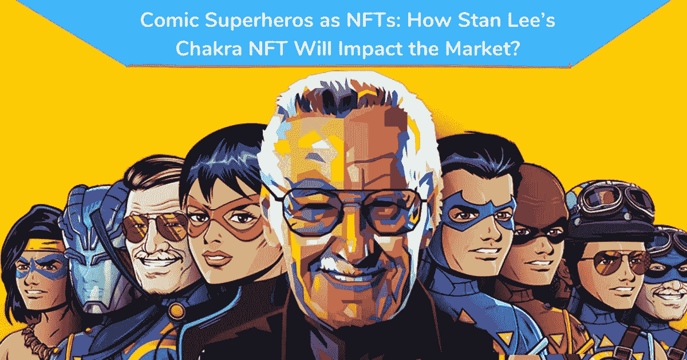
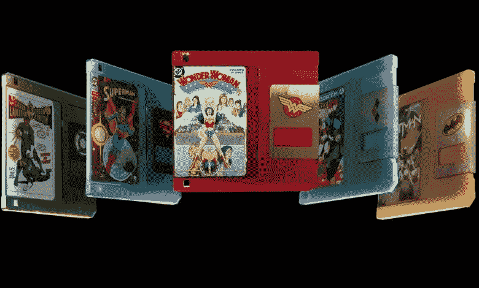
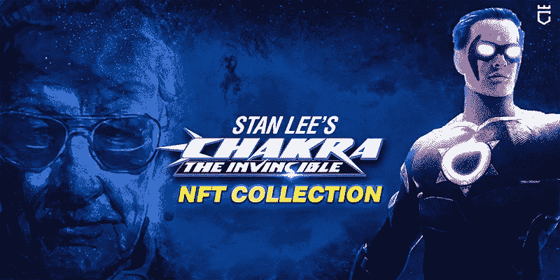

# 漫画超级英雄人物冒险进入 NFTs:斯坦·李的查克拉 NFT 将如何影响市场？

> 原文：<https://medium.com/geekculture/comic-superhero-characters-are-ventured-into-nfts-how-stan-lees-chakra-nft-will-impact-the-market-3e0c909ed3c4?source=collection_archive---------17----------------------->

自从 NFTs 出现以来，娱乐、体育、游戏、投资和漫画等几个行业都受到了很大的影响。漫画书为创作者提供了一个很好的机会来将它们转化为非功能性读物。在某些时候，手绘漫画人物已经成为一种老派的想法。这是因为 NFT 向创作者、艺术家、故事讲述者和插图画家保证了一种新的所有权、可信度和真实性。

漫画人物和小说的趋势对创作者来说并不容易接受，但区块链越来越受欢迎为人们接受它们铺平了道路。很明显，NFTs 将为艺术家、创作者、爱好者和消费者拥有稀有和独特的收藏品提供巨大的空间。

是什么让数字漫画获得了最大的人气？

作为个人，我们有一个漫画小说中最喜欢的角色列表。在这段时间里，我们可以见证数字化是如何实现巨大飞跃的。这增加了人们对他们在书中看到的漫画进行数字化可视化的诱惑。因此，我们可以看到几个数字漫画版本，以适时满足读者。这引起了对漫画人物手绘肖像的强烈反对。

在创作数字漫画时，真实性和原创性等几个属性必须得到保护。这是区块链技术进入领域的地方。漫画人物被标记为不可替换的标记。这些 NFT 是内置的区块链技术，确保没有欺骗和操纵的空间。不仅仅是数字艺术，非数字艺术正在获得观众的广泛接受。随之而来的投资选择是人们更喜欢这些非功能性金融工具的突出原因。

**漫画书 NFTs 是如何发挥重要作用的？**

顾名思义，漫画书 NFT 是不可替代的令牌，代表原始漫画书。漫画迷可以购买代表特定问题的 NFT。数字 NFT 漫画将允许数字收藏品以与实体版本相同的方式具有相同的收藏价值。这些漫画 NFT 是在表现每个角色和他们规定的力量的基础上发展起来的。个人可以拥有它们，并声称拥有这些数字资产的所有权。

漫画 NFTs 邀请漫画迷们为自己获得 NFT 漫画收藏品。这些天来，这些 NFT 见证了漫画迷人数的激增。此外，对于这些年来几乎没有看过漫画书的粉丝来说，这是一种视觉享受。这也伴随着对个人所有权的规定。

**超级英雄角色加入 NFT**

如前所述，非功能性交易并不局限于某个特定的行业或领域。它对所有人开放，因为任何资产都可以被令牌化为 NFT。与其他行业一样，创意和娱乐行业确实值得所有不可替代的标志的关注。从纸张到数字代币，漫画人物的旅程是不可思议的。近年来，他们取得了长足的进步。

漫威和 DC 在全球拥有庞大的粉丝群。对于这些球迷来说，拥有任何一处房产都是梦想成真。为了火上浇油，漫威和 DC 角色被标记为不可替换的标记。这个消息对漫画迷来说是一个巨大的惊喜。这给了忠实粉丝一个为自己拥有 NFT 的机会。斯坦·李 打造的 [**超级英雄 NFTs 会让粉丝疯狂。**](https://chakra.beyondlife.club/?fsz=home)

**NFT 市场在酝酿什么？**

世界上没有一个漫威球迷会不认识斯坦·李。是啊！他是设计漫威角色并赋予他们生命的共同创作者。斯坦·李是美国漫画作家。他写过基于 DC 和奇迹的漫画书。这些漫画书后来被拍成了电影。查克拉是他创造的赢得人们热烈掌声的人物之一。

斯坦·李以他一生中描绘的理想人物而闻名，他的创作触及了各个方面。但他对印度文化的渴望让他勾勒出了查克拉的性格。查克拉是宝莱坞和好莱坞的化身。无敌查克拉是他专为印度市场打造的。与他一起，沙拉德·德瓦拉詹和哥谭·乔普拉也协助创造了查克拉角色。

2012 年，斯坦·李表现出对探索印度文化和道德的兴趣。查克拉在他的心中总是占据着一个特殊的位置，他也在几个例子中分享了同样的位置。不仅对他来说如此，对他的粉丝来说也是如此。这被认为是一部融合了好莱坞和宝莱坞元素的小品。

**斯坦·李的脉轮将如何影响 NFT 市场的未来？**

NFT 通过他们在几乎每一个行业的存在统治着地球。了解了这些 NFT 的范围后，娱乐业也开始关注将数字角色标记为 NFT。所有的荣誉都归功于区块链科技为数字所有权的概念铺平了道路。体育和游戏 NFT 已经在市场上树立了新的标准。现在，漫画正在努力进入这个名单。

该角色于 2013 年推出，在市场上大受欢迎。现在，经过数字化，他们已经进入 NFT 市场。超越生命。俱乐部与橙色彗星一起宣布计划推出斯坦·李查克拉 NFT 旗下的独家 NFT 收集。

对于每个漫画读者来说， [**获得斯坦·李的查克拉 NFT 收藏**](https://chakra.beyondlife.club/?fsz=home) 将是一个欢欣鼓舞的时刻。制造商还计划在斯坦·李生日当天推出这些 NFT。简单地说，这将是读者在创造者生日时获得脉轮 NFTs 的一个好机会。

查克拉 NFTs 的推出是在一个完美的球体下进行的，让粉丝们疯狂。目前关于非功能性甲状腺炎的趋势已经成为每天的头条新闻。在这方面，NFT 查克拉的到来将创造一个新的趋势在 NFT 市场。这也将鼓励更多的企业家进入这个市场。

**上发条**

对 NFTs 的极度狂热是使人们为 NFTs 疯狂的拉动因素。加入比赛，尽早获得查克拉无敌 NFT 收藏。这是一个从市场上抓住你的非功能性思维的机会。