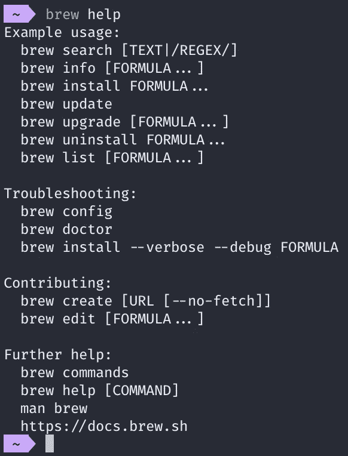
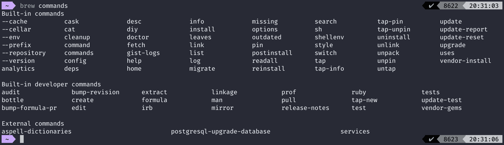

# 命令行界面—自制软件

> 原文：<https://medium.com/geekculture/command-line-interface-homebrew-b1b771d73bca?source=collection_archive---------5----------------------->

## 自制软件，适合各种类型的 macOS 用户。


Photo by [Carlos Blanco](https://unsplash.com/@cblanco_31?utm_source=unsplash&utm_medium=referral&utm_content=creditCopyText) on [Unsplash](https://unsplash.com/@cblanco_31?utm_source=unsplash&utm_medium=referral&utm_content=creditCopyText)

# 概述

# 什么是自制？

根据家酿的网站，家酿是“macOS(或 Linux)缺失的软件包管理器”([家酿](https://brew.sh/))。

所以…

# 什么是包管理器？

软件包管理器是“一个软件工具的集合，它以一致的方式为一台[计算机](https://en.wikipedia.org/wiki/Computer)的[操作系统](https://en.wikipedia.org/wiki/Operating_system)自动安装、升级、配置和删除计算机程序”([维基百科](https://en.wikipedia.org/wiki/Package_manager))。基本上，它是一个工具，允许计算机用户以一种简化的方式下载、升级、修改和删除软件包，这些软件包是存档的软件文件。

需要认识和警惕的一件事是，包管理器以多种不同的形式存在于多种不同的技术中。

# 包管理器的例子

Python 是世界上最流行的编程语言之一。它附带了一个包管理器 Pip，可以从 Python 包索引( [PyPi](https://pypi.org/) )下载包和库，这些包和库可以在用 Python 编写的项目中使用。

[Node.js](https://en.wikipedia.org/wiki/Node.js) 是一个运行时环境，允许 JavaScript 在 web 应用的后端运行。它带有一个内置的包管理器，节点包管理器(NPM)，从节点包管理注册中心( [NPM 注册中心](https://www.npmjs.com/))获取包和库，这些包和库可以在用 JavaScript 编写的项目中使用。

APT i 它是每个 Linux 发行版都附带的包管理器，可以在终端上开箱即用。它在 macOS 上的功能类似于 Homebrew，但是它是用 Linux 设计的，特别是 Debian。MacOS 没有开箱即用的主包管理器——这是自制软件填补的漏洞。

# 为什么你可能需要自制？

正如你可能知道的，包管理器似乎无处不在，存在于许多不同的媒介中。它们使开发人员能够加速将必要的库下载到各种机器上的过程，这些机器可能跨越同等或更大范围的应用程序。

软件包管理器的另一个优势是能够在一个命令中下载必要的应用程序，如 Google Chrome 或 Visual Studio 代码，而不是在互联网上搜索下载页面，将应用程序拖放到 *Applications* 文件夹中，然后等待它复制过来。像家酿这样的解决方案只需一个命令就能完成。

# 装置

*在我们继续之前:默认情况下，macOS 机器安装了终端仿真器 terminal，它在其中加载 Bash Shell 的实例。通过使用键盘快捷键 CMD+空格键输入 Spotlight Search 来查找“终端”,然后键入“终端”,并打开应用程序。如果你不喜欢使用终端应用，更喜欢第三方解决方案，我推荐* [*iTerm2*](https://www.iterm2.com/) *和*[*Hyper*](https://hyper.is/)*。*

# 先决条件

家酿是使用两种编程技术构建的:Ruby 和 Git。在我们可以下载自制软件之前，我们需要确保你的机器上安装了这两个软件。首先，我们将检查您的机器上是否安装了 Ruby。macOS 设备预装了 Ruby，所以你不需要像下面这个步骤那么担心。只是为了确保在您安装的任何终端模拟器中运行该命令:

```
ruby -v
```

版本真的不重要，因为这个脚本唯一做的事情就是确保您的机器上安装了 Ruby。如果你得到一个相似的数字序列，比如“2.6.3”，那么你可以进入下一个需求。

第二个先决条件是你需要下载的东西:Git，软件开发中常用的版本控制系统。macOS 机器没有预装这项技术，所以您需要从他们的网站上获取:

[](https://git-scm.com/downloads) [## 下载

### Git 带有内置的 GUI 工具(git-gui，gitk ),但是有几个第三方工具供用户寻找一个…

git-scm.com](https://git-scm.com/downloads) 

当您在机器上安装了 Git 之后，在您的终端中运行以下命令以确保它正常工作:

```
git --version
```

同样，版本并不重要——如果你是第一次下载，你的机器上应该有最新的版本。在撰写本文时，Git 的最新稳定版本是 2.22.0。当你确认这两种技术都存在于你的电脑上后，你就可以安装和使用自制软件了。家酿可以很容易地安装一个命令:

```
/usr/bin/ruby -e "$(curl -fsSL <https://raw.githubusercontent.com/Homebrew/install/master/install>)"
```

安装可能需要一些时间。安装完成后，假设您没有遇到任何错误，您可以退出终端应用程序并重新打开它(这对初学者来说是最直观的操作),也可以在终端模拟器中运行以下命令:

```
reset
```

这两个操作都将重新启动当前的终端会话，并用您正在使用的任何 shell 的新版本替换它。默认情况下，macOS 机器在终端模拟器中运行 Bash Shell。完成这些操作后，通过键入以下命令并按 Enter 键来检查 Homebrew 是否正在运行:

```
brew help
```

您应该会得到这样的结果:



如果您的终端看起来不完全像这样，不要担心。上图中唯一重要的是我们从命令中收到的输出。现在让我们进入下一部分，在这里我们将看到家酿啤酒的实际应用。

# 使用

从上一节中我们收到的“brew help”命令的输出中，您也许可以看出，我们可以做一些事情来真正利用自制软件的力量。要获得您可以使用 Homebrew 运行的命令的完整列表，请在终端模拟器的 shell 实例中运行以下命令:

```
brew commands
```

上面命令的输出应该是这样的(但可能不完全相同):



由于这可能是你第一次在这台机器上安装 Homebrew，你可能没有上面列出的一些命令——我已经安装了 Homebrew 现在链接到的外部库和包。由于您的屏幕看起来与此相对相似，所以您的思路是正确的。

我们要看的第一类命令是 *brew install* 命令，后面是一个叫做*公式*的术语。如果您打算将自制程序作为一致的工作流程的一部分，您很可能会使用这些类型的命令。

Homebrew 有各种各样的包和库可以下载，但是在您深入了解软件包管理器之前，理解 Homebrew 背后的基本术语可能会有所帮助。如果你以前从未使用过家酿啤酒，听到像*配方*、*木桶*和*酒窖*这样的术语可能会有点令人畏惧，所以我会尽我所能为你提供最好的信息，帮助你理解所有单词和短语的含义。

# 术语

使用家酿啤酒时，您需要的所有术语的完整列表可以在这里找到:

[](https://docs.brew.sh/Formula-Cookbook#homebrew-terminology) [## 配方食谱

### 公式是用 Ruby 编写的包定义。它可以使用 brew create 创建，其中是 zip 或 tarball…

docs.brew.sh](https://docs.brew.sh/Formula-Cookbook#homebrew-terminology) 

这包括术语和它们的定义，以及每个术语的例子，以帮助你对家酿啤酒有一个全面的了解。

*brew install* 命令的作用就像它听起来的那样:它安装你可以随时使用的软件包。这些命令中的大多数将安装 CLI 包，允许您在终端中针对特定技术执行特定任务，但也有例外。

这是一个示例，显示了 *brew install* 命令后跟 *formula* 输入可能的样子:

```
brew install python
```

这将在您的机器上安装最新版本的 Python。您不仅可以使用 *brew install* 命令下载像 Python 这样的完整语言，还可以下载与这些技术一起使用的工具。例如，我更喜欢用`PipEnv`代替`pip`和`virtualenv`来包含我的开发环境和与我的 Python 项目相关的依赖项。`PipEnv`下载方式如您所料:

```
brew install pipenv
```

如果您有兴趣查看通过 Homebrew 安装的与命令行界面相关的所有软件包的完整列表，请运行以下命令:

```
brew list
```

以下是一些我最喜欢的基于命令行的安装:

*   Heroku——Heroku CLI。
*   pipenv —将 pip 和 virtualenv 结合成一个无缝工具。
*   [pyenv](https://github.com/pyenv/pyenv) — Python 版本管理器。
*   [yvm](https://github.com/tophat/yvm) —纱版经理。
*   [nvm](https://github.com/nvm-sh/nvm) — Node.js 版本管理器。
*   [youtube-dl](https://ytdl-org.github.io/youtube-dl/index.html) —将 youtube 视频作为 MP4 文件下载到您的电脑上。
*   [纱](https://yarnpkg.com/en/) —脸书打造的 Node.js 包管理器。
*   [tmux](https://github.com/tmux/tmux) —终端复用器。
*   [树](http://mama.indstate.edu/users/ice/tree/) —打印终端中当前的文件夹和文件层次结构。
*   [cmatrix](https://github.com/abishekvashok/cmatrix) —这个只是为了好玩！

如果您安装了一个*公式*并希望以后删除，请在您的终端中键入一个简短的命令，从您的机器中删除指定的*公式*:

```
brew uninstall python
```

当然，这些不是你可以用自制软件做的唯一的事情——我们只是触及了这个综合工具所能做的事情的表面。如果您正在寻找可以在带前缀的 *brew* 命令之后运行的命令的完整列表，请查看它们的文档:

[](https://docs.brew.sh/Manpage) [## brew(1) -缺失的 macOS(或 Linux)软件包管理器

### 自制是安装苹果 macOS 没有的 UNIX 工具的最简单和最灵活的方式。它也可以…

docs.brew.sh](https://docs.brew.sh/Manpage) 

我最常用的一些命令包括:

*注意——所有这些命令都以 brew 命令为前缀。*

*   *安装*
*   *列表*
*   *卸载*
*   *重新安装*
*   *医生*
*   *更新*
*   *升级*

我将跳过前三个命令，因为我已经介绍过了。继续往下看，我们找到了这些新命令:

```
brew reinstall formula
```

该命令结合了这两个命令:

```
brew uninstall formula
brew install formula
```

如果你已经下载了一个*公式*，发现有些东西不工作，你需要重新安装整个*公式，*，而不是找出可能导致唯一问题的原因，这是一个很好的命令。

```
brew doctor
```

这是我的最爱之一。有时，由于安装了新的软件包，需要删除或覆盖多余的文件。如果您运行这个命令，您会得到一个输出提示，告诉您需要做什么来确保 Homebrew 可以满负荷运行。

```
brew update
```

这个命令获取最新版本的 Homebrew，以及你安装在机器上的最新版本的*公式*。默认情况下，每当你执行一个 *brew* 命令时，Homebrew 就会自我更新，但是偶尔运行一次这个命令也不错，可以确保你总是最新的。

```
brew upgrade formula
```

从存储库中获取最新版本的*公式*，并将其下载到您的机器上。当软件包贬值并且您需要使用最新版本时非常有用。

```
brew install --cask formula
```

让您用自制软件下载 macOS 桌面应用程序。如果你有一台新机器和一堆你想安装的软件包，这是非常有用的。

现在，我已经介绍了一些我最喜欢的用自制软件执行的命令，我将进入最后一部分:故障排除。如果到目前为止你在下载和使用自制软件时遇到了任何问题，请参考下面的部分——我希望它能对你可能面临的问题有所帮助。

# 解决纷争

任何人在试图安装一种新型的软件包管理器时都会碰壁，家酿也不例外。有关安装和使用 Homebrew 时可能遇到的常见问题的完整列表，请访问以下链接:

[](https://docs.brew.sh/Common-Issues) [## 常见问题

### 这是常见问题、已知问题及其解决方案的列表。你需要 Xcode 命令…

docs.brew.sh](https://docs.brew.sh/Common-Issues) 

最重要的是没有安装 Xcode。如果您在任何时候运行一个 *brew* 命令，并且它抛出一个关于缺少特定命令行实用程序的错误，文档建议您在终端中运行这个命令来下载 Xcode 命令行工具:

```
xcode-select --install
```

这不会安装整个 Xcode，但会安装命令行实用程序，让 Homebrew 以有效的方式工作。

家酿是一种方便的工具，它已经融入了我几乎每天的工作流程。即使它是第三方解决方案，当执行命令时，你也可以深入到 macOS 机器所特有的深度。

如果你发现了任何错误，请留下评论，我会尽快回复你。感谢您的时间和关注！

我希望你今天学到了一些关于软件包管理器和自制软件的新知识。