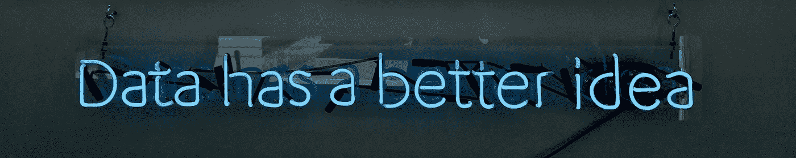

# 商业自杀——数据库级的集成

> 原文：<https://medium.com/geekculture/commercial-suicide-integration-at-the-database-level-aedad603b7d3?source=collection_archive---------14----------------------->

商业自杀的方式有很多，但可能没有比尝试伟大的架构目标——所有应用程序都与之对话的单一权威数据库——更慢、更痛苦的死亡了。

这个理论很好，如果我们有一个单一的数据库，那么我们所有的业务信息都在一个地方，所有人都可以访问，容易报告，降低维护成本，所有应用程序的一致性，以及许多其他良好的目标。

然而，所有这些崇高的理想掩盖了一个更基本的问题，即单一的数据库不能解决任何一个问题，而且会使大多数问题变成更大的问题。

## 所有信息都在一个地方—单一权威机构

从表面上看，这听起来像是一个伟大的目标——毕竟所有开发人员都试图按照“不要重复自己”的准则生活——而许多地方的数据显然违反了这一原则。

出现在许多应用程序和许多存储机制中的数据会导致各种各样的大问题；不一致、重复、复制、重复的业务逻辑和代码，本质上都归结为—你最终得到的是意大利面条式的数据。意大利面条的数据很像意大利面条的代码——它杂乱无章，纠缠在一起，如果不把自己裹在意大利面酱里，就很难拆开。这显然是一件“坏事”。

## 那么什么是错的呢？

第一个也是最明显的错误是，所有的应用程序都有不同的需求，以及不同的“世界观”。尽管从理论上讲，对于整个组织来说，可能存在一些“客户”的概念，但即使是这种最基本的数据项，在各个部门之间，甚至在一个部门内的各个应用程序之间，也有很大的差异。

你可以像许多以数据库为中心的人一样解决这个问题，并说“这就是问题所在，我们需要标准化所有这些应用程序以使用一个真正的客户”。但这在问题的定义中遗漏了真正重要的词…“需求”…这并不是偶然的，客户对业务的不同部分是不同的，它确实*是*不同的。

您的数据库人员可能会说“您的应用程序中的客户可能会有所不同，因为您有不同的需求，但您必须将它放入我们的一个真正客户中”，但这就像试图将蛇放入塑料袋中一样，它们真的不想放在袋子中，它们不太适合放在袋子中，当放入一条蛇时，其他蛇迟早会逃跑或咬您的手。当你的另一个部门也开始把他的蛇放进袋子里时，你将为谁不被咬而斗争。

更糟糕的是，现在您正试图从基于需求的客户映射到一个真正的客户，并花费大量时间来维护应用程序中的转换层。当一个真正的客户发生变化时，毫无疑问他会随着新应用程序的要求而变化，他需要扩展以处理更多的数据，每个以前的应用程序都需要重新访问，大部分内容需要重写，整个应用程序需要再次进行回归测试。您必须为每个与您的单一权威数据库进行对话的应用程序执行此操作。

你可以跳过这些东西，依赖你的应用程序忽略这些新数据，依赖数据库不关心它们是否正确更新了新数据，但这真的会回来咬你，当那袋蛇开始变得非常大、非常满时，你真的不想成为试图让新蛇进入其中的人。

## 一个真正权威的真相

没有了。

我已经说过了，我已经惹恼了所有的数据库人员，可能也惹恼了大量的 SOA 人员(我将在以后的文章中讨论商业自杀——服务级别的集成),并且完全不同意高尚的业务目标。

事实是，数据必须有上下文——没有上下文，数据就毫无价值，绝对毫无价值。存储在数据库中的数据没有上下文，因此没有价值。上下文是由读写数据的应用程序提供的，因此它们是唯一重要的东西，它们的需求也是唯一重要的东西。这意味着，他们需要特定于其应用程序的数据，数据的组织方式要使该应用程序满足业务目标，并使该应用程序满足非功能性要求，如弹性、可靠性和一致性。

## 那么，为什么有人想要一个真正的权威数据库呢？

从传统的角度来看，很容易理解为什么数据库管理员和数据库开发人员需要它——它是他们的生命线，是他们存在的全部理由。更重要的是，这是他们成长的文化——数据是重要的东西，数据是宇宙的中心，数据必须一致、统一和纯净。

但是撇开数据库开发人员不谈，更重要的是为什么一个公司想要一个真正权威的数据库(OTADB)？毕竟，这个帖子的标题说这是“商业自杀”，那么为什么这个还没有传达到管理层呢？

好吧 OTADB 的承诺是，它将减少重复中的错误、减少浪费、减少重复工作和减少维护成本——所有这些都是非常可取的业务目标。事实上，从那些提倡这种方法的人(同样是那些数据库管理员和开发人员)来看，OTADB 听起来非常有吸引力。从表面上看，它实现了所有这些目标。

失败的地方在于，软件开发的圣杯总是遥不可及，他们从来没有成功地实现它。开发的每一个应用程序都开始让 OTADB 变得更糟，人们开始将一些东西加入其中以满足业务需求，这并不是因为开发人员想要将一些东西放在一起，而是因为 OTADB 的限制迫使他们这样做，如果他们想要交付任何功能的话。

他们指责这些黑客破坏了他们对一个真正权威数据库的愿景，数据库管理员告诉他们，他们必须与应用程序团队斗争，以阻止他们搞乱他们漂亮的数据库，但 OTADB 不再符合崇高的目标，因为那些讨厌的开发团队已经把它搞得一团糟。

## 等等 One True Authority 数据库背后的业务目标是什么？

如果有人从这些崇高的目标后退一步，问一个更基本的问题，解决方案可能实际上比看起来要明显得多。虽然它们都是崇高的目标，但实际上被 OTADB 方法搞得更糟了，它们不是真正的业务目标。

在所有其他需求的基础上，促使人们(尤其是数据库管理员)想要单个数据库的最终业务需求是，他们可以看到他们公司的样子，换句话说，他们可以产生管理信息，向你和我报告。

这是一个企业最基本的要求——对他们的公司有一个清晰、一致、准确和最新的了解。这是管理层所需要的，是允许他们做决定，允许他们发现问题，允许他们发现机会的东西。

因此，我们将尽一切努力，相信我，这是广泛而重大的努力，最终都是为了支持一些报告工具。报告工具在处理不同格式的数据、不一致的数据以及分散的数据时存在问题。因此，在过去的某个时候,“公认的真理”变成了“我们需要一个真正权威的数据库来产生好的报告”

报告是一个上下文，数据只有在上下文中才有目的和相关性。

## 如果房间里的大象实际上是在报告，我们如何解决大象问题？

这几乎是如此容易处理，这是愚蠢的。也许是因为它太简单了，以至于被许多人忽视，被其他人拒绝。尤其是当它违背了另一个崇高的目标…为了提供高质量的报告信息，我们复制了更多的数据。

是的，我们复制它，因为所有的报告数据都是只读的，所以如果它只是其他数据的副本也没关系。报告需求与交易需求也有很大的不同，因此我们获得了能够为报告功能优化重复数据的额外好处。

对于查询和报告来说，关系数据库中的数据实际上是非常糟糕的，为了让所有这些应用程序能够更快地写入数据，需要不断做出妥协，这使得报告很糟糕，反之亦然。

在这篇博文中，我并不直接关心这些数据是如何进入报告数据库的，可以说“简单”的方法是发布包含数据更改的消息，并让报告应用程序获取这些数据并保存它们。我在这里的观点是，将报告功能从日常业务功能中分离出来会带来巨大的好处。

## 现在我们有了一个新问题

这仍然给我们留下了一个问题—当不同的应用程序确实需要了解其他应用程序中的数据时，会发生什么呢？当我的呼叫中心工作人员被要求更新某个客户的地址时，会发生什么情况。现在，由于每个应用程序都有自己的世界观和自己的数据存储，我的会计应用程序无法访问这种变化。

那么，对于“数据如何进入报表数据库”这个问题的解决方案在这里是完全相同的——当您有公司其他人可能感兴趣的更改时，您从您的应用程序发布消息。发出一条消息“CustomerAddressUpdated ”,任何其他相关的应用程序现在都可以监听这条消息，并以它认为合适的方式处理它。

## 在它认为合适的时候

这是我们一开始就试图实现的真正商业目标…避免公司自杀。

当应用程序各自对自己的数据、自己的操作负责，并且只负责让“企业”知道它们已经做了一些其他事情可能需要知道的更改时，那么您就有了自己的解决方案。

用好的开发术语来说，我们有适当的关注点分离…应用程序对它们的数据负责，并且只对它们的数据负责。他们决定是否关心来自其他应用程序的数据——他们不会被强制使用它，也不会绕过它。

*这是十年前一篇文章的转贴，有些部分可能显得有些过时，有一些小的编辑，但大部分原则在今天仍然适用*