# SQL 编码中必不可少的常用字符串函数

> 原文：<https://medium.com/geekculture/common-string-functions-essential-for-your-sql-coding-round-2d9ca8f1d717?source=collection_archive---------14----------------------->

Photo by [Sunder Muthukumaran](https://unsplash.com/@sunder_2k25?utm_source=medium&utm_medium=referral) on [Unsplash](https://unsplash.com/?utm_source=medium&utm_medium=referral)

## 解决了真正的面试问题

**字符串函数:**

字符串函数是将字符串值作为输入，执行特定操作并输出字符串类型或任何其他类型的值的函数。

**LTRIM:**

这个函数接收一个字符串作为输入，删除前导空格或任何特别提到的符号并返回它。

> 已解决的面试问题
> 
> 公司:**亚马逊**
> 
> 等级:**易**
> 
> 问题:**去掉左边的空格后打印名字。**

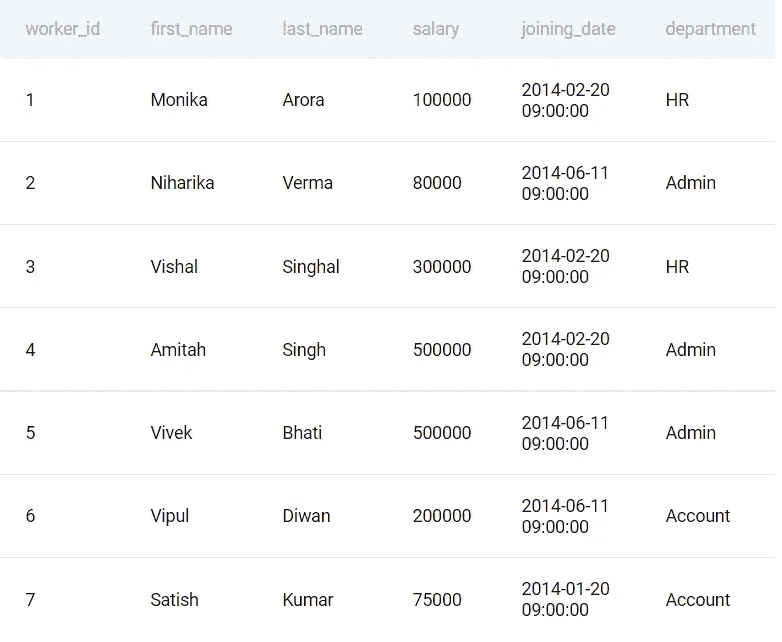

> **回答:**

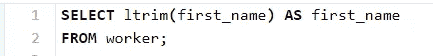

answer query

**RTRIM:**

这个函数接收一个字符串作为输入，从字符串中删除尾部空格并返回它。

**左:**

该函数接收一个字符串作为输入，并从左侧开始返回指定数量的字符。

> 示例:
> 
> 员工数据库

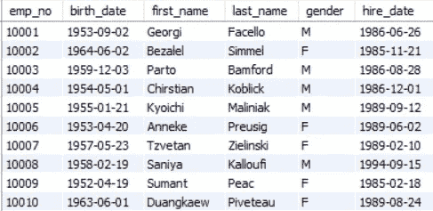

screenshot of the employee database

让我们从雇员的名字中获取前 3 个字母

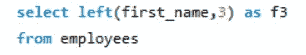

first argument refers to the column/string input and second argument refers to number of characters to return

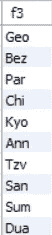

results of the above mentioned Query

> 已解决的面试问题
> 
> 公司:**旧金山市**
> 
> 等级:**中等**
> 
> 问题:**验证所有电话号码的前 4 位数字都等于 1415。**

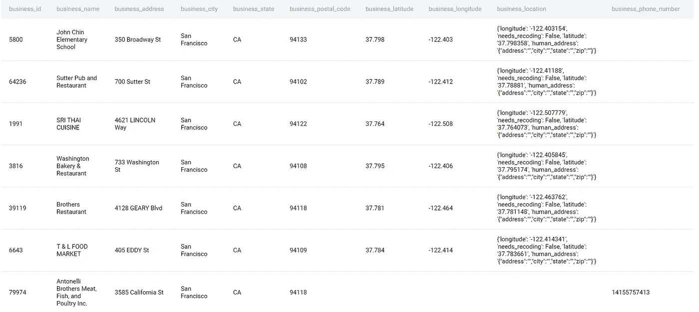

preview of the table

> **回答:**

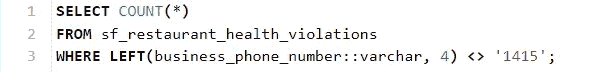

answer query

> business_phone_number::varchar 将列的类型从 float 转换为 varchar

**右:**

这个函数接收一个字符串作为输入，并从右边开始返回指定数量的字符。

> 示例:
> 
> 员工数据库

screenshot of the employee database

让我们从雇员的名字中得到最后 3 个字母

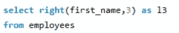

first argument refers to the column/string input and second argument refers to number of characters to return

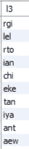

results of the above mentioned query

> 已解决的面试问题
> 
> 公司:**谷歌**
> 
> 等级:**容易**
> 
> 问题:**查找高中名字不以‘HS’结尾的学生的 SAT 成绩。**

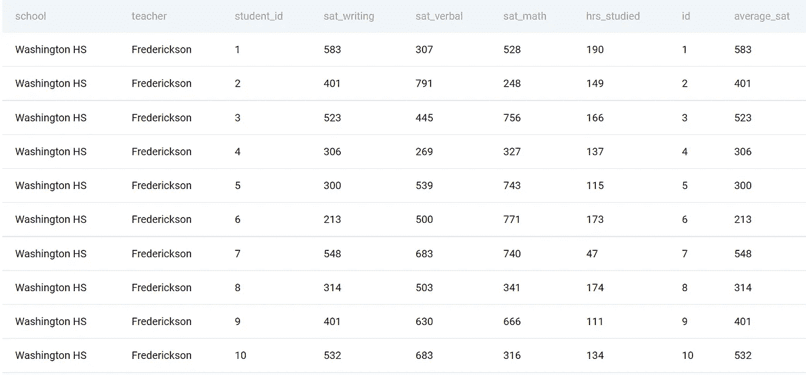

preview of the table

> **回答:**

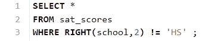

answer query

**子串:**

该函数使您能够从左侧任何位置开始提取指定数量的字符。

> 示例:
> 
> 员工数据库

screenshot of the employee database

让我们从雇员名字的第二个位置开始得到 3 个字母

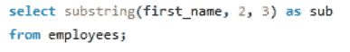

first argument refers to the column/string input and second argument refers to starting position and third argument refers to number of characters to retrieve

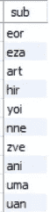

results for the query

**STRPOS(PostgreSQL)/POSITION(MySQL):**

这个函数用于查找一个字符串/字符在另一个字符串中的位置。

> 示例:
> 
> 员工数据库

screenshot of the employee database

让我们得到字符 r 在雇员名字中的位置

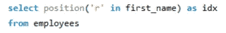

this query searches for the position for r in the first name

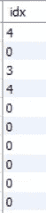

result of the above mentioned query

> 已解决的面试问题
> 
> 公司:**亚马逊**
> 
> 级别:**简单**
> 
> 问题:找出字母“a”在工人名字“Amitah”中的位置。使用基于 1 的索引，例如第二个字母的位置是 2。

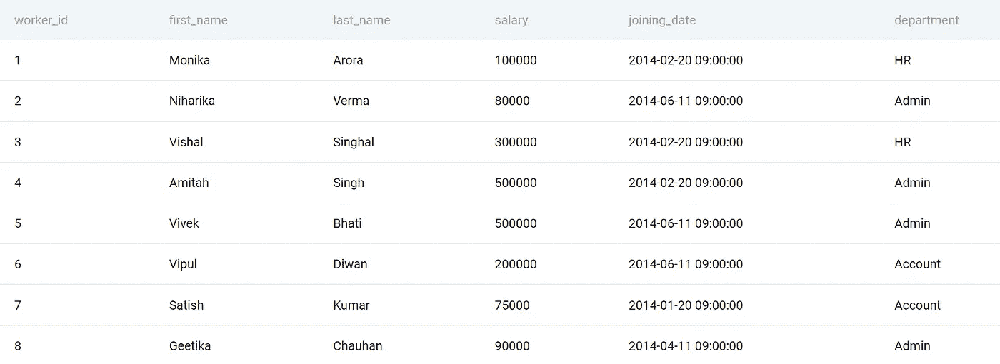

preview of the table

> **回答:**

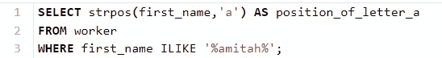

answer query

**结论:**

在本文中，我试图解释一些在 SQL 编码访谈中经常被问到的常见字符串操作，希望你们觉得这篇文章有用。

问题来自网站— [STRATASCRATCH](https://www.stratascratch.com/) 这是为您的编码回合练习 SQL 问题的最佳网站之一。