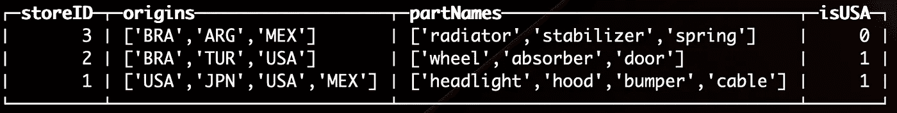

# ClickHouse 中的常用表表达式

> 原文：<https://medium.com/geekculture/common-table-expressions-in-clickhouse-4b4556c296c1?source=collection_archive---------4----------------------->

> 通用表表达式或 CTE(在 SQL 中)是一个临时命名的结果集，源自一个简单的查询，并在一个`SELECT`、`INSERT`、`UPDATE`或`DELETE`语句的执行范围内定义。[维基百科](https://en.wikipedia.org/wiki/Hierarchical_and_recursive_queries_in_SQL)

Photo by [Alex wong](https://unsplash.com/@killerfvith?utm_source=unsplash&utm_medium=referral&utm_content=creditCopyText) on [Unsplash](https://unsplash.com/s/photos/data-center?utm_source=unsplash&utm_medium=referral&utm_content=creditCopyText)

# 介绍

在以下情况下使用 CTE 很方便:

*   当一个请求可以获得数据，并且其大小适合内存空间时；
*   需要多次使用此查询的结果；
*   创建递归查询。

额外的好处是提高了 SQL 查询的可读性。

CTE 与临时表和嵌套查询有什么区别？

*   如果子查询与[相关](https://en.wikipedia.org/wiki/Correlated_subquery)，那么它的调用将在选择的每一行中重复，这大大增加了执行该查询的成本；
*   用大量数据填充临时表会给磁盘带来负载；
*   由于存储临时表的特性，使用它们执行查询会增加执行时间。

# 句法

ClickHouse 既支持将<表达式>作为<标识符> 的*，也支持将<标识符>作为<子查询表达式>* 的*语法。*

*   使用*启动 CTE；*
*   为查询提供名称；
*   随后用*AS；*
*   定义查询；
*   如果需要多个 cte，请用逗号分隔它们。

WITH <identifier> AS <subquery expression>

*   使用*启动 CTE；*
*   定义一个表达式；
*   随后用*AS；*
*   为表达式提供一个名称；
*   如果需要多个 cte，请用逗号分隔它们。

*WITH <expression> AS <identifier>*

# 例子

创建:

插入:

选择:

结果:

