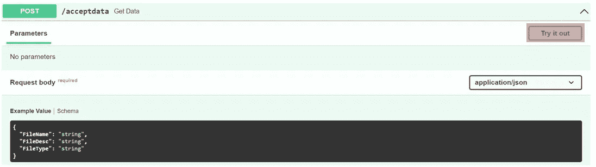
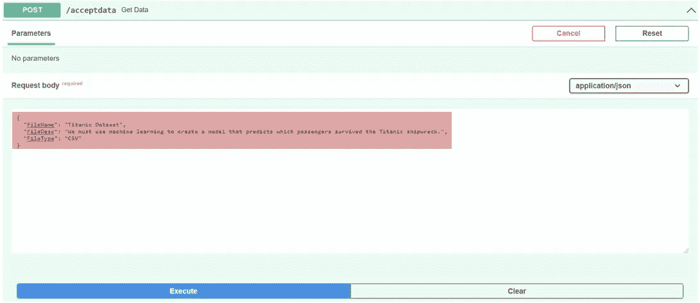
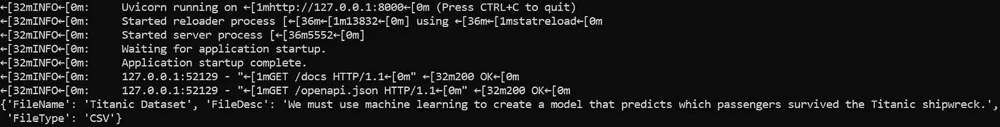
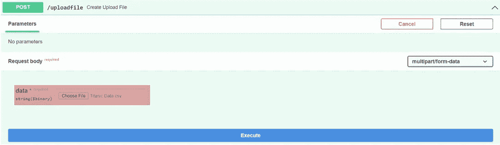
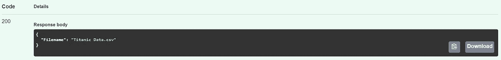
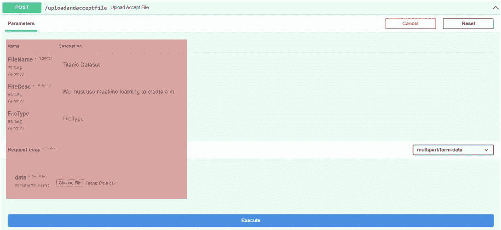
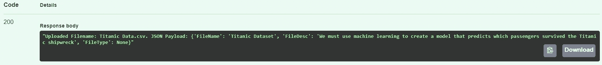

# 通过 JSON 有效负载进行通信，并在 FastAPI 中上传文件！

> 原文：<https://medium.com/geekculture/communicate-via-json-payload-and-upload-files-in-fastapi-244bdbc447dd?source=collection_archive---------1----------------------->

## 厌倦了在文档和博客中徘徊？这里有一个路线图，可以帮助你找到这个失落的宝藏！


Source: Official FastAPI Website

# 介绍

如果我们能最清晰地表达我们的想法，生活会变得多么简单？能够有效地与他人沟通对我们需要达到的结果有着巨大的影响。因此我们说，“沟通是成功的关键”。这句话同样适用于技术领域。应用程序通过一个**应用程序编程接口**进行通信，就像人类通过语言进行通信一样。API 允许应用程序以最大的一致性共享信息(即外行人的想法)!沟通是一个好的构建系统架构的关键。

API 是一种为计算机或计算机程序提供服务的接口。当系统需要服务时，它向 API 请求响应。API 负责接受请求并处理它，或者拒绝请求并确认它。如果 API 接受请求，它必须执行预定义的任务并做出响应。在本文中，我们将探索 **FastAPI** 的功能。

FastAPI 于 2018 年发布，由 sebastán ramírez 开发。这个 API 用于在 python 中创建 web 应用程序，并与 Uvicorn 和 Gunicor web 服务器一起工作。FastAPI 支持异步编程、pydantic 和所有 OpenAPI 规范中最令人印象深刻的。这些是 FastAPI 拥有的众多特性中的一部分；我们将在本文中使用上面列出的特性。现在让我们快速了解这三个特征。

**异步编程**

FastAPI 允许一个程序在等待另一个程序/进程的资源时执行其他活动。用关键字 async 定义的模块使模块异步。异步模块中的请求具有关键字 await。await 关键字将请求发送到一个池/桶，而不是阻塞模块。

**Pydantic**

Python 给了我们一种不需要定义变量数据类型的语言。这看起来是一件好事，但是在处理多个 API 时，未定义的数据会给我们的程序带来一些问题。因此，通过强大的 pydantic 库，我们可以在 python 脚本中启用数据验证。通过创建一个包含所有变量、变量类型和默认值(可选)的基础模型，这是可能的

**OpenAPI 规范**

OpenAPI 规范(OAS)，以前称为 Swagger 规范，定义了一个接口，允许开发人员在不创建整个产品(程序)的情况下理解服务。用户可以理解远程服务并与之交互。我们所要做的就是通过“/docs”目录访问 OAS。换句话说，只需访问"**http://127 . 0 . 0 . 1:8000/docs**"

既然我们已经对将要探索的内容有了清晰的了解，让我们深入这个主题。在本文中，我们将演示 FastAPI 中的三种技术。

*   通过“JSON 有效负载”进行通信
*   上传文件
*   接受数据和上传文件的组合

> 我的 [GitHub](https://github.com/ginelledsouza/FAST_API_Demonstration) 安全地储存了上面隐藏的宝石，并提供了一个总结的胜利过程。

**那么，让我们开始编码吧！**

**制定路线图**

**代码**

```
#FASTAPI imports
from fastapi import FastAPI, Request, File, UploadFile, Depends
from pydantic import BaseModel#APP defination
app = FastAPI()#Base model
class Options (BaseModel):
    FileName: str
    FileDesc: str = “Upload for demonstration”
    FileType: Optional[str]
```

**基本型号:**

通过使用 pydantic 技术，我们定义了基本模型。这里指定了变量的数据类型。这里我们看到三种类型的定义:

1. ***文件名:字符串*** —名为“文件名”的变量接受一个字符串值。

2.***FileDesc:str = " Upload for demand "***—名为“file desc”的变量接受字符串值，并分配有默认值。

3. ***FileType:可选【str】***—名为“FileType”的变量接受非强制的字符串值。用户可以选择不为这些变量提供输入。

**目的地 1:通过“JSON 有效载荷”进行通信**

有效负载是在 HTTP 请求中发送的实际数据包。当我们发出一个 API 请求时，这是一条关键信息。这个有效载荷可以有几种格式。我们将特别研究 JSON 格式。大多数 API 通过 JSON 有效负载进行通信。

**代码**

```
#Using an asynchronous POST method for communication@app.post("/acceptdata")
async def get_data(request: Request,options: Options):

    #Waits for the request and converts into JSON
    result = await request.json()  

    #Prints result in cmd – verification purpose
    print(result)return result
```

**代码解释**

1.  ***@ app . post("/accept data ")***—在前面的代码中，我们已经初始化了我们的应用程序。我们现在通知 API，数据路径" ***/acceptdata*** "必须通过 POST 请求发送。
2.  ***async def get _ data(Request:Request，options: Options)*** —本文开头，我们碰到了 FastAPI 提供的“异步编程”。因此，在这个函数中，我们使用异步编程的特性。([阅读更多…](https://fastapi.tiangolo.com/async/) )
3.  ***result = await request . JSON()***—这里两个操作同时工作。

3.1. ***await —*** 如果所需的资源被阻塞，await 将请求发送到池/桶。([阅读更多…](https://fastapi.tiangolo.com/async/) )

3.2. ***request.json() —*** 接收到的请求被转换成 json 有效载荷。

> (注意:在所有输出图像中，感兴趣的内容以红色突出显示)

**输出**

我们现在将通过选择“试用”来测试我们的脚本。



Testing : “/acceptdata”

用适当的值填充变量。



Enter values within the request body

响应返回将显示如下。


Once successfully executed the OAS displays the results within the response body

默认情况下，当我们作为成功响应返回数据时，它以 JSON 格式显示。因为我们已经打印了请求，所以让我们查看命令提示符来验证我们是否已经成功地接收到作为 JSON 有效负载的请求。



JSON payload printed in python script, displays result in command prompt

瞧，我们在 JSON 表单中实现了一个请求。

**目的地 2:上传文件**

可以使用 FastAPI 库中的 Uploadfile 和 File 类来上传文件。让我们简单地创建一个允许用户上传文件的方法。上传后，我们将显示文件名作为响应，并在命令提示符下打印出来以供验证。

**代码**

```
#Upload a file and return filename as response@app.post("/uploadfile")
async def create_upload_file(data: UploadFile = File(...)):#Prints result in cmd – verification purpose
    print(data.filename)#Sends server the name of the file as a response
    return {"Filename": data.filename}
```

**代码解释**

1.  ***async def create _ upload _ File(data:upload File = File(…)—***接受请求文件有两种方法，“ *Bytes* ”和“ *UploadFile* ”。当上传的文件很小时，字节可以很好地工作。适用于大型文件，如图像、视频、大型二进制文件等。，我们使用上传文件。([阅读更多…](https://fastapi.tiangolo.com/tutorial/request-files/) )
2.  ***data . filename*******—***这里我们返回上传文件的名称。*

***输出***

*让我们通过选择“试用”→“选择文件”→找到文件来测试脚本。*

**

*Uploading an image*

*响应返回将显示如下。*

**

*Once successfully executed the OAS displays the results within the response body*

***最终目的地:接受数据和上传文件的组合***

*我们已经成功地演示了通过 JSON 有效负载传递数据和上传文件。因此，我想到了一个问题，是否有可能在一个方法中执行这两个操作？是的，它是！在“Depends”类的帮助下，我们可以创建一个支持此功能的函数。一个函数可能因为几个原因而具有依赖性，例如代码可重用性、安全性、数据库连接等。从属函数是使用另一个函数/类来执行其活动的函数。*

***代码***

```
*#Accept request as data and file
@app.post("/uploadandacceptfile")
async def upload_accept_file(options: Options = Depends(),data: UploadFile = File(...)):data_options = options.dict()

 result = "Uploaded Filename: {}. JSON Payload    {}".format(data.filename,data_options)*
```

***代码解释***

1.  ****async def upload _ accept _ File(Options:Options = Depends()、data:upload File = File(…)):——***这个函数定义里面最重要的特性就是“*(depend()*”。依赖方法通知函数" *upload_accept_file* "参数化变量" *options* "依赖于类 **Options** 。( [阅读更多…](https://fastapi.tiangolo.com/tutorial/dependencies/) )*
2.  ****data _ options = options . dict()—***这里我们尝试另一种技术，将收到的请求转换成等价的 JSON 有效负载。*

***输出***

*让我们通过选择“试用”来测试这个脚本。*

**

*Combination of base model with file uploads via dependency*

*响应返回将显示如下。*

**

*Once successfully executed the OAS displays the results within the response body*

*万岁！我们终于完成了这次激动人心的冒险。*

*感谢您的阅读！:)*