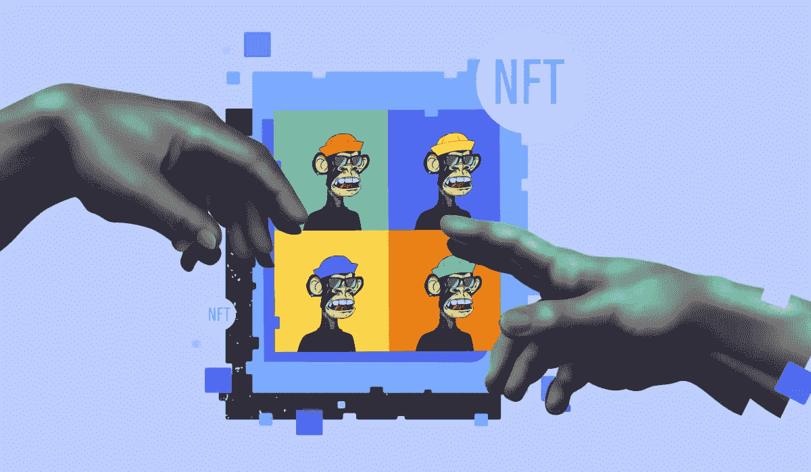
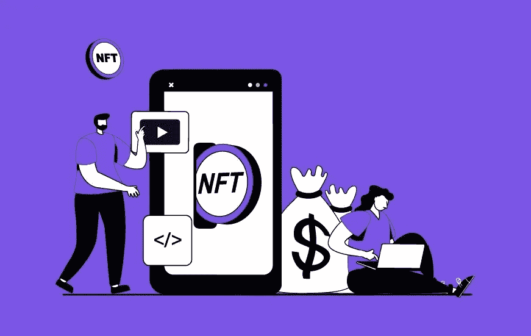

# 以社区为中心的 NFT 市场开发——创建独特的社区驱动的 NFT 平台指南

> 原文：<https://medium.com/geekculture/community-centric-nft-marketplace-development-guide-to-create-a-unique-community-driven-nft-bb1a6c1926a8?source=collection_archive---------11----------------------->

我们都知道创新 NFT 对商业世界来说是一个巨大的福音。这种狂热并没有随着它首先提供的东西而平息。但是，随着一个新概念的探索，可以将业务提升到一个新的水平，不仅仅是一个普通的 NFT 市场，而是为世界各地的密码爱好者服务。NFT 市场迎来了无数企业家的财富。然而，另一个开始未来几年的解决方案是用一个不断发展的平台吸引用户，在这个平台上，交易不是唯一可能的事情。 [**以社区为中心的 NFT 市场**](https://www.appdupe.com/nft-marketplace-development) 如果你正在寻找一个能提升巨大优越感体验的市场，它正符合你的胃口。

# **以社区为中心的 NFT 市场平台有何新颖之处？**

自从 2021 年“Beeple，Everydays: the first 5000 days”大卖后，这是 38525 ETH，大量的创作者已经在 NFT 市场上走出来。因此，一个普通的 NFT 市场因其交易容量和卓越的功能而非常棒。以社区为中心的 NFT 市场弥补了在审查 it 市场发展方面缺乏权威。

NFT 市场是交易发生的地方，但是交易者的特权呢？除了 NFT 的功能之外，还有一个额外的好处。作为奖励，他们有机会成为市场中的社区成员，做出决策。这反过来给拥有治理令牌的面向社区的成员消除重复的优势。

# **以社区为中心的市场中的道**

DAO 或分散自治组织是一个智能契约，它通过将变更分配给以社区为中心的 NFT 市场来工作。DAO 中的协议赋予了在线社区权力，并决定了市场的工作流程。在 Web 3.0 中，智能合约包含平台的规则和规定。它们非常重要的一些地方是

1.  管理
2.  效用
3.  安全性

**以社区为中心的 NFT 商场的工作流程**

1.  第一阶段是向平台注册并填写所需信息。
2.  将帐户与数字钱包关联。
3.  用户可以在平台上购买本机或治理令牌。
4.  以固定价格或在以社区为中心的 NFT 市场通过拍卖购买喜爱的 NFT。
5.  购买后，用户可以在平台上转售购买的 NFT。这可以通过法定货币和加密货币来实现。
6.  在支付被处理之后，卖家和买家之间的钱包被转移。
7.  收取的费用由以社区为中心的 NFT 市场的经营者决定。

## **发展以社区为中心的 NFT 市场的好处**

*   强大的支持团队
*   功能的创造性集成
*   定制开发解决方案
*   全天候支持
*   部署后指导
*   定期更新支持
*   时间有效
*   性价比高

人们自然会问，以社区为中心的 NFT 市场开发是如何进行的？在这里，一个完整的结构，以扩大电力包装的 NFT 市场，将提供一个用户友好的体验如下。一个好的 NFT 市场所包含的主要特性和必要功能所包含的可定制性是无与伦比的。这个市场的优势在用户中被认为是很高的。它们如下:

1.  利用最新的技术，在预算范围内获得有吸引力的用户体验。
2.  在 NFT 市场中添加了所有需要的概念的最佳创新被开发为无故障。
3.  价格表的结构与以社区为中心的 NFT 市场发展相匹配，价格更实惠。
4.  最后但同样重要的是，以社区为中心的 NFT 市场可以避免从零开始的发展，因为所有的 [**白标 NFT 市场解决方案**](https://www.appdupe.com/nft-marketplace-development) 都可以以较低的价格提供，从而支持市场的保质期。

# **功能内置于以社区为中心的 NFT 市场**

## **店面**

他们是市场的门面，店面是各种资产的所有资产列表的地方。它标记和突出 NFT 收藏品，以便实际交易发生。

## **钱包整合**

钱包在市场中的整合是促进进一步活动的不可避免的过程。钱包与市场的整合主要是为了保留加密货币和 NFT，而不仅仅是用来在交易过程中支付和接收。

## **多钱包支持**

顾名思义，它们支持市场上各种加密货币的大量用户。

## **招标门户**

门户的行为就像是为用户提供对其好奇资产的竞价。

## **销售和转售门户**

通过转卖获得额外利润。

## **高级搜索和过滤器**

为用户提供了在市场中浏览 NFT 收藏的便捷方式。

## **推送提醒**

关于时间和更新的所有必要的销售细节，投标计数，时间等信息。

## **懒造币**

用户在交易 NFT 之前不需要支付任何铸造费用。只有当通过 NFT 看到利润时，才支付价格，这种透明性吸引了用户的注意力。

互动市场总是很有吸引力。通过以社区为中心的 NFT 市场，平台上的观众和爱好者保持着联系。社区成员和公共用户通过购买平台的治理令牌一起进入 NFT 市场。此外，用户可以通过投票消除重复的非功能性交易，从而在论坛中为更好的交易进行自我检查。

## **在以社区为中心的 NFT 市场开发中，采用了哪些收费模式？**

管理员或市场已经为用户打开了对更广泛的收入流的访问。他们是

*   订阅费用
*   铸造费
*   煤气费
*   交易费用
*   维护费用
*   土著象征性报酬

**结局思绪**

这一领域的项目适合于确定用户对平台的看法。通过提供一个区域，用户也可以仔细检查市场的变化并做出决定，这是非常了不起的。在以社区为中心的 NFT 市场发展项目**中，NFT 的收藏品既有实体的，也有数字的，正如我们最近被 trend 称之为“物理数字的”，这在商业繁荣时期很管用。现在时机已经成熟，加密创业者和艺术家们可以加入游戏，创建一个以社区为中心的 NFT 市场，享受他们的好日子。**