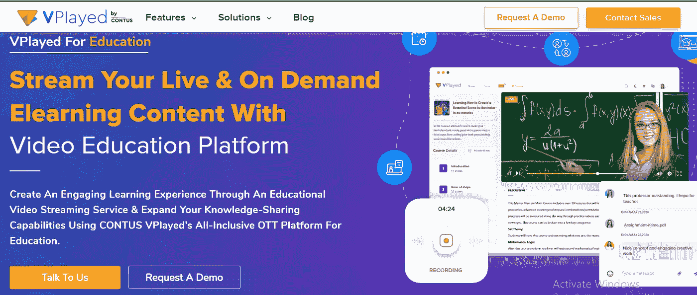
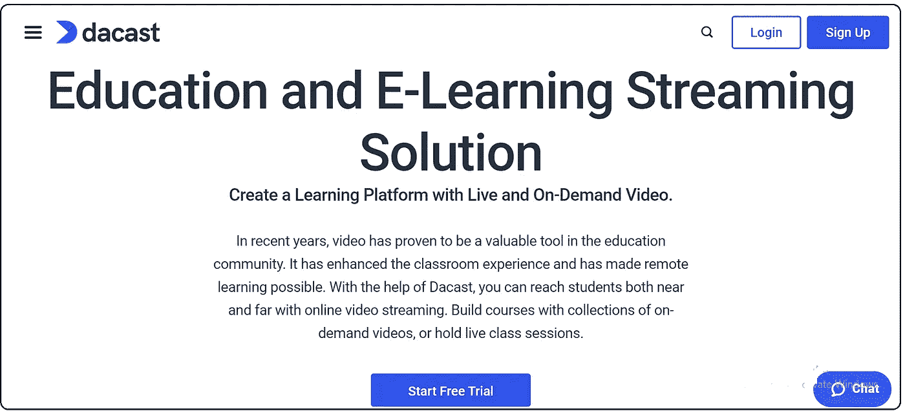
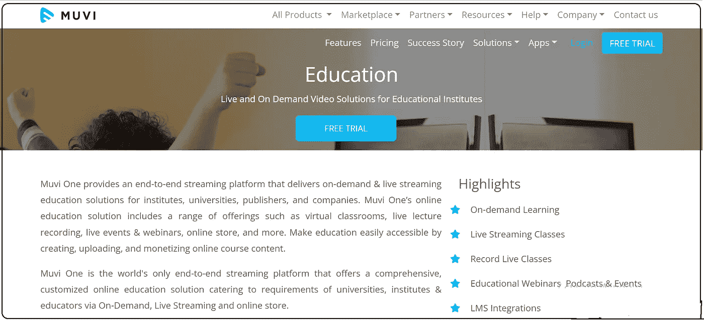
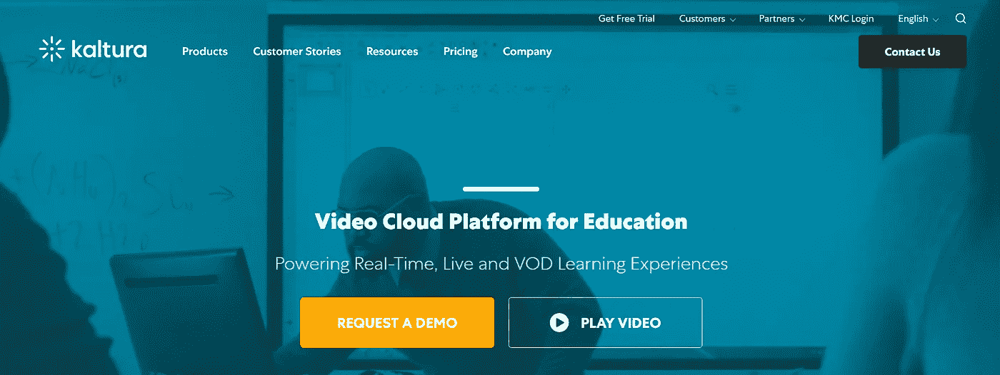
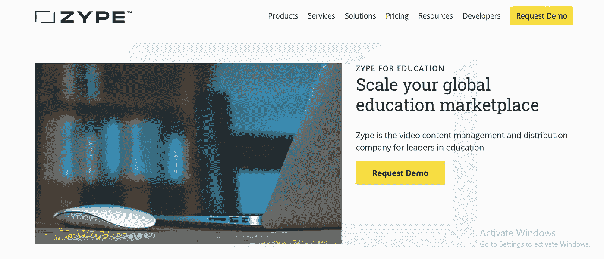
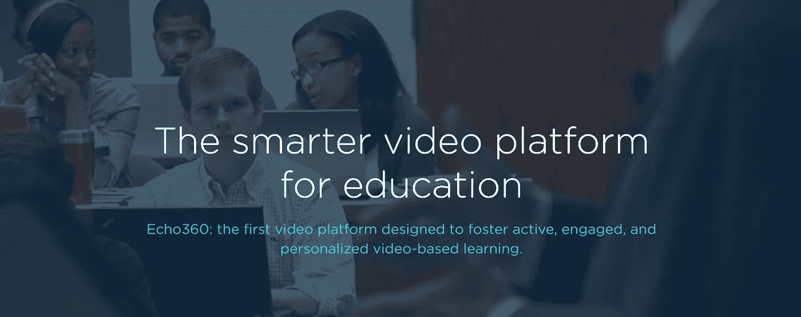

# 对比 2023 年排名靠前的在线视频教育平台

> 原文：<https://medium.com/geekculture/compare-the-top-online-video-education-platforms-in-2022-4e1f18a144b8?source=collection_archive---------10----------------------->

***最后更新—***2023 年 3 月 13 日

*新冠肺炎疫情病毒的爆发将教育转移到了网上。自 2020 年以来，学校、学院和大学一直在全球范围内开展在线课程。由于 Covid 菌株不断变异，随着社交距离成为常态，在线教育将继续存在。这促使教育机构和独立教师及培训者投资电子学习平台。*

*公司也适应了在线电子学习平台。根据最近进行的一项调查，与传统的学习方法相比，电子学习使员工学习一个概念的时间减少了 60%。与传统课堂模式相比，学生和员工从在线培训和课程中获得的收益高出 60%。在本文中，您将了解[创建教育视频流应用](https://www.vplayed.com/build-video-streaming-app.php)的必备功能，以及 2023 年[最佳在线视频平台](https://www.contus.com/blog/online-video-platforms/)的对比。*

***教育视频点播平台的优势***

*教育视频点播平台有几个优势。以下是对学生、员工和公司最重要的优势:*

*   *高信息保持率*
*   *提高对信息的理解*
*   *易于解释和理解复杂的信息*
*   *图像、视频、图表、音频剪辑和其他参考资料的数字媒体可以用来解释复杂的信息*
*   *消除教育和培训差旅*
*   *学生、员工和培训师可以在全球范围内相互联系*

***教育视频平台的主要特性***

*这些是你的 [**虚拟教育平台**](https://www.gudsho.com/elearning-video-monetization) 要想成功必须具备的特性。*

*   ***安全和隐私设置***

*安全视频上传、私人托管、端到端加密、密码保护和域限制是每个在线教育平台都应该具备的一些安全设置。为了完全保护隐私，这些视频应该仅限于授权的观众观看。*

*   ***白标视频播放器***

*导师和培训师应该能够在他们的视频中使用自己的品牌。您的电子学习平台的徽标或品牌不应出现在他们的任何视频中。高级会员应该可以使用白色标签的视频播放器。*

*   ***视频货币化***

*创建几个[视频货币化](https://www.vplayed.com/video-monetization-platform.php)选项，供培训师在注册你的在线教育平台时选择。月付、年付、季付计划、一次性访问费/终身访问视频是一些常用的货币化计划。您还可以包括定制的计划。*

*   ***视频营销和分析***

*没有强有力的营销战略的企业是什么？包括在仪表板内销售视频的选项。此外，为用户启用详细的分析报告，以便他们可以从电子学习平台的仪表板中跟踪学生的行为。*

***7 大在线视频教育平台直播课对比***

1.  *[**VPlayed**](https://www.vplayed.com/education-video-streaming-platform.php)*

*CONTUS VPlayed 是一家端到端的[在线视频教育平台](https://www.vplayed.com/education-video-streaming-platform.php)提供商，可以进行视频点播和视频直播。它可以在手机、笔记本电脑/台式机和智能电视上访问。*

**

***v played 教育视频平台的特点***

*   *转码*
*   *完全可定制*
*   *多屏幕*
*   *视频内容管理系统*

***2。Dacast***

*[Dacast](https://www.dacast.com/) 是一款完全集成且完全可定制的[视频流服务](https://www.vplayed.com/blog/best-video-streaming-services/)，教育机构和教师均可使用该服务进行视频直播和点播。*

**

***Dacast 教育视频流服务的特点***

*   *视频内容管理系统*
*   *集成付费墙的视频货币化*
*   *高度可扩展*
*   *高级分析*

***3。潘诺托***

*Panopto 是一个专用于教育的视频流平台。教育机构、公司、培训师等都可以使用。*

**

***pano PTO 教育视频平台的特点***

*   *完全集成的内容管理系统，包括管理第三方媒体资产*
*   *学习管理系统和视频会议解决方案*
*   *灵活的视频字幕，屏幕阅读器支持*
*   *可在笔记本电脑、平板电脑、智能手机上访问*

***4。** [**Muvi**](https://www.muvi.com/)*

*Muvi 是一个位于 SaaS 的[视频流媒体平台](https://www.vplayed.com/online-video-platform.php)，可以作为在线视频课堂平台使用。它是完全可定制的，可以在多屏幕上访问。这是一个端到端的视频流解决方案，包括在线视频播放器、电视开箱即用、网站 DRM、It 基础设施和移动应用。*

**

***在线视频课堂平台的特点***

*   *安全性*
*   *多重 CDN*
*   *详细分析*
*   *多支付网关支持*

***5。***

***Kaltura 在其云服务器上托管视频，是一个强大的[创建视频流网站](https://www.vplayed.com/blog/create-video-streaming-website-like-netflix/)。教育工作者和公司可以利用 Kaltura 建立他们的在线视频课程平台。***

******

*****Kaltura 在线教育视频流服务的特点*****

*   ***视频门户***
*   ***视频消息***
*   ***白板，CMS 播放列表，屏幕共享***
*   ***高级分析***

*****6。** [**Zype**](https://www.zype.com/)***

***Zype 是 API 优先的 SaaS 解决方案，为直播课堂提供基础设施。这是一个基于云的视频 CMS，提供集成、自动化、分发、分析和货币化选项。***

******

***Zype 电子学习平台的特点***

*   ***易于使用的视频内容管理系统(CMS)***
*   ***完全可定制***
*   ***订阅管理***
*   ***可在全品牌移动电视上观看***

***7。 [**呼应 360**](https://echo360.com/)***

***Echo 360 是一个专用的[在线视频平台](https://www.vplayed.com/us/online-video-platform.php)，专为教育和培训打造。教育机构、培训师和公司利用 Echo 360 进行培训和教学。***

******

*****教育视频流服务的特点*****

*   ***视频学习和互动***
*   ***视频分析***
*   ***视频管理***
*   ***显像记录***

*****结论*****

***教育机构和工作场所已经开始在世界各地开放。但是虚拟工作环境和虚拟教室已经存在。培训者已经采用了部分虚拟教室，即使他们回到了传统的教学方法。作为企业主，您可以根据您需要的功能和盈利计划选择教育流媒体解决方案。***