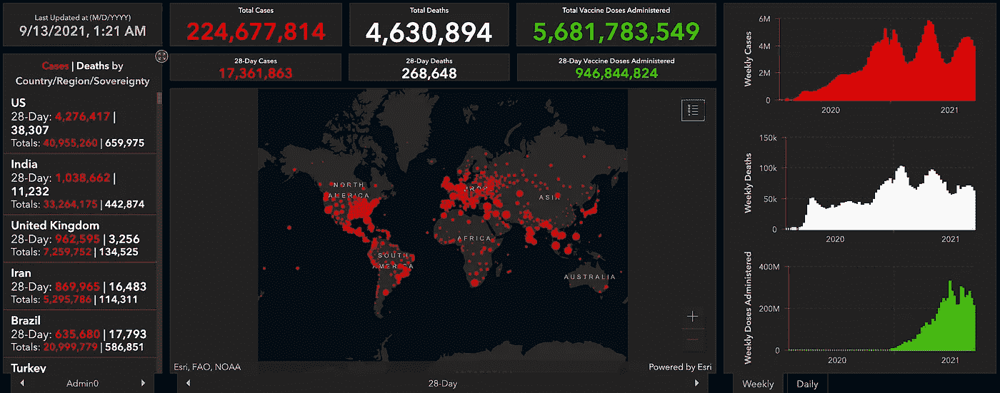

# 使用 SARIMAX、脸书先知、神经网络和 XGBoost 比较新冠肺炎死亡的时间序列预测

> 原文：<https://medium.com/geekculture/compare-time-series-predictions-of-covid-19-deaths-using-sarimax-facebook-prophet-neural-network-c6f6f26b2582?source=collection_archive---------25----------------------->

([Johns Hopkins University of Medicine](https://coronavirus.jhu.edu/map.html))

# 介绍

**新型冠状病毒**又名**新冠肺炎**是 21 世纪最严重的疫情，后果难以预料。截至 2021 年 9 月，全球共有 2.25 亿例病例，导致 460 万人死亡( [Wordometer，2021](https://www.worldometers.info/coronavirus/) )。它的破坏甚至已经…