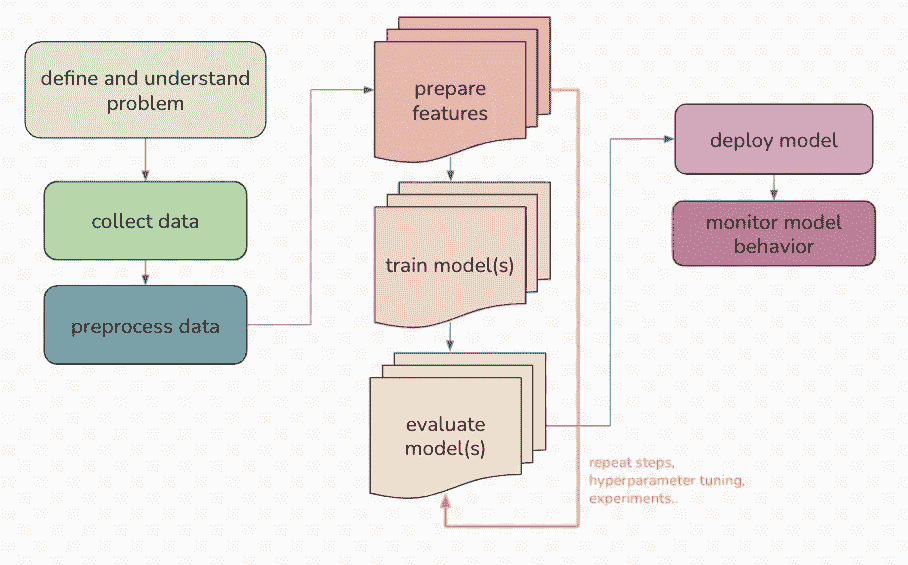

# 比较元流、MLFlow 和 DVC

> 原文：<https://medium.com/geekculture/comparing-metaflow-mlflow-and-dvc-e84be6db2e2?source=collection_archive---------3----------------------->


Space Adventures [#58](https://www.flickr.com/photos/tags/58) (Charlton, 1964)

# 介绍

这篇博文是基于我所做的研究，为了在 [HelmholtzAI](https://www.helmholtz.ai/) 为我们的机器学习操作需求确定一个合适的候选者。它涵盖了我的方法，从理解问题，定义标准到实际的比较过程，比较本身和我的结论。你可以找到我沿途创建的存储库和中心部分，比较表，这里的和这里的。请随意跟随或使用它们作为您自己工作的基础。这篇博客的结构如下:

*   定义我们的用例
*   机器学习生命周期
*   比较检查点
*   考试设置
*   概述
*   结论
*   观点
*   词汇表

在检查或测试任何工具之前，了解机器学习工程本身的更广泛的概念是很重要的。(参见 ML[规则、](http://martin.zinkevich.org/rules_of_ml/rules_of_ml.pdf) [CD4ML](https://martinfowler.com/articles/cd4ml.html) 和 Google[机器学习系统中隐藏的技术债务](https://papers.nips.cc/paper/2015/file/86df7dcfd896fcaf2674f757a2463eba-Paper.pdf)作为关于这个领域的良好第一印象以及它为什么重要)。

在粗略地将我们的用例放在新兴的 MLOps 环境中之后，我集中精力检查三个工具:[元流](https://docs.metaflow.org/)、 [MLflow](https://mlflow.org/) 和 [DVC](https://dvc.org/) 。

> Metaflow 是一个 python 库，最初由网飞开发，用于帮助构建和管理数据科学项目。
> 
> MLflow 是一个管理机器学习生命周期的开源平台。该平台提供了四个不同的组件，既可以独立使用，也可以一起使用。
> 
> DVC 是一个用于 ML 项目的开源版本控制系统，它是围绕现有的工程工具集和工作流(Git、CI/CD 等)构建的。).

# 定义我们的用例

作为一个研究机构，当我们选择新的工具时，我们有许多方面要考虑。我们的使用案例围绕着大型科学数据集、定制基础设施(自有数据中心、HPC)以及对可再现性的特殊需求。

基于此，必须满足以下要点:

*   **再现性:**如果科学结果是通过全程使用 ML 获得的，那么这一部分也必须是独立研究者能够理解的，因此代码、数据、参数和模型的再现性是至关重要的。
*   **工作流集成:**需要记住的另一件事是，我们的潜在用户群将包括科学家，他们的主要工作不是了解复杂的工具或高级编码——因此，工具越容易集成到已经建立的工作流中(例如，使用 git、python 脚本..)越好。
*   **可交换后端:**我们有自己的数据中心和云基础设施，因此该工具必须能够与定制后端
*   与框架无关:由于首选库可以快速改变，甚至首选编程语言，工具不应该关心实际的机器学习代码使用了哪些库和风格。
*   **开源:**我们认为它应该是首选，而且通常更容易适应定制需求
*   **成本因素:**作为一家公共机构，我们必须牢记预算，并优先选择非企业解决方案

# 机器学习生命周期

有各种方法来分解机器学习过程，这取决于一个人的优先级。下图描绘了我们眼中的机器学习生命周期:



This graphic is separated into various steps, which are connected by arrows denoting the execution order. The steps are further grouped into blocks which are inspired by commonly found coding structures.

首先，我们需要理解和定义我们的问题。是关于什么的？当应用机器学习时，我们期望学到什么？这是机器学习的问题吗？回答完这些问题后，下一步是数据收集(通常由科学家完成)和对收集的数据进行预处理(通常由我们的团队完成)。有时，根据数据质量，预处理步骤必须重复几次。(但那是另一个故事了，^^)

第二块展示了创建一个模型所需的步骤——这些步骤通常要执行多次，以便进行试验和调整。

一旦确定了合适的模型，就需要使用该模型并对其进行监控，以检测随时间推移的偏差。

**比较检查点**

为了选择一个合适的候选人，我将手头的任务分为以下几个部分

*   一般设计决策
*   版本管理和再现性
*   实验跟踪和比较
*   流水线执行和代码入侵
*   扩展和后端
*   与 HPC 的交互
*   储存；储备
*   日志记录和调试
*   形象化
*   合作
*   和睦相处
*   模型服务
*   开放源码
*   费用
*   应用于真实世界的例子

你可以在这里找到对照表

# 考试设置

许多见解是通过广泛阅读文档和执行官方教程获得的，但是为了对每种工具有所了解，需要亲身体验。

为了能够比较工具之间的可用性，需要一个共同的基础。因此，我们的想法是创建一个包含相同机器学习示例的改编版本的存储库，因为每个工具都以不同的方式集成到代码中，而且这个过程是评估的重要部分。

为了使用一些(相对)官方的和经过良好测试的东西，我选择了在基础考试设置中使用一个[ml flow 官方示例](https://www.mlflow.org/docs/latest/tutorials-and-examples/tutorial.html)。(请注意，代码示例可以而且应该根据检查点进行扩展)

以下是每个工具的基本测试步骤的大致概述:

```
Pipeline:
- integrate $tool into workflow
- run ml-pipeline with $toolParameters:
Test logging, altering and retrieving with:
- parameter 1 (val0, val1, val2)
- parameter 2 (val0, val1, val2)Metrics:
Test logging, exchanging and retrieving with:
- metric 1 .. metric nModels:
Test exchangeability of models
(pending)
- model 1 (type, parameters, metrics)
- model 2 (type, parameters, metrics)Dataset:
Storing, altering, versioning and retrieving
- small dataset (PoC)
- changed dataset
- large dataset (pending)Storage:
- local
- remote (pending)HPC:
- interaction with HPC environment (pending)
```

关于示例本身的其他信息可以在[内容/示例. md](https://github.com/hzdr/mlops_comparison/blob/master/Content/Example.md) 中找到。

整个考试设置+示例代码+附加信息可在[这里](https://github.com/hzdr/mlops_comparison)找到

下面是每个工具的快速回顾，重点是对我们重要的方面。

# 概述

## 元流

Metaflow 是一个 python 库，最初由网飞开发，用于帮助构建和管理数据科学项目。该库是围绕[数据流范式](https://en.wikipedia.org/wiki/Dataflow_programming)设计的。代码和工作流通过[流程](https://docs.metaflow.org/internals-of-metaflow/technical-overview#flow)进行管理。使用流对代码实施了一种强大的面向对象的方法。

当流首次应用于生产时，元流会创建一个新的、隔离的生产命名空间。[标签和名称空间](https://docs.metaflow.org/metaflow/tagging#namespaces)是另一个强大的概念，用于各种任务，从管理状态到版本控制和与他人协作。

Metaflow 的目标是将代码结构化为图形，从[步骤](https://docs.metaflow.org/metaflow/basics#what-should-be-a-step)开始构建。步骤是不可分割的执行单元，可用于确定代码粒度。步骤还标记[检查点](一个检查点)，因此用于跟踪各种状态及其相应的参数。

并行和动态代码执行可以通过 [foreach 分支](https://docs.metaflow.org/metaflow/basics#foreach)来处理。通过与[亚马逊网络服务](https://docs.metaflow.org/metaflow-on-aws/metaflow-on-aws)的紧密集成来处理空间需求，例如检查点和数据。虽然理论上 Metaflow 可以用于不同的后端，但目前只支持 AWS。

## MLflow

MLflow 是一个管理机器学习生命周期的开源平台。该平台提供了四个不同的组件，既可以独立使用，也可以一起使用。这四个组成部分是:

*   [物流跟踪](https://mlflow.org/docs/latest/tracking.html)
*   [MLflow 项目](https://mlflow.org/docs/latest/projects.html)
*   [ml 流量模型](https://mlflow.org/docs/latest/models.html)
*   [车型注册处](https://mlflow.org/docs/latest/model-registry.html)

文档中还有一个额外的子组件，对我们的用例非常重要:

*   [Mlflow 插件](https://mlflow.org/docs/latest/plugins.html)

MLflow 跟踪组件包含 API 和 [UI](https://mlflow.org/docs/latest/tracking.html#tracking-ui) ，用于记录参数、代码版本、指标和输出文件。结果是可视化的，可以通过用户界面访问，所有可以通过用户界面访问的东西也可以通过编程访问。组件本身是围绕*运行*的概念来组织的，这可以被看作是机器学习代码的执行步骤——*运行*也被记录，并且可以被看作类似于元流*步骤*。

MLflow 项目是一种以可重用和可复制的方式打包代码的格式。该组件还包括用于执行项目并将几个项目链接到工作流中的 API 和命令行工具。工作流还可以用于并行执行或参数实验，提供一些功能，如 [DVCs 实验功能](https://dvc.org/doc/start/experiments)。

MLflow 模型组件是打包机器学习模型的标准格式，以便在不同的下游工具中使用它们，例如通过 REST API 或 Apache Spark 上的批处理推理进行实时服务。模型可以输出不同的 [*口味*](https://mlflow.org/docs/latest/models.html#built-in-model-flavors) 供进一步使用。

MLflow 模型注册组件是一个集中式模型存储，包括一组 API 和一个 UI，用于协作管理 MLflow 模型的整个生命周期。在更大的设置中，它似乎是管理其他三个组件的一个组件。

MLflow Python API 支持编写与不同 ML 框架和后端集成的插件。Mlflow 插件提供了一种自定义 MLflow Python 客户端行为和集成第三方工具的机制。对我们来说，一个重要的使用案例是定制存储解决方案的可能集成。

## DVC

DVC 是一个用于 ML 项目的开源版本控制系统，它是围绕现有的工程工具集和工作流(Git、CI/CD 等)构建的。).DVC 可分为以下几个部分:

*   [版本控制+访问](https://dvc.org/doc/start/data-and-model-versioning)
*   [管道](https://dvc.org/doc/start/data-pipelines)
*   [实验](https://dvc.org/doc/start/experiments)
*   [可视化](https://studio.iterative.ai/)

数据和模型版本控制是负责处理和跟踪大型文件、数据集和机器学习模型的组件。这是通过与`git`(“DVC = = Git for data”)一起执行的命令来实现的。关于添加数据的信息存储在`[.dvc files](https://dvc.org/doc/user-guide/project-structure/dvc-files)`中。这个元数据文件是原始数据的占位符，可以像源代码一样用 Git 进行版本控制。数据本身可以远程存储，并通过`[dvc push](https://dvc.org/doc/command-reference/push)` 和`[dvc pull](https://dvc.org/doc/command-reference/pull)`进行访问。

代码和工作流被组织在[管道](https://dvc.org/doc/start/data-pipelines)中。管道背后的想法是围绕数据*输入*和*输出*构建代码，并使执行步骤可重复——类似于其他工作流管理工具(例如 [Snakemake](https://snakemake.readthedocs.io/en/stable/index.html) )。

使用`[dvc run](https://dvc.org/doc/command-reference/run)` 可以创建*阶段*，它们构成了*管道*的步骤。Python 脚本可以很容易地添加到阶段中。

DVC 提供了`[dvc experiments](https://dvc.org/doc/command-reference/exp)`功能，解决了超参数调整和模型测试的需要。它使用相同的流水线原理，但提供了额外的功能，如模拟运行、排队和不同实验运行之间的比较。最好的可以应用到实际的工作流程中，而其他的可以被丢弃，这样就不会污染存储库。DVC 的输出似乎可以输入到其他工具中，如[权重&偏差](https://wandb.ai/site)。

可视化结果可以通过各种 [diff 命令](https://dvc.org/doc/start/metrics-parameters-plots)或 [DVC 工作室](https://dvc.org/doc/studio)来实现，它们提供了与 [MLflows 跟踪 UI](https://www.mlflow.org/docs/latest/tracking.html#tracking-ui) 类似的功能。

# 结论

*我为对此流程感兴趣的人提供了结论和展望，以及我对此事的看法*

从设计概念(大量使用名称空间)和文档中可以看出，Metaflow 的构建考虑了伸缩和协作。代码被结构化为图流，特性通过装饰器来控制，迭代器用于将所有东西链接在一起(而不是传统的返回语句)。这种方法非常强大和优雅，但也需要足够的计算机科学知识，以便能够理解这些概念，并成功地将它们应用到现有代码中。另一个缺点是对 Amazon AWS 的强烈依赖，目前没有对定制后端的官方支持，并且缺少用于比较的 UI——因为它更像是一个库，而不是工作流管理工具。一些人尝试结合使用 Metaflow 和 Mlflow 作为解决方法，也有社区努力添加不同的后端。至于现在还不能预见何时会有官方的和易于使用的支持。

**MLflow** 提供了受检工具中最多样化的功能。它包括一个图形用户界面，用于集成不同后端或服务模型的不同 API，一个机器学习生命周期管理组件和各种其他功能。文档非常详细，这对开发人员和管理员来说非常好，但对我们的一些潜在用户来说可能是压倒性的。对于我们的用例，MLflow 跟踪组件及其 UI 是一个巨大的优势。另一方面，框架的庞大和非平凡的协作选项是一个严重的缺点。高学习曲线和初始代码投资(如后端编写插件)是可以预期的。

**DVC** 更小，构建在现有的和广泛的工具集之上，尤其是围绕 Git。与其他两个工具相比，DVC 主要由一组 CLI 工具或 DVC 工作室操作(尽管它也提供了一个 API 用于直接代码集成，如果你想这样做的话)。这似乎是代码侵入最小的工具，不需要为了集成工具而进行大量的代码调整，这对我们的潜在用户群来说是一个巨大的优势。文档很简单，并且在所需的计算机科学背景方面提供了一个较低的起点。

一般来说，Metaflow 对于大型团队的大型生产用例来说似乎是一个很好的选择，但是对于我们预期的用户基础和定制环境来说可能太难了。如果研究所正在考虑将整个 ML 工作流标准化，并像处理其他基础设施一样处理它，那么 MLflow 应该是一个重要的考虑因素。如果单个研究人员或小型团队只关注 MLflow 跟踪，他们可能会使用它来本地跟踪他们机器上的实验，并将代码组织到项目中以供将来重用。默认情况下，MLflow 跟踪将文件读写到本地文件系统，因此不需要部署服务器。DVC 比其他工具更窄(例如，缩放必须由后端处理)，并且在我们的用例的优点和缺点之间有最好的平衡。它涵盖了实验跟踪、比较和数据版本化等需求，并围绕 git 等精心设计的工具进行构建，使其在现有工作流程中更容易访问和使用。它也是代码入侵最少的变体。

# 观点

基于这项工作，目前的建议是，要么更接近 MLflow 的简化用法，要么与 DVC 一起使用。在这两种情况下，自定义后端、远程存储和更彻底的 UI 检查的使用情况都有待估计(希望很快就会出现，真正的科学用例实验正在进行中。)

在社区支持方面，这三个工具都提供了一些交互和获得帮助的方式。

用例及需求会随着时间的推移和经验的积累而改变，因此这篇博客应该被看作是我在这个庞大的话题上的第一次尝试。

我希望你喜欢你的阅读:)建设性的批评和建议总是受欢迎的！

**更新:**DVC 社区告诉我，同时运营 MLflow 和 DVC 也是一种选择。(MLFlow 用于可视化，DVC 用于版本控制)。这种方法可以帮助减轻 MLFlow 在协作方面的缺点，同时使用其强大的 UI。

# **词汇**

(一如既往地半信半疑)

**(python)库**:一组有用的函数，无需从头开始编写代码。

**(开源)平台**:一组技术，用作开发其他应用程序、流程或技术的基础。

**框架:**开发软件应用的平台。框架类似于 API，尽管从技术上来说框架包括 API。顾名思义，框架是编程的基础，而 API 提供对框架所支持的元素的访问。框架还可以包括代码库、编译器和软件开发过程中使用的其他程序。

**API:** 应用编程接口——一组命令、函数、协议]和对象，程序员可以使用它们来创建软件或与外部系统交互

**(G)UI:** 一种图形用户界面，用户通过该界面经由视觉指示器表示与电子设备和软件进行交互。

**HPC:** 高性能计算

命令行界面——基于文本的界面，用于操作软件和操作系统