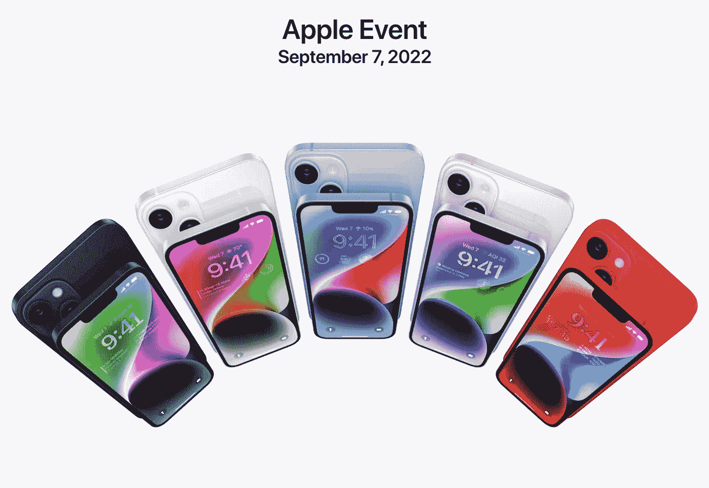

# 对比:iPhone 13 与 iPhone 14

> 原文：<https://medium.com/geekculture/comparison-iphone-13-vs-iphone-14-8a4d04a12a27?source=collection_archive---------5----------------------->

## 值得升级吗

Source: Apple Keynote

在 9 月的主题演讲中，苹果推出了第二代 AirPods Pro、第二代 Apple Watch SE、Apple Watch Series 8、Apple Watch Ultra 和四款 iPhones。所有这一切都在意料之中，这可以从很多方面来说，尤其是关于 iPhones 的个别功能。

> 不幸的是，这也证实了这是相当困难的…