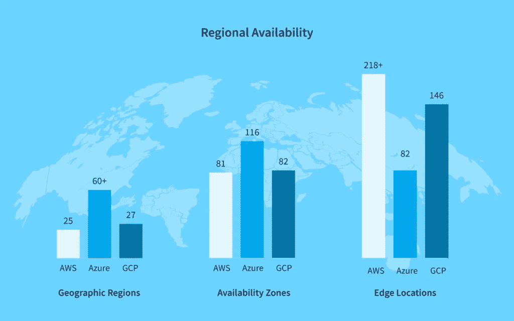

# 对比概述:Azure vs. GCP vs. AWS — NIX United

> 原文：<https://medium.com/geekculture/comparison-overview-azure-vs-gcp-vs-aws-nix-united-321c370c1f48?source=collection_archive---------18----------------------->

云计算处于当今*全面数字化*的最前沿，渗透到各行各业，带来先进的高能效远程云机遇。没过多久，通过领先存储技术提供商的力量，激烈的竞争就在利基市场形成了。多年来竞争一直在变化，今天我们有三个共同的云计算最爱——微软、谷歌和亚马逊，它们各自基于云的存储平台——Azure、谷歌云平台(GCP)和亚马逊网络服务(AWS)。

这些特定的平台主导了 IaaS(基础设施即服务)和 PaaS(平台即服务)市场。因此，我们决定公平合理地比较每一个，以帮助您了解哪一个最适合您的特定目标和细节。这是 AWS 与 Azure 和 GCP 的终极对比。

虽然这三大领先平台总体上在云计算市场上占据主导地位，但根据市场份额和总普及率，它们已经牢牢占据了自己的公平位置。不同的特性、工具和功能适合不同地区的不同用户，等等。，形成清晰的分割。

亚马逊通过 AWS 平台展示的云能力在竞争中遥遥领先。Synergy Research Group 的报告称，AWS 目前占据了全球云市场 [33%的总份额](https://www.srgresearch.com/articles/incremental-growth-cloud-spending-hits-new-high-while-amazon-and-microsoft-maintain-clear-lead-reno-nv-february-4-2020)，涵盖了各种规模企业的需求。该平台的深度多功能性是由于指数级系统扩展能力而实现的，这使其成为云平台的顶级性能发电站。

[的同一份报告](https://www.srgresearch.com/articles/incremental-growth-cloud-spending-hits-new-high-while-amazon-and-microsoft-maintain-clear-lead-reno-nv-february-4-2020)指出，微软在同一个利基市场中占 18%的总份额，以最适合企业的潜在特征将其置于第二位。尤其是那些拥有自己的运营数据中心和[企业数据仓库](https://medium.com/r?url=https%3A%2F%2Fnix-united.com%2Fblog%2Fwhat-is-enterprise-data-warehouse%2F&utm_source=medium&utm_medium=referral&utm_campaign=cloud_services_comparison)解决方案的企业，Azure 由于其混合云和私有云功能，可以与这些解决方案很好地集成。

根据基础报告，谷歌平台覆盖了大约 5%的市场。就他们的工作日程和行业发展速度而言，这种情况让谷歌的家伙们非常高兴。这家强大的公司似乎正在非常渐进和谨慎地渗透到云利基市场，目标是目前最广泛的用户群。

# AWS vs. Azure vs. GCP:得失

凭借其在市场中的稳固地位，每个平台都比表面上的整体成功更有意义。更深入地分析 GCP 与 AWS 和 Azure 的对比，每个解决方案都有特定的优缺点。让我们来看看。

# AWS 的优缺点

**加号:**

*   **巨大的技术能力** —亚马逊网络服务是一个平台，它包含了一个巨大的基于云的运营领域，提供了易于扩展的云空间，其扩展潜力仅受客户特定需求和愿景的限制。
*   **灵活的特性** —由庞大的 AWS 平台提供的服务、工具和其他功能数不胜数，可以处理从日常管理到深度数据分析和智能预测的各种任务。
*   **稳定的数据传输** — AWS 有助于有效避免存储或服务器数据传输过程中的数据丢失，消除大量相关风险。
*   **高数据可用性** — AWS 用户可以选择最接近其地理位置的数据存储选项，以避免存储距离。

**减号:**

*   **关注公共云** —在这种情况下，面向企业的能力在某种程度上是有限的，而不是现成可用的私有云和混合云机会，这使得 AWS 成为企业内部使用时需要仔细考虑的一个选项。
*   **有些令人困惑的成本** —倾向于 AWS 的公司的一个常见抱怨是不明确的长期定价政策，以及不断变化的条件和进一步预算策略的不明确条件。

# 蔚蓝色的优缺点

**加号:**

*   **微软**的力量——这个巨大的云供应商基本上把它所有的*内部要点*(包括像。NET、SQL Server、Office 等。)并对其进行调整以方便基于云的使用，为客户提供微软所能提供的最好的东西。
*   广泛的生态系统——我们可以自信地说，大多数公司都在这里或那里使用一些微软的软件解决方案，并且很容易与它们集成，Azure 是一个非常灵活的选择。
*   **企业性能** — Azure 对大多数企业来说都是一个很好的解决方案，允许实现基于强大的微软久经考验的能力构建的定制云基础设施。

**减分:**

*   **第三方集成** —是的，微软很容易与类似性质的解决方案集成；但是，在与非微软产品集成时，可能会遇到重大问题。
*   **有限的灵活性** —扩展上述观点，如果工作流主要基于微软，Azure 可以帮助实现一个健壮的企业系统，但由于无法完全自由地定制内部和外部的云基础设施，整体平台的通用性受到阻碍。

# GCP 的优点和缺点

**加号:**

*   **Kubernetes 标准** —深度容器化帮助 GCP 处理大数据分析和 ML 驱动的数据处理，以获得更快和更智能的*现场操作结果。*
*   **负载平衡和扩展** —谷歌是一家非常精明的提供商，拥有平稳运行的数据中心和快速响应的整体服务。
*   **谷歌生态系统**——谷歌创造的各种软件解决方案也被寻求云机会的公司普遍使用，这使得逐步采用 GCP 成为一项增强绩效的工作。
*   **开源机遇**——和往常一样，谷歌为所有开源爱好者提供了大量的自由定制空间，形成了一个由渴望自由思考的 GCP 用户组成的完整社区。

缺点:

*   **没有足够的企业议程** —由于系统更新颖、面向初创企业的性质，GCP 的应用领域变窄了，基础设施提供了一些市场定义的云工具，无法真正服务于一体化企业云目的。
*   **技术限制**—GCP 提供的应用引擎仅支持 PHP、Java 和 Google Go，限制了兼容软件方法和解决方案的整体范围。
*   **昂贵的费用** —与 GCP 合作，管理数据下载和支付支持费用(平均每月支持费用为 150 美元)有些昂贵。

1.  **AWS 是迄今为止最高性能和最灵活的复杂云软件解决方案，然而，它的价格是相应的，并且需要适当的技能；**
2.  **Azure 可以建立一个可靠的企业云计算基础，在它的核心工作于已证实的微软解决方案，然而，它也有一些已证实的缺陷；**
3.  **GCP 可能没有开箱即用那么大，但是开源的、真正灵活的软件本质允许实现几乎相同的结果。**

****AWS vs Azure vs GCP 看台成绩:****

# **亚马逊 AWS vs. Azure vs .谷歌云:服务比较**

**如果没有列出每个平台提供的基本服务，这种云网络服务的比较是不完整的。更进一步，我们应该考虑定义每个平台的特定容量和服务。**

# **计算能力**

**AWS 系统性能的核心是弹性计算机云(一种虚拟机管理服务)和可以轻松集成的容器服务。弹性计算机云是一种核心 web 服务，支持自主可扩展的高性能云计算环境。**

**除此之外，Kubernetes 或 Docker 等容器服务可用于自动化集群和服务器管理工作负载。同时，其他服务如 Beanstalk、Lightsail、Batch 等。，进一步扩展云环境功能。**

**微软的解决方案依赖于虚拟机和一系列紧密相连的服务。虚拟机构成了该平台的核心系统，提供了高级别的安全性、混合云能力、对其他微软服务的广泛支持以及用于提高整体性能的大量实例目录。**

**人工智能和人工智能驱动的功能也在这里出现。虚拟机扩展集是负责自动扩展的系统，而基于 Kubernetes 的系统负责容器化。还有一个批处理服务和云服务，它们是 Beanstalk 的一个很好的替代品。**

**谷歌平台的强大功能称为 Compute Engine，它可以帮助您自动折扣，使用预定义和定制的机器类型，采用每秒计费，并通过组织碳中和基础设施和将能源支出减半来优化数据中心的能源消耗率。**

**尽管 GCP 的功能不如上述两个平台广泛，但它继承了 Kubernetes 的功能，有助于将所有微服务和容器从容器部署到所有其他管理都设置到位。**

**亚马逊提供了一个名为简单存储服务(S3)的解决方案来存储数据，这是一个高度可扩展的、完善的系统，拥有一个由精明的专家组成的充满热情的社区。存储容量基本上是无限的，可以根据您的资源消耗需求进行扩展。如果你需要处理一些大的或者批量的文件，你也可以一次上传 5 GB。**

**微软的存储解决方案被称为 Blob 存储，它是一个通用的系统，可以利用继承的能力处理非结构化数据。它很棒，因为它可以很容易地与一堆额外的应用程序集成，你可以一次上传高达 5 TB。**

**谷歌云存储是一个完全原创的数据存储平台，提供广泛的集成能力，稳固的数据上传一致性，以及作为额外工具的可恢复上传。该存储针对处理非结构化数据进行了优化，允许立即上传重达 5 TB 的文件。**

*   **用于数据处理的弹性 MapReduce:**
*   **方便数据编排的数据管道；**
*   **用于实时数据流的 Kinesis 流；**
*   **用于大规模数据摄取的 Kinesis Firehose**
*   **在数据分析过程中快速获得深入见解。**

# **数据分析**

*   **HDInsight**
*   **动力 BI；**
*   **Azure 机器学习；**
*   **Azure 认知服务；**
*   **Azure 数据工厂等。**

**谈到有洞察力的数据分析工具，AWS 提供:**

*   **云数据融合；**
*   **云数据流；**
*   **云 BigTable**
*   **云数据准备等。**

**Azure 并没有落后太多，它提供了一个原创的 Azure Synapse 分析服务，用于集成、存储和分析数据，同时还有以下工具:**

****

**谷歌的平台采用了另一种用于数据分析目的的独特解决方案，称为 BigQuery，这是一种完全托管的企业数据仓库，使查询和存储庞大的数据集变得容易，包括借助以下工具:**

# **区域可用性**

**亚马逊网络服务覆盖 [25 个地理区域](https://www.bmc.com/blogs/aws-regions-availability-zones/)和 81 个可用区域。218 个以上的边缘位置和 12 个区域性边缘缓存。**

**Microsoft Azure 运行 60 多个区域，每个区域至少有三个可用性区域，超过 116 个边缘位置(存在点)。**

**谷歌云平台有 27 个云区域，82 个区域和 146 个边缘位置。**

**此外，每个提供商还为专门的政府公用事业提供政府云解决方案。**

**计算使用 AWS 的潜在成本的问题是，有太多的变量，很容易失去跟踪，并看到许多意想不到的成本到处滋生。这就是为什么专家通常在这里使用专门的成本管理工具。本质上，你可以选择以三种不同的方式计费——a)基于资源消耗率，b)基于[保留实例](https://aws.amazon.com/ru/ec2/pricing/reserved-instances/?nc1=h_ls)定价模型，c)按使用小时计费。**

*   ****AWS 有错综复杂的成本形成体系，绝对不便宜；****
*   ****Azure 的定价是透明的，但一旦插件开始使用，隐藏的成本就会产生；****
*   ****GCP 在定价上是透明和灵活的，这只是反映了它的开源性质。****

******AWS vs GCP vs Azure 定价结果:******

****您实际上是为使用存储的每一秒钟付费，不多也不少，而且是按分钟付费。账单也是分分钟凑一次。不过，您也应该在适当的专家的帮助下计算成本，因为许可选项可能会让您感到困惑，而基于情况的折扣可能有助于优化整体定价。****

****与 Azure 类似，GCP 按分钟计费，但它每 10 分钟汇总一次账单。就目前而言，这是最经济实惠的解决方案，使其价格与其提供的容量保持一致。****

# ****AWS、Azure 和 GCP:巨大的选择困境****

******亚马逊 AWS vs. Azure vs 谷歌云******

*   ****面向大中型企业的 AWS，这些企业需要具有大量定制和扩展自由的多功能一体化解决方案；****
*   ****Azure 适用于需要由强大的微软生态系统强化的强大一体化系统的小型至大型公司；****
*   ****GCP 适用于需要经济高效且功能强大的智能工具、云优化功能等的小型公司或独立目标和需求。****

******底线:******

****现在是 GCP vs Azure vs AWS 对决的时候了。****

****AWS 简化了广泛的可伸缩性，有助于避免和消除流程中大量的常见风险、陷阱和不必要的工作。它在成本管理方面非常灵活，并且可以与第三方服务顺利集成。然而，这是一个需要专业人士才能正常运行的系统，为所使用的资源设定一个合理的价格，并且只作为额外购买的奖励提供企业功能。****

****微软 Azure 是用户友好的、简单的和广泛的开箱即用的。它可以很容易地用一整套集成的 MS 服务和工具来加强(这对于使用 Windows 的办公室来说是一个额外的优势)。它也适合任何规模的公司，并有助于实现合理的成本效益。但是，对于这种解决方案，您应该真正关注您的数据传输强度，以避免额外的成本。从长远来看，如果您是一家需要大型一体化解决方案的大型企业，而您没有投入足够的精力来配置和管理它，它可能不符合您的需求。****

****GCP 拥有深入的数据存储和分析能力，与大量其他谷歌服务无缝集成，以及合理、灵活的定价模式。然而，Google 生态系统的范围也可能被认为是一个技术限制，而使用的编程语言的选择也是非常有限的，并且还有区域限制。****

# ****将尼克斯联合视为您值得信赖的合作伙伴****

****NIX United 是一家经验丰富的云容量提供商，提供从基本云部署到深度优化、集成和分析的服务。我们可以根据您的项目单独组建一个团队，承担您日程上的任何任务。****

****我们通过量身定制的[定制软件开发](https://nix-united.com/?utm_source=medium&utm_medium=referral&utm_campaign=cloud_services_comparison)服务来提供我们的专业技术知识，帮助企业和初创公司根据目标和能力进行合理扩展。从常规的 [CRM 集成](https://nix-united.com/services/enterprise-it-integration-and-customization-services/?utm_source=medium&utm_medium=referral&utm_campaign=cloud_services_comparison)到定制云硬编码工作，我们全都做了。我们还将帮助您决定最适合您的 Azure vs. AWS vs. GCP。****

# ****最后的想法****

****是的，亚马逊网络服务是一个领先的发电站云平台，通过广泛的解决方案为几乎所有规模的企业积累了计算能力。但它的两个竞争平台的力量在于它们能够填补“老大哥”的缺口，并扩展到特定需求的容量。事实上，他们现在正在处理这样一个行业巨头，使他们已经严重的竞争对手。****

****所以睁大你的眼睛，专注于适合你个人的事情，而不是*普遍接受的最佳解决方案*。与此同时，我们希望 AWS、Azure 和 Google Cloud 的比较能让你更清楚地知道应该选择哪个方向。****

# ****AWS、GCP 和 Azure 哪个更好？****

****对于云 Amazon vs. Google vs. Microsoft 这个问题的最终答案应该在彻底研究和分析所有利弊之后给出，以确定最适合您特定需求和目标的选项。例如，在我们的比较文章中，您可能会了解到 GCP 可能比 AWS 更适合您的需求，AWS 是一个通用的强大解决方案，可能有您不需要的东西。****

# ****Azure、AWS 和 GCP 哪个更便宜？****

****GCP 是最便宜的选择，它缺乏相应的功能。如果我们在这方面比较微软 Azure vs 谷歌云 vs AWS，那么 AWS 是成本最高的，然后是 Azure，GCP 在最后一个位置是最实惠的选择。然而，在使用任一平台时，长期成本可以通过多种方式进行优化。****

# ****AWS vs. GCP vs. Azure:哪个更安全？****

****同样，微软 Azure vs .亚马逊 AWS vs .谷歌云的最终选择应该根据个人需求、要求和能力来考虑。因此，如果你身边有一个精明的网络安全专家团队，你也可以把 GCP 变成一个受到严密保护的云。这就是 AWS vs. GCP vs. Azure 立场的困境，可靠的顾问可以帮助你澄清和处理。****

*****原载于 2021 年 12 月 22 日*[*【https://nix-united.com】*](https://nix-united.com/?utm_source=medium&utm_medium=referral&utm_campaign=cloud_services_comparison)*。*****