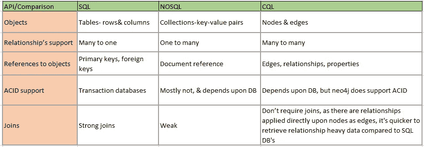
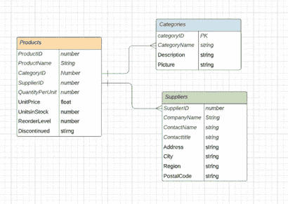
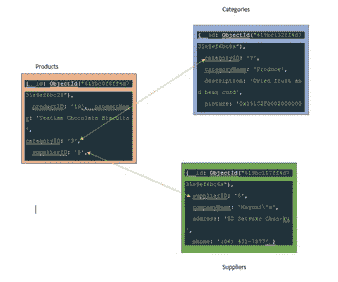
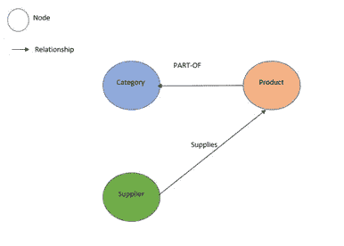
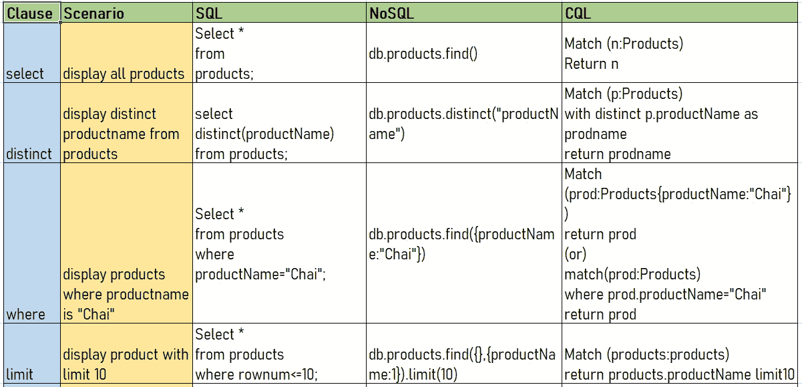
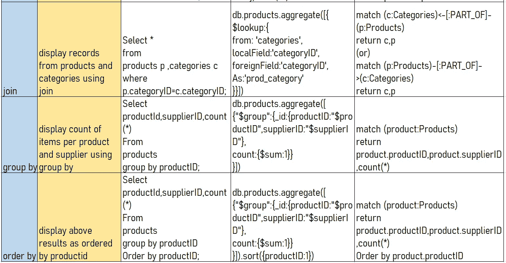

# SQL 与 NoSQL 和 CQL:比较和测试场景

> 原文：<https://medium.com/geekculture/comparisons-tested-scenarios-sql-vs-nosql-vs-cql-b455951aaf51?source=collection_archive---------11----------------------->

—关系数据库、文档数据库和图形数据库的数据分析！！

Photo by [Burst](https://burst.shopify.com/photos/brown-white-dogs?)

技术堆栈— Oracle、MongoDB、Neo4j

在当前具有 N 层环境的软件体系结构中，像单一责任或关注点分离这样的原则使得平台堆叠了多种技术，其中工程师不仅仅倾向于任何特定的技术，相反，他们必须理解或准备好使用他们专业知识之外的不同技术。

其中一种情况是，工程师每天必须使用各种 API(SQL、NoSQL、CQL)在各种数据模型(rational、document、graph)上交互/处理各种数据结构，如(表、JSON、节点结构)。而且很难对所有品种都有专门知识。今天，在这篇文章中，我将详细介绍这些结构，以便开发者在日常工作中使用它们！

词汇表:

*   概念比较
*   数据模型的
*   查询分析

**概念比较**:最初我们将研究这些 API 之间的概念差异，以理解我们与之交互的数据和数据模型的本质！

Internal Screenshot

**数据模型**:使用下面的示例对象，我们可以在不同的数据库上设计模型，并在 b/w 中显示差异，我们也将使用这些数据模型进行查询分析。

示例:产品—是产品的运营数据，其中也包含类别和供应商详细信息，类别—描述产品及其类别，供应商—提供这些产品的公司和地址

**关系模型**:在这个模型中，对象被称为实体，关系是基于键约束创建的

**Relational Model**

**基于文档的模型**:在这个模型中，文档是 JSON 对象的集合，使用 JSON 对象内部的引用创建关系，然后根据这些引用进行规范化。

**Document Model**

注意:在 NoSQL 模型中，文档是基于主文档(这里是产品)中的引用进行规范化的。

**图模型**:在这里，对象称为节点，节点之间的关系称为边。每个节点都有将相似节点分类到不同节点的属性。

**Graph Model**

**查询比较:**我们现在将根据我们设计的模型类型编写查询。在这里，我将尝试使用我们在 SQL 上的框架查询来描述查询，这也是大多数开发人员的默认查询语言，并且易于理解。*骨骼:-*

选择*列，选择*列

来自*表 1*

其中*条件/表达式*

加入*表 2*

分组依据*条件*

以...排序

限制

Screen1

Screen2

我试图展示这些比较，以帮助理解和利用现代项目中使用的技术中的基本查询结构。感谢你阅读这篇文章！！

参考资料:

*   MongoDB:[https://docs . MongoDB . com/manual/core/data-modeling-introduction/](https://docs.mongodb.com/manual/core/data-modeling-introduction/)
*   neo4j:[https://neo4j . com/docs/cypher-manual/current/functions/aggregating/](https://neo4j.com/docs/cypher-manual/current/functions/aggregating/)