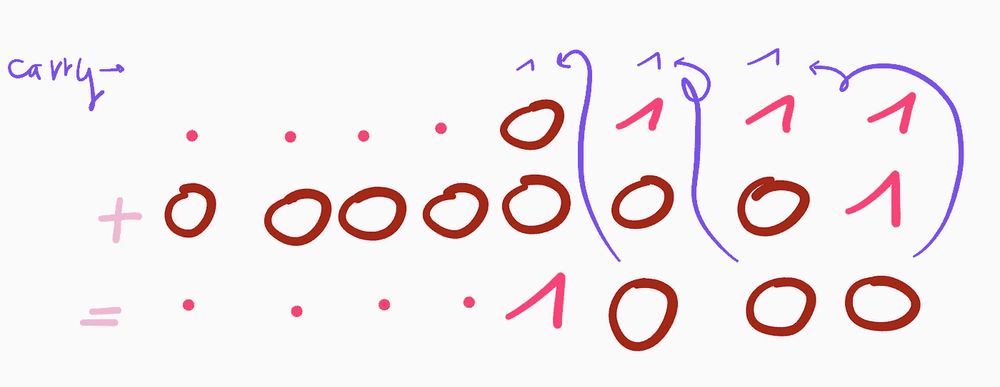
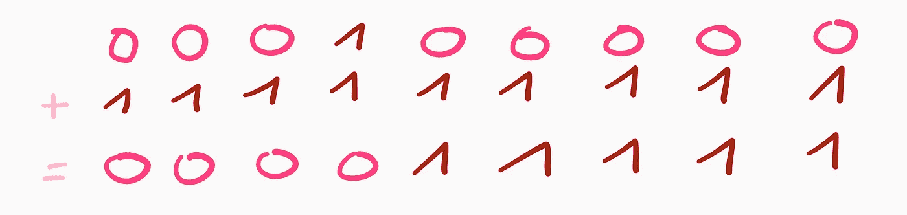

# 竞争性编程:一种更有效的表示和操作整数集的方式

> 原文：<https://medium.com/geekculture/competitive-programming-a-more-efficient-way-of-representing-and-manipulating-sets-of-integers-99b0e10daca9?source=collection_archive---------29----------------------->

Photo by [Elena Mozhvilo](https://unsplash.com/@miracleday?utm_source=medium&utm_medium=referral) on [Unsplash](https://unsplash.com?utm_source=medium&utm_medium=referral)

按位运算符提供了一种对自然数集执行多种运算的方法，而无需存储实际的数字。在本文中，我们将了解这种技术是如何工作的，它支持哪些操作，以及它们是如何实现的。特别是，我们将学习如何在常数时间中找到一组整数*的并、交和最小元素。*

# 大意

这种技术背后的思想是将一组 *n* 个整数的 *S* 表示为一个整数 *X* ，使得当 *X* (从右数)的索引位( *a* + 1)被设置为 1 时，整数 *a* 正好位于 *S* 中。例如，singleton {3}将由二进制表示为 00001000 的数字来表示。同样，集合{3，5}将由 00101000 表示。换句话说，{a}的表示是整数 2^a，集合 *A* 的表示是 2^ *k* 的和，对于 *A* 中的所有元素 *k* 。

考虑到这一点，我们可以使用按位运算符对集合实现基本运算。

# 创建单例

将一个数的第 *i* 位设置为 1，所有其他位设置为 0 可以使用左移运算符来完成，通常用符号 **< <** 来表示。如果 *u* 和 *v* 是整数，那么 *u* < < *v* 将 *v* 0 加到数字的右边。比如 4<<3 =**100***000*，因为基数 10 中的 4 是 100 是基数 2。对于所有的 *x* ，1 < < *x* 是其第( *x* + 1)位被设置为 1 并且在其他地方都为 0 的数字，即 2^ *x* 。

所以对于所有自然数 *a* ，单个的{ *a* }都用 1 < < *a* 来表示。

# 计算两个集合的并集

到目前为止，我们只和单身人士合作过。现在，我们希望能够将几个单值集合合并成一个具有多个值的集合。这可以通过使用*或*位运算符来简单实现。这个运算符被称为*析取运算符*。*或*取两个数字 u 和 v 并返回数字*z*=*u*||*v*使得对于每个索引 *i* ，当 *i* 时 *z* 的第 *i* 位正好设置为 1

使用这个定义，如果 *A* = { *a* }并且 *B* = { *b* }那么集合 *A* ⋃ *B* 由 *A* 和 *B* 的表示的析取来表示。

例如，{2} = 00000100(第三位设置为 1)和{5} = 00100000(第六位设置为 1)和 00000100 | 00100000 = 00100100。

# 寻找两个集合的交集

两个集合 *A* 和 *B* 的交集是同时属于 *A* 和 *B* 的所有元素的集合。当且仅当 A 的第 I 位和 B 的第 I 位都设置为 1 时，这对应于第 I 位设置为 1 的数字。这正是按位连接词 **&** 的作用。

给定代表两组自然数的两个数 A 和 B，A 和 B 的交集由 A **&** B 给出。

# 求两个集合的对称差

求两个集合的区别，其实不是并集和交集那么简单。相反，我们可以计算它们的对称差。两个集合 *A* 和 *B* 的对称差是恰好属于两个集合之一的所有元素的集合。等价地，它是它们的并集，减去它们的交集。

用 *A* 和 *B* 的表示的异或来表示。表示为*u***xor***v*的 *u* 和 *v* 的异或运算，在其一个操作数的第 *i* 位设置为 1 并且另一个操作数的第 *i* 位设置为 0 时，其第 *i* 位设置为 1。这应该清楚地表明，这对应于两个集合的对称差。

# 子集和成员

我们希望能够对我们的集合执行最后两个基本操作:检查某个集合 *A* 是否是另一个集合 *B* 的子集，以及检查某个自然数 *a* 是否属于某个集合 *A* 。这两种操作实际上都是从我们前面看到的操作派生出来的。

为了检查 A 是否是 B 的子集，我们将检查 A 和 B 的交集是否是 A 本身。因此，A ⊆ B 当且仅当，A & B = A

同样，数 *a* 属于 *A* 当且仅当，单元素{a}和 A 的交集非空，即(1 < < a) & A！= 0.

# 寻找集合中的最小值

也可以很容易地找到一个集合的最小元素。这需要计算一个数 *A* 的二进制补码，我们将它表示为- *A* 。它由公式-*A*=(**not**A)+1 给出，其中 not 否定所有位，即将 0 变为 1，将 1 变为 0

在我们的表示中，集合的最小元素是设置为 1 的最右边的位。

因此，如果我们对一个集合求反，最小值就是设置为 0 的最右边的位。

当我们加上 1 时，我们得到满足 min -A = min A 的集合-A。原因如下图所示。

图像显示了(不是 A) + 1 的计算。由总和表示的集合的最小值正好是在第一项中设置为 0 的最右边的位。这是真的，因为进位一直累加到两位数都为零的位置。这是第一项最右边的*零点*的位置，即 *A* 最小值的位置。进位就这样被消耗掉了，加法产生一个*1*:和的最小元素实际上与 *A* 相同。

在这一点上，不再有进位，因为我们只是在 A 的数字上加了*个零*，以后也不会再有了。因此，最右边的*位*左边的所有位都与 in(而不是*位*位)相同。由此可见， *A* 和- *A* 的最小值实际上是既在 *A* 中又在 *-A* 中的唯一元素。

因此， **A & -A** 表示包含 *A* 的最小值的单体。

# 前 n 个自然数的集合

我们可以直接创建小于某个自然数 *n* 的所有自然数的集合。

让我们考虑数字 *X* ( *n* )的第 *n* 位(从末尾算起)被设置为 1，其他所有位被设置为 0。如果我们将所有位都设置为 1 的数字加到它上面，那么我们将得到 1 和 *n* - 1 之间所有整数集合的表示。

上图显示了为什么当 1 在第六个位置时这是真的，但想法大体上是相同的:我们评估 0 + 1 到 1，直到我们到达两个位都被设置为*1*的位置。此时，总和计算为 10，所以我们写 0 并携带 1。我们一直保持进位 1 到最后一位数字。和是第一个 *n 个*自然数的集合的表示。

如果我们使用基于二进制补码的有符号类型，其二进制表示到处都是 1 的数通常是-1，所以我们将实现这个操作为 **(1 < < n) - 1 *。***

# 参考

*   竞争程序员手册。
*   Christoph Dürr 和 Jill-Jênn Vie 的 Python 竞争性编程。