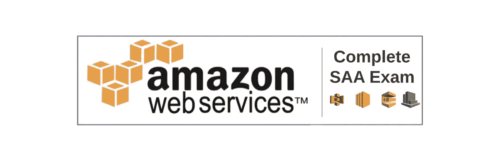

# AWS 解决方案架构师助理认证的模拟考试

> 原文：<https://medium.com/geekculture/complete-aws-solutions-architect-associate-exam-with-solutions-dba5a735ae79?source=collection_archive---------2----------------------->

## 第 26 章:65 个不同问题的模拟考试，包括答案和解释。让我们来测试一下我们在课程中学到了什么！

在过去的几个月里，我们研究了很多 AWS 服务，比如 AWS EC2、AWS S3、AWS Lambda 和 DynamoDB。在…