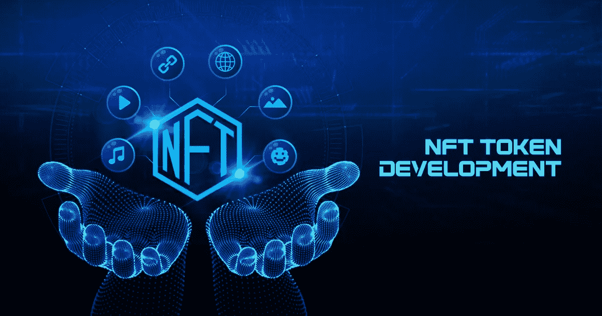
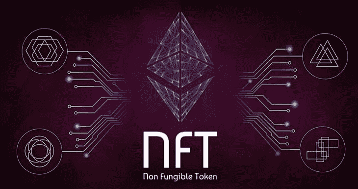

# NFT 代币开发完整商业指南

> 原文：<https://medium.com/geekculture/complete-business-guide-to-nft-token-development-c5e28cbaea00?source=collection_archive---------13----------------------->

## 不可替换令牌简介

不可替换的令牌是在区块链环境中开发和运行的数字资产。它们是代表其他真实项目的独特资产，如图像、文本、音频、视频、gif 等。NFT 类似于加密货币，但不同之处在于它们持有的信息；虽然加密货币拥有货币等数据，但 NFT 拥有与现实世界资产相关的数据，如图像、描述、价值等。

不可替代的代币在参与区块链世界的收藏家和投资者中越来越受欢迎。许多受欢迎的名人已经开始进入市场，最近加入的是著名的奥斯卡奖得主安东尼·霍普金斯爵士，他拥有 NFTs。全球非专利技术的市场资本总额已经超过 220 亿美元，并且随着新的创造者和企业家的出现而不断扩大。NFTs 的普及增加了企业主以 [***不可替代令牌开发服务***](https://www.infiniteblocktech.com/non-fungible-tokens?utm_source=guestblog&utm_medium=medium&utm_campaign=sairam) *进入市场的机会。*

## 不可替代的令牌开发是一个好的商业想法吗？

对开展新业务感兴趣的企业家、初创公司和企业主现在有一个巨大的机会，可以用低投资和更快的部署来启动他们。感兴趣的各方可以很容易地利用不可替代的令牌开发解决方案，并继续他们在 NFT 领域的业务。这是年轻企业家的最佳商业策略。NFT 是全球资产，全球任何人都可以使用智能钱包进行访问。市场为创造者和企业家提供了新的机会，让他们能够完全控制自己的资产和资金。不可替代的令牌开发是获取利润的全球商业策略。

## 为什么选择不可替代的令牌开发？

不可替代的令牌是可以在全球范围内购买、出售和交易的数字资产，不需要花费大量时间来处理交易或收取费用的监管系统。NFTs 的引入使得创作者可以在没有任何第三方的情况下向全球观众出售他们的作品。 [***NFT 市场***](https://bit.ly/3yVxaYQ) 是参与者的数字市场。这增加了商业组织和创业公司对新市场和平台的需求，为企业家开辟了新的商机。不可替代的代币开发为寻找创业资金的企业家提供了解决方案。

## 不可替代令牌开发的基本服务

**不可替代的代币开发构思**

企业主必须讨论他们的商业政策，以及在不可替代的代币开发公司的支持下，这些政策是否可以在 NFT 世界实施。在讨论期间，他们必须确保开发团队充分了解项目的所有细节。

**权利文件**

该白皮书是对 NFT 项目的全面描述，包括项目的财务、开发团队、整体架构、路线图等信息。基于企业所有者的需求，不可替代代币开发公司构建白皮书，因此购买代币的投资者可以容易地理解项目动机。

**智能合约的开发**

区块链网络使用智能合同(即程序代码)来自主管理所有用户交易和活动。每个 NFT 项目都必须有效地设计智能合同才能成功。开发公司创建智能合同来管理环境中不可替换的令牌项目的活动。

**NFT 资产创造**

企业家可以创造 NFT 来代表资产，如照片、音频、视频、gif、信息等。，为 NFT 项目创建必要的令牌。开发团队创建 NFT，使企业主能够将代币分发给投资者以筹集资金。

**测试 NFT 资产**

提供不可替代的令牌开发解决方案的组织确保 NFT 项目完全没有错误，并将在区块链环境中安全地独立执行活动。项目的组成部分由质量检查小组充分验证。

**列出筹款项目**

在平台中列出不可替换的令牌和项目是不可替换令牌开发的最后阶段。开发公司帮助和协助那些希望在一个知名平台上分发代币的企业主，以快速从世界各地的投资者和收藏家那里获得资本。

## 不可替代令牌开发的附加服务

**不可替代代币的营销**

营销是至关重要的，以帮助企业主吸引投资者和市场参与者有兴趣购买或投资于 NFT 项目或令牌。通过运用各种策略进行营销，该项目在不同受众中的影响力得到了提高。

**审核不可替代令牌**

审计服务通过外部区块链专家确认项目组成部分。为了在观众中改进项目，他们审查项目的材料、政策、路线图、开发和财务。在部署之前对不可替换的令牌进行审核可以提高其可靠性，并确保领域中的顺利事务。

## 不可替代的令牌开发解决方案的优势

**更快的筹款**

NFT 发展解决方案提供商确保初创企业和企业家能够尽快开展业务。企业主可以轻松地向投资者推出他们的代币和不可替代的代币开发解决方案，并筹集资金。

**投资低**

开发团队配备了所有必要的端到端工具和方法，可以定制这些工具和方法来满足相关方的业务需求，并且价格合理。不可替代的令牌开发服务可以被任何想要以最小的成本和从市场中获利的人使用。

**安全**

[***NFT 发展公司***](https://www.infiniteblocktech.com/nft-development-services?utm_source=guestblog&utm_medium=medium&utm_campaign=sairam) 的工作人员在区块链技术方面知识丰富，经验丰富，了解行业现状。因此，最好是利用专业人员提供的服务在 NFT 世界发行代币。

## 收场白

希望本指南能为您提供不可替代代币开发的所有必要信息，并让您对 NFT 资产和市场有一个清晰的了解。这是如何在理论上发展 NFT 的基础。如果你想开发你的代币，遵循上述服务，找到一个合适的开发公司来开发和部署你的不可替代代币在市场上筹款。为你的想法选择一个不可替代的令牌开发解决方案，并在 NFT 领域成功迈出你的一步。