# 在 Typescript、Terraform 和 SAM CLI 中开发 Dockerized Lambda 的完整端到端指南

> 原文：<https://medium.com/geekculture/complete-end-to-end-guide-for-developing-dockerized-lambda-in-typescript-terraform-and-sam-cli-ecdea1c6e72c?source=collection_archive---------7----------------------->

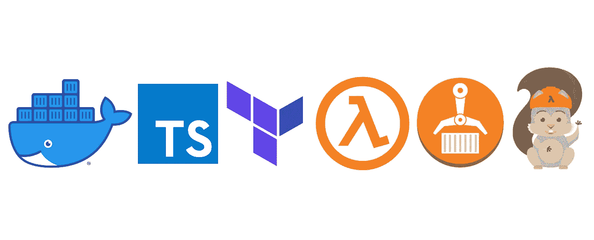

Docker + TS + Terraform + Lambda + ECR + SAM CLI = 💚

这是一个完整的指南来设置，开发和部署一个后端应用程序与[，一个最近在 AWS](https://aws.amazon.com/blogs/aws/new-for-aws-lambda-container-image-support/) 上为 lambda 发布的容器图像特性。

不用说，如果你是 Docker 的超级粉丝，你就会知道它有多神奇。您在本地测试的就是您部署它时得到的，至少在容器级别是这样。

因为这个功能很新，所以我掉进了**很多兔子洞**，我相信其他人也会掉进，所以我会把兔子洞的每一部分都打破，这样就不会有人被困在里面了。本指南从真正的基础开始，如创建用户或设置 terraform，所以请随意跳到您需要的部分。

# 同时使用 Terraform 和 SAM CLI 的原因

嗯，看起来 Terraform 支持构建 docker 映像并将其部署到 ECR，但是经过大量的挖掘，我发现如果我只是在另一个管道中构建 Docker 映像并使用几行 shell 脚本进行部署，事情会变得更简单。所以 Terraform 将用于定义资源，不包括构建和部署过程。这没有问题。

还有，什么山姆 CLI？Terraform 不能取代 SAM CLI，反之亦然。SAM cli 在开发本地 lambda 时非常有用，因为它自动为每个 lambda 配置端点，并极大地消除了初始设置的障碍。因为 lambda 函数是“特殊的”,它们只有在被调用时才会被“启动和调用”(不像 EC2 或 Fargate ),仅仅做`ts-node my-lambda.ts`不会让它工作。当然，还有许多其他解决方案(例如`sls`)，但在本指南中，我将只使用 SAM CLI。但是由于许多原因，山姆让我想使用其他更好的解决方案，如果有的话...原因如下。

*对于正在寻找如何'* ***热重新加载*** *' docker 容器用于基于 lambda* 的类型脚本或 javascript 的人，免责声明:到目前为止，它不会顺利工作。最好的办法是每次使用`nodemon`查看某个目录来触发`sam build`，并在另一个 shell 中启动`sam local start-api`。它像预期的那样工作，但我从这里看到的当前问题是，每次它`sam build` s 时，它都会制作另一个 Docker 映像和另一个等等，所以会有许多无用的悬空映像堆积在您的驱动器中，您需要手动删除它们，因为 SAM CLI 不支持传入等效于`docker run --rm`的参数。不管怎样，这就是故事，所以这就是我想尝试其他解决方案的原因。[在 Github](https://github.com/aws/aws-sam-cli/issues/921) 的相关问题上有更多关于这个的信息。请让我知道你们中是否有人对`sls`有好的体验，因为我还没怎么用过它。

好的。现在让我们写一些代码。

# 为 Terraform 设置 AWS

首先，确保您已经在 AWS CLI 上安装并授权。安装 AWS CLI 超出了这里的范围，因此[请遵循 AWS 上的指南](https://docs.aws.amazon.com/cli/latest/userguide/install-cliv2-mac.html)。

成功安装后，运行:

将提示您输入访问密钥 ID 和秘密访问密钥。根据您的情况，有不同的方法来处理这个问题，但是为了简单起见，我们可以创建一个用户(从 AWS 控制台。您可能只会将它用于“编程访问”)，这将具有应用 Terraform 代码的这些策略。

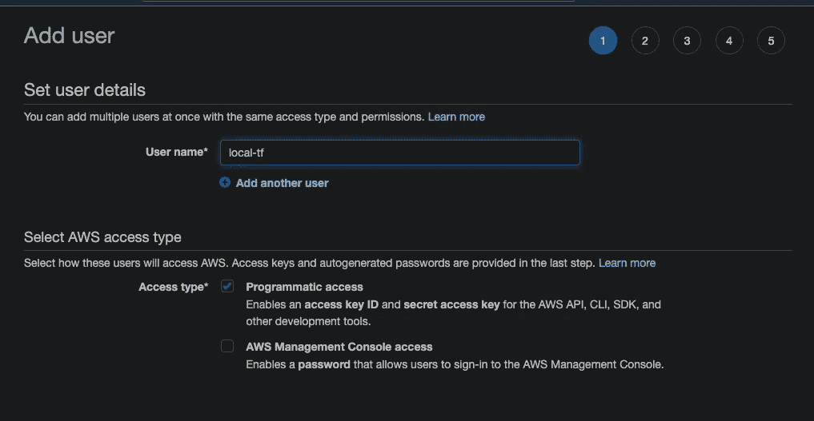

Add user

这个用于将 S3 桶设置为后端:

这个用来锁定状态:

而下一个相当棘手；因为我们将临时启用与管理 IAM 相关的权限，因为我们将首先需要创建一个角色，每当我们尝试计划和应用 IaC 时，我们都可以从该角色中`assumeRole`。

现在，我们可以进入 AWS 控制台，制定以下策略:

确保在完成所有工作后，您需要缩小到特定的操作和资源(用于生产用途)。

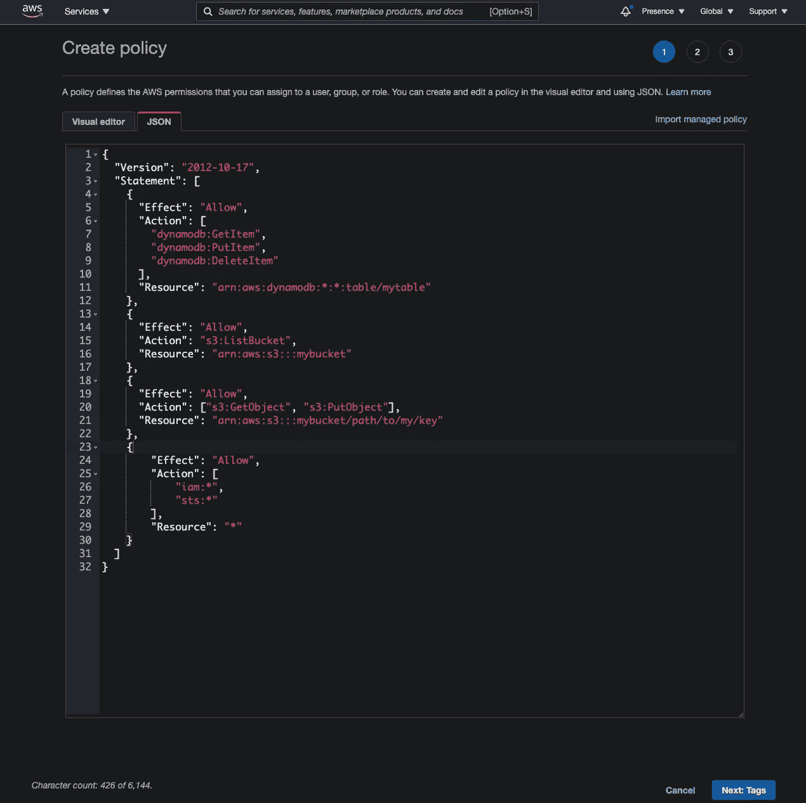

Create policy

现在，既然您已经制定了三个不同的策略(或者都在一个策略中，这取决于您的偏好)，将它们附加到您刚刚创建的用于运行`aws configure`的用户。

# 设置地形

如果您还没有，[按照官方网站](https://learn.hashicorp.com/tutorials/terraform/install-cli)的说明安装 terraform。只需下载二进制文件并将其移动到`bin`文件夹。

现在验证 terraform 的版本

然后在你的项目目录中制作`main.tf`文件(我个人把它放在`IaC`文件夹中，因为后端会有另一个文件夹存放‘真实’的`.ts`代码):

main.tf

现在，运行`terraform init`:

然后，我们将需要添加 s3 后端和状态锁定。但在此之前，在 Dynamodb 上创建一个表，在 S3 上创建一个桶，分别用于托管 IaC 后端和锁定状态。

现在我们需要在我们创建的 DynamoDB 上添加更多的策略，因为我们想要创建一个表:

然后你可以写这段代码(顺便说一下，把它放在 IaC 下面的一个不同的通用存储库中可能是个好主意，因为当前的存储库只用于 lambda 相关的资源。但是为了这篇文章，我就把它写在这里):

然后，还要添加 S3 后端(您也需要在这里添加相关的 IAM 策略，但是因为我们知道如何做，所以我将省略解释):

现在，运行`terraform apply`，验证更改，并进入`yes`。应该已经创建了 DynamoDB 表和 S3 桶。以下是目前为止的代码:

main.tf

现在，添加 s3 后端和状态锁:

main.tf

我们还将使用 Docker provider，所以也要加上:

main.tf

现在，因为您已经添加了一个后端和另一个提供者，我们将需要再次运行`terraform init`，然后再运行`terraform apply`。运行它。

# 设置 lambda

现在我们需要在本地机器上开发 lambda。安装 SAM CLI:

请注意，过时的版本不支持运行 Docker 容器，所以请确保您的版本是最新的。

现在，我们不会运行`sam --init`，因为这样会很难把服务器做成 monorepo 结构。我们想把它做成一个 monorepo 的原因是，这样可以更容易地对每个 lambda 进行适当的分类，并使用每个 lambda 只需要拥有的依赖项来部署它。相反，我们将使用 *lerna* 来初始化服务器文件夹。

和往常一样:

然后它会给你这个布局:

然后，添加您的第一个功能包。为了这个例子，我们假设我们要做一个 REST API，由许多 lambdass 组成，每个 lambda 用不同的语言返回' hello '作为响应(这在现实中完全没用，但至少在这里有用)。我们的第一辆 lambda 将是英国的。

现在，目录结构将如下所示:

现在，在`server`下，我们将需要添加一些实用程序来本地构建和调用该函数。如下添加并修改`server/package.json`，当然，再次运行`npm i`:

server/package.json

对我们试图做的事情做一些解释:这些`devDependencies`将是包范围的依赖。这些并不特定于我们将要构建的任何一个函数；他们将帮助加工一般的东西。这就是我们把它们放在这里的原因。

依赖关系:

*   `@types/node`:我们将需要它来为`fs`或`path`这样的“内置节点”模块给出正确的类型定义。
*   `concurrently`:只是一个脚本运行器。
*   `lerna`:你懂的。
*   `nodemon`:这将帮助我们观察一个目录，并再次建立 Docker 映像。

脚本:

现在，您需要为 SAM cli 创建`template.yml`来消费和运行我们想要运行的内容。

template.yml

我们还不能运行`sam build`或`sam local start-api`，因为我们还需要设置`Dockerfile`和 ECR 库。

到目前为止，我们已经添加了用于运行 SAM CLI 的`template.yml`:

现在我们将在`packages/hello/`中添加`Dockerfile`。

这将是 Dockerfile 的内容:

要一行一行地浏览它:

*   `amazon/aws-lambda-nodejs:14`是 lambda 的亚马逊官方图片。nodejs 的当前 LTS 是 14，所以我们使用它。`AS builder`与 Docker 中的多阶段构建相关；它有助于减小最终 Docker 图像的大小。基本上在这个`builder`阶段，我们将只构建要包含在最终映像中的输出，并且在这个步骤中安装的任何依赖项都不会包含在最终输出映像中。
*   `WORKDIR /usr/app`:在 docker 镜像中，设置工作目录为`/usr/app`。在一个普通的 docker 镜像中没有任何`app`文件夹，所以它会创建`app`目录。我们将把编译好的 js 代码放在那里。
*   我们需要这些文件来将 typescript 编译成 javascriptt 文件。
*   `npm install`:会安装依赖关系。
*   `npm run build`:将 typescript 代码编译成 js。
*   这只是为了调试。在建造的时候，docker 会输出当时里面是什么，让你验证你是不是在做你打算做的事情。
*   `FROM amazon/aws-lambda-nodejs:14`:这是 Docker 中的第二个构建阶段。前一阶段的所有输出将在此阶段被丢弃，除非明确指定要包括。
*   `RUN npm install --only=prod`:只安装`dependencies`，不安装`devDepdencies`。
*   `COPY --from=builder /usr/app/lib /usr/app/lib`:明确引用前一个`builder`阶段，将`/usr/app/lib`中的内容复制到当前的`/usr/app/lib`。在这种情况下，它将复制所有编译的 javascript 代码。
*   `CMD [ "/usr/app/lib/index.handler" ]`:命令应该是`path-to-lambda-handler-without-extension.handler`。事情就是这样的。

现在我们已经添加了一个 Dockerfile 文件。现在让我们为 lambda 设置基本环境:

您需要修改`tsconfig`来使用现代的 javascript 特性；最突出的是，添加以下内容。这将允许您使用`Promise` API。我建议也打开其他选项，尤其是那些与严格类型检查相关的选项:

tsconfig.json

也修改`packages/hello/package.json`。请注意，您添加到最终编译输出代码(javascript)中的任何依赖项都需要添加到`dependencies`，而不是`devDependencies`:

server/packages/hello/package.json

现在，添加一个非常简单的 lambda:

packages/hello/lib/index.ts

到目前为止，我们已经创建了这些:

现在，在`server/`下创建`nodemon.json`来观察和构建文件:

server/nodemon.json

创建`nodemon.json`后，可以开始运行`npm run watch`或`npm start`。它会做两件事:当你在`packages/`目录下做任何改变时构建 Dockerfile，并为 lambda 托管一个本地端点。这将类似于热重装，虽然它看起来更像一个黑客；一旦做出更改，您无需取消并再次运行`sam local start-api`。如果不起作用，请先创建 ECR，然后重试。

哦，你可以删除`__tests__`和`lib/hello.js`，因为我们不使用它们。不管怎样，现在我们已经准备好将这个函数构建到 docker 映像中了。让我们来试试:

一切都很酷，docker 构建成功。您可以尝试运行映像并测试请求:

Invoking lambda locally

这就是 SAM CLI 应该开始发挥作用的地方。但在此之前，我们需要用 terraform 创建一个 ECR 存储库。让我们暂时回到 terraform。

# 回到地形:承担角色和 ECR

现在，我们将需要首先创建一个角色，因为我们将依赖该角色来获得创建我们想要的任何资源所需的权限。这被称为“承担角色”，之所以被认为是一个好的实践，是因为您不必创建多个凭证(可能是多个用户)来做某些需要权限的事情。相反，当你计划和应用资源的变化时，你*借用*这段时间的许可。

那么我们该怎么做呢？首先，让我们创建`hello_role.tf`:

hello_role.tf

对于本文，我们不会深入研究具体的策略，所以我们将只允许几乎所有的资源，而不详细指定它们。对于真实世界的使用，您将必须定义精确的语句来给出正确的权限。

我们在这里所做的，本质上，是我们允许`localtf`用户承担`hello_role`的角色，拥有运行 hello 服务器栈的所有策略。这被称为“创建信任关系”(如果您在 AWS 上执行此过程，您将会看到这一点)。通过这种方式，`localtf`不必总是拥有它需要的所有权限。它仅在需要时(即部署时)才获取它们

一旦你写完`hello_role.tf`，运行`terraform apply`进行修改。

现在，回到`main.tf`并添加:

main.tf

一旦您添加了`assume_role`，现在您就可以使用该角色所赋予的权限来创建任何您想要的资源。现在让我们创建一个 ECR 存储库。制作`ecr.tf`:

ecr.tf

运行`apply`，terraform 很快就会做出 ECR。

# 构建映像并将其推送到 ECR

现在我们已经创建了一个 ECR，我们可以回到我们的服务器，编写一个小脚本来登录、构建和推送我们正在编写的 lambda 的映像。

这非常简单。只需准备好您的 AWS cli 即可使用；并进行身份验证，以便能够从 Docker CLI 使用 ECR:

server/login-docker.sh

接下来，将 Docker 映像标记为`latest`并在构建时分开时间戳，这样最新的标记将始终是最新构建的映像，然后另一个映像将保留下来用于记录，您可以稍后使用它来恢复或在某些情况下做其他事情。

server/build-and-push-docker-image.sh

现在，您可以自己测试一下:

此后，您将能够在 AWS ECR 上看到:

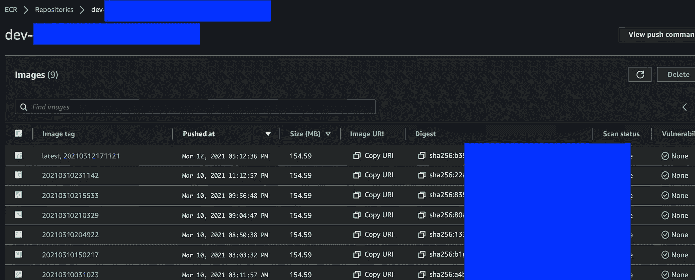

Images on ECR

如您所见，这些图像将按时间戳进行标记，最新构建的图像将始终标记为`latest`，您将在 Terraform 中引用此标记，以将新构建的 Docker 图像应用于 lambda。

到目前为止，我们已经做了如下更改:

现在大部分准备工作已经完成，所以我们可以继续创建实际的 lambda 和 API 网关了。

首先，最重要的部分:你想从 Docker 创建 lambda 本身。

lambda.tf

已经有一个模块是专门为此制作的，所以用它来制作 lambda。一旦你完成了，`apply`的变化。

这里的关键是，您将引用 ECR 中标签为最新的图像 URI。如果您之前已经构建并推送了一个新的 docker 映像，那么该映像的散列将会不同，从而导致 lambda 函数的重新部署。否则它不知道 docker 图像是否是新的。

同样，在运行更改后，您可以在 AWS 控制台上看到 lambda:

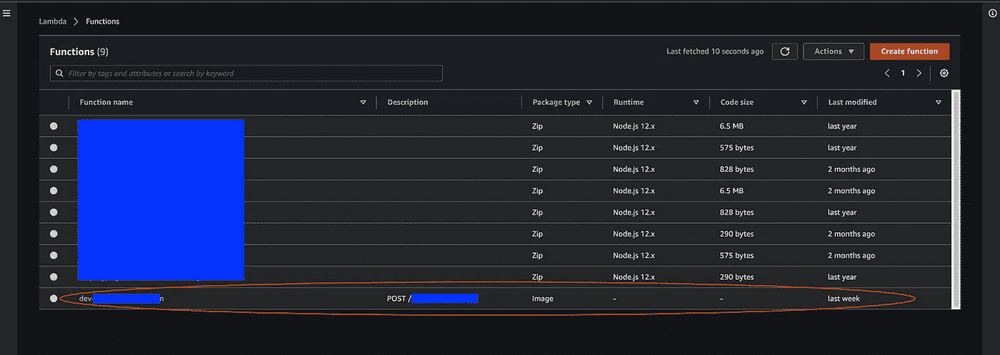

Check lambda created on AWS console #0

如你所见，与其他 lambdas 相比，它的包类型是“Image”，这意味着它不是来自 Zip，而是 Docker 图像。

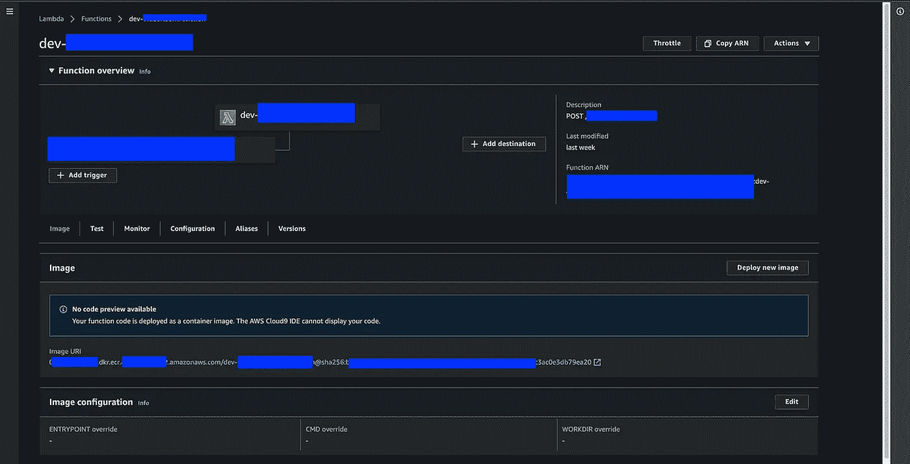

Check lambda created on AWS console #1

你应该可以在 lambda 信息的底部看到图像的 URI(包括哈希)。如果您点击图像 URI，您将导航到 ECR 上您刚刚创建并推送的最新图像。

现在，你将能够在 AWS lambda 控制台上测试 Lambda，但我们最终想要的是像发送 GET `/hello`到某个域并接收响应这样的事情。为了能够做到这一点，我们需要设置 API 网关。

对于这个例子，我们将在`api.hello.com`设置一个域。

方法如下:

api_gateway.tf

我将逐一解释代码。

`aws_api_gateway_rest_api`将创建一个 REST api。它通常不包括单个端点；它通常包含多个，比如:`api.hello.co/hello`、`api.hello.co/bonjour`、`api.hello.co/nihao`等等。在 AWS 上，它相当于“API”选项卡中的一行:

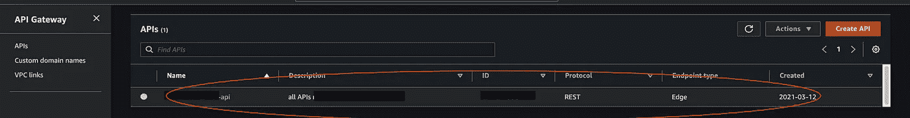

APIs tab

`aws_api_gateway_resource`:简单来说，你可以把它想象成一个尚未部署的 API 端点。在这种情况下，我们创建一个以`/hello`结尾的端点。

在下面的例子中，我们用`OPTIONS`和`POST`创建了两个不同的资源，到相同的路径(被黑色覆盖隐藏)。稍后我们将讨论创建选项资源来处理预检请求。现在，知道创建 REST 资源意味着创建某个端点就足够了。

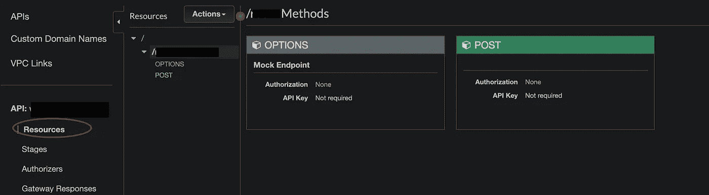

REST resource

`aws_api_gateway_method`:现在，您想要为这个资源创建一个 REST 方法。我们的`/hello`端点不需要 auth(超出了本文的范围)，并且是一个 GET 方法。

`aws_lambda_permission`:默认情况下，API gateway 没有调用 lambda 函数的权限。因此，我们只是授予它一个权限，以便它可以被执行。

`aws_api_gateway_integration` : API 网关支持转换(过滤，预处理，...)在它到达客户端之前的请求或者在它到达实际的λ之前来自客户端的响应。我们在这里没有为这个例子做任何特殊的事情，但是你可能想要在将来使用它。有关更多信息，[请阅读相关 AWS 文档](https://docs.aws.amazon.com/apigateway/latest/developerguide/how-to-integration-settings.html)。

`aws_api_gateway_stage` : API gateway 支持开箱即用将 API 分成不同的阶段。您应该使用它来跨生产、登台和开发环境分离您的 API。现在，我们将只为当前的 terraform workspace 制作一个 stage，在本文的所有示例中假设为`dev`。应用更改后，您将能够在 AWS 控制台上看到以下内容:

`aws_api_gateway_deployment`:这相当于在 AWS 控制台上点击‘部署 API’。

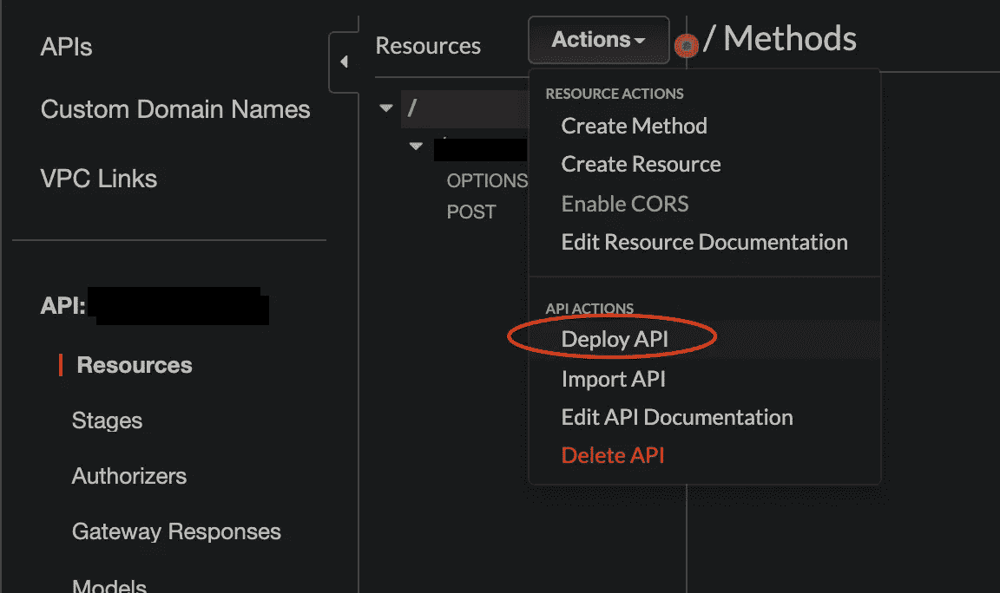

一旦在 API gateway 中创建了资源，就必须*部署它们*，以便外部客户端可以访问它们。一个小问题是`redeployment`；即使您对 REST API 资源进行了更改，如果`redeployment`参数没有更改，它也不会得到部署。主要有两种方法可以解决这个问题:

1.  使用`timestamp()`触发每个`apply`的重新部署。使用这种方法，lambda 在重新部署时可能会停机几秒钟。但是可以肯定的是，它总是可以部署的，所以如果我的服务不能处理很多用户，我会选择这个。
2.  每当文件改变时，使用`md5(file("api_gateway.tf"))`触发重新部署。但是您需要始终确保与 API 网关部署相关的所有内容都只存在于这个文件中。

好的。到目前为止，我们已经设置了 lambda 和基本 API 网关配置。现在，您可以像这样在 Postman 上测试您的 API:首先，转到 AWS API 网关控制台，找到部署到某个阶段的特定端点。应该有一个“调用网址”在页面的顶部。

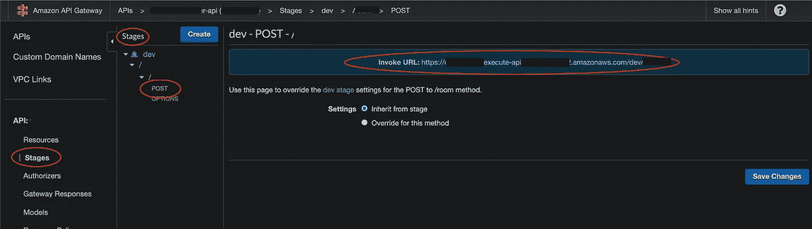

Invoke URL

现在，打开邮差，然后

1.  插入您的调用 URL
2.  点击“授权”，选择“AWS 签名”类型，输入`AccessKey`和`SecretKey`。这些密钥应该来自 AWS IAM 控制台的某个用户凭据。如果您没有一个专门用于从本地环境调用用 lambda 和 API gateway 设置的 API 的工具，请为其创建一个用户并获取密钥。
3.  插入您的 AWS 区域。
4.  如果您的 API 请求更多的查询参数或查询体，请插入它们。
5.  点击发送，应该可以了。

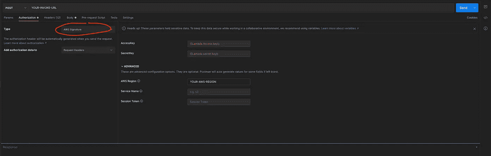

Testing ‘Invoke URL’ on Postman

如果您在请求头中没有提供 AWS 凭证，它将不起作用，因为到目前为止，您的 API 只能由 API 网关已知的 IAM 用户使用，如果您只是从本地计算机发送请求，而没有提供任何访问和密钥，它不会知道是您。为了使它能够工作，甚至不需要为任何公开给客户端应用程序的公共 API 提供凭证，您现在应该配置**定制域**。

到目前为止，我们已经对 lambda 和 API 网关资源进行了更改。我们现在应该拥有的文件列表如下。

接下来，我们将看到如何创建一个自定义域，并将该域与我们刚刚创建的 REST API 相关联。

# 为自定义域创建地形资源

现在，问题是我们有 API，但它不能从任何外部客户端应用程序调用，这是许多项目的常见情况。所以我们想先注册一个域来代表我们的端点。

在对定制域进行更改之前，我们需要设置另一个 AWS 提供者，因为我们需要使用`us-east-1`区域作为边缘优化定制域名([这是唯一支持为边缘优化定制域名](https://docs.aws.amazon.com/apigateway/latest/developerguide/how-to-edge-optimized-custom-domain-name.html)创建 ACM 证书的区域)。

API 端点有两种选择:1。边缘；2.地区性的。如果您的端点应由全球客户访问，请使用 edge 如果您的端点被明确限制在世界上的一个特定地区使用，请使用区域。如果你不知道该做什么，现在使用 edge 是完全安全的。首先，添加另一个 aws 提供者:

main.tf

然后，编写实际的代码来创建证书和自定义域。

custom_domain.tf

确保从 AWS Route53 控制台获取现有的托管区域 ID(或您打算使用的任何其他区域 ID ):

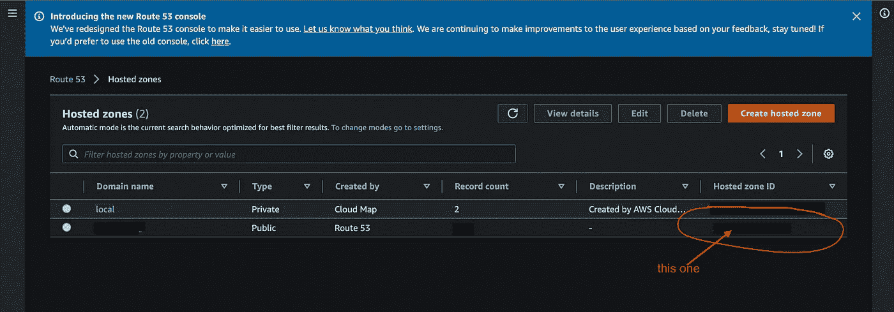

Route53

使用该 ID 为自定义域名创建 Route53 记录。

应用更改后，您将能够在 AWS 证书管理器上看到正在创建的 ACM 证书:

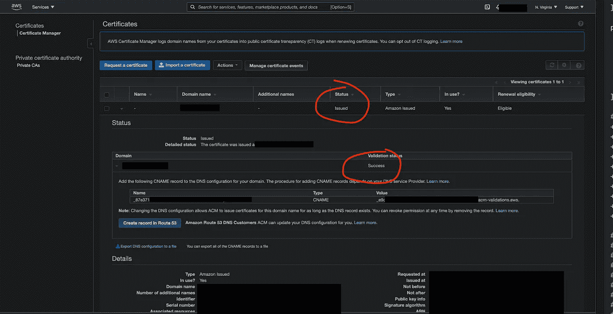

AWS Certificate Manager

只要确保您验证了状态为“已发布”且验证状态为“成功”即可。您可能需要等待几分钟才能完成。此外，如果您的证书没有出现，请确保您在`us-east-1`上，而不是在其他任何地方。

完成这些后，现在您可以再次返回 API Gateway，并配置自定义域。现在您已经注册了一个域，您可以从 API 网关控制台看到它:

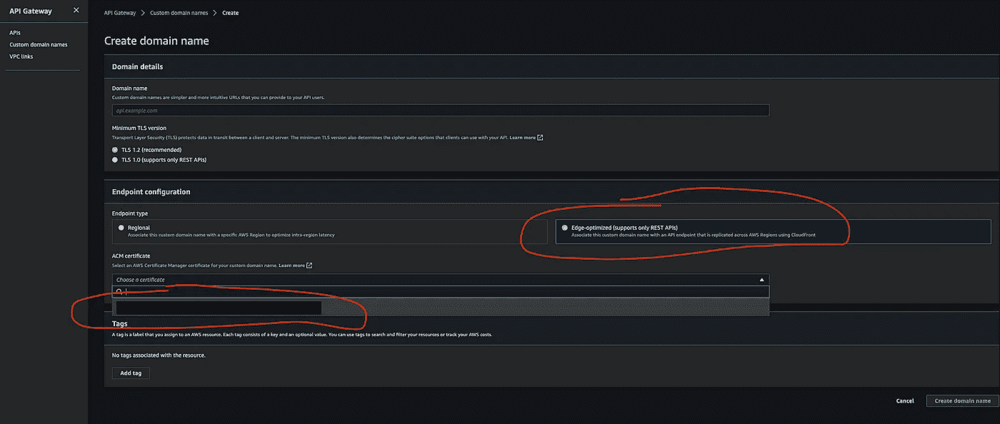

在证书下拉列表中，您应该能够看到您刚刚创建的域。不要在控制台上创建域名。现在回到 terraform，让我们为它写等价的代码。

custom_domain.tf

您只需填写刚刚从 API 网关控制台看到的选项。只需填写有关证书、域名和端点配置的相关信息。

现在，这很重要:您需要创建另一个 Route53 记录来将您的定制域映射到 cloudfront。创建自定义域后，AWS 会创建“API 网关域名”，在下图中用红色圈出:

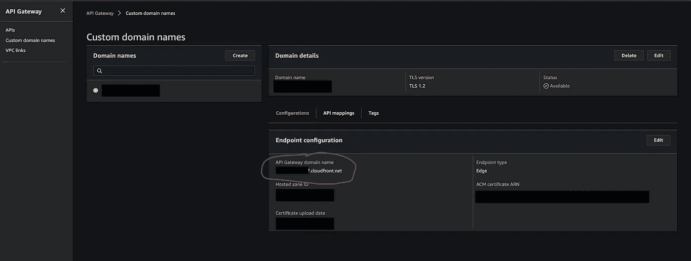

API Gateway domain name

您需要将到`api.hello.com`的流量路由到这个 API 网关域名(一个 API 网关域名的例子是`asdfasdfasdf.cloudfront.net`，只要您使用的是`EDGE`)。这就是我们正在用`aws_route53_record.custom_domain_to_cloudfront`做的事情。否则，对您的 API 的响应将一直显示一些奇怪的错误，这些错误的原因很难猜测。我发现 AWS 真的缺乏这方面的文档，所以请在这一点上提出建议。**您需要创建另一个 Route53 记录**。

你可以通过进入 Route53 控制台并寻找`api.hello.com`来验证。它应该如下所示:

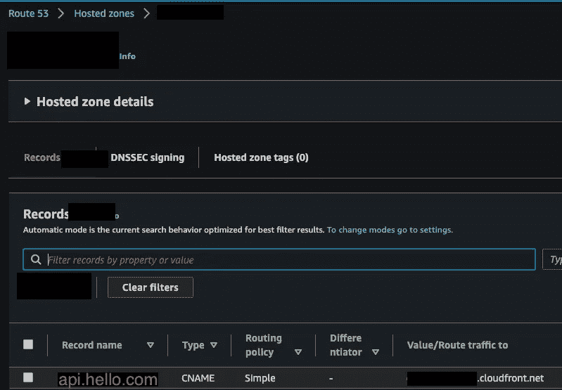

Route53 record for api.hello.com to asfasdfasdf.cloudfront.net

之后，很多事情就不用做了；只需在`api_gateway.tf`中添加基本路径映射资源。即使您没有到端点的附加路径，您也必须*创建一个基本路径映射。否则你的 API 不会公开。*

api_gateway.tf

应用此更改后，验证您的 API 映射是否已创建:

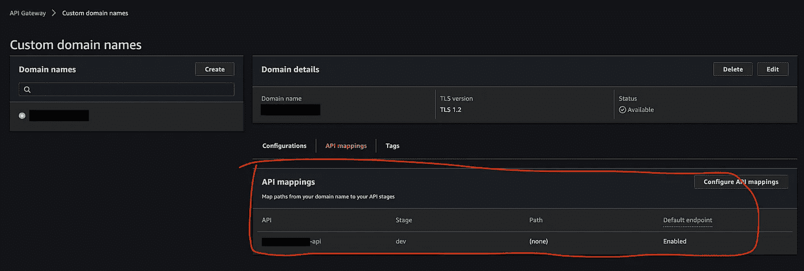

API mapping on API Gateway

现在，您可以回到 Postman，通过请求 GET `api.hello.com/hello`来测试您的 api。这里可能令人困惑的是，您没有在基本路径映射中添加任何`path`。如果你添加`hello`作为路径，你的 API 端点就会被配置成`api.hello.com/hello/hello`，这显然不是我们想要的。因此，如果您已经在`aws_api_gateway_resource`中配置了路径，就不要添加任何路径映射。不管怎样，如果到目前为止一切都设置正确的话，对 API 端点的请求和响应应该可以正常工作。

# **启用选项(预检请求)**

现在，我们的客户端应用程序当然不是 Postman，所以通常客户端会首先请求 OPTIONS `api.hello.com/hello`，然后请求 GET `api.hello.com/hello`，如果他们打算发送 CORS 请求，这是一个非常常见的情况([从 MDN docs](https://developer.mozilla.org/en-US/docs/Glossary/Preflight_request) 中了解更多信息)

如果您没有做任何与处理选项请求相关的事情，您的客户端应用程序很可能会出现如下错误:

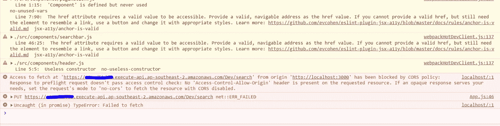

Image from [https://stackoverflow.com/questions/59909987/aws-api-gateway-403-forbidden-response-to-preflight-options-request](https://stackoverflow.com/questions/59909987/aws-api-gateway-403-forbidden-response-to-preflight-options-request)

所以让我们开始吧！已经有一个由优秀开发人员编写的[便捷模块，所以我们将只使用它:](https://github.com/squidfunk/terraform-aws-api-gateway-enable-cors)

api_gateway.tf

注意，如果您有任何自定义头，您必须在您的配置中定义它。接下来，验证控制台上现在允许选项请求:

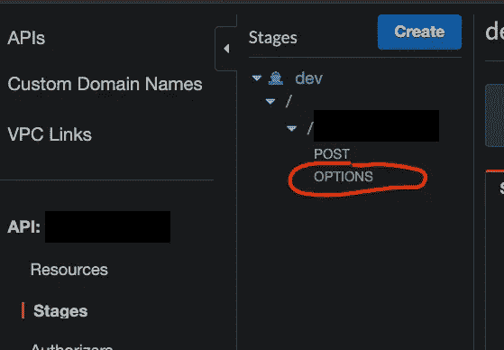

此外，你还需要改变 lambda 的响应头。只需添加`Access-Control-Allow-Origin": "*"`即可:

packages/hello/lib/index.ts

现在，应用更改，返回到您的客户端应用程序并重试请求。应该有用。

# 总结

如果您遵循了所有步骤，您将会创建以下文件:

到目前为止，我们已经了解了如何使用 Typescript、Terraform 和 SAM CLI 设置、开发和部署 dockerized lambda 应用程序。lambda 上有成吨的东西要覆盖..也许下一次，它将使用 lambda 在 VPC 的资源。我希望你喜欢这个，并找到一些有价值的见解。谢谢你。

*最初发布于*[*https://9 oelm . github . io/2021-03-13-complete-end-to-end-guide-for-developing-dockerized-lambda-with type script-terraform-and-SAM-CLI/*](https://9oelm.github.io/2021-03-13-complete-end-to-end-guide-for-developing-dockerized-lambda-with-typescript-terraform-and-SAM-cli/)