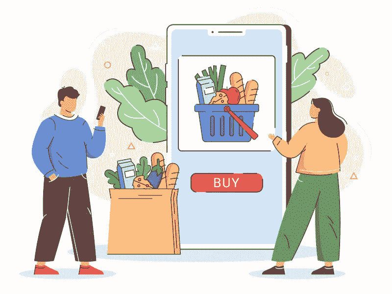

# 构建盈利性在线杂货交付应用程序的完整指南

> 原文：<https://medium.com/geekculture/complete-guide-to-building-a-profit-bearing-online-grocery-delivery-app-855a3f96e5f0?source=collection_archive---------21----------------------->

杂货交付应用程序开发

Grocery Delivery App Development

我们生活在一个数字化时代。因此，从餐馆到杂货店，各种服务都已经实现了自动化。在本文中，我们将特别讨论杂货店及其数字化。

尽管在疫情之前人们可能已经熟悉这些解决方案。但是疫情是这些应用程序受欢迎程度飙升的时候。由于在此期间很大一部分人被限制在他们房子的四个角落里，这个解决方案因祸得福。顾客可以通过送货上门轻松获得日常必需品。这使得它的盈利能力成倍增长，今天它确实有一个非常有利可图的范围。

当你读这篇文章时，你会对它受欢迎的原因有所了解。此外，它将提供一些步骤的知识，这些步骤的坚持将使传统杂货店很容易在竞争激烈的杂货店市场中开拓出一个利基市场，从而实现收入的飙升。

# 杂货交付应用的优势

通过采用杂货交付应用程序开发将超市转变为在线杂货店将确保以下优势-

*   使商店与潮流保持一致，并成功扩大客户群。
*   增强库存管理的执行方式。
*   为消费者提供个性化的购物体验。
*   自动化计费和客户支持等流程，降低基础架构和雇佣成本。

了解建立网上杂货店的不同好处；让我们看一下描述这些解决方案的利润范围的统计数据。

# 描绘网上杂货店有利可图范围的统计数据

有了网上杂货店，你就有了自动执行库存管理的优势。你还可以在更大比例的互联网用户中提高自己的在线知名度。这些优势让它看起来很前卫。这也让它获得了丰厚的价值。我们已经通过下面的统计数据描述了这些。看看他们。

> 1.2021 年网上杂货店的估值为2857.0 亿美元
> 
> 2.预计扩张将发生在 25.3%的[CAGR](https://www.grandviewresearch.com/industry-analysis/online-grocery-market)
> 
> 3. [56%的购物者更喜欢在网上购买日常家居用品](https://www.statista.com/statistics/1315086/share-of-online-shoppers-affected-by-rising-groceries-prices/)

以上这些数字充分证明了为什么成为 1771.7 亿美元利润市场的一部分是一个好主意。

如果你正在寻找一种时尚，请遵循以下步骤。这将简化杂货交付应用程序的开发过程，并使您能够访问一个通过您进行的杂货交付来提高利润的应用程序。

# 如何开发杂货 App？遵循以下步骤

[杂货交付应用程序开发](https://www.groceryappclone.com/)是一个详尽的过程。它涵盖了从研究到最终应用开发的许多领域。我们在下面给你这方面的知识。

## 1.研究市场

首先评估市场，了解网上杂货店的需求。虽然这是必要的，但还是建议检查它的重要性。接下来，您需要评估客户及其需求。评估他们的人口统计数据，包括他们的年龄、兴趣等。这将让你知道如何更好地为他们服务。在这个阶段，评估你的竞争对手也很重要。

**问这些问题-**
我的竞争对手在做什么？客户对它满意吗？是/否？
如果没有，如何在我的解决方案中解决这些问题？
·竞争对手的解决方案有哪些特点？有没有缺失的元素？是/否？
·如果是的话，他们的加入能带来更多的顾客吗？

这将允许你制定一个合适的应用程序设计。当你这样做的时候，你需要知道你的杂货应用程序中包含的功能。

## 2.为您的应用添加独特功能

当您执行按需杂货应用程序开发，以确保杂货交付服务无缝发生。因此，你需要记住三个部分，顾客、杂货店和送货伙伴。

一旦你知道了这些细分市场，你就需要知道这三个方面的功能，并把它们包含在你的杂货应用程序中。我们在下面为你列出了他们。

> ***为客户***

*   意愿清单
*   订单历史
*   计划交货
*   多个支付网关
*   实时订单跟踪

> ***为交货伙伴***

*   接受/拒绝请求
*   发票生成
*   更新订单状态
*   应用内通话
*   实时跟踪客户位置

> ***为杂货店***

*   订单管理
*   器材管理
*   产品管理
*   报告和分析
*   支付管理

 [## 了解连接杂货应用程序开发公司的原因

### Ankit Patel 年 9 月 8 日 5 分钟阅读杂货店购物已经观察到一个数字曲线，由于在…

www.groceryappclone.com](https://www.groceryappclone.com/blog/know-reasons-to-connect-grocery-app-development-company/) 

## 3.明智地选择收入模式

你的网上杂货店的最终目标是帮助你提高利润。所以，你需要选择一个货币化的模式。

这里有三个受欢迎的模型-

*   按交货百分比收取的佣金。
*   高峰时段、节日、特殊场合等收取额外费用。
*   向客户收取的订阅费。

请确保了解这三个，并选择一个您认为符合您的业务需求的，并查看您的收入。

## 4.选择强大的技术堆栈

除了选择理想的收入模式之外，使用强大的核心技术也同样重要。这将使应用程序运行流畅，完美无缺。它还将确保用户参与度在相当长的时间内保持最大。这里有一些你可以使用的技术。

*   对于推送通知— Push.io、Twilio
*   用于短信和电话验证— Nexmo
*   支付——brain tree、PayPal、Stripes

既然您已经了解了如何开发一个功能全面且健壮的食品杂货应用程序，那么评估开发解决方案的成本就很重要了。

# 开发杂货交付应用程序的预计成本

当你采用杂货交付应用程序开发来建立一个强大的在线杂货店时，你必须把重点放在成本因素上。

因此，开发一个杂货递送应用程序的[成本将在 2 万至 3 万美元之间。然而你需要记住的是——如果应用程序很复杂，设计很复杂，而你包含的功能是不必要的，那么价格会自动上涨。](https://www.groceryappclone.com/blog/know-reasons-why-your-store-need-grocery-delivery-app/)

在这种情况下，建议您保持简单的应用程序设计，只添加那些简化杂货交付服务的元素，以便分别方便顾客、商店和交付合作伙伴。这将保持你的预算完整。

# 关键要点

阅读这篇详尽的文章，你可以清楚地看到，通过一个杂货交付应用程序，有可能在短时间内进入有利可图的按需杂货交付市场，并看到你的收入。

然而，除了评估不同的收入模式并了解其特点之外，你还需要从对市场、客户等进行广泛研究开始，掌握一些非常方便的技巧。一旦你对所有这些方面有了足够的了解，你就可以继续前进，与专门从事这一领域的公司联系，这样你就可以在这个过程中大大节省成本，并在合理的短时间内将你的业务纳入客户的视野。

# 包扎

根据 Statista 的数据，56%的购物者更喜欢在网上购买食品杂货。这足以证明一个事实，即传统杂货店需要获得应用优势，建立一个在线杂货店，以便库存、产品和商店管理任务得到简化，收入开始涌入。

生活在一个竞争激烈的时代；这款应用肯定会因祸得福。因此，如果还没有完成，并且你计划完成，是时候获得应用程序优势了。与海外可靠的合作伙伴联系，并获得一个杂货交付应用程序，提供开箱即用的杂货交付服务，并随着客户数量的增加而增加利润。