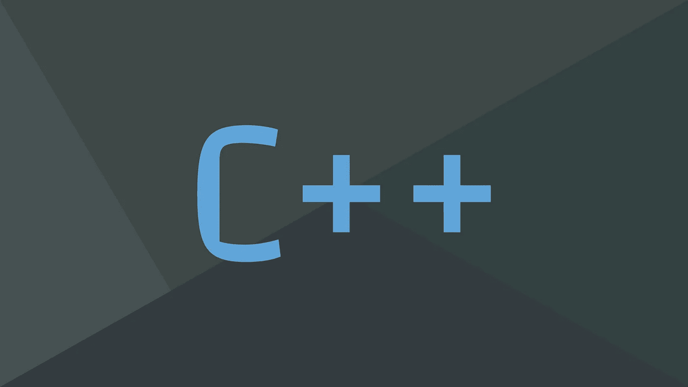

# 从初学者到高级学习 C++的完整教学大纲！

> 原文：<https://medium.com/geekculture/complete-syllabus-for-learning-c-from-beginner-to-advanced-8a97b6c4e726?source=collection_archive---------7----------------------->

不知道从哪里开始或者学什么？这是计划好的整个路线图…

Image provided by the author

好的，你已经决定学习 C++，也许你已经看了几个关于基础知识的视频，比如如何设置 IDE 和下载编译器，但是你仍然不确定从哪个主题开始学习。