# 使用 Sklearn 完成 python 中交叉验证和实现的教程。

> 原文：<https://medium.com/geekculture/complete-tutorial-on-cross-validation-with-implication-in-python-using-sklearn-48100095788?source=collection_archive---------3----------------------->

## @机器学习#交叉验证

## CV 的概念、类型和实际含义。


Photo by [Scott Graham](https://unsplash.com/@homajob?utm_source=unsplash&utm_medium=referral&utm_content=creditCopyText) on [Unsplash](https://unsplash.com/s/photos/machine-learning?utm_source=unsplash&utm_medium=referral&utm_content=creditCopyText)

在本文中，我们将看到交叉验证背后的理论概念，不同类型的交叉验证，以及最后使用 python 和 sklearn 的实际应用。

**但在此之前，我们为什么需要交叉验证？让我们理解。**

在用给定的数据建立任何最大似然模型之前，我们将数据集分成测试集和训练集，其比例取决于数据集计数的可用性。大多数情况下，`**Test Set : 20 -30 % of data**` **&** `**Train Set : 70–80 % of data**`其中，模型的准确性/性能将由测试数据集来检查。但是这 70- 30 %的数据量是从所有数据点中随机选择的，这导致了精确度的波动。这是通过给变量 **random_state** 赋值来控制的。

`***Random state will decide the splitting of data into test and train set and using a particular finite number(It can take any positive value) will ensure same results will be reproduced again and again. But for different random_state splitting of test and train will be different and hence accuracy obtained will be different and results in fluctuation of accuracy****.*`

**我们需要验证我们的 ML 模型的准确性，交叉验证的作用就来了:**这是一种通过使用不同的数据子集对模型进行一定次数的迭代来评估 ML 模型准确性的技术。模型的最终输出将是所有输出的平均值。它还减轻了过度拟合的影响。

通常有 6 种类型的 cv 方法:

1.  坚持方法
2.  遗漏一个交叉验证
3.  k 折叠交叉验证
4.  分层 K 折叠交叉验证
5.  时间序列交叉验证
6.  重复随机测试序列分割或蒙特卡罗交叉验证

让我们一个一个来看:

# **1。保持方法**

这只是将数据分成训练集和测试集。训练数据的百分比大于测试数据。发布使用训练集训练模型和剩余测试集进行误差估计。

***缺点:*** 会有[高方差](/geekculture/overfitting-underfitting-and-bias-variance-tradeoff-9e83f4a147c)的机会，因为任何随机的数据样本和与之相关的模式都可能被选入测试数据。由于我们用测试数据验证模型，准确性和模型泛化会受到负面影响。

# **2。遗漏一项交叉验证(LOOCV):**

在这种情况下，在所有数据点**中，一个数据**被留下作为测试数据，其余的作为训练数据。因此，对于 **n** 个数据点，我们必须执行 **n** 次迭代来覆盖每个数据点。

***留 P-Out 交叉验证是一种特殊情况，留下 P 个数据点用于测试和验证，n-p 用于训练模型。***

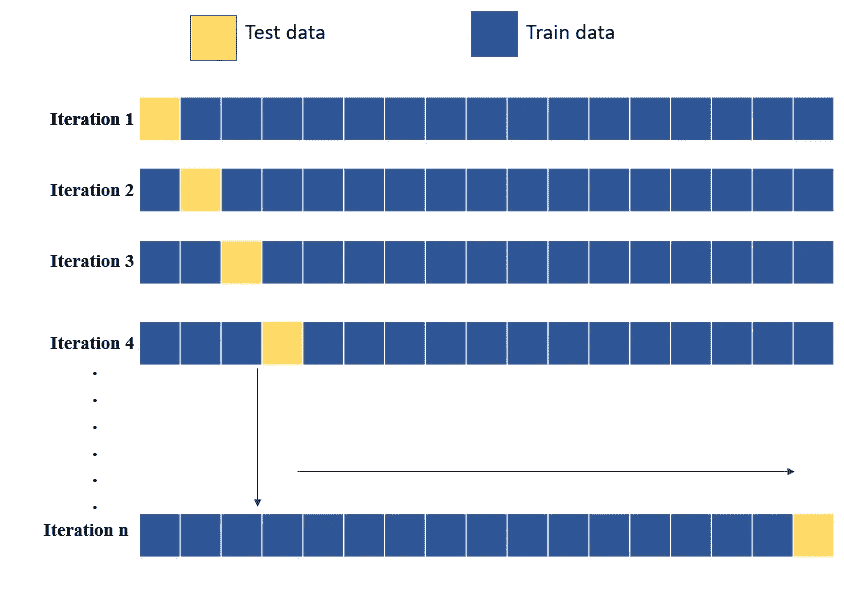

LOOCV iterations. Credits: Author

***缺点:***

I)需要高计算能力，因为大数据集的每个数据点都需要多次迭代。

ii)由于 **n-1 个**数据点被用作训练数据，因此[会发生过拟合，导致低偏差](/geekculture/overfitting-underfitting-and-bias-variance-tradeoff-9e83f4a147c)，但不会产生概化模型，导致高误差和低精度。它很久以前就被使用了，现在没人使用它了。

# **3。k 折交叉验证:**

其中，整个 **n 数据集**被分成 k 个部分，其中 **n/k =p** ，然后这个 **p** 将作为每次迭代的测试数据，下一次迭代的下一个 p，以此类推，直到 **k** 次迭代。为 ex。5 折交叉验证的 20 个数据点，20/5 =4，因此给定数据集将如下图所示进行划分。不同的折叠会有不同的设置。**每个数据将在测试集中被考虑一次，在训练集中被考虑 k-1 次，增强了该方法的有效性**。每个折叠将给出不同精度，最终精度将是所有这 5 个精度的平均值。此外，我们将能够获得该特定型号的最小**精度和最大**精度。****

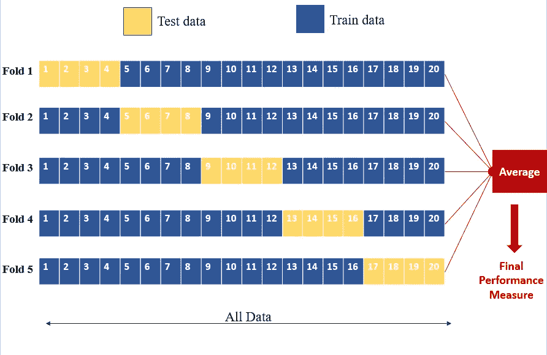

5-fold cross validation iterations. Credits : Author

***优点:***

I)有效使用数据，因为每个数据点都用于训练和测试目的。

**低偏倚是因为大部分数据用于训练。**

**低方差，因为几乎每个数据点都在测试集中使用。**

ii)精确度高。

**理想情况下，k 值最好在 5 -10 之间，但也可以是任何值。较高的 K 值将导致类似于 LOOCV 方法的精确度。**

***缺点:***

I)I**m 平衡数据集使用此方法**导致低准确性，假设对于二进制分类问题，在测试数据中，我们有输出 1 的最大实例，因此它不会给出关于特定模型的准确结果。或者在价格预测中，为测试集选择的所有数据都有很高的价格，因此准确性也会受到影响。

为了克服这一点，我们使用分层交叉验证。

# **4。分层交叉验证:**

在这种情况下，在训练和测试数据集中填充的随机样本是这样的，即在训练和测试数据分割的每次迭代中，每个类的实例数量以是和否、0 和 1、或高和低的良好比例被采用，从而模型给出良好的准确性。

# **5。时间序列交叉验证:**

它完全适用于时间序列数据，如股票价格预测、销售预测。输入按顺序添加到训练数据中，如下所示。

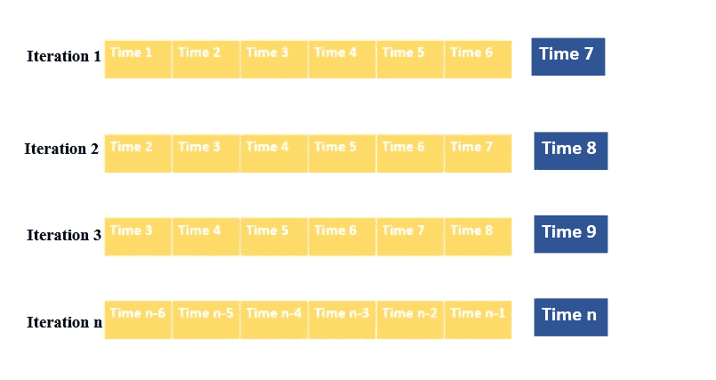

Time Series CV. credits : Author

# 6.重复随机测试训练分割或**蒙特卡洛交叉验证**:

它包括传统的训练测试分割和 K-fold CV。这里，数据集被随机分割成训练集和测试集，然后分割和性能测量的进一步过程被重复我们指定的次数。执行交叉验证。

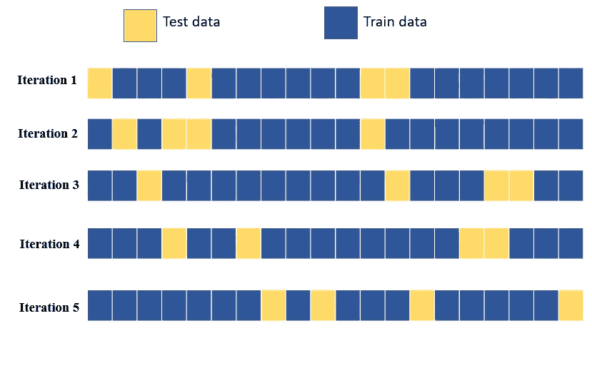

Repeated Random Test Train Split. Credits: Author

***缺点:***

I)它不适用于不平衡数据集。

ii)有可能一些样本没有被选择用于训练和测试数据。

# 使用 Sklearn 和 Python 的实际意义:

现在，我们正在使用 python 和 sklearn 实现上述所有技术，以构建一个简单的 ML 模型。这只是为了理解交叉验证技术，所以回归分类器的其他超参数是默认值。

我们正在考虑一个癌症数据集，以在各种特征的基础上预测癌症的类型，即良性(B)和恶性(M)。

```
import pandas as pd
data=pd.read_csv(r'/content/drive/MyDrive/cancer_dataset.csv')
data.head()
```

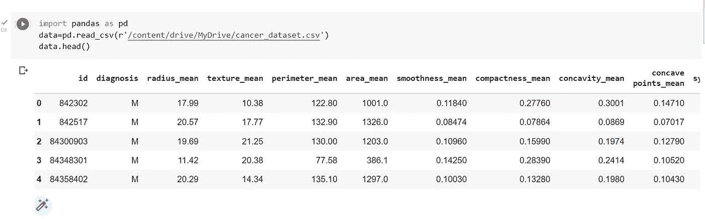

```
**#Removing Null Values**
data.isnull().sum()
```

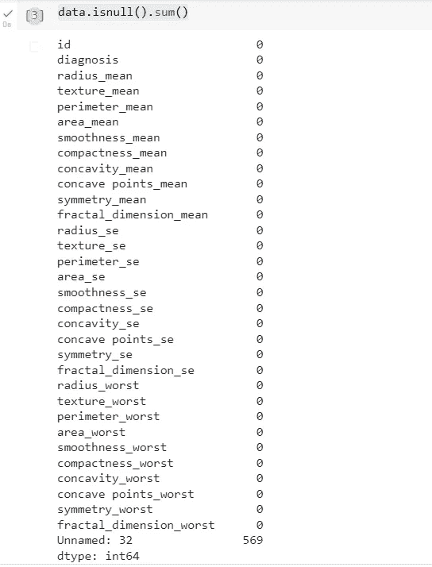

```
**#last column have all NaN value so we can drop that**data1=data.drop(['Unnamed: 32'],axis='columns')**###  Dividing dataset into dependent & independent feature****#diagnosis is the output and rest all are input features.**x=data1.iloc[:,2:]
y=data1.iloc[:,1]**#to check if the dataset is balanaced or not**y.value_counts()
```

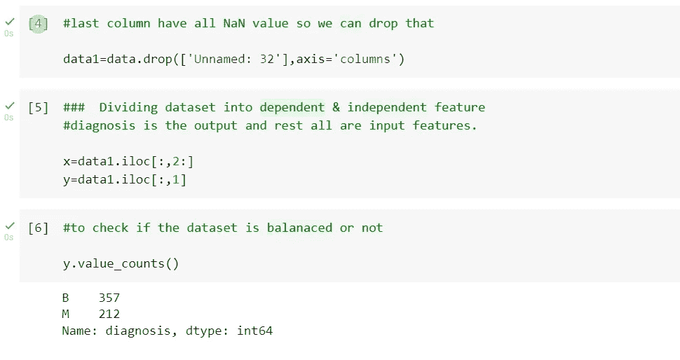

现在我们正在使用不同的 CV 技术构建 ML 模型。

**1。维持验证**

```
from sklearn.tree import DecisionTreeClassifier
from sklearn.model_selection import train_test_splitx_train,x_test,y_train,y_test=train_test_split(x,y,test_size=0.30,random_state=0)
model=DecisionTreeClassifier()
model.fit(x_train,y_train)
mod_score1=model.score(x_test,y_test)
mod_score1
```

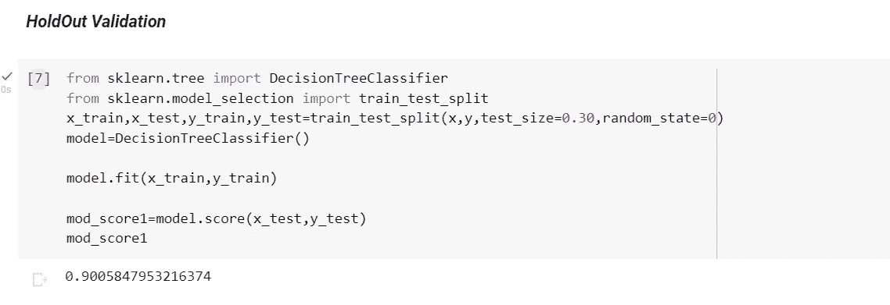

**2。遗漏一个交叉验证(LOOCV)**

```
from sklearn.model_selection import LeaveOneOut
from sklearn.model_selection import cross_val_score
model=DecisionTreeClassifier()
leave_val=LeaveOneOut()
mod_score2=cross_val_score(model,x,y,cv=leave_val)print(np.mean(mod_score2))
```

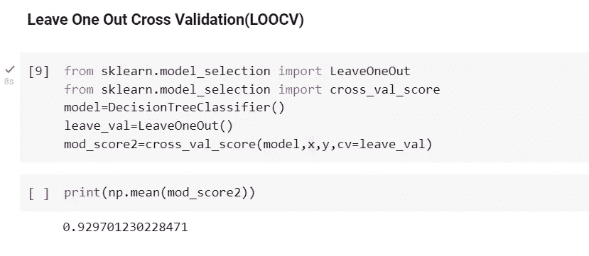

**3。k 折交叉验证**

```
from sklearn.model_selection import KFold
model=DecisionTreeClassifier()
kfold_validation=KFold(10)import numpy as np
from sklearn.model_selection import cross_val_score
mod_score3=cross_val_score(model,x,y,cv=kfold_validation)
print(mod_score3)**#Overall accuracy of the model will be average of all values.** print(np.mean(mod_score3))
```

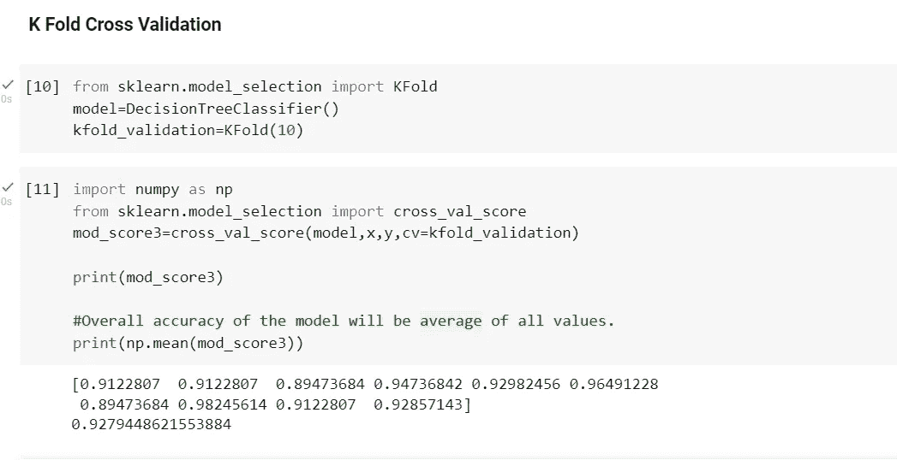

**4。分层 K 倍交叉验证**

```
from sklearn.model_selection import StratifiedKFold
sk_fold=StratifiedKFold(n_splits=5)
model=DecisionTreeClassifier()
mod_score4=cross_val_score(model,x,y,cv=sk_fold)
print(np.mean(mod_score4))
print(mod_score4)
```

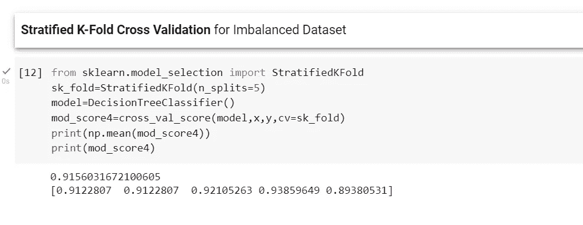

**5。重复随机测试-列车分裂**

```
from sklearn.model_selection import ShuffleSplit
model=DecisionTreeClassifier()
s_split=ShuffleSplit(n_splits=10,test_size=0.30)
mod_score5=cross_val_score(model,x,y,cv=s_split)
print(mod_score5)
print(np.mean(mod_score5))
```

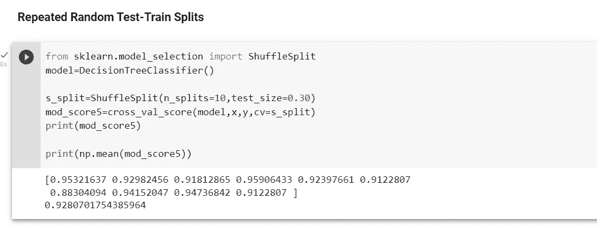

这样，我们几乎涵盖了交叉验证的每一点。

感谢阅读！！