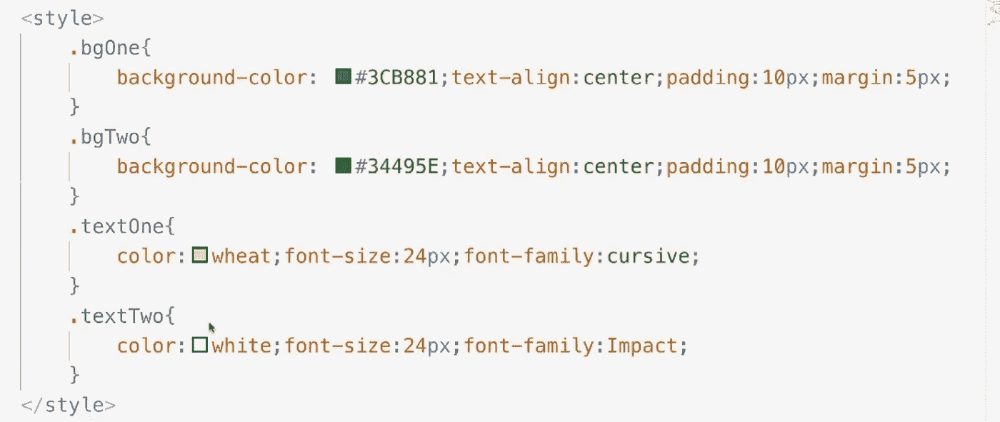

# 完成 Vue.js 3 指南[2010 年 5 月]

> 原文：<https://medium.com/geekculture/complete-vue-js-3-guide-5-10-5a80fa342177?source=collection_archive---------32----------------------->

从这节课开始，我们将学习如何使用 Vue 控制 **CSS 样式**。我们将从添加和删除类开始。我们将在下一课处理内联 CSS。

我已经预定义了四个类:两个背景类和两个文本类。

在项目样板中，我创建了一个 span 标记。span 标记有一个外部 DIV。我们将在这个 DIV 中添加和删除类。