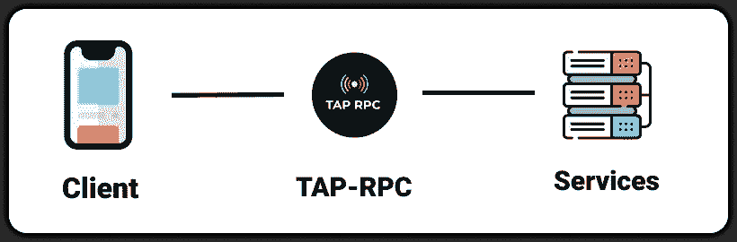
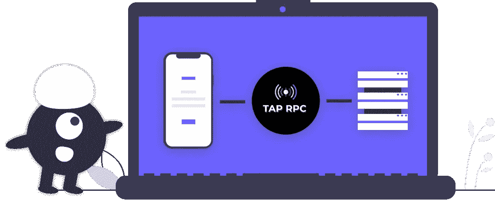
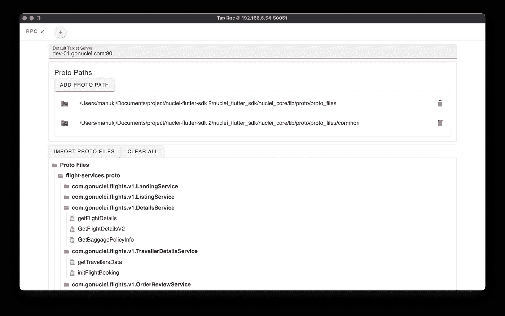
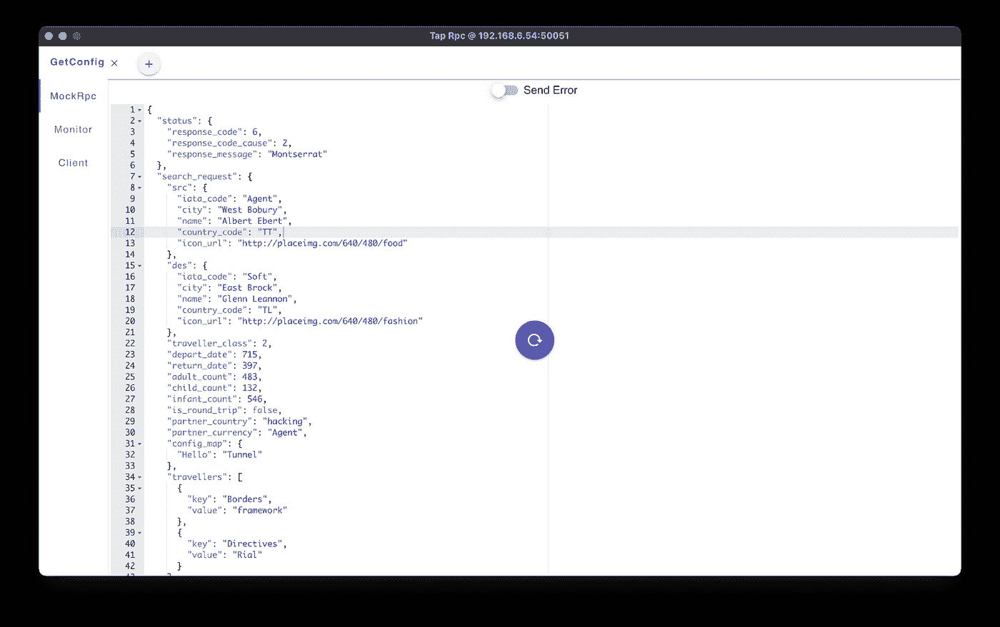
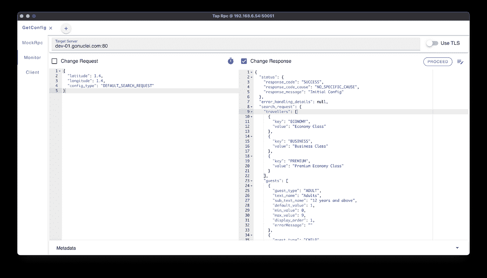
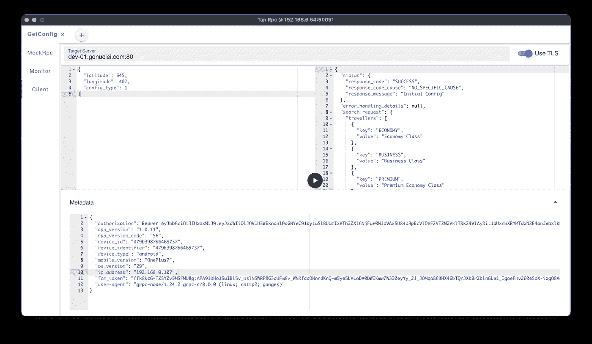

# 使用 Tap-Rpc 完成您的 GRPC 开发和测试工作流

> 原文：<https://medium.com/geekculture/complete-your-grpc-development-and-testing-workflow-with-tap-rpc-bc185a1adce5?source=collection_archive---------35----------------------->

我们在[nucleus](http://gonuclei.com)使用 GRPC 为我们的服务，主要是因为 GRPC 提供了丰富的好处，例如通过原型文件进行简单的服务定义，提供可扩展性，跨语言和平台工作，通过 http2 支持双向流。

尽管有这些好处，我们解决了一些不可避免的限制和我们经常面对的开发和测试工作流程的细微差别。

# 我们试图解决的问题

任何项目通常的开发和测试工作流程都包括前端和后端开发，以及测试项目的 QA 人员。

**前端问题**:前端开发人员总是依赖后端服务准备就绪，以构建用户界面，很多时候服务仍在进行中。如果服务没有准备好，前端将不得不手动模拟响应，这是非常耗时和乏味的。

**后端问题**:后端服务的测试完全依赖于他们编写的测试用例，后端开发人员无法实时修改来自应用程序客户端的请求，这使得发现问题变得更加困难。

QA 关注点:在后端或客户端模拟某些边缘案例和场景是非常困难和耗时的，这通常需要改变客户端和后端的代码库。QA 没有简单的方法来实时查看或修改客户端和后端之间交换的请求和响应，这将多次暴露错误和未处理的情况。

为了解决上述所有问题，我们需要一个介于前端(客户端应用程序)和后端(服务)之间的工具

*   这是一个工具，它让开发人员以一种比通常的日志更好的方式实时看到请求和响应。
*   允许您实时修改客户端应用程序和服务器之间交换的请求和响应。
*   允许您使用客户端应用程序所需的相关信息生成模拟响应，并提供向服务发送模拟请求的方法。

这就是 **Tap-Rpc** (灵感来自 Bloom Rpc grpc 客户端)的由来。

# TAP-RPC:

Tap-Rpc 有效地解决了上述问题。

*   简化前端开发，甚至在后端 API 未准备好的情况下解除前端阻塞。
*   显著降低开发人员和 QA 之间的依赖性
*   有助于有效的应用和后端测试

# 安装和使用:

*   从这里下载最新版本:[https://github.com/nateshmbhat/tap-rpc/releases](https://github.com/nateshmbhat/tap-rpc/releases)

*   在您的客户端应用程序中，将 grpc 服务的主机和端口设置为指向 Tap-Rpc 窗口标题中间显示的 Tap-Rpc 的 ip 地址和端口。在上图中，窗口标题显示的地址为“ **192.168.6.54:50051** ”。
*   设置缺省的目标服务器 URL，这是监视器和客户机模式所需要的。在上图中，目标服务器被设置为“dev-01.gonuclei.com:80 ”,这是真正的 grpc 服务的地址。
*   用户选择包含服务的原型文件。一旦您选择了 proto 文件，所有的服务和这些服务中的 rpc 都会出现在一个树形结构中，您可以选择一个特定的 RPC。
*   此时，来自客户端的任何请求都将被转发到后台的默认目标服务器。
*   现在，您的客户端应用程序已经准备好访问 Tap-Rpc 的所有特性。

Tap-Rpc 提供了 3 种操作模式，每种模式解决一组不同的问题:

1.  模拟 Rpc 模式
2.  监控模式
3.  客户端模式

# 模拟 Rpc 模式:

Mock Rpc mode in action

模拟 rpc 模式为可以定制的客户端提供模拟响应。这种模式试图消除对后端服务的依赖。客户端只需要指向窗口标题中给出的地址，就可以开始使用 Tap-Rpc 作为模拟服务器。

*   生成的模拟响应依赖于原型属性名和属性类型，这有助于生成真实的响应。例如:图像网址，地址文本，电话，文件路径，电子邮件，姓名等。
*   模拟响应可以由**动态编辑**。
*   您也可以选择**发送** **模拟 grpc 错误代码**和自定义错误消息来测试错误场景。
*   本质上，tap-rpc 工具的每个用户都有能力拥有自己的服务器，为请求提供真实的响应，而不需要客户端手动硬编码模拟响应。

# 监控模式:

Monitor mode in action

监控模式是 Tap-Rpc 最有趣的特性，它充当应用程序客户机和真正的后端服务器(目标服务器)之间的桥梁，允许您实时监控和修改请求和响应。

*   用户可以实时看到客户端应用程序和服务器之间交换的请求和响应。
*   用户可以在请求到达后端之前修改来自客户端的请求。
*   用户可以在响应到达客户端之前修改从服务器返回的响应。
*   用户还可以访问和修改元数据、切换 TLS 使用、转发错误、更改目标服务器以动态转发请求等。

# 客户端模式:

Client mode in action

在客户机模式下，您可以通过向目标服务器发送真实的模拟请求来独立测试您的后端服务。

*   使用客户端模式向后端服务发送真实的模拟请求。
*   帮助测试各种场景下的每个后端服务和 rpc。
*   用真实的数据生成模拟请求。

# 使用 REST 而不是 GRPC？

如果你在使用 REST 服务而不是 grpc，我们仍然为你提供了另一个专门用于处理 REST 服务和请求的工具，你可以从这里获得:[https://github.com/nateshmbhat/tap-rest/releases](https://github.com/nateshmbhat/tap-rest/releases)

> 这篇文章是由 [manu kj](https://medium.com/u/94450a387c10?source=post_page-----bc185a1adce5--------------------------------) 共同撰写的

> *别忘了砸那个* `*CLAP*` *按钮👏🏻走之前:)*

Clapping is Caring :)