# 使用 Tasker 完全自动化您的 Android 设备

> 原文：<https://medium.com/geekculture/completely-automate-your-android-device-with-tasker-41af76752716?source=collection_archive---------2----------------------->

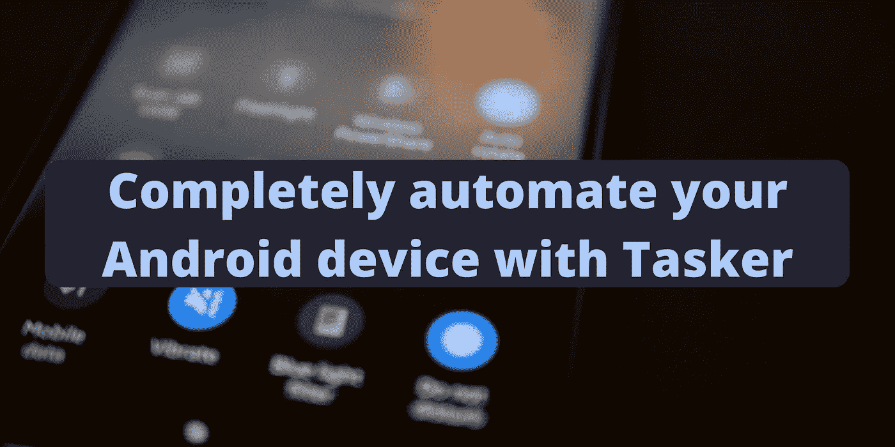

Photo by [Azamat E](https://unsplash.com/@picsaf?utm_source=unsplash&utm_medium=referral&utm_content=creditCopyText) on [Unsplash](https://unsplash.com/s/photos/phone-settings?utm_source=unsplash&utm_medium=referral&utm_content=creditCopyText)

Tasker 是一个强大的工具，当它检测到配置文件中描述的特定条件时，允许 Android 用户执行称为任务的操作。最棒的是，你可以为你每天面临的每种情况创建个人资料。

在这里，我将解释我如何设置 Tasker 来自动执行我每天需要手机执行的操作。

## 要求

你需要在你的 Android 设备上安装 [Tasker](https://play.google.com/store/apps/details?id=net.dinglisch.android.taskerm) ，并对你的习惯进行分析。要求对 Tasker 操作有良好的了解。

我还使用了一些需要 root 权限的操作来更改设备设置。

**更新 29/07/2021** :现在可以使用[这个工具](https://www.reddit.com/r/tasker/comments/oterk2/dev_tasker_permissions_001_desktop_app_to_easily/?utm_medium=android_app&utm_source=share) ( [下载](https://github.com/joaomgcd/Tasker-Permissions/releases)和[源代码](https://github.com/joaomgcd/Tasker-Permissions))刚刚发布的 Tasker 的开发者绕过这个限制。

**原文:**可以授予 Tasker 一些 ADB 权限，绕过这个限制。在 Reddit 主题或 ADB Wifi 许可页面[上了解更多信息。](https://tasker.joaoapps.com/userguide/en/help/ah_adb_wifi.html)

# 第一步。了解你的习惯

一年中，我有一个工作模式和一个假期模式。

在第一种模式中:

*   我每天在同一时间醒来和入睡。
*   我在同一时间开始工作、结束工作和午休。

对于后者，我没有具体的时间表。

有时候一周我也会去健身房，开车四处走走。这两件事的发生与模式无关。

## 电话设置

我有一些基于我自己所处环境的设置简介。
首先，我的手机总是以最大音量开着闹钟和来电铃声。显示屏旋转也一直关闭。

晚上，我打开 wifi，关闭移动数据，启用勿扰模式，将媒体音量设为静音，禁用定位服务，打开节电模式，并禁用自动同步。

在家里，我打开 wifi 并启用定位服务。

在工作时，我打开 wifi，禁用定位服务，启用勿扰模式，将媒体音量设置为静音，禁用定位服务，并禁用自动同步。

当我在健身房时，我会启用“请勿打扰”模式，将媒体音量静音，禁用定位服务和自动同步。

当我在车里时，我把媒体音量调到最大。

然后我设置了移动数据，定位服务，自动同步开启，免打扰模式关闭，其他情况下关闭电池保护。

# 第二步。在 Tasker 中创建任务

我定义了以下任务:

*   基本:用我手机的一般设置。
*   在家:设置我在家的时间。
*   工作:设置我工作的时间。
*   夜晚:设置我睡觉的时间。
*   健身房:设置我在健身房的时间。
*   汽车:当我在我的汽车里的时候有设置。
*   默认:为所有其他情况设置。

在每个任务中，我在一个变量中设置“概要”名称和一个优先级数字。第一个与我将要使用任务的情况有关。稍后我将使用优先级来自动执行任务；优先级较高的任务会战胜优先级较低的任务。

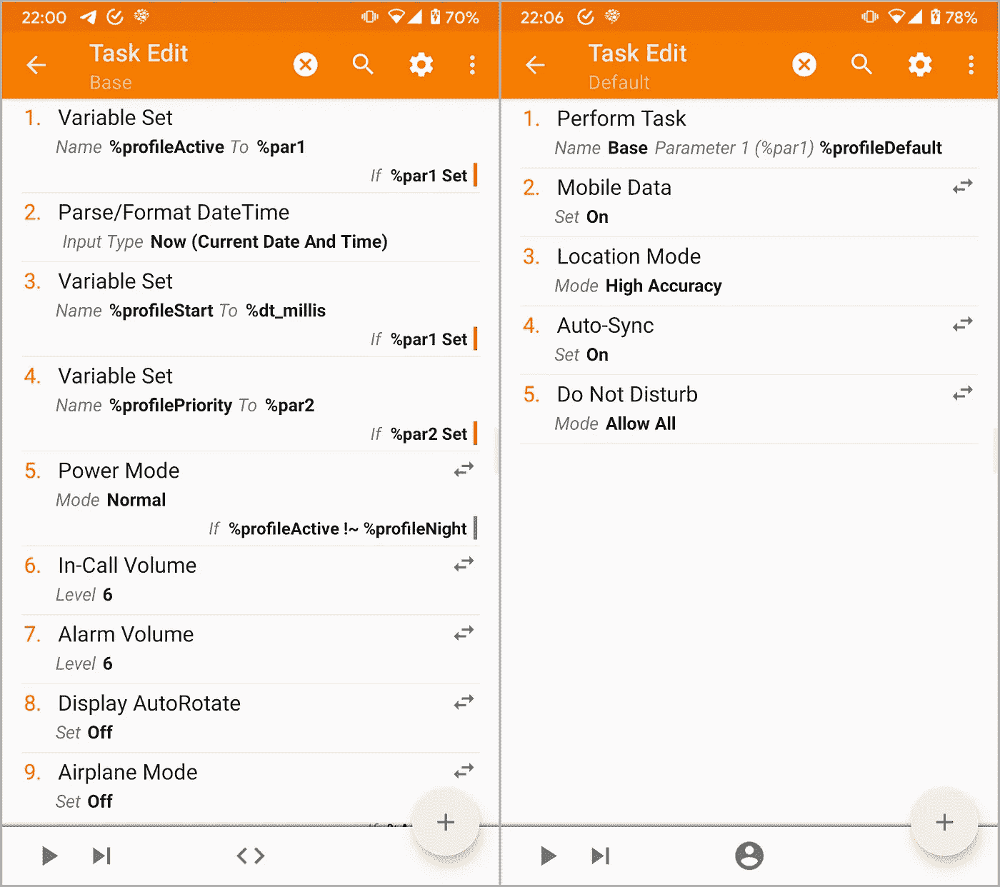

我的任务调用 **Base** one，使用 [*执行任务*](https://tasker.joaoapps.com/userguide/en/help/ah_run_task.html) 动作，传递概要名和优先级号。 **Base** 任务读取这两个参数( *%par1* 和 *%par2* )并将它们设置在各自的变量中。它还在另一个名为 *%profileStart* 的变量中设置执行时间。

您可以在此下载**基础**任务描述[并在此](https://gist.github.com/pirasalbe/53a3625d58db9fb2d7dc0e42570b5342)从[导入 Tasker。](https://taskernet.com/shares/?user=AS35m8nzU8Z2OxB1WGqHbYHDLajdlq0DG%2B8k8f7L2XfQM3eHbHEAthA2xNvalA2%2FZaJvRZj2roE7ow%3D%3D&id=Task%3ABase)

创建完所有任务，我有这样的东西。

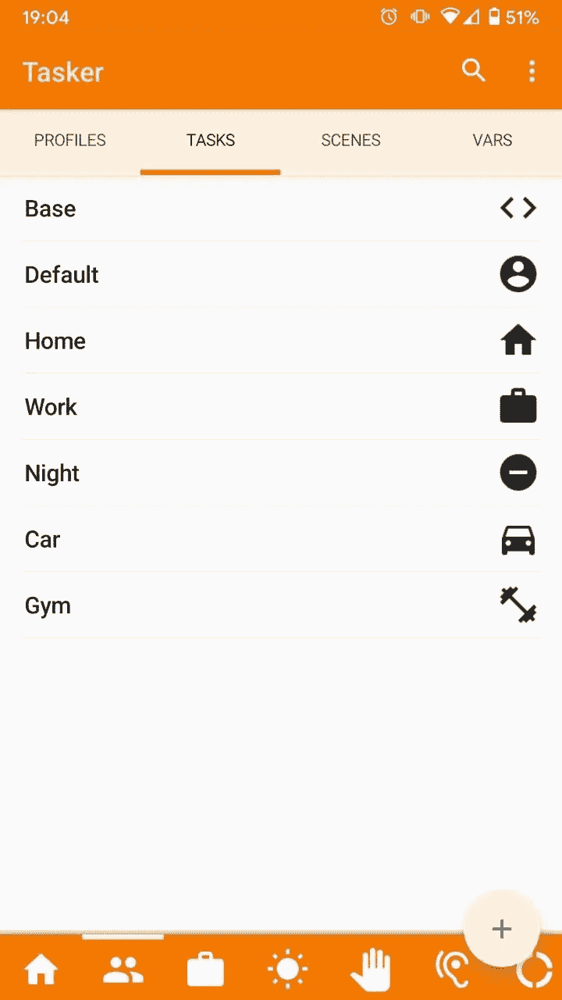

# 第三步。在 Tasker 中创建配置文件

我之前说过，我有两种模式:**工作**和**休假**。我还添加了第三个名为 **Off** 的按钮来禁用一些自动化功能，以防万一我需要它。我创建了一个变量来存储启用的模式。

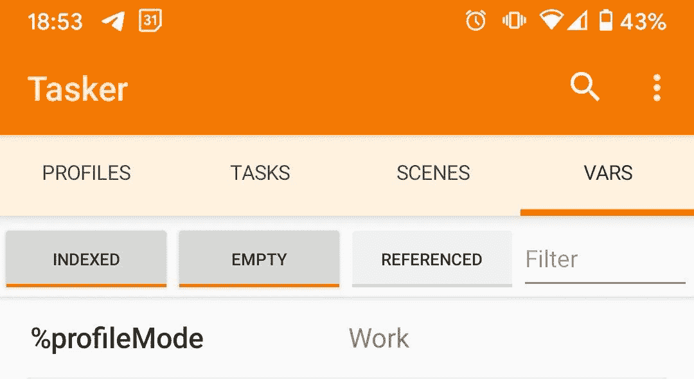

当**工作**模式启用时，我有以下条件。*工作*任务从 8:30 运行到 13:00，并在 14:00 到 17:30 再次运行。*夜间*任务每天午夜开始，但仅在工作日的 07:00 结束。

我已经根据时间描述了一些情况，但你也可以做同样的事情，例如，当你连接到你的工作 wifi 网络时。

在**假日**模式下，我只需要*夜*任务在 02:00 开始。

不考虑模式，当我连接到我的汽车的蓝牙时，我运行*汽车*任务，当我在健身房时，我运行*健身房*任务。当我的设备连接到我的家庭 wifi 时，运行*家庭*任务。

默认任务在所有其他任务结束时运行。

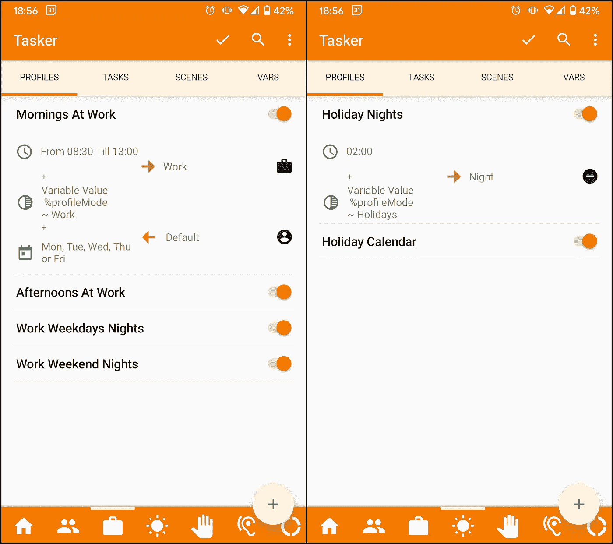

Here are a few of the profiles discussed before that runs at a specific time and day.

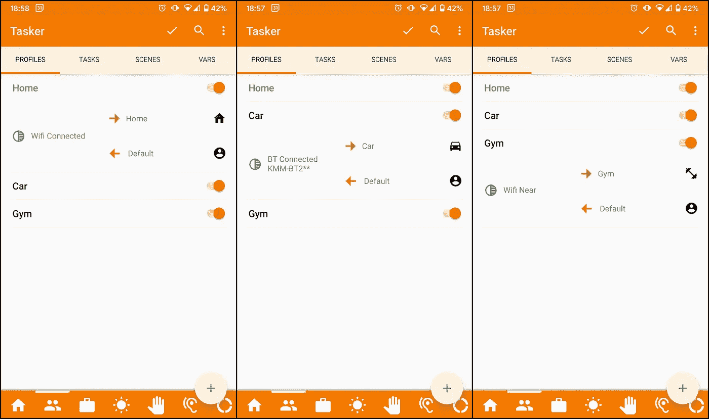

These are other profiles that run with different conditions. The first profile runs when a Wifi network is connected, the second when a Bluetooth device is connected, and the third when a wifi network is near. The last one is a condition based on the location; you can read more [here](https://tasker.joaoapps.com/userguide/en/loctears.html).

# 第四步。优先级管理

现在自动化正在工作，但一些条件可能会重叠。

比如上班时间需要开我的车怎么办？应该启动*工作*任务(由上午/下午工作配置文件触发)还是*汽车*任务(由汽车配置文件触发)？如果*车*任务成功，则*默认*任务将运行，而不是第一个轮廓退出时的*工作*任务。

这些令人困惑的案例是我为每个配置文件定义一个优先级数字的原因。**注意**我没有使用*概要属性*中的*已启动任务优先级*。这样，我也可以手动启动每个任务。

我已经定义了以下优先级，记住，高优先级优先于低优先级。

*   首页:1
*   工作:2
*   夜晚:3
*   健身房:4 人
*   汽车:5 辆
*   默认值:0

现在，我可以为我之前定义的每个概要文件添加一个条件，这样，只有当一个任务的优先级低于或等于它自己的优先级时，它才会运行。

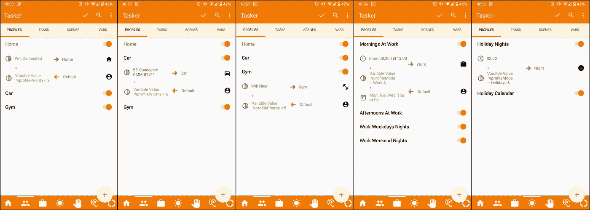

In the last two images, the second condition is the %profileMode in AND with the %profilePriority.

## 轮廓末端

现在，当 *Car* 任务运行时，我们处于我在该步骤开始时展示的场景中，优先级上升。*工作*概要文件退出并运行*默认*任务，造成更多混乱。

为了解决这个问题，我创建了一个名为 *Profile End* 的通用退出任务。该任务接收现有任务的名称作为参数，如果在此期间没有其他任务运行，它会降低优先级，直到有一个任务运行或达到 0，并启动默认的*。对于其他概要文件，我指的是具有不同名称和较低优先级的概要文件，或者是相同但稍后运行的概要文件。*

*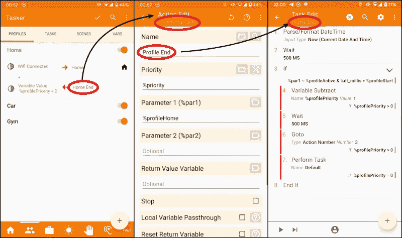*

*您可以在此下载**概要文件结束**任务描述[，并在此](https://gist.github.com/pirasalbe/8549350c94323bed9058c7ebd36d1e36)从[导入 Tasker。](https://taskernet.com/shares/?user=AS35m8nzU8Z2OxB1WGqHbYHDLajdlq0DG%2B8k8f7L2XfQM3eHbHEAthA2xNvalA2%2FZaJvRZj2roE7ow%3D%3D&id=Task%3AProfile+End)*

*在下图中，您可以看到当*工作*和*小车*条件重叠时发生的**轮廓末端**流动。圆圈是条件，矩形是正在运行的任务，橙色矩形解释发生了什么。*

*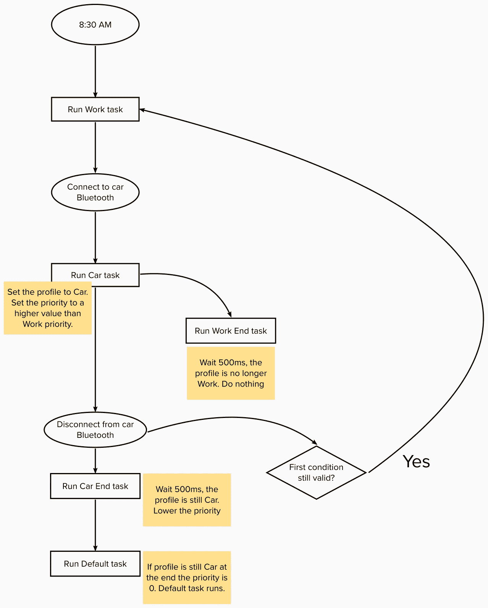*

# *第五步。改变模式*

*在第 3 步中，我创建了变量 *%profileMode* 来定义应该运行哪些任务。为了在不手动更改变量的情况下更改模式，我编写了一个任务，例如添加到主屏幕。*

*此外，我在*假日*模式下的每一天都有一个日历事件。因此，我创建了一个条件，在这些事件开始时切换到*假日*模式，然后在事件结束时切换回*工作*模式。它还启用和禁用我的 Fitbit 警报。你可以在另一篇文章中阅读更多关于如何做的内容。*

*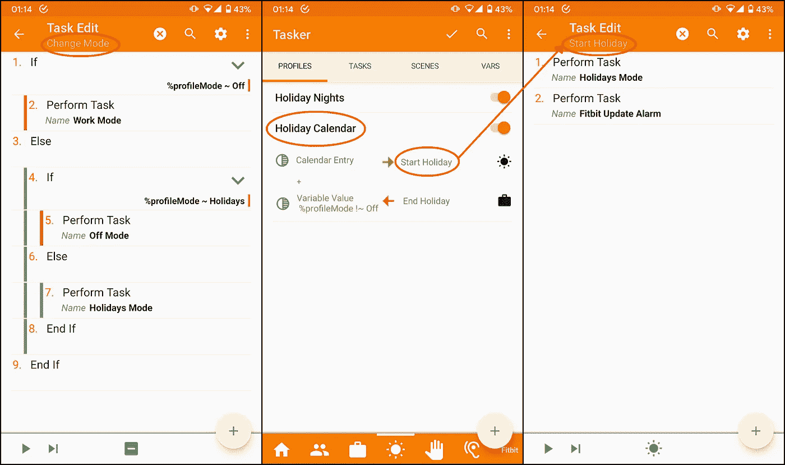*

*The first screenshot is the task to change mode, the second shows my condition, and the third is the task that automatically enables **Holidays Mode** and disables my Fitbit alarms.*

# ***第六步。创建场景***

*使用 Tasker 场景，我创建了一个弹出窗口来手动启动我之前展示的所有任务。你可以在[场景](https://tasker.joaoapps.com/userguide/en/scenes.html)用户指南中了解更多信息。*

*我有一个快速设置来打开这个场景。它允许我运行，在第一行，*默认*、*回家*和*晚上*的任务，在第三行，*健身房*和*工作*的任务。第三行最后一个按钮显示当前模式，存储在 *%profileMode* 中，点击运行*改变模式*任务。中间一行有一些信息，比如日出时间，当前任务，存储在 *%profileActive* 中，以及日落时间。*

*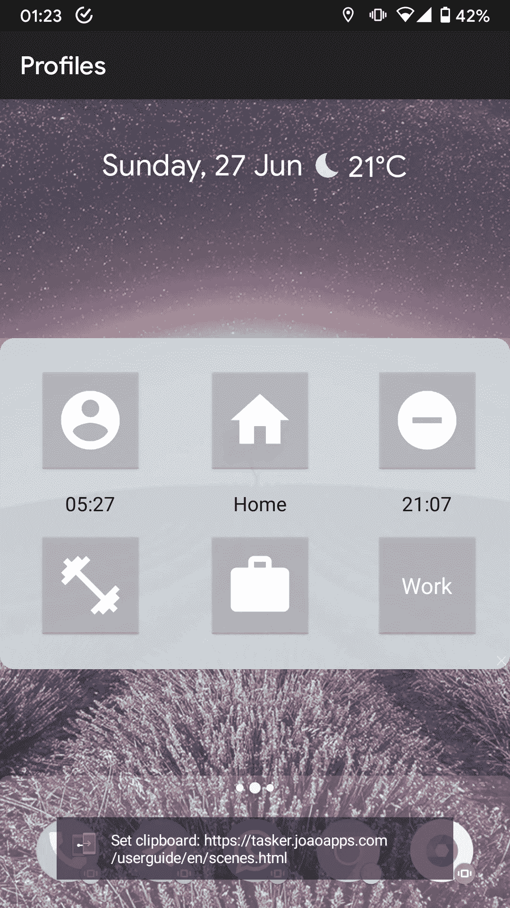*