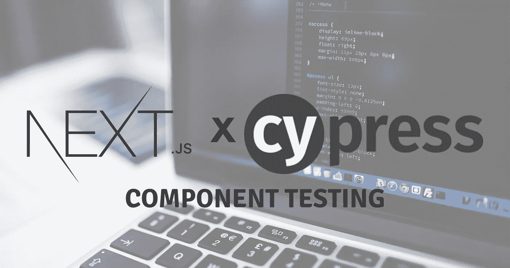
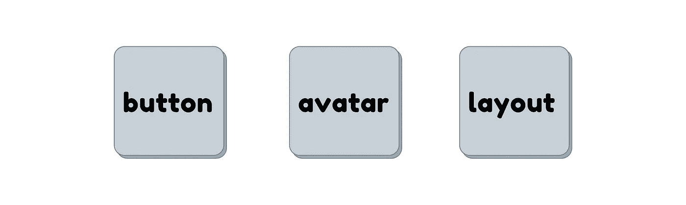
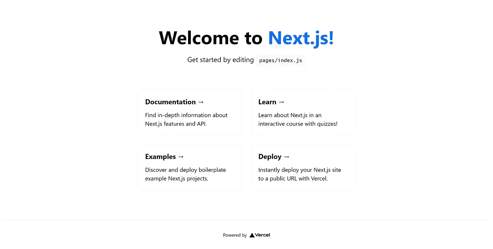
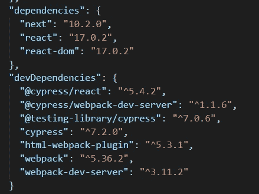
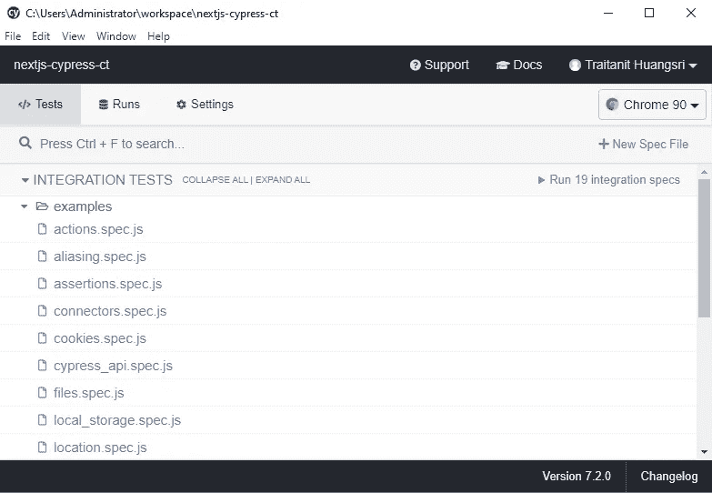
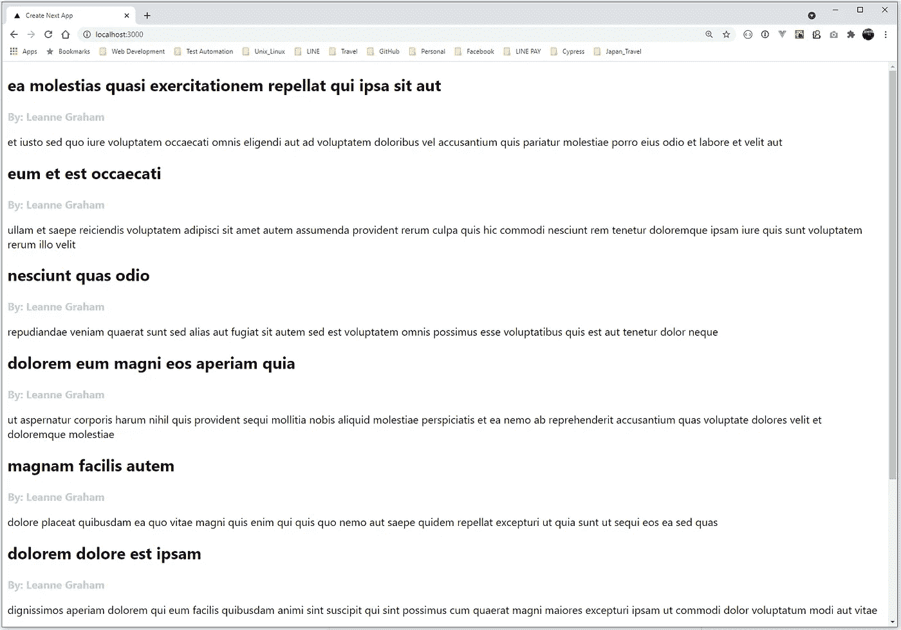
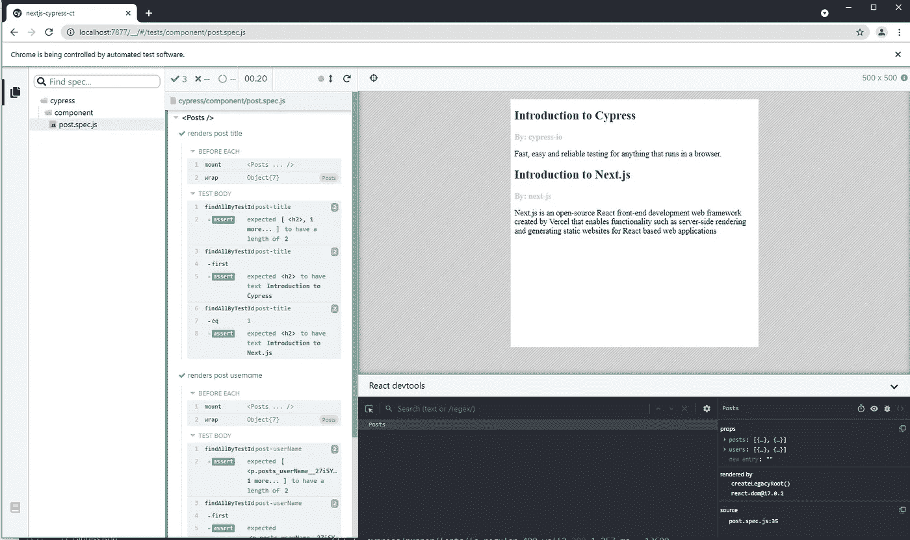
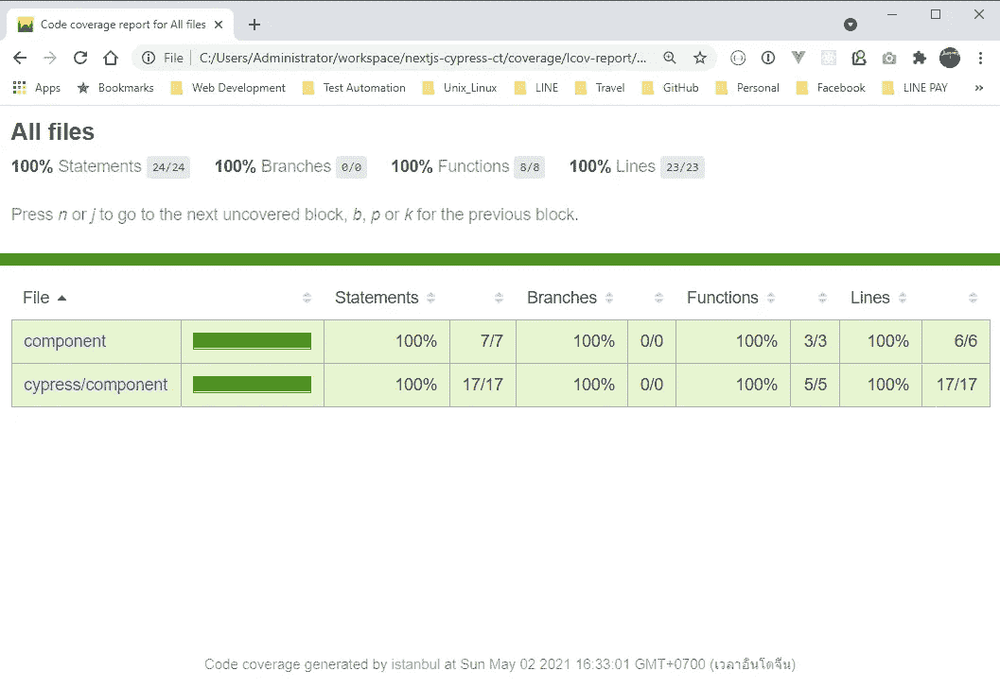
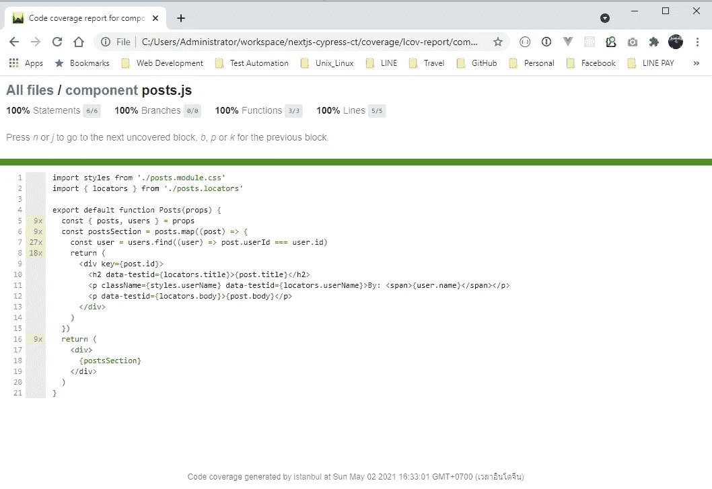

# 使用 Cypress 对 Next.js 应用程序进行组件测试

> 原文：<https://medium.com/geekculture/component-testing-next-js-application-with-cypress-28fa311adda6?source=collection_archive---------3----------------------->



嗨伙计们！在本文中，我将向您展示如何用 Cypress 编写组件测试 Next.js 应用程序。这可能会永远改变你的测试体验。

# 什么是组件测试？

如今，web 开发已经发展了。我们通常使用一种叫做**“Web 组件”**的设计模式来设计我们的网站，我们可以在网络上的任何地方重用这种模式。组件测试是一个概念，我们孤立地测试 web 组件来观察它的行为。有了这个概念，我们可以只关注被测试的特定组件，这与另一个测试级别(如集成或端到端测试)相比是一个非常不同的视角。



Web Components

通常，我们会在 Node.js 虚拟浏览器中运行组件测试，比如`jsdom`。这种方法有一些缺点:

1.  虚拟浏览器并不 100%支持所有浏览器 API
2.  我们甚至看不到组件是如何呈现的。我们只能在文本模式下看到 DOM 层次结构。

借助 Cypress 中的组件测试，它可以在具有完整浏览器 API 支持的**真实浏览器**中运行您的 web 组件。当它运行时，你的组件也可以被渲染并被你的眼睛看到。很酷吗？

# 使用 Cypress 对 Next.js 应用程序进行组件测试

自 Cypress 7.0 以来，他们确实支持使用现代 web 框架进行组件测试，如 **React、Vue、**，当然还有 **Next.js** 。Next.js 是由 Vercel 开发的 web 框架，旨在帮助开发人员创建更强大的 web 应用程序。它增强了 React 构建静态或服务器端渲染应用程序的能力，还增加了更多功能，例如图像优化、智能代码拆分和绑定等等。

[](https://docs.cypress.io/guides/component-testing/introduction#What-is-Component-Testing) [## 简介| Cypress 文档

### ⚠️赛普拉斯组件测试库仍处于 Alpha 阶段。我们正在快速发展，并期望 API 可以…

docs.cypress.io](https://docs.cypress.io/guides/component-testing/introduction#What-is-Component-Testing) 

在本文中，我将逐步向您展示如何为 Next.js 应用程序设置和编写第一个组件测试。

# 1.创建 Next.js 应用程序

首先，让我们使用 create-next-app 工具创建一个新的 Next.js 应用程序

```
$ npx create-next-app nextjs-cypress-ct
```

创建项目后，让我们运行这个简单的应用程序

```
$ yarn dev
```

当在 *http://localhost:3000* 进入网页时，你应该看到网页是这样显示的



# 2.安装 Cypress 和其他测试依赖项

当你的 Next.js app 准备好了，然后安装 Cypress 等测试库为`devDependencies`

```
$ yarn add -D cypress @cypress/react @cypress/webpack-dev-server @testing-library/cypress html-webpack-plugin webpack webpack-dev-server
```

全部安装后，你的`package.json`文件应该是这样的



然后，运行以下命令

```
$ npx cypress open
```

Cypress 将初始化并设置 Next.js 应用程序的文件结构



在你的项目根目录下有一个`cypress`目录。它包括:

*   **集成**:集成和端到端测试用例的文件夹。
*   **fixtures** :存储你的测试数据，比如 JSON 或者模拟数据文件。
*   **插件**:用于加载 Cypress 插件(将在本文后面使用)
*   **支持**:加载其他支持文件，如 [Cypress 自定义命令](https://docs.cypress.io/api/cypress-api/custom-commands)

# 3.创建您的 Web 组件

在本文中，我将创建一个简单的 web 组件来呈现名为**“Posts”**的博客文章。数据将从假 API[https://jsonplaceholder.typicode.com/](https://jsonplaceholder.typicode.com/)中获取

我还应用了定位 web 元素的最佳实践，为定制数据属性使用一个单独的定位器文件，这样我可以在以后的测试中重用它们。例如`<h2 data-testing={locators.title}>`加载`data-testid=’post-title’`

然后我编辑主页`pages/index.js`来添加我的文章组件，以显示在主页上

然后，我重新运行应用程序，看看我的“文章”组件是如何呈现的。



Posts component in Home Page

# 4.“文章”组件的编写测试

为了开始用 Cypress 为您的 web 组件编写测试，我在`cypress`目录下创建了一个名为**“component”**的新文件夹来存储组件测试用例。但是首先，我们必须设置一些库，使 Cypress 能够访问您的 web 组件。

**4.1 将 Next.js 组件测试插件注入 Cypress**

在`cypress/plugin/index.js`，像这样注入 Next.js 组件测试插件

该插件将注入 Next.js `webpack-dev-server`以允许 Cypress 访问您的 web 组件。

## 4.2 开始编写测试

编写组件测试的概念类似于端到端测试，除了你不必调用`cy.visit()`来导航到网页。相反，您只需调用`mount` API 来安装 web 组件，并使用 Cypress 命令与之交互。

在这种情况下，我还使用 [**Cypress 测试库**](https://github.com/testing-library/cypress-testing-library) 通过一个名为**“data-testid”**的自定义数据属性来访问 DOM 元素，如果您尝试过 React 测试库，这一概念基本相同。

在我的“Posts”组件中，它允许我们传递两个属性`posts`和`users`。因此，我使用与来自 API 的响应数据相同的结构为这两个道具创建了一个模拟对象。然后将它作为道具传递给组件，并查看它如何呈现组件的结果。

# 5.用 Cypress 运行组件测试

Cypress 推出了名为**“组件测试运行器”**的新测试运行器，它允许我们管理组件测试用例，例如测试过滤，它还在上面添加了 **React Dev 工具**(如果我们已经在浏览器上安装了它)这非常酷，因为我们可以在测试运行时使用它来调试我们的组件。我觉得这个功能对我们这样的开发者非常有用。

要用 Cypress 运行组件测试，执行命令

```
$ npx cypress open-ct
```



耶！您可以看到组件是如何呈现的。此外，您可以追溯到任何测试步骤，看看发生了什么。是的，在右下方是一个 **React Dev 工具**，它可以帮助你更容易地调试你的组件。多么酷的试车员啊！

# 6.生成代码覆盖率报告

你们中的一些人可能很想知道我们是否可以看到用 Cypress 进行组件测试的代码覆盖报告？答案是**“当然”**您可以使用 Cypress 代码覆盖报告插件轻松地为您的组件测试生成代码覆盖报告。让我们看看怎么做

**6.1 安装依赖关系**

要生成代码覆盖报告，您必须安装这两个库: **Cypress 代码覆盖插件**和**伊斯坦布尔巴别塔插件**(用于代码插装)

```
$ yarn add -D @cypress/code-coverage babel-plugin-istanbul
```

**6.2 给 Cypress 添加代码覆盖任务**

在`cypress/plugins/index.js`给它添加代码覆盖任务

Cypress 会在您每次自动运行测试时执行任务。

**6.3 导入代码覆盖插件**

在`cypress/supports/index.js`将插件导入其中

**6.4 为代码插装配置 Babel 插件**

在根目录下创建一个文件名`.babelrc`来配置伊斯坦布尔巴别塔插件

**6.5 重新运行组件测试**

当我们重新运行测试时，在您的项目的根目录中将会有一个名为“coverage”的新文件夹。代码覆盖率报告将以 lcov-report 格式显示，如下所示



您可以点击您的组件文件来查看详细的代码覆盖率



酷！就是这样。我们有一个代码覆盖报告来查看测试覆盖了多少行代码或语句。

# 结论

所以我们可以很容易地开始用 Cypress 编写组件测试 Next.js 应用程序。有了“Cypress 组件测试运行程序”，帮助我们更容易地调试 web 组件，对你的眼睛可见，并在真正的浏览器中运行。所以你不必再模仿一些浏览器 API 了。

我希望我的文章可以帮助你从今天开始为你的 Next.js 应用编写测试。如果你想看源代码的完整例子，让我们从下面的链接来看看。编码和测试快乐！

[](https://github.com/nottyo/nextjs-cypress-ct) [## nottyo/nextjs-cypress-ct

### 使用 Cypress.io 进行 Next.js 组件测试。通过在…上创建帐户，为 nottyo/nextjs-cypress-ct 开发做出贡献

github.com](https://github.com/nottyo/nextjs-cypress-ct)