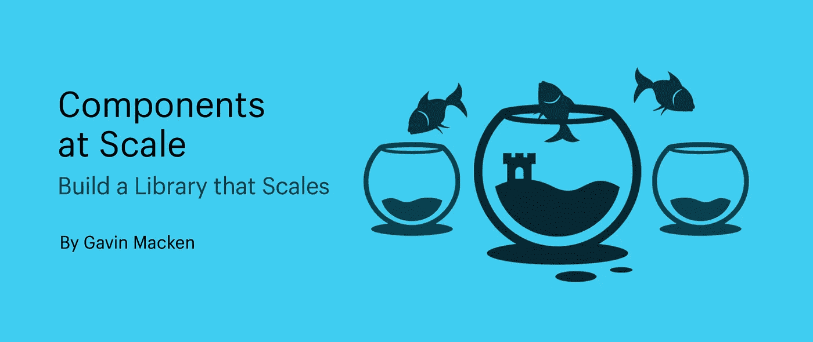

# 大规模组件:构建可扩展的库

> 原文：<https://medium.com/geekculture/components-at-scale-build-a-library-that-scales-20377a631963?source=collection_archive---------5----------------------->

## 随着您的成长，帮助您的团队保持健全的组件

所以你想建立一个组件库——很好！事实上，您已经签出了这一部分，这表明您正在一个可扩展的平台上工作。或者你刚刚雇佣了一些新的开发人员，并意识到你的代码库正在以比质量检查更快的速度分化…