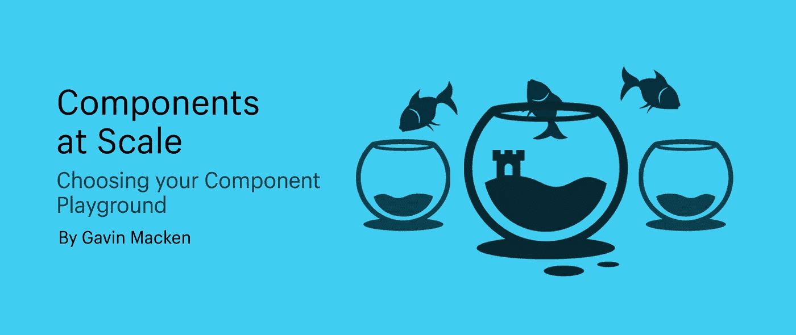

# 大规模组件:选择您的组件游乐场

> 原文：<https://medium.com/geekculture/components-at-scale-choosing-your-component-playground-68c126163236?source=collection_archive---------1----------------------->

## 哪个选项适合你？

你好。

此时，可以肯定地说，基于组件的设计和开发将会继续存在。孤立地设计和构建页面的日子已经一去不复返了。相反，我们正在构建组件集合，这些组件都遵循一个共享的设计系统，并且可以跨任何应用程序使用。