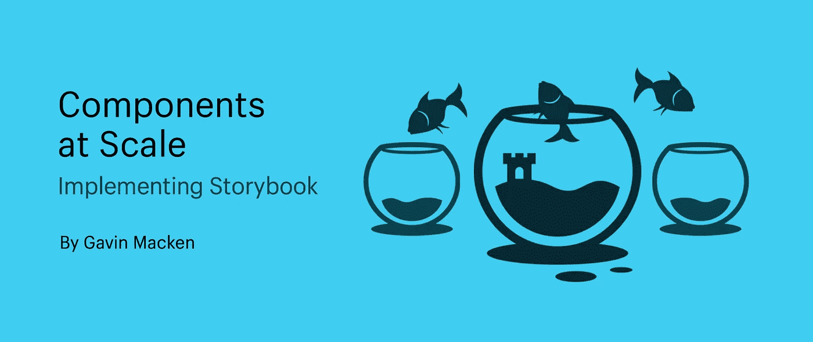

# 大规模组件:实现故事书

> 原文：<https://medium.com/geekculture/components-at-scale-implementing-storybook-4ec9b2378afd?source=collection_archive---------3----------------------->

## Storybook 是一个用户界面开发环境，是 UI 组件的游乐场。下面是如何使用它

Storybook 是一个用户界面开发环境。或者，更简单地说，它是 UI 组件的游乐场。该工具使开发人员能够在展示组件的同时独立创建组件…