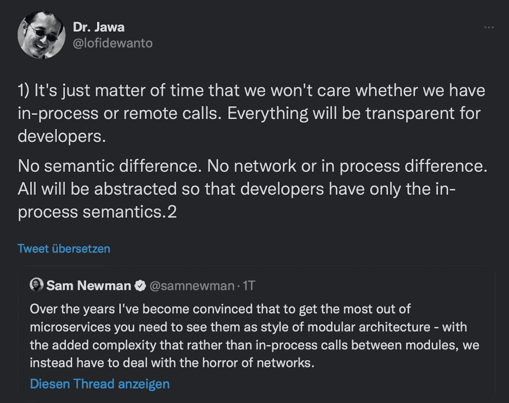

# 组件，组件，你在哪里…分发！

> 原文：<https://medium.com/geekculture/components-components-where-are-you-distributed-1776738dab8c?source=collection_archive---------12----------------------->

我写这篇短文是为了说明为什么我认为下面的观点会是我们的未来:

> “我们不会在意是进程内调用还是远程调用，这只是时间问题。对开发者来说，一切都将是透明的。没有语义差异。没有网络或进程间差异。所有这些都将被抽象，这样开发人员就只有进程内语义了”。

Twitter source: [Microservices with Horror of Networks](https://twitter.com/lofidewanto/status/1433165385994489868?s=21)