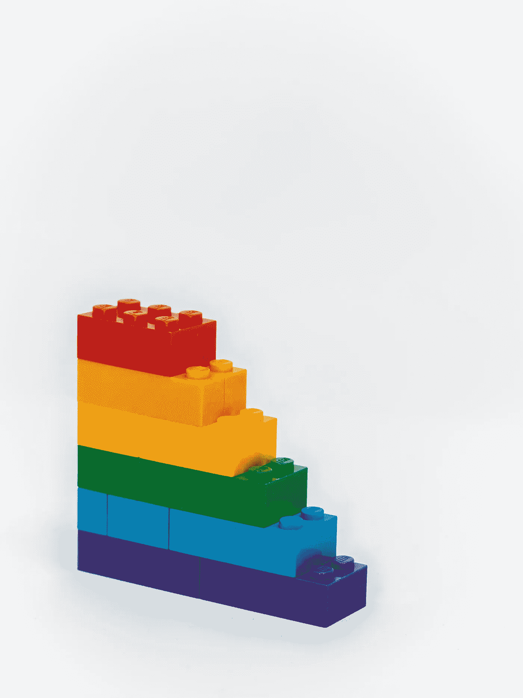
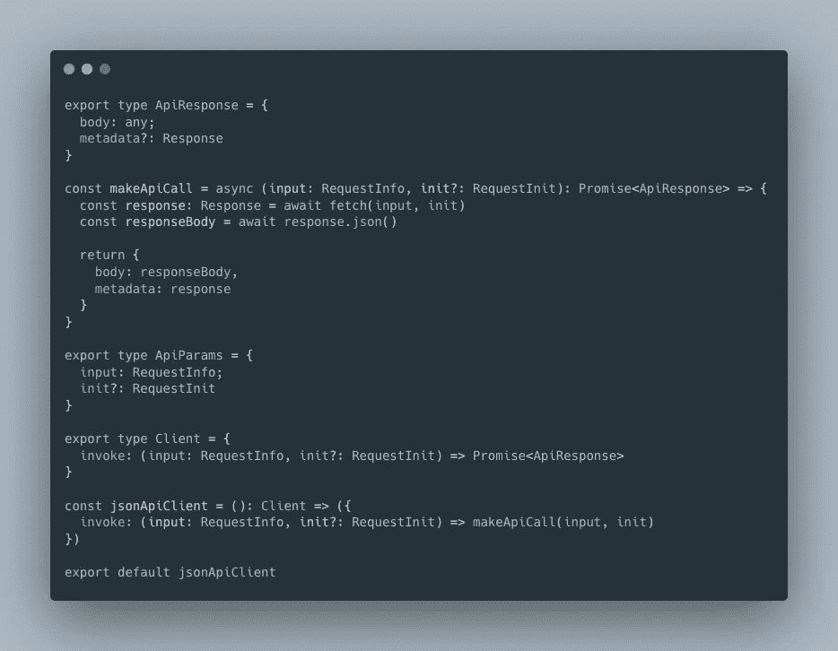
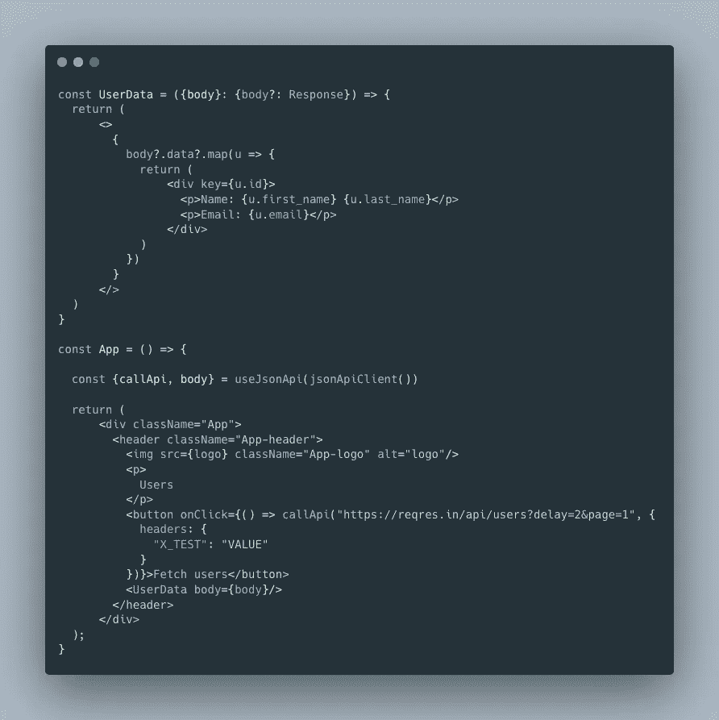
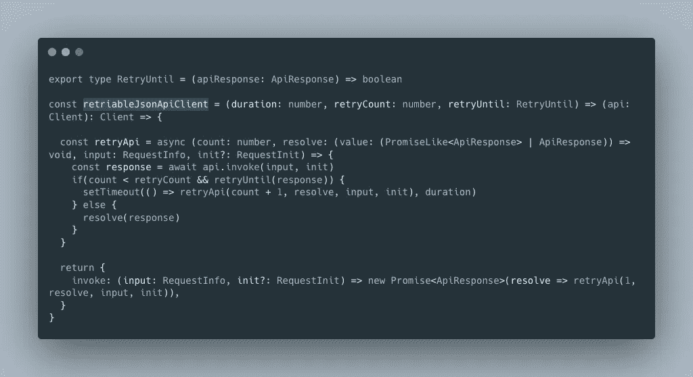
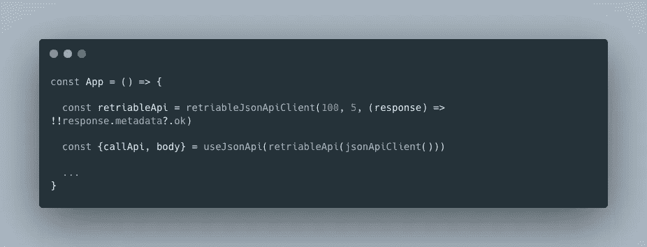
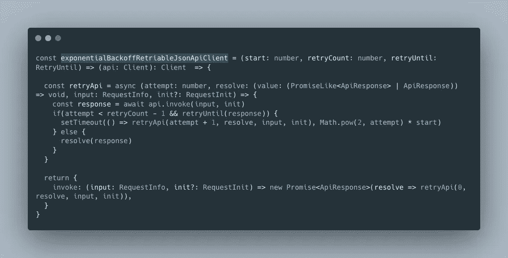
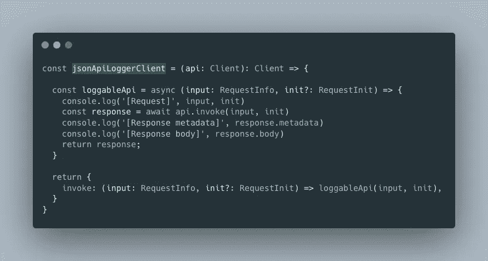
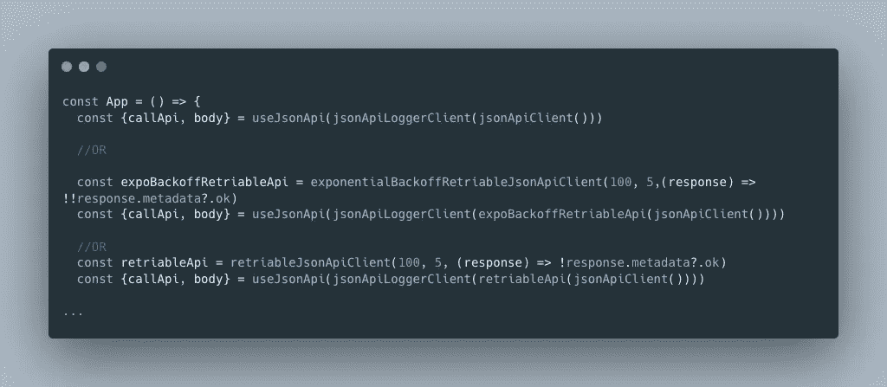

# react #take-1 中的可组合模式

> 原文：<https://medium.com/geekculture/composable-patterns-in-react-take-1-709b0b2bf53d?source=collection_archive---------7----------------------->

## 构建 react 应用程序的函数式方法。如何更好的进行 API 调用？

玩乐高对所有年龄范围和教育或社会背景的许多人都有吸引力。点击砖块形成更复杂的物体既不需要艺术天赋，也不需要技术知识。玩乐高最大的好处是，唯一限制你的是你自己的想象力。

那么乐高的核心口号是什么呢？

> 创造一些积木，然后一起玩。

这种模式在工业的其他领域非常适用。比如家具制造业。宜家制作模块化成套家具，并出售给顾客，同时附上手册，说明如何将基本单元组装成自己设计的套装。

> *有趣的事实:数学教授索伦·艾勒斯计算出有超过*[*9.15 亿种方式*](http://web.math.ku.dk/~eilers/lego.html) *来组合六块、八块乐高积木。*

1957 年，乐高积木的互锁原理诞生了，1958 年，双头螺栓连接系统获得专利，大大增加了积木的稳定性。这使它们变成了今天孩子们使用的乐高积木。

自从子程序出现在计算机编程的早期尝试中，开发人员就试图模块化他们的代码。如果我们能像乐高积木一样对待软件，我们就可以混合和匹配各种零碎的东西，通过简单地将它们的组件组装在一起，构建灵活的应用程序。然而，拥抱乐高哲学有一个主要问题。

我们没有像乐高那样的双头螺栓连接标准。我们希望我们的函数/类/程序足够通用，能够处理所有可能的场景。我们如何设计一个如此通用的程序，以至于它可以被任何其他程序使用。这似乎是一个不可能完成的任务，不是吗？

作为软件工匠，我们有自己的设计哲学。

> S.O.L.I.D 是软件工程中使用的首字母缩写词，描述了一套面向对象设计的原则。当系统使用这些原则实现时，代码库是可理解的、可重用的、可测试的、可维护的和灵活的。这个概念源于罗伯特·c·马丁。从那时起，它就被软件工程师所采用和使用。
> 
> *不要重复自己(干)——当然，最容易理解的软件原理，但不是一切都那么明显*

我相信以上两者的结合就是真理的蟾蜍。

让我们看看这是否真的可能

> u***ser Story:****假设我有一个* `*Fetch*` *按钮，在页面上，当我点击* `*Fetch*` *时，用户从一个 api 得到的信息应该会显示在下面的一个表格中*

听起来相当直接。让我们通过在开始时选择一些框架/包来启动这个应用程序。我将使用 [create-react-app](https://reactjs.org/docs/create-a-new-react-app.html) 进行搭建，使用 [fetch](https://www.npmjs.com/package/node-fetch) 进行 api 调用。我将在[https://reqres.in/](https://reqres.in/)消费一个[模拟用户 api](https://reqres.in/api/users?delay=2&page=1)

现在，如果我们看看用户故事，有 3 个我们必须构建的特定元素

*   创建一个客户端来进行 http 调用。
*   因为这是一个 react 应用程序，所以将 api 响应存储在一个状态中。这将触发一个呈现周期，导致 UI 组件重新呈现。
*   创建一个有按钮`Fetch`的 UI 组件。将 UI 组件与上面的 2 个一键集成。

> *客户端*

代码基本上是不言自明的。我们有一个客户端抽象，它有一个`invoke`方法。在幕后，`invoke`方法使用`fetch`进行 http 调用，并将响应转换成 json 返回给调用者

> *钩子*

对于呈现数据的 react 组件，响应必须存储在一个状态中，这将触发呈现周期。因此，让我们构建一个钩子来消费我们的客户端`useJsonApi`消费一个客户端，进行 api 调用，并将响应和元数据存储在 state 中；简单的柠檬榨汁机。

> *应用程序*

这将在屏幕上呈现一个按钮，单击该按钮将从 api 获取用户信息，并在 div 标签中呈现结果。仔细看看这两个函数是如何组成的。到目前为止，实现非常简单，但是请耐心等待..这会变得非常有趣

> 使改变变得容易的一个基本策略是模块化软件设计——马丁·福勒

> ***假设:*** *用户是由其他流程异步创建的。因此，当操作仍在进行时，api 可能会返回一个* `*404*` *。* ***用户故事:*** *假设有一个用户存在，当我点击* `*Fetch*` *时，用户应该如下表所示。*
> 
> *客户端*

因为我们不想因为这个设计选择而妨碍我们的用户体验，所以轮询是最简单的客户端实现。仔细看`retriableJsonApiClient`的签名。它接受可重试的参数和一个`Client`，并返回一个`Client`。在引擎盖下，我们将`invoke`方法包装成一个可重试的块。它现在将等待，直到重试次数用完或重试条件返回 false。一旦做到这一点，它将解决的承诺。

这是我们消费它的方式

我们已经创建了一个延迟 100 毫秒的`retriableApi`，重复 5 次，直到我们得到一个`200 ok`响应。然后将`jsonApiClient`包装在`retriableApi`中，再传递给`useJsonApi`

刚刚发生了什么？我们在不改变其源代码的情况下向客户端添加了更多的功能。这些函数现在是可组合的。

虽然这不是一个用户故事，但是一个更好的重试实现可能是带有[指数后退](https://en.wikipedia.org/wiki/Exponential_backoff)的

这就是我们消费它的方式

这是记录请求和响应的客户端的另一个实现

这就是我们消费它的方式

深呼吸，想想我们已经取得的成就。我们想出了不同风格的`json-api-client`，而没有像`generic-json-api-client`一样致力于单一的实现。同样，客户的消费者，在这种情况下`App`可以组成不同的实现，只要它们符合契约并创建不同的抽象。

我们一开始谈到的乐高咒语是什么？

> 创造一些积木，然后一起玩。

快乐的日子。因此，我们看到了如何组合 json-api-client 的不同实现。接下来，我们将探索如何组合钩子的不同实现。敬请期待 [#take-2](/geekculture/composable-patterns-in-react-take-2-6116b5505f2b)