# react #take-2 中的可组合模式

> 原文：<https://medium.com/geekculture/composable-patterns-in-react-take-2-6116b5505f2b?source=collection_archive---------15----------------------->

## 构建 react 应用程序的函数式方法。如何更好的进行 API 调用？这里有 [#take-1](/geekculture/composable-patterns-in-react-take-1-709b0b2bf53d) 如果你错过了。

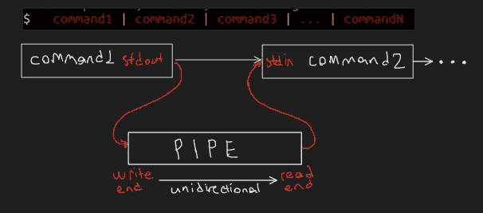

Unix pipes

由 Ken Thompson 创立的 Unix 哲学强调构建简单、简短、清晰、模块化和可扩展的代码，这些代码可以由开发者而非其创造者轻松维护和重用。Unix 哲学支持可组合性，而不是整体设计

所以道格拉斯·麦克罗伊提出 Unix 管道的建议也就不足为奇了。他像数学家一样思考。我相信这就是函数式编程的诞生(*不要引用我的话*)。FP 的核心构建块一直是构图。现在`grep, awk and ps`都是只做一件事的小程序。然而，由于每个程序在 Unix 中的设计方式，它们可以被组合来创建更复杂的程序。请看下面的片段。

```
List the process IDs (PIDs) for all systemd-related processesps -ef | grep systemd | awk '{ print $2 }'
```

它创建了一个从`ps -ef`开始的管道，将输出传递给`grep systemd`以找到所有 systemd 进程，最后是打印结果表的第二列的`awk '{ print $2 }'`。

在 [#take-1](/geekculture/composable-patterns-in-react-take-1-709b0b2bf53d) 中，我们探索了不同风味的`json-api-client`。现在让我们更进一步

> ***用户故事:*** *假设我在主页上，当页面加载时，来自 api 的用户应该显示在下面的表格中*

现在我们已经有了一个`json-api-client`。我们也有一个`useJsonApi`钩子，可以在状态中加载数据，导致页面重新呈现。总结一下我们所拥有的。

> jsonApiClient


jsonApiClient

> *使用 JsonApi*


useJsonApi

我们能在这两个街区的基础上。是的，我们可以:)废话不多说

> *使用 JsonApiOnLoad*


useJsonApiOnLoad

如果你熟悉 react，我们需要做的就是在`useEfffect`里面包装东西。这正是我们所做的。`useJsonApiOnLoad`钩子接受任何遵守`UseJsonApi`契约的钩子。在引擎盖下，我们需要记忆 api。这对于依赖引用相等来防止不必要的渲染的子组件很有用(例如 shouldComponentUpdate)。一旦我们有了记忆化的 api，我们就把它包装在`useEffect`中。容易的事...

*注意:不要太担心* `*ApiResponse & Omit<T, keyof UseJsonApi>*` *。我们稍后会谈到这一点。*

> *应用程序*

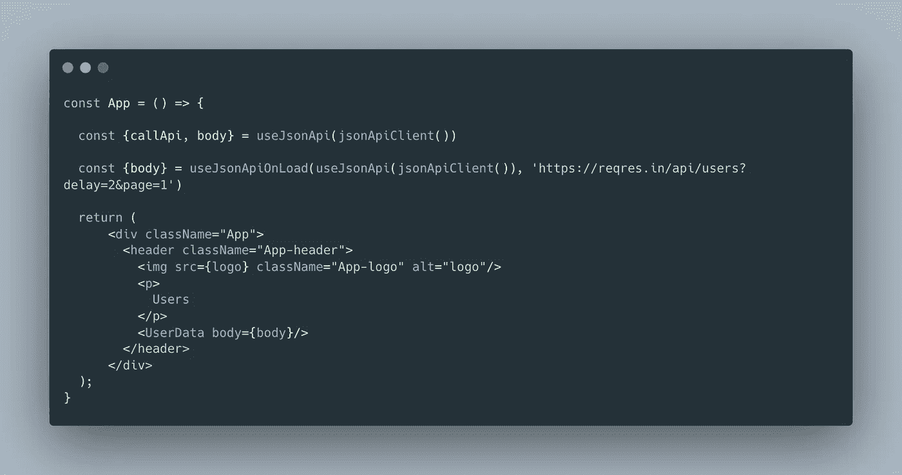

The App

还有更多

> ***假设:*** *用户是由其他某个流程异步创建的。因此，当操作仍在进行时，api 可能会返回一个* `*404*` *。* ***用户故事:*** *假设我在主页上，当页面加载时，来自一个 api 的用户应该如下表所示。*

我们可以重用之前看到的所有`json-api-client`风格。

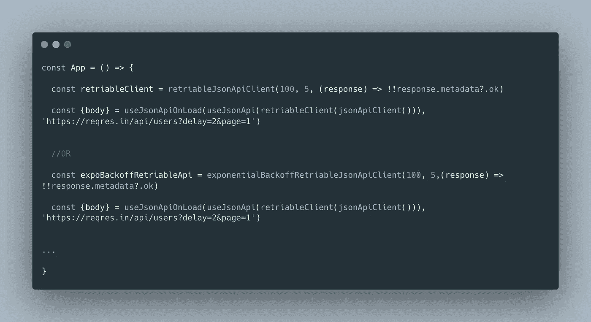

The App

> ***假设:*** *我们有一些机制来获取进行 api 调用的访问令牌。* ***用户故事:*** *假设我是主页上的授权用户，当页面加载时，来自 api 的用户应该显示在下表中。*

我们已经有了处理在状态中存储 api 响应的`useJsonApi`钩子。我们还有`useJsonApiOnLoad`在页面加载时进行 api 调用。我们所需要的只是在进行 api 调用时添加授权头的缺失部分。让我们创造缺失的部分

> *useAuthorisedJsonApi*

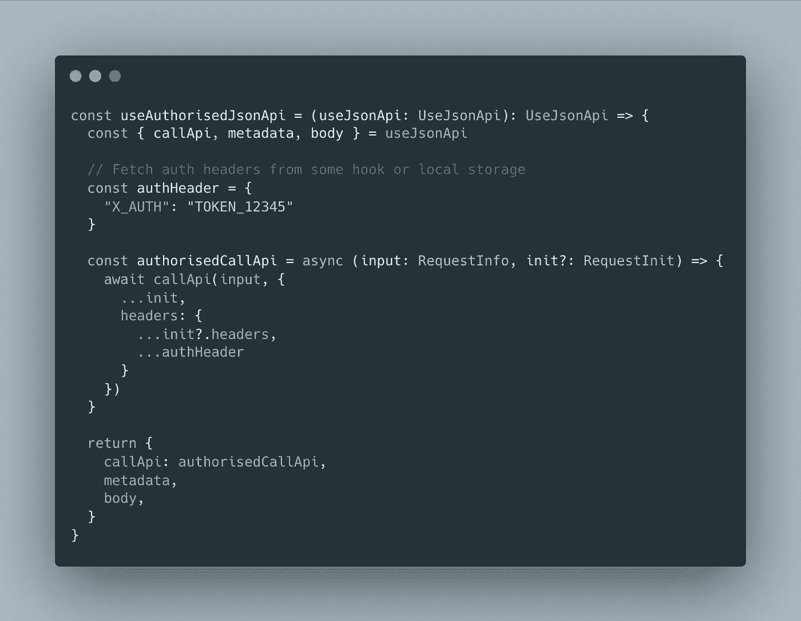

*useAuthorisedJsonApi*

我们在钩子内部所做的就是使用 accepting `UseJsonApi`有效载荷和 override`callApi`实现来添加授权头。可以使用任何机制获取这些 auth 头

现在越来越有趣了。让我们来看看我们是如何连接东西的

> *App*

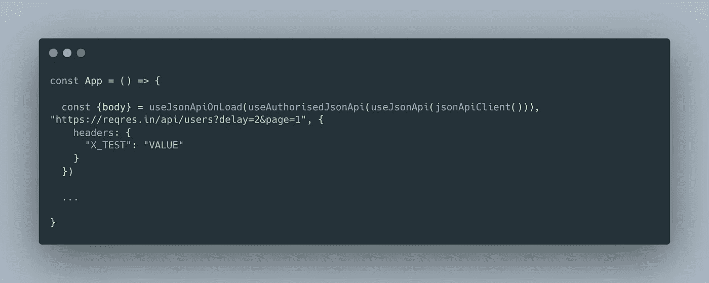

The App

如果我们想在点击按钮而不是加载页面时进行授权的 api 调用，我们所要做的就是编写我们想要的东西。只是当点击按钮调用`callApi`时，标题将被传递。

> *App*

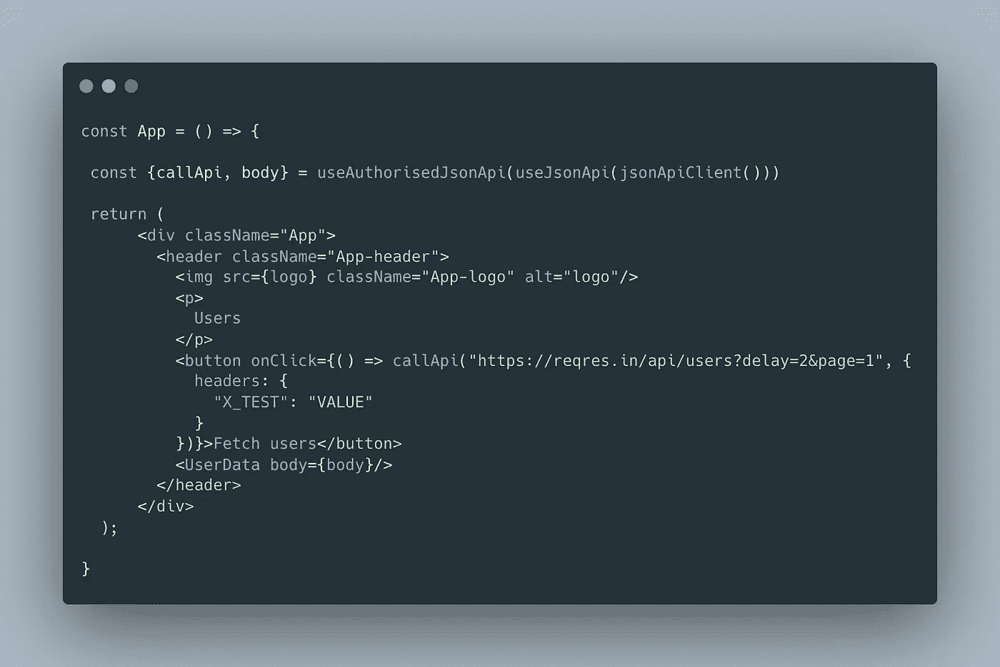

The App

同样，我们可以在引擎盖下使用任何口味的`jsonApiClient`

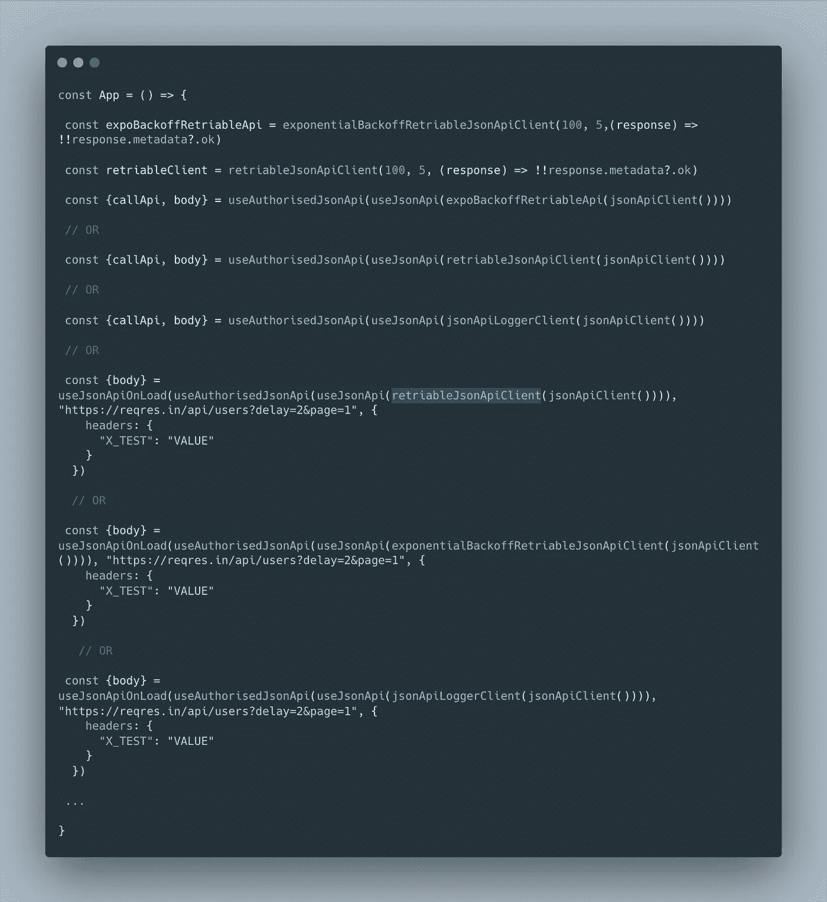

The App

但是这一切怎么可能。还记得这个吗？

> ***注:*** *不要太在意* `*ApiResponse & Omit<T, keyof UseJsonApi>*` *。我们稍后会谈到这一点。*

现在再看一下`useJsonApiOnLoad`的代码


useJsonApiOnLoad

对于我们的契约，我们不仅仅依赖于`UseJsonApi`契约，而是依赖于任何扩展`UseJsonApi`的规范。这允许我们接受传入的任何其他数据，并在响应中将其传递回调用者。我们还通过声明响应将包含`ApiResponse`和除核心契约之外`UseJsonApi`上的任何额外内容，使其类型安全:)

我们不会就此止步。让事情变得更加有趣。

> ***用户故事:*** *假设我在主页上，当页面加载时，我想显示一个加载指示器，直到从 api 获取时间数据。*

我们已经有了核心构件..即… `jsonApiClient`、`useJsonApi`和`useJsonApiOnLoad`。我们所需要的就是有人来维持一个`loading`状态。然后想办法把它们缝合在一起。没有再费周折...

> *使用水杨酸盐*

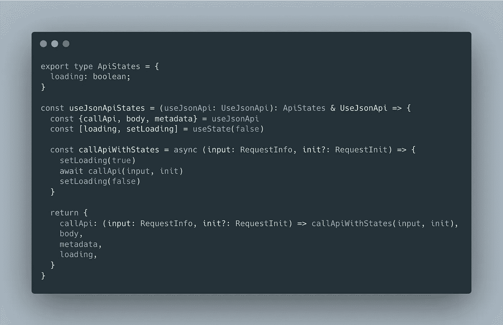

useJsonApiStates

同样，代码非常简单。我们还是依靠核心`UseJsonApi`契约。我们所做的就是在本地维护一个`loading`状态，并在 api 调用前后打开和关闭它。就是这样。

*注意:这也很容易扩展到错误状态。我会让你去想象。*

到目前为止，我们还没有为 react 组件创建任何抽象。让我们利用这个机会介绍一个

> *暂停加载*

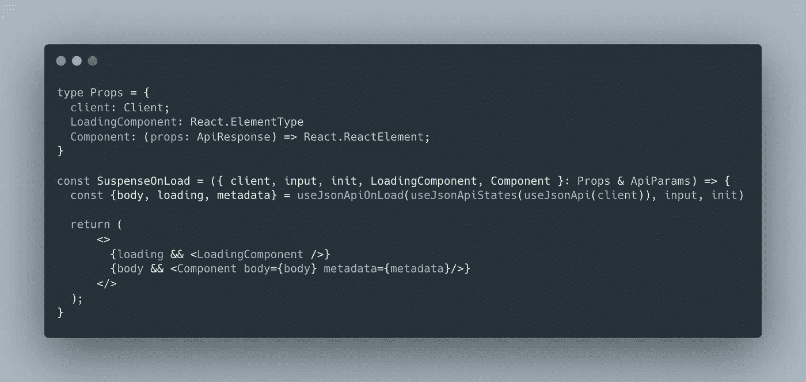

SuspenseOnLoad

一旦我们缝合了所需的钩子，我们所做的就是订阅`loading`状态。如果正在加载，显示加载组件。当数据存在时，显示数据:d .我有目的地将客户机作为输入参数。这允许我们传递客户的任何味道。此外，绝对没有什么可以阻止我们加入`useAuthorisedJsonApi`的组合。

> *应用程序*

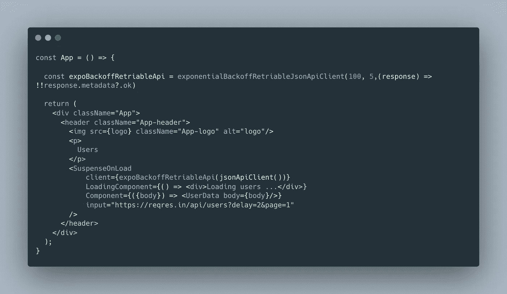

The App

为了了结这件事。

> ***用户故事:*** *假设我有一个按钮* `*Fetch*` *，在页面上，当我点击* `*Fetch*` *时，我应该会看到一个加载微调器，然后从 api 获取数据。*

我们可以从`SuspenseOnLoad`那里获得所有我们需要的灵感

> *暂停触发*

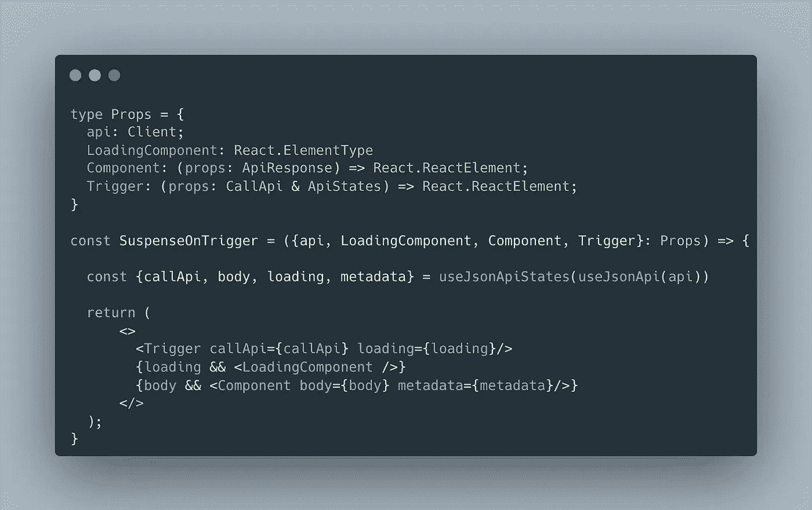

SuspenseOnTrigger

因为我们不依赖于页面加载事件，所以我们需要一个触发器组件来为我们启动。除此之外，代码应该是自我解释的。

> *应用程序*

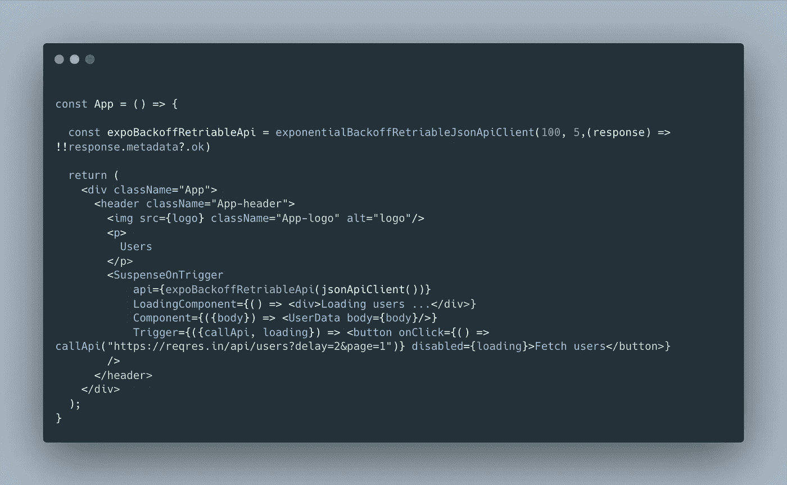

The App

这是一个总结。这本质上是组合的力量。它使我们能够通过组合现有的抽象来动态地创建新的抽象。构图的概念一直是我所钟爱的。希望你们觉得有用。干杯。