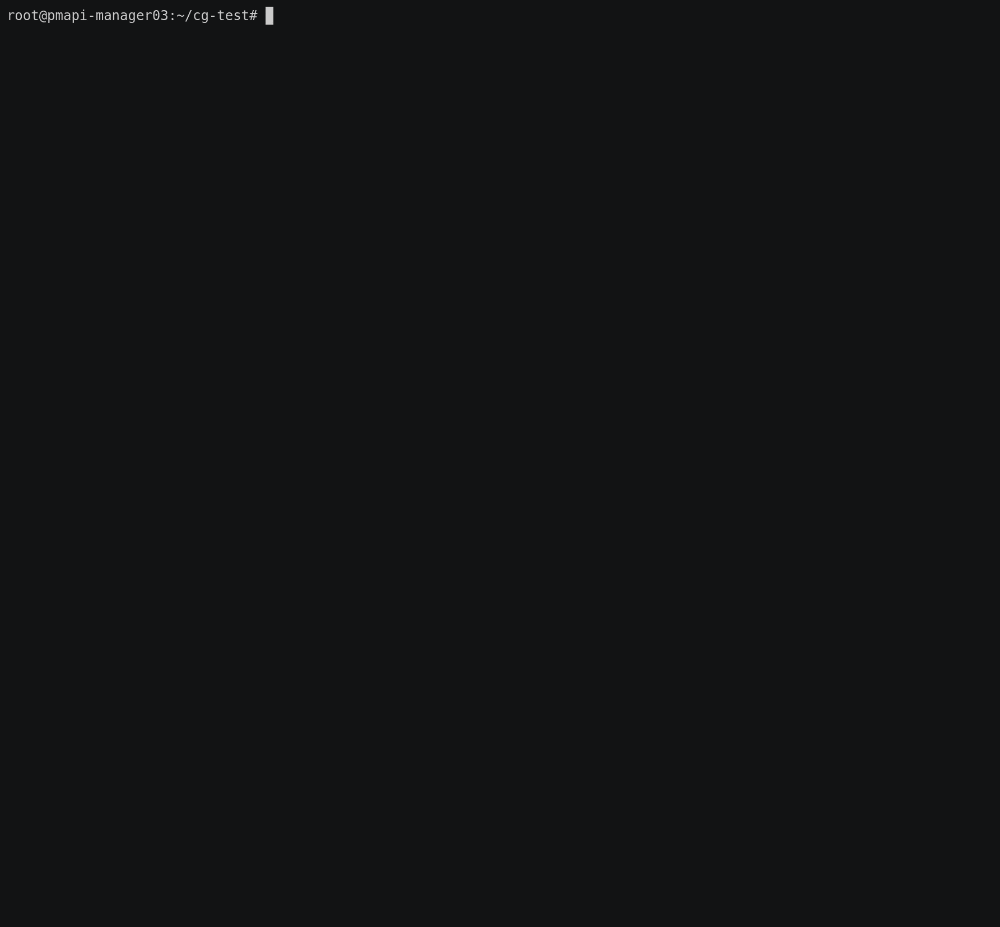
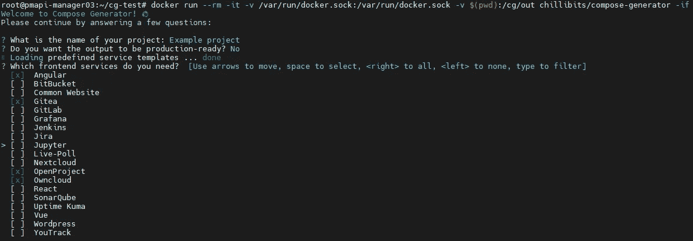
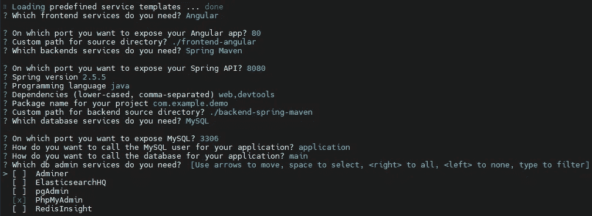

# 撰写生成器—在几秒钟内部署您的应用

> 原文：<https://medium.com/geekculture/compose-generator-d4356d38922d?source=collection_archive---------5----------------------->


Photo by [Dominik Lückmann](https://unsplash.com/@exdigy?utm_source=medium&utm_medium=referral) on [Unsplash](https://unsplash.com?utm_source=medium&utm_medium=referral)

使用 Docker 和 Kubernetes 进行应用程序部署比以往任何时候都更容易，但它是否会更快、更无缝呢？这就是 Compose Generator 发挥作用的地方，它通过命令行界面帮助您完成常见的 Docker 任务。


Compose Generator logo

# 部署项目

使用合成生成器，您只需执行以下四个步骤:

*   安装合成发生器(如下说明)
*   从 VCS 克隆项目的存储库
*   运行`compose-generator install`安装 Docker 和 Docker Compose(如果已经安装了 Docker 和 Docker Compose，可以跳过)
*   运行`compose-generator -r`来生成您的部署配置，并随后运行它



让我们更深入地研究一下 Compose Generator，以便更好地指出它的各种优点以及为什么应该考虑使用它。

# 生成 Docker 撰写配置

Compose Generator 可以被看作是一个部署助手，它的作用就像是 Docker 安装的包装器。如上所述，Compose Generator 可用于在您的系统上安装 Docker 和 Docker Compose，因此您只需首先关心安装 Compose Generator。Compose Generator 的主要特性是——顾名思义——为您的项目生成 Docker 合成配置。此外，合成生成器可以生成秘密(例如，数据库凭证等。)，管理卷、网络、环境变量等等。

在下面的例子中，我们将部署一个基本的 Angular 应用程序，连接到一个 Spring Boot API 和一个 MySQL 数据库。Compose Generator 支持各种各样的服务模板(趋势增长)，您可以在这里找到列出的。

# 示例堆栈部署

但是，建议在您的主机系统上安装 Compose Generator，如这里的[所述](https://www.compose-generator.com/install/linux)，对于本初学者指南，您也可以通过执行以下命令将其作为 Docker 容器运行:

```
$ docker run --rm -it -v /var/run/docker.sock:/var/run/docker.sock 
     -v $(pwd):/cg/out chillibits/compose-generator
```

Docker 提取图像并在交互模式下运行它。`$(pwd)`占位符代表 Docker 主机系统上的当前路径，并被映射到容器中的`/cg/out`目录。这意味着，产生的输出文件，如`docker-compose.yml`将会位于您执行上面命令的目录中。



The running Docker container looks like this 🠕

Compose Generator 会询问您项目的名称，以及您是否希望创建一个生产就绪的配置而不是默认的开发配置，以便将您的服务隐藏在反向代理之后。Compose Generator 提供了各种预定义的服务模板，您可以像在构建块系统中一样根据自己的需要来安排这些模板。对于我们的例子，我们将在前端部分选择`Angular`，在后端部分选择`Spring with Maven`，在数据库部分选择`MySQL`。对于您从模板列表中选择的每个项目，合成生成器会询问您特定于服务的问题，这些问题对于设置它们很重要。回答完`MySQL`的所有问题后，您可以看到，Compose 生成器预先选择了 PhpMyAdmin，因为它是 MySQL 的默认 db 管理系统。您可以取消选择它或按 enter 键继续。



PhpMyAdmin is preselected because we chose MySQL as database

> 提示:您可以在高级模式下执行`compose-generator -a`来启动合成生成器 Cli。然后，您还会收到关于高级堆栈定制的问题。点击查看生成子命令[的 cli 选项的更多信息。](https://www.compose-generator.com/usage/generate/#options)

回答完所有问题后，Compose Generator 将在调用它的目录中生成以下文件结构:

```
current directory
├─volumes
│ ├─volume1
│ ├─volume2
│ ├─volume3
│ └─...
├─.gitignore
├─.cg.yml
├─docker-compose.yml
└─environment.env
```

`docker-compose.yml`文件包含您的 Docker 编写配置。如果你的容器需要任何秘密，它们被存储在`environment.env`文件中，该文件将在运行时附加到所有相关的容器上。如上所述，Compose Generator 还会为您创建卷目录。根据您选择的堆栈模板，卷目录中已经有文件(如配置文件等。)尽可能减轻你的负担。
根目录中的`.gitignore`文件包含`environment.env`文件，以避免意外向 VCS 提交任何机密。
`.cg.yml`是 Compose Generator 本身的一个配置文件，用来记忆你的一些选择。

# 从配置中删除服务

想象一下，您已经生成了一个包含`Angular`、`Spring with Maven`、`MySQL`和`PhpMyAdmin`的堆栈，但是您想切换到`MongoDB`，因为您必须在 Spring 应用程序中处理更多类似文档的数据结构。
您可以做的是要求 Compose Generator 删除服务`MySQL`和`PhpMyAdmin`并添加`MongoDB`来代替。

要删除前两个，您可以在您的配置的`docker-compose.yml`文件所在的目录中执行以下命令:

```
$ compose-generator remove
```

选择两个服务`MySQL`和`PhpMyAdmin`并按下输入键。Compose Generator 将从您的合成配置中删除这些服务，而不会留下任何残留物，例如未使用的卷、网络等。

# 向配置中添加服务

现在为`MongoDB`添加服务，您可以执行以下命令:

```
$ compose-generator add mongodb
```

回答完所有问题后，`docker-compose.yml`文件现在应该包含一个服务`database-mongodb`，服务`database-mysql`和`db-admin-phpmyadmin`应该消失了。

# 关于合成生成器的进一步阅读

Compose Generator 背后的关键概念是，它是持久的和可扩展的。因此，可以创建自己的预定义服务模板，并将它们添加到可选服务列表中。如果你这样做了，请随意在 GitHub 上提交它作为社区贡献！

关于创建预定义服务模板和所有可用 cli 子命令的深入信息，将会有更多后续文章！

感谢您的关注和阅读本文。
如果你想了解更多关于 Compose Generator 的知识，请访问[www.compose-generator.com](https://www.compose-generator.com)的官方文档和[GitHub](http://github.com/compose-generator/compose-generator)上的开源项目。