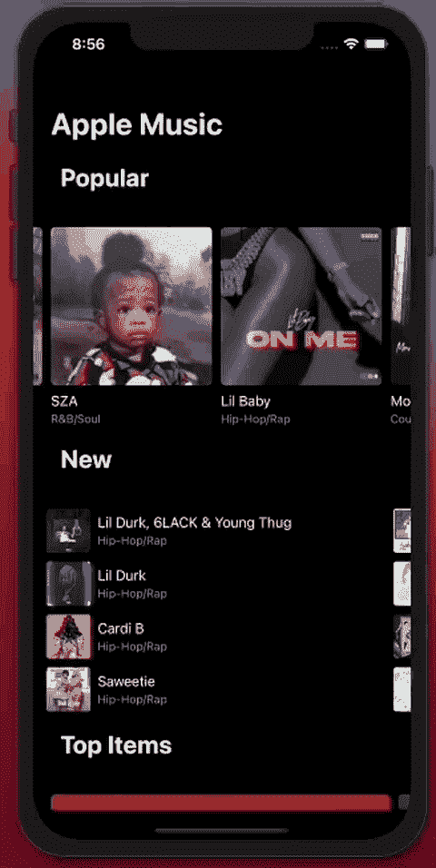

# 合成 SwiftUI 列表

> 原文：<https://medium.com/geekculture/compositional-swiftui-list-266bff7844af?source=collection_archive---------3----------------------->


Photo by [Mika Baumeister](https://unsplash.com/@mbaumi?utm_source=medium&utm_medium=referral) on [Unsplash](https://unsplash.com?utm_source=medium&utm_medium=referral)

在这篇文章中，我想和你分享一个如何在你的项目中混合使用`UIKit`和`SwiftUI`的例子。为此，我创建了一个名为`CompositionalList.` 🧩的小图书馆

[组合列表](https://github.com/jamesrochabrun/CompositionalList)是由`UIKit DiffableDataSource`和`Compositional Layout`驱动的 SwiftUI `UIViewControllerRepresentable`包装器。🥸
它是可定制的和灵活的，支持多部分、单元格选择，并且可以使用`UIHostingController`在`UIKit`中使用或者在`SwiftUI`应用中使用。

可以在`Xcode: Click File`->-`Swift Packages`->-`Add Package Dependency`中直接将其作为 swift 包添加到您的项目中，并添加此 [URL。](https://github.com/jamesrochabrun/CompositionalList)

对于这个例子，我们将使用 [RSS Itunes 提要生成器](https://rss.itunes.apple.com/en-us)来显示苹果音乐提要，如下所示…



[https://github.com/jamesrochabrun/CompositionalList/tree/main/Example/CompositionalListExample](https://github.com/jamesrochabrun/CompositionalList/tree/main/Example/CompositionalListExample)

Itunes Feed API 很棒，但遗憾的是它不返回分段数据，所以为了这个例子的目的，我不得不将结果分块。所有的块代码、网络层、[自定义组合布局](https://github.com/jamesrochabrun/CompositionalList/blob/main/Example/CompositionalListExample/CompositionalListExample/Helpers/CustomLayout.swift)和发布结果的`ObservableObject`模型都可以在[这里](https://github.com/jamesrochabrun/CompositionalList/tree/main/Example/CompositionalListExample)找到。

我们将只关注如何在我们的`CompositionalList`中显示结果…

Apple Music Feed in a Compositional List.

让我们一步一步来…

> *别忘了* `*import CompositionalList*` *😬*

1.  定制每行的项目，这个闭包提供了一个`model`和一个`indexpath`，并期望一个`View`作为返回值。在这里，您可以为每个部分返回不同的`SwiftUI`视图。如果您使用类似于`Switch`的条件语句，在这种情况下，您必须使用`Group`作为返回值。例如，在这种情况下，编译器会将其推断为返回值:

```
Group<_ConditionalContent<_ConditionalContent<TileInfo, ListItem>, ArtWork>>
```

2.定制每个部分的页眉或页脚，这个闭包提供了部分标识符、相应部分的索引路径以及可以是`UICollectionView.elementKindSectionHeader`或`UICollectionView.elementKindSectionFooter`的`kind`(这将由您的布局定义)。它期望一个`View`作为返回值，你可以根据节或者是页眉还是页脚来定制你的返回值。与第 1 点相同，如果使用了条件语句，请确保将其放在`Group`中。

为页眉或页脚返回的`SwiftUI`视图将动态调整其内容，您可以从`Text`甚至一个全新的水平列表中返回！

实现这个闭包是**必需的**即使你没有在布局中定义页眉或页脚，你仍然需要返回一个`View.`在这种情况下，你可以返回一个高度为 0 的`Spacer`。(现在正在寻找更好的解决方案🤷🏽‍♂️).

3.`SelectionProvider`内部使用`UICollectionViewDelegate`单元格 did select 方法提供选中项的闭包，实现这个闭包是**可选的**。

4.`customLayout`环境对象，这里可以返回任何一种布局，只要是`UICollectionViewLayout`。这个库还包含一些定义好的`NSCollectionLayouSection`扩展方法，你可以用它们来组成你的布局，`.composed()`的定义可以在这里找到[。](https://github.com/jamesrochabrun/CompositionalList/blob/main/Example/CompositionalListExample/CompositionalListExample/Helpers/CustomLayout.swift)

5.让我百思不得其解的是，我们需要使用一个条件语句来验证数组不是空的，这样才能工作。*然而*，*这对于这种情况很方便，因为我们可以在这里处理加载或错误状态*。😬

就是这样，将`UIKit`工具与`SwiftUI`混合在一起得到了很好的支持，让你可以解除目前在`SwiftUI`框架中可以找到的某些限制。

完整的回购是可用的和开源的[这里](https://github.com/jamesrochabrun/CompositionalList)。