# 理解 Postgres 中用于全文搜索的 TSVECTOR 和 TSQUERY

> 原文：<https://medium.com/geekculture/comprehend-tsvector-and-tsquery-in-postgres-for-full-text-search-1fd4323409fc?source=collection_archive---------2----------------------->

# 简介:

全文搜索搜索与查询匹配的文档，并且可以根据记录与查询的相关性对记录进行排序。在全文搜索系统中，文档(如杂志文章、电子邮件或数据库表)充当搜索单元。最常见的搜索类型是按照与查询相似性的顺序返回包含查询词的所有文档。查询和相似性的概念非常灵活，并且根据应用程序的不同而不同。最基本的搜索将查询视为一组单词，并根据它们在文档中出现的频率进行比较。这是 Google、Firefox 等网络搜索引擎使用的一种技术。

文本搜索引擎必须能够解析文档并将词位(关键字)链接到父文档。然后，这些关联被用来查找包含查询词的文档。你可能听说过 SQL 数据库中的‘I like’和‘like’操作符，它们用于搜索文本。“like”和“ilike”运算符执行全文搜索分析任务的能力是有限的。

**问题与喜欢** **运算符:**

1.  like 运算符搜索精确单词，但不能搜索单词变体。例如，如果您在某个文档中搜索单词“produce”，而该文档中的一些记录只包含单词“producing”，则查询将不会返回这些记录。当搜索任何形式的单词时，必须为每个变体显式包含 like 子句，如果需要查找大量单词，这可能会很耗时。
2.  Like 运算符不会返回与查询条件匹配的文档的排名。例如，如果查询词在多个文档中出现不止一次，则查询词出现次数最多的文档比出现次数最少的文档更重要。like 运算符不提供多个文档之间的相对排名。
3.  like 操作符在处理大型文档时速度非常慢，导致性能低下。

当我们使用“ilike”操作符时，我们在“like”操作符上遇到的问题仍然存在。唯一的区别是‘I like’不区分大小写。

# PostgreSQL 中的全文搜索:tsvector 和 tsquery

PostgreSQL 提供了两种数据类型 tsvector 和 tsquery 来帮助进行全文搜索，因为“like”和“ilike”运算符在执行全文搜索分析任务的能力方面受到限制。TS 代表 tsvector 和 tsquery 中的文本搜索。tsvector 类型用于表示可搜索文本的文档，而 tsquery 类型用于表示文本查询格式的文本查询。在 Postgresql 中，两者都用于执行全文搜索。tsvector 是单个词位的有序集合，这些词位是标准化的词，包括同一词的多个变体。

我们将深入研究 to_tsvector()和 to_tsquery()函数，它们分别返回 tsvector 和 tsquery 数据类型。

在 Postgres 中，使用以下语法创建一个表，并向其中添加 4 条记录。这是代码:

```
**create table document_text(file_id int, content text, description text);****insert into document_text values**(1, 'The stock exchange predicts a bull market which would make many investors happy, but analysts warn of possibility of too much optimism and that in fact we are awaiting a bear market. As always predicting the future market is an uncertain game and all investors should follow their instincts and best practices.','Impact of bull market on investors'**);****insert into document_text values**(2, 'A bull market is one in which the market is rising and the economy is doing well, whereas a bear market is one in which the economy is collapsing and most equities are losing value. Although some investors are "bearish," the vast majority of investors are "bullish." Over lengthy time periods, the stock market has generally produced positive returns.','Market: positive and  negative sentiments'**);****insert into document_text values**(3, 'During a bear market, market sentiment is negative, and investors begin to shift their money away from stocks and into fixed-income instruments as they wait for the stock market to recover. To summarise, the drop in stock market values has shaken investor confidence. As a result, investors keep their money out of the market, causing a general price decrease as outflow grows.','Bull and bear market'**);****insert into document_text values(**4, ' the decrease in stock market values has shaken investor confidence, As they would have predicted that the market will fall more.  This causes investors to keep their money out of the market, causing a general price decrease as outflow grows. In bear market, value of stocks falls while in bull market the value of stocks falls. However the market has been producing the positive result over length periods.','Impact of price decrease in market'**);**
```

该表如下所示:

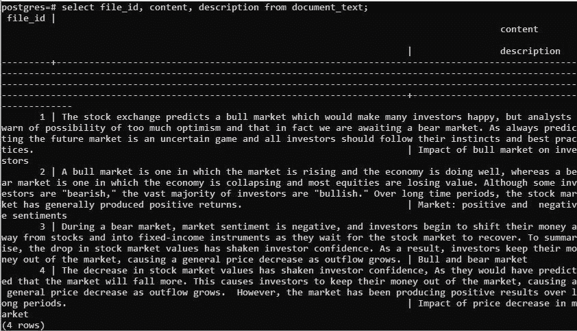

# 1.如何使用 to_tsvector()？

**to_tsvector()** 是 Postgres 的内部函数，返回作为参数传递的文本或文档的 tsvector，可用于执行高效的文本搜索。tsvector 是键-值对的有序集合，其中键代表词位，值代表词位的位置。词位是词的规范化表示。tsvector 中没有停用词，如“h as”、“in”或“as”，词位按字母顺序排序。

例如，在下面的查询中，置信度被转换为“confid”词位，位于位置 10。词位“市场”出现了两次，分别在位置 5 和 15，因此后面跟着两个数字。

**查询:**

```
select to_tsvector('The decline in stock market values has shaken investor confidence, as they expected the market to fall further.');
```

**输出:**

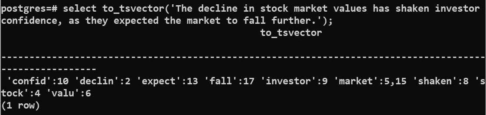

# 2.如何使用 to_tsquery()？

**to_tsquery()** 返回文本(或文档)中搜索模式的 tsquery。每个单词的规范化词位表示与单词本身略有不同；例如，信心已经被转化为“confid”词。在不使用 to_tsquery()函数的情况下搜索 confidence 将返回 false，因为 Postgres 在内部将单词“confidence”转换为 tsquery 数据类型，这将返回“confidence”，而 ts 向量中不存在“confidence”。

**查询 1:**

```
**select to_tsvector('The decline in stock market values has shaken investor confidence, as they expected the market to fall further.') @@ 'confidence';**
```

**输出 1:**

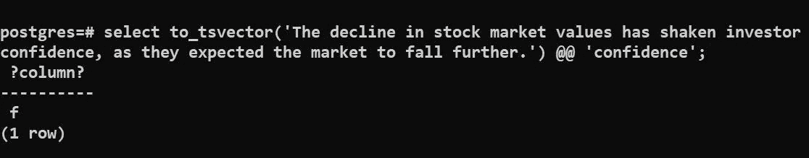

**tsquery typecast 与 to_tsquery()函数的区别:**

如以下查询所示，类型转换为 tsquery 数据类型不会在 Postgres 中产生准确的结果。当我们在单词 confidence 上使用 cast 操作符(::)时，我们得到单词“confidence”。相反，置信度的规范化表示“confid”由 to_tsquery()返回。如果 PostgreSQL 函数可用，您应该始终使用它们进行转换，而不是使用转换运算符。cast 运算符也会导致查询性能下降。

**查询 2:**

```
**select 'confidence'::tsquery, to_tsquery('confidence');**
```

**输出 2:**

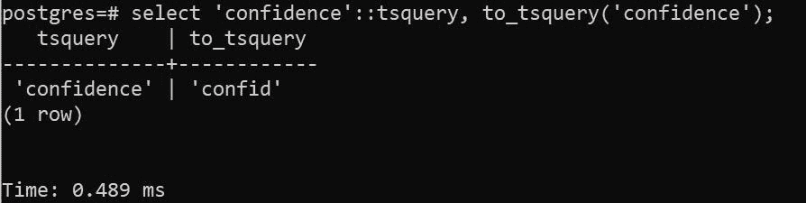

**如果我们在‘confidence’周围使用 to_tsquery()，那么它将返回 true。**

**查询三:**

```
**select to_tsvector('The decline in stock market values has shaken    investor confidence, as they expected the market to fall further.') @@ to_tsquery('confidence');**
```

**输出 3:**

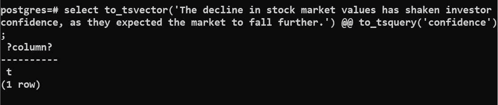

to_tsquery()可用于使用布尔运算符(如 and、or 和 not)对多个单词进行查询。我们将在上面创建的表 document_text 上逐个看到它们。

**2.1。带有 And( &)运算符的 to _ ts query:**

由' & '分隔的多个单词可以作为参数传递给 to_tsquery()函数，以匹配文档中的所有单词。下面的查询查找内容字段以任何形式和任何顺序包含所有单词“confidence”、“investors”和“prediction”的记录。返回 file_id 为 4 的记录，因为它包含查询中给出的所有三个词:confidence、investors 和 predicted。

**查询 4:**

```
select file_id, content from document_text where to_tsvector(content) @@ **to_tsquery('confidence & prediction & investors');**
```

**输出 4:**

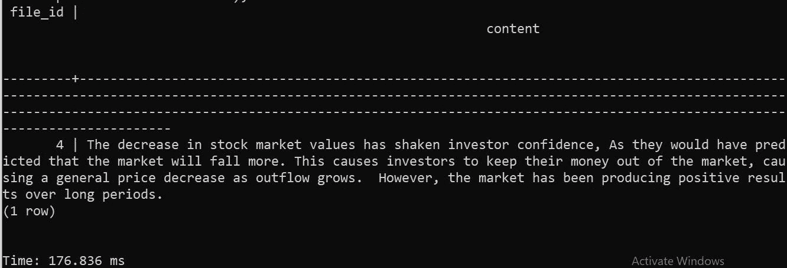

**2.2 用 Or(|)运算符的 to _ ts query:**

由**或运算符(' |')** 分隔的多个单词可以作为参数传递给 to_tsquery()函数，以匹配文档中的任何一个单词。以下搜索在内容字段中以任意顺序查找包含“negative”和/或“economy”的记录。文件 id 为 2 和 3 的记录满足指定的标准，因此出现在输出中。

**查询 5:**

```
select file_id, content from document_text where to_tsvector(content) @@ **to_tsquery('negative | economy');**
```

**输出 5:**

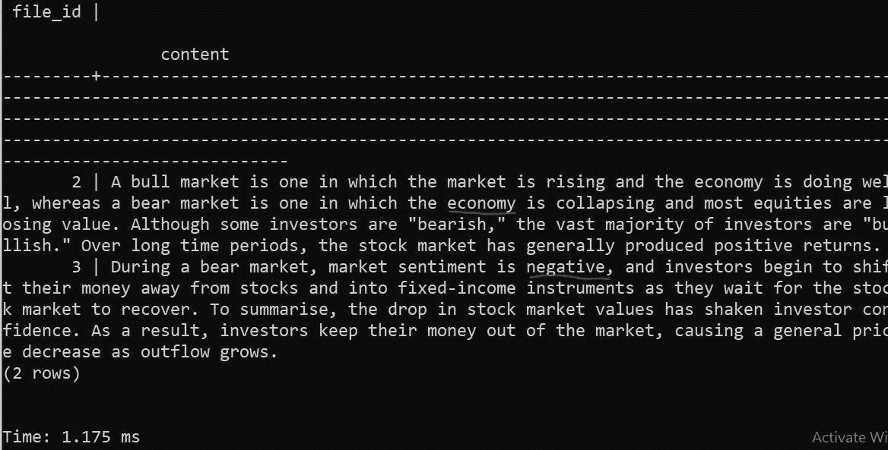

**2.3。to_tsquery() with Not(！)操作员:**

要查找不包含指定单词的记录，请使用 **NOT 运算符('！').** **不是(！)**是一元运算符，因此出现在单词之前。以下查询查找内容字段不以任何顺序包含单词“bear”的记录。只有文件 id 为 4 的记录不包含单词“bear ”,因此出现在输出中。

**查询 6:**

```
select file_id, content from document_text where to_tsvector(content) **@@ to_tsquery('!bear');**
```

**输出 6:**

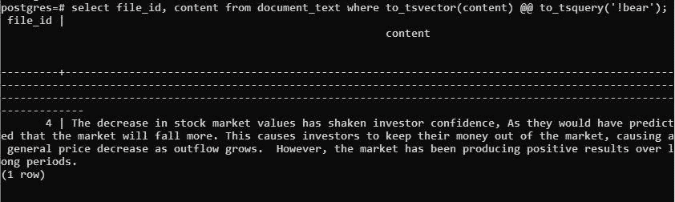

**2.4。** **to_tsquery()带有多个布尔运算符:**

大多数时候，我们都在寻找包含特定单词组合的记录，其中一些必须出现，而另一些不应该出现。这可以通过在单个 tsquery 中组合多个布尔运算符来实现。例如，要查找包含单词' predict '但不包含' bear '的记录，或者包含单词' instrument '的记录，我们可以通过' **(predict &！bear)| instrument'** 里面的 to_tsquery()函数。返回 file_id 为 3 和 4 的记录，因为单词“instrument”出现在 file_id 为 3 的记录中，单词“predict”而不是“bear”出现在 file_id 为 4 的记录中。

**查询 7:**

```
select file_id, content from document_text where to_tsvector(content) @@ **to_tsquery('(!bear & predict)| instruments');**
```

**输出 7:**

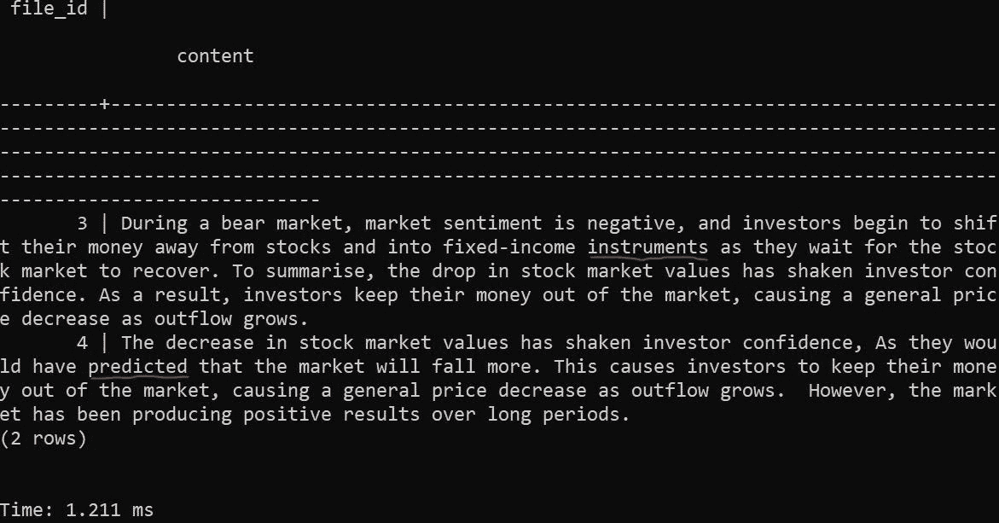

# 优化快速文本搜索:

大型数据集的全文搜索速度较慢。为了提高全文搜索的性能，Postgres 提供了在 tsvector 字段上建立索引的选项，这样可以更快地执行查询。您可以在表格上创建索引，以加快和优化对较大文档的文本搜索。GIN 是最常用的全文搜索索引。Postgres 文档建议了两种方法:一种是直接在索引中创建 to_tsvector()字段，另一种是首先使用 to_tsvector()在表中创建另一个 tsvector 列，然后在这个字段上创建一个 gin 索引。

我们将遵循第二种方法来创建索引。我们还可以使用 concatenate 操作符在 to_tsvector()中指定多个列。在创建 GIN 索引之前，我们将修改该表，在名为 tsvector_content_desc 的字段内容和描述中包含一个 tsvector 字段。我们对内容和描述使用了 coalesce()函数，如果包含空值，就用空字符串替换它们。

添加列的查询:

```
**alter table document_text 
       add column tsvector_content_desc  tsvector 
       GENERATED ALWAYS AS (to_tsvector('english', coalesce(content, '') || ' ' || coalesce(description, ''))) 
       STORED;**
```

**输出:**

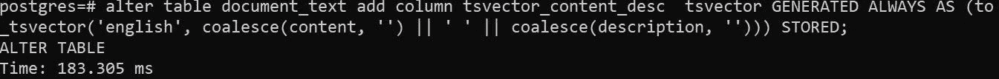

**查询创建索引:**

```
**CREATE INDEX textsearch_idx ON document_text USING GIN (tsvector_content_desc);**
```

**输出:**

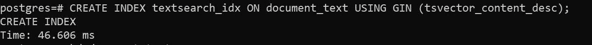

现在，我们可以使用 tsvector_content_desc 字段在以下查询中执行文本搜索。您可以注意到这个查询消耗的时间是 0.88 ms，这比上面其他不使用索引的查询执行时间要低得多。

**查询:**

```
**select file_id, content 
       from document_text 
       where tsvector_content_desc @@ 
                     to_tsquery('(!bear & predict)| instruments');**
```

**输出:**

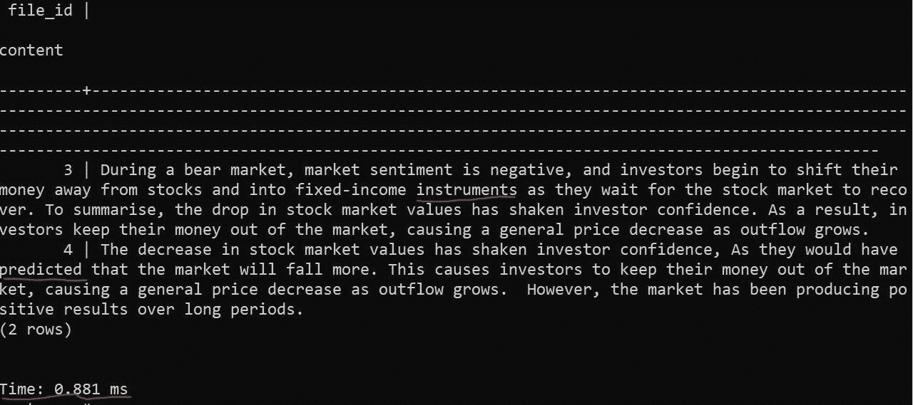

**结论:**

Postgres 的全文搜索功能非常棒，而且相对较快(足够了)。它将使您的应用程序无需其他工具即可增长。

**关键要点:**

1.  “like”和“ilike”运算符不能用于较大文档的全文搜索，因为它们执行全文搜索的能力有限。
2.  tsvector 和 tsquery 是 Postgres 中可用的数据类型，它们克服了“like”和“ilike”运算符对全文搜索的有限功能。
3.  to_tsvector()和 to_tsquery()是 Postgres 中用于搜索查询术语变体的函数。
4.  可以对 tsvector 字段进行索引，以便更快、更有效地对较大的文档进行全文搜索，从而避免任何性能问题。

您可以根据自己的应用需求选择最佳的文本搜索策略。了解 Postgres 中文本搜索可用的数据类型和函数将有助于您决定在数据库中使用哪些数据类型。如果应用程序需要一个短而精确的单词搜索词，您可以使用“like”和“ilike”操作符。如果应用程序需要对较大的文档进行更复杂的搜索，可以使用 to_tsvector()和 to_tsquery()函数。

**参考文献:**

[https://www . PostgreSQL . org/docs/current/text search-tables . html](https://www.postgresql.org/docs/current/textsearch-tables.html)