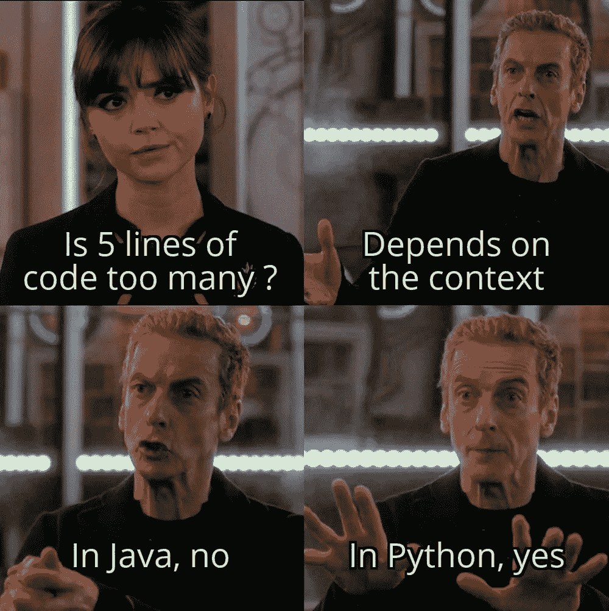

# Python 中的理解:它们是什么？为什么应该使用它们？

> 原文：<https://medium.com/geekculture/comprehensions-in-python-what-are-they-why-should-you-use-them-ff24a49460e7?source=collection_archive---------10----------------------->



作为这种语言中最具代表性和最深奥的语法之一，我确信每个人都已经听说过或者使用过列表理解。

但是你知道语言中还有三种其他类型的理解吗？

在这篇文章中，我将谈论什么是 *Python* 中的理解，以及为什么人们会使用它们。我还将讨论什么时候使用理解会损害代码的可读性。

# Python 中的理解是什么？

从本质上来说， *Python* 中的理解是通过对另一个可迭代对象执行操作来创建新序列的语法。

在 *Python 中有四种类型的理解。*

1.  **列举理解**
2.  **字典理解**
3.  **集合理解**
4.  **发电机理解**

大多数初学者对理解的一个常见误解是，最初的 iterable 需要与理解的类型相同。然而，事实并非如此，例如，如果你正在处理一个*字典理解*原始的 iterable 也可以是一个列表。

名称中提到的类型是从理解中返回的序列的类型。

# 为什么要用 Python 来理解？

我们在我们的代码中使用理解，因为使用它们会更有条理和可读性。然而，在某些情况下使用它们时需要小心，因为有时它们会产生相反的效果。

# 列表理解

列表理解是 *Python* 中最常见的理解类型，它遵循简单的语法:

正如我们在这里看到的，条件是完全可选的，但是如果你使用它，取决于你是否使用 *else* 子句，它在*列表理解*中的位置将会改变。

我们还可以看到，它们非常容易使用，可以很方便地减少循环中**的使用，使代码更加整洁。**

掌握它的最佳方法是亲自和它们一起玩，了解它们的局限性。下面是一个真实的用法例子，让你了解一下。

# 词典理解

正如我前面提到的，理解名称中提到的*类型*指的是它创建的序列类型，而不是理解中使用的 iterable 类型。

```
The syntax for a dictionary comprehension is:
```

同样，这里的条件是可选的。

您可以在许多不同的场景中使用它，例如，假设您希望能够根据员工在公司中的职位来比较他们的工资，并且您有一个很长的字典列表，其中包含每个员工的各种信息。

事实是，如果你只关心职位和薪水，你也许可以使用它，但是有比需要的更多的信息，因此我们可以使用字典理解来轻松地创建一个只包含我们想要的信息的新字典。

正如你在上面看到的，我们可以使用 *dict comprehension 在一行中非常容易和干净地实现这一点。*

# 集合理解

一个*集合理解*的功能类似于一个*列表理解*，除了它拥有集合的所有好处，即集合中的项目不能重复，并且值没有顺序。

它也使用了类似于列表理解的语法，除了它使用了花括号而不是方括号。

有时这可能是有用的，但您必须记住要小心，因为如果需要对结果进行排序，集合的有利方面可能会导致问题，如下所示:

# 生成器理解

*生成器理解*是我们在 *Python* 中最不为人知的理解类型。

一个*生成器*是一个返回一个对象(迭代器)的函数，我们可以一次迭代一个对象，这是 python 中一个独特的语法，通常由带有 **yield** 关键字的函数生成。

生成器理解的语法和所有其他语法一样简单:

使用生成器的美妙之处在于，我们可以简单地通过使用内置函数 **next()** 一步一步地迭代它。

# 什么时候不应该使用理解？

> 读完这里的所有内容后，总是使用理解似乎是显而易见的，对吗？

没有。

python 中的理解可以以上述所有方式用于创建可读代码，但是当我们使用*嵌套的理解*时，我们需要小心，因为它会导致代码可读性降低。

# 嵌套理解

嵌套理解是我们用来指在其他理解中完成的理解的术语。

虽然这是一个非常强大的功能，但它也会在可读性方面产生相反的效果。

例如，下面的两个脚本创建了下面的金字塔。

```
#
##
###
####
#####
######
#######
```

正如我们所看到的，虽然这是一个相当基本的例子，但在没有嵌套理解的情况下，可读性已经更好了，随着复杂性的增加，保持可读性就越困难。

通读了文章并理解了理解，我们不能完全理解它们给语言带来的力量，但与此同时，我们需要注意不要滥用它们，因为当逻辑不简单时，它会很快损害可读性。

每当我开始自己嵌套理解时，我总是喜欢记住这句简单的话:

> 代码应该解释注释，而不是注释解释代码。

然后决定是否最好在没有理解的情况下写出逻辑。

使用理解的美妙之处在于，当正确使用时，它可以帮助你产生高效可读的代码。

我希望你喜欢阅读并继续学习！