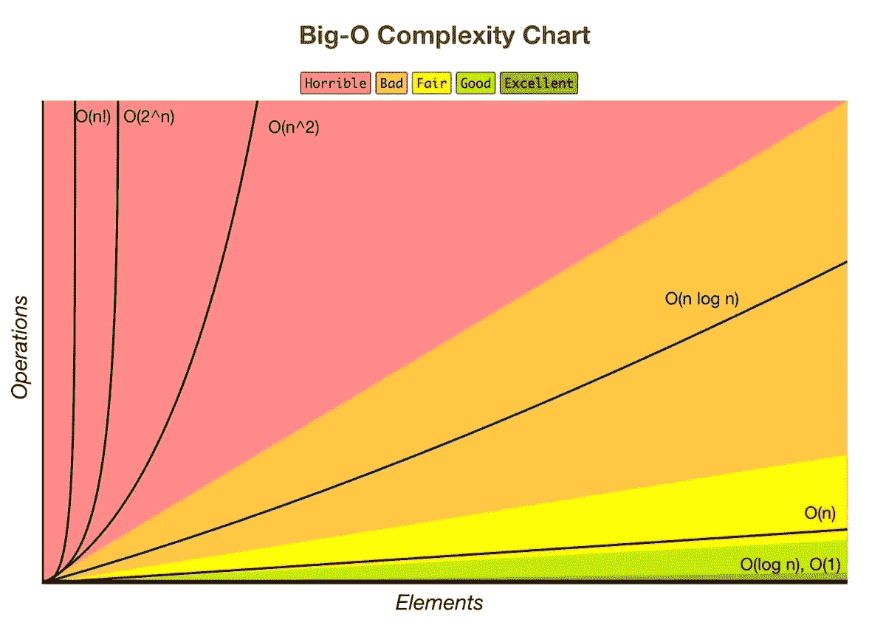
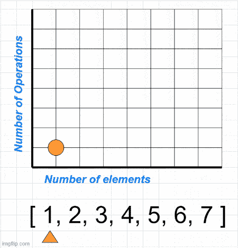
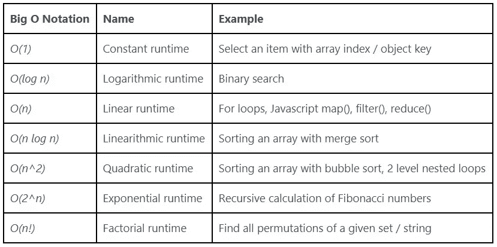
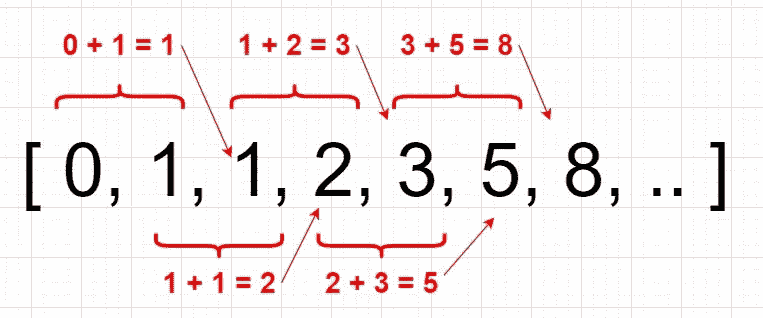

# 用简单英语编写的全面的大 O 符号指南，使用 JavaScript

> 原文：<https://medium.com/geekculture/comprehensive-big-o-notation-guide-in-plain-english-using-javascript-e3071354c91d?source=collection_archive---------25----------------------->


如果你是计算机科学专业的学生或毕业生，可以 100%肯定这是一个你绝对了解的主题。

但是，如果你目前正在自学编程，或者像我一样已经是该领域的自学程序员，有可能你甚至没有听说过这个术语。但我向你保证，你迟早会面对这个问题。当你这样做时，第一次可能会感到害怕。老实说，这对我来说也很可怕——直到我决定深入了解这一点。

摘自维基百科页面:[https://en.wikipedia.org/wiki/Big_O_notation](https://en.wikipedia.org/wiki/Big_O_notation)

*“大 O 记数法是一种数学记数法，描述当自变量趋向某一特定值或无穷大时，函数的极限行为。Big O 是 Paul Bachmann、[1] Edmund Landau、[2]等人发明的记数法家族中的一员，统称为 Bachmann–Landau 记数法或渐近记数法。*

*在计算机科学中，大 O 符号用于根据算法的运行时间或空间需求如何随着输入大小的增长而增长来对算法进行分类。[3]在解析数论中，大 O 符号通常用于表示算术函数和更好理解的近似之间的差的界限；这种区别的一个著名例子是素数定理中的余项。大 O 符号也用于许多其他领域，以提供类似的估计。”*

这种描述对你来说容易理解和记忆吗？虽然它是正确的，但一开始我并不容易理解它。让我与你分享它对我有意义的方式——我希望它对你也有意义。

# **那么，什么是大 O 记数法，我们为什么需要它？**

简单地说，大 O 符号用于测量我们编写的函数或算法的性能和可伸缩性。本质上，它是维基百科文章中提到的数学符号——但是你不需要成为一个绝对的数学奇才才能使用它。

你可能会问，既然有工具显示运行一段代码需要多少毫秒，我为什么要用大 O 呢？虽然它很方便，但对于可靠分析器来说，它仍然不够一致。因为如果你有一台比我更强的计算机，我们执行代码的时间将会不同。即使是在同一台计算机上，时间也会根据当时 CPU 和 RAM 的运行情况而有所不同。有了大 O，我们就不用担心这些细节了。

当我们谈论可伸缩性时，我们谈论的是随着输入量的增加，函数或算法的速度会降低多少。假设您有一个拥有 100 个用户的应用程序。您可以使用一个函数遍历一个包含 100 个用户的列表来获取他们的名字。该功能将在几毫秒内完成工作。

但是当你的应用增长了，你要经历 10.000，100.000 甚至百万用户的时候，会发生什么呢？我们如何找出什么类型的数据结构和算法可以有效地解决这个问题？这正是大 O 符号来拯救的时候。

# **理解大 O 复杂性图**



【https://www.bigocheatsheet.com/】--[-*-*-](https://www.bigocheatsheet.com/)-

*该图非常直观地展示了使用区域颜色进行缩放的优缺点。但是为了让你们对这个图表有更多的想象，我可以分享一个互动的 gif 图给你们展示这个代码:*

```
*const example = [1, 2, 3, 4, 5, 6, 7]function printArray (arr) {
 for (let i = 0; i < arr.length; i++) {
   console.log(‘element:’, arr[i])
 }
}printArray(example)*
```

*在代码中，我们简单地遍历一个数字数组，并在控制台上打印每个值。正如您在下面的 gif 中所看到的，操作的数量随着数组的大小而相应增加，因为在这段代码中，我们对每个元素执行一次操作:*

**

# ***时间和空间复杂度***

*我们用大 O 来分析我们算法的*时间和空间复杂度*。**时间**和**空间**是衡量编写高效代码的两个基本指标。*

***时间复杂度:**与 ***速度*** —运行算法需要多长时间。速度是由***CPU***决定的，计算机已经。*

***空间复杂度:**与 ***内存*** 有关——运行算法需要多少内存。这里的内存是指一个要使用的算法所需要的临时内存空间，称为*辅助空间*。内存是由 ***【随机存取内存】*** 电脑所决定的。*

*如今，我们拥有强大的计算机，但我们的资源不是无限的。*

*所以，当你下次听到关于时间和空间复杂性的时候，记住这一点:这是关于明智地使用资源。*

*如果你正在解决一个编程问题，时间和空间之间会有一个权衡。*

*当你想让某个东西运行得更快时，你可能不得不为此牺牲更多的内存。*

*当你想让某样东西在内存上便宜的时候，你可能不得不以更低的速度来安定下来。*

*这是一种平衡的行为——不同的设备、软件或平台需要不同类型的时间和空间的平衡。作为一名程序员，掌握这些知识将有助于你更有效地解决问题。*

*我相信到目前为止，我们对大 O、时间和空间复杂性的定义以及我们为什么需要它们已经有了很好的基础。让我们开始熟悉最常见的大 O 符号。*

*这些是我们将涉及的复杂性列表:*

**

*在我开始解释之前，我猜你一定想知道 *O* 和 paranthesis 中的数字或符号，如【T2(n)】代表什么。*

***O** 是指该功能的**指令***

***(n)** 表示**个输入***

# ***O(1) —常数时间***

***复杂度等级:优秀***

*就伸缩性而言，恒定时间是最佳的复杂度。为什么？因为顾名思义，它是不变的:不管你需要操作多少项，运行算法所需的时间都是一样的。*

```
*const tenItems = new Array(10).fill(‘foo’)
const millionItems = new Array(1000000).fill(‘bar’)function returnFirstElement (arr) {
 return arr[0]
}returnFirstElement(tenItems)
// this will take same amount of time as tenItems array:
returnFirstElement(millionItems)*
```

*看到了吗？在这种情况下，我们有多少个元素并不重要。我们得到了第一个元素，然后就完成了。但是请记住，恒定时间不仅仅是选择一个元素。请这样想:不管我们有多少输入，我们所做的操作量不会改变——因为它不依赖于输入的大小。查看以下示例:*

```
*const tenItems = new Array(10).fill(‘foo’)
const millionItems = new Array(1000000).fill(‘bar’)function printOnlyFirstFive (array) {
 for (i = 0; i < 5; i++) {
 console.log(‘element:’, array[i])
 }
}printOnlyFirstFive(tenItems)
// this will take same amount of time as tenItems array:
printOnlyFirstFive(millionItems)*
```

*现在你可能会想，在第一个例子中，我们用一个元素做了运算，所以它是 *O(1)* 。那我们能把这个叫做 *O(5)* 吗？是的，你可以把常数的数量统计为*O(5)*——但最终它仍然是常数。作为命名惯例，我们将称之为 *O(1)* 或常数时间。*

*通过对象的键从对象中选取一个值也是常量运行时的一个例子。不管一个对象有多少个元素，选择值的时间是恒定的:*

```
*const todaysMenu = {
 breakfast: ‘Smoothie’,
 lunch: ‘Sallad’,
 dinner: ‘Sushi’,
};function whatIsInTheMenu(menu, type) {
 return menu[type]
}whatIsInTheMenu(todaysMenu, ‘breakfast’) // => Smoothie*
```

*类似下面的函数也是常量运行时算法的一个例子。无论数字有多大，它们都遵循一个固定的模式:*

```
*function addTen(n) {
 return n + 10
}console.log(addTen(10)); // => 20
console.log(addTen(1000000)); // => 1000010function isEvenOrOdd(n) {
 return n % 2 ? ‘Odd’ : ‘Even’;
}console.log(isEvenOrOdd(10)); // => Even
console.log(isEvenOrOdd(10001)); // => Odd*
```

***恒定运行时间算法的一些例子:***

**从带有索引号的数组中选择一个元素。
从带有键值的对象中选择一个元素。检查数组中的一个元素是否为空。**

***一些时间复杂度不变的内置 Javascript 方法:***

***数组:**push()、pop()*

*请记住:基本的数学运算，如和、乘、减、除、模、位移等..也有一个恒定的运行时间。*

# ***O(对数 n) —对数时间***

***复杂度等级:好***

*对数运行时算法是规模上仅次于常数运行时算法的最快算法。最简短的可能解释是:对数运行时间通常适用于将问题一分为二的算法。*

*一个很好的类比是考虑如何在字典中搜索一个单词。例如，您想要查找单词“树”。一页一页地打开，你不会从头开始搜索单词。取而代之的是，你可以打开页面，直接进入一个随机的页面，越靠近“T”部分越好。如果你走得太远，比如说“U”部分——从那里你只能试着回到“T”部分，而不是在它之前。*

*对数运行时的典型例子是二分搜索法。二分搜索法是一种算法，它通过在每次迭代中将输入分成两半来找到一个参数在一个排序的数组中的位置。我特别强调了**排序**,因为数组应该被排序才能用这个算法得到准确的结果。当你需要使用二分搜索法时，请记住这一点。*

*假设我们有一个包含 10 个项目的数组，我们希望找到值为 5 的项目。你首先做什么？使用 for 循环。在这种情况下也可以称为暴力解决方案:我们只是使用 for 循环(线性搜索)迭代数组:*

```
*const tenArray = Array.from(Array(10).keys())const linearSearch = (arr, target) => {
 for (let i = 0; i < arr.length; i++) {
 if (arr[i] === target) {
 return `Found the target: ${target} at index ${i}`;
 }
 }
}linearSearch(tenArray, 5)*
```

*这将花费 *O(n) —线性运行时间*来找到元素。你将在下一章得到关于这个运行时的更多细节——但是为了举例，我将在下面展示给你，只要知道线性运行时直接依赖于输入的长度。请这样想:搜索 100 个输入的时间是搜索 10 个条目的 10 倍。*

*现在，让我给你演示一下线性搜索和二分搜索法之间的规模差异。我将使用 Javascript 的 performance API 来展示一个大致的比较。我也鼓励你复制粘贴这段代码，并在你喜欢的代码编辑器中尝试。*

*同样，正如我之前提到的，这些数字可能会根据您的计算机有多强而有所不同。即使在同一台计算机上，根据计算机在该时间点的表现，数字也会有所不同。如果您没有得到与我这里完全相同的数字，请不要担心，我们关注的只是运行时之间的伸缩差异。*

```
*const tenArray = Array.from(Array(10).keys())// O(n) — LINEAR RUNTIME
const linearSearch = (arr, target) => {
 for (let i = 0; i < arr.length; i++) {
 if (arr[i] === target) {
 return `Found the target: ${target} at index ${i}`;
 }
 }
}// O(log n) — LOGARITHMIC RUNTIME
const binarySearch = (arr, target) => {
 let startIndex = 0;
 let endIndex = (arr.length)-1;

 while (startIndex <= endIndex){

 let pivot = Math.floor((startIndex + endIndex)/2);

 if (arr[pivot] === target) {
 return `Found the target: ${target} at index ${pivot}`;
 } else if (arr[pivot] < target) {
 startIndex = pivot + 1;
 } else {
 endIndex = pivot — 1;
 }
 }
 return false;
}let beforeLinear = performance.now()
linearSearch(tenArray, 5)
let afterLinear = performance.now()let beforeBinary = performance.now()
binarySearch(tenArray, 5)
let afterBinary = performance.now()console.log(‘Milliseconds linear search:’, afterLinear — beforeLinear)
console.log(‘Milliseconds binary search:’, afterBinary — beforeBinary)// RESULT:
// => ‘Milliseconds linear search:’ 0.02500019036233425
// => ‘Milliseconds binary search:’ 0.06500002928078175*
```

*正如您在示例中看到的，我们已经遍历了 10 个元素。线性算法执行**比对数算法执行****快 2.6 倍。但是现在让我们看看当我们迭代一百万个项目时，算法是如何扩展的:***

```
***const millionArray = Array.from(Array(1000000).keys())// O(n) — LINEAR RUNTIME
const linearSearch = (arr, target) => {
 for (let i = 0; i < arr.length; i++) {
 if (arr[i] === target) {
 return `Found the target: ${target} at index ${i}`;
 }
 }
}// O(log n) — LOGARITHMIC RUNTIME
const binarySearch = (arr, target) => {
 let startIndex = 0;
 let endIndex = (arr.length)-1;

 while (startIndex <= endIndex){

 let pivot = Math.floor((startIndex + endIndex)/2);

 if (arr[pivot] === target) {
 return `Found the target: ${target} at index ${pivot}`;
 } else if (arr[pivot] < target) {
 startIndex = pivot + 1;
 } else {
 endIndex = pivot — 1;
 }
 }
 return false;
}let beforeLinear = performance.now()
linearSearch(millionArray, 567841)
let afterLinear = performance.now()let beforeBinary = performance.now()
binarySearch(millionArray, 567841)
let afterBinary = performance.now()console.log(‘Milliseconds linear search:’, afterLinear — beforeLinear)
console.log(‘Milliseconds binary search:’, afterBinary — beforeBinary)// RESULT:
// => ‘Milliseconds linear search:’ 2.185000106692314
// => ‘Milliseconds binary search:’ 0.054999953135848045***
```

***现在，差异是显著的。当我们遍历一百万个条目时，二分搜索法的执行速度比线性搜索快 40 倍！但是当我们对 10 个项目使用完全相同的函数时，线性搜索比二分搜索法快 2.6 倍。我相信这是一个很好的例子，展示了通过为您想要解决的问题选择正确的算法，您可以在性能上带来多大的不同。***

# *****O(n) —线性时间*****

*****复杂度等级:一般*****

***我们说线性时间是什么意思？如果我告诉你我们知道的所有循环都是线性时间复杂性/增长的例子，这可能会开始变得更有意义。***

***因为完成一个循环的时间与数组的长度直接相关。迭代 100 个项目将比迭代 10 个项目花费 10 倍的时间。***

```
***const tenItems = new Array(10).fill(‘foo’)
const hundredItems = new Array(100).fill(‘bar’)function printArray (arr) {
 for (let i = 0; i < arr.length; i++) {
 console.log(‘element:’, arr[i])
 }
}printArray(tenItems)
// this will take 10 times longer than iterating tenItems array:
printArray(hundredItems)***
```

*****线性运行时算法的一些例子:*****

****打印列表中的所有值。
在集合中查找给定的元素。
获取数组中的最大值或最小值。****

*****一些具有线性时间复杂度的内置 Javascript 方法:*****

*****数组:** *shift()、unshift()、splice()、concat()、slice()、indexOf()、forEach()、map()、filter()、reduce()****

# *****O(n log n) —线性时间*****

*****复杂度排名:接近一般*****

***线性时间复杂度它比线性算法稍慢，但仍优于二次算法(你将在下一节看到)。 *O(n log n)* 常与 *O(log n)* 混淆。它是线性 *O(n)* 和对数 *O (log n)* 运行时复杂度的组合。***

***它们是如何结合的？第一个 *n* 是线性时间复杂度，乘以 *log n****

```
***O(n * log n) -> O (n log n)***
```

***利用分治策略的排序算法是线性算法，如下所示:***

****合并排序、快速排序、堆排序、时间排序****

***让我们来看一个例子，合并排序:***

```
***const someArray = [ 3, 14, 7, 11, 6, 1, 21, 9, 14, 15 ]// sorting helper:
const merge = (left, right) => {
 let result = [];

 while(left.length || right.length) {if(left.length && right.length) {
 if(left[0] < right[0]) {
 result.push(left.shift())
 } else {
 result.push(right.shift())
 }
 } else if(left.length) {
 result.push(left.shift())
 } else {
 result.push(right.shift())
 }
 }
 return result
}// main function
const mergeSort = (arr) =>{
 if(arr.length <= 1) {
 return arr
 }const pivot = arr.length / 2
 const left = arr.slice(0, pivot)
 const right = arr.slice(pivot, arr.length)return merge(mergeSort(left), mergeSort(right))
};mergeSort(someArray)***
```

***我不会在这里对**合并排序**进行详细的分析，但是让我用简单的英语给你一个简单的概述——这样我们可以看看它的大 0 方面。***

***以下是合并排序的工作原理:***

***-它接受未排序的数组。***

***-一次一步地将数组分割成更小的部分。***

***-把它们分类。***

***-然后将它们合并，构建一个完全排序的数组。***

***-为此，它**递归地**使用我们在代码块中看到的 *merge()* 方法。**递归**是什么意思？简而言之，它是一个调用自身的函数，直到满足一个条件。通常称为**退出条件**。如上所述，退出条件是基于数组长度的。***

***从大 O 方面，我们看到了什么:***

****merge()* - >这种方法的时间复杂度是基于数组长度的，所以是线性运行时 *O(n)****

****mergeSort()* - >它在每次迭代中将数组分成 2 块。还记得我们讨论过的二分搜索法吗？**合并排序**在这里以类似的方式运行，左右数组在每次迭代中被减半。因此对数运行时 *O(log n)* 也存在。***

***最后，当我们合并这两个函数时，我们得到-> *O(n log n)****

# *****O(n ) —二次时间*****

*****复杂度等级:坏*****

****二次*是一个描述*平方*或者提升到 2 的*次方的名字。它实际上是数学中一个数字*的古老的*平方。****

***快速恢复:什么是数字的平方？一个数的平方是该数乘以自身的结果。***

***2 的 2 次方，或 *2* ，与 *2 * 2* ，或 *4* 相同。***

***5 的 2 次方或 *5* 与 *5 * 5* 或 *25* 相同。***

***二次运行时最经典的例子是使用同一个数组的**嵌套循环。因为你正在运行一个线性运行时操作内的另一个线性运行时操作- > *O(n * n) = O(n ^ 2)******

***让我们看一个例子:***

```
***const fruits = [“apple”, “strawberry”, “watermelon”]function logAllPairs(arr) {
 for (i = 0; i < arr.length; i++) {
 for (j = 0; j < arr.length; j++) {
 console.log(`${arr[i]} — ${arr[j]}`)
 }
 }
}logAllPairs(fruits)/* Output => 
‘apple — apple’
‘apple — strawberry’
‘apple — watermelon’
‘strawberry — apple’
‘strawberry — strawberry’
‘strawberry — watermelon’
‘watermelon — apple’
‘watermelon — strawberry’
‘watermelon — watermelon’
*/***
```

***这里，我们使用同一个数组打印出所有的线对。如您所见，为了从 3 项长度的数组中获得结果，我们需要运行 9 次:***

****3 * 3* 或 *3 的 2 次幂*。***

***如果我们使用 3 个嵌套循环会发生什么？还能叫二次运行时吗？不。它将被称为*立方运行时*，因为我们将有 *O (n ^ 3)* 或 *O (n * n * n)****

***为了给你一个更好的描述，具有二次、三次或类似运行时间的函数也被称为**多项式时间复杂度**。也可以表示为: *O(n ^ k)****

***n —输入***

***k——2，3，…任意的幂***

***请记住:较大的 *k* 值会使算法变慢。三次运行时算法会比二次运行时慢很多。***

# *****O(2^n) —指数时间*****

*****复杂度排名:恐怖*****

****指数*或*基数 2* 意味着每次输入增加时，算法执行的计算都会加倍。我们也可以说这是对数运行时的反义词*O(log n)*——因为每一步的计算都减半，而指数运行时则翻倍。*指数运行时间*的典型例子是递归计算斐波纳契数。让我给你一个快速的概述:***

*   ***斐波那契数是它的前两个邻居的总和，从 0 开始。***
*   ***请记住，实际计算从第三个索引开始(或者，如果我们从索引[0]开始计算数组，我们可以说索引[2])。因为它是第一个有两个邻居的索引:***

******

***-通过下面的函数，我们将给出一个索引数，使用递归返回序列中的第 ***n*** 个斐波那契数。这个解也叫“幼稚”解对于这个问题，我建议你去查一下，研究一下寻找斐波那契数的优化解。现在，我们只想关注大 O 方面:***

```
***function fibonacciRecursive(num) {
 // exit conditions, return if it is 0 or 1
 if (num === 0) return 0
 else if (num === 1) return 1
 // else, call the function recursively
 else return fibonacciRecursive(num — 1) + fibonacciRecursive(num — 2)
}fibonacciRecursive(4)
// OUTPUT => 3***
```

***这里发生了什么？当我们运行函数时，我们得到多个返回的递归结果。每一步的计算量都会翻倍！***

```
***fibonacciRecursive(4) = fibonacciRecursive(3)+fibonacciRecursive(2)
fibonacciRecursive(3) = fibonacciRecursive(2)+fibonacciRecursive(1)
fibonacciRecursive(2) = fibonacciRecursive(1)+fibonacciRecursive(0) 
// fib(1) and fib(0) are 0 and 1 respectively***
```

***从堆栈中弹出:***

```
***fibonacciRecursive(2) = 1 + 0 = 1
fibonacciRecursive(3) = 1 + 1 = 2
fibonacciRecursive(4) = 1 + 2 = 3***
```

***时间复杂度增长非常快。看，我们调用了两次*斐波那契(2)* 和*斐波那契(1)* 。***

***如果可能的话，应该避免指数运行时间的函数，因为它们的伸缩性很差。但这还不是最糟糕的。还剩下一个时间复杂度，我们需要在下一节看一看。***

# *****O(n！)—阶乘时间*****

*****复杂度排名:最差*****

****阶乘*是一个数字，它是所有正整数相乘得到的结果。***

```
***6! = 6 x 5 x 4 x 3 x 2 x 1 = 720***
```

***看到了吗？它长得非常快。***

***阶乘运行时用法的经典例子是 ***旅行推销员*** 问题。假设你是一名销售人员，你要拜访 n 个城市。参观每个城市，然后返回出发地点的最短路线是什么？为了解决这个问题，我们需要计算每一条可能的路线。这就是排列进入画面的时候。***

***本周你需要去三个城市。我们有多少种排列？***

```
***function getPermutations (arr) {
 if (arr.length <= 2) {
 if (arr.length === 2) return [arr, [arr[1], arr[0]]]
 return arr
 }
 return arr.reduce(
 (acc, item, i) =>
 acc.concat(
 getPermutations([…arr.slice(0, i), …arr.slice(i + 1)]).map(val => [
 item,
 …val,
 ])
 ),
 []
 );
}const cities = [‘Copenhagen’,’Stockholm’, ‘Oslo’]
getPermutations(cities)***
```

***这是阶乘 3，或者说 *3！*，返回 6 条不同的路线:***

```
***[
 [ ‘Copenhagen’, ‘Stockholm’, ‘Oslo’ ],
 [ ‘Copenhagen’, ‘Oslo’, ‘Stockholm’ ],
 [ ‘Stockholm’, ‘Copenhagen’, ‘Oslo’ ],
 [ ‘Stockholm’, ‘Oslo’, ‘Copenhagen’ ],
 [ ‘Oslo’, ‘Copenhagen’, ‘Stockholm’ ],
 [ ‘Oslo’, ‘Stockholm’, ‘Copenhagen’ ]
]***
```

***如果你需要计算 18 个城市的排列，会发生什么？应该是 18！阶乘。***

***哪会 **6，402，373，705，728，000** 不同路线！***

***如果可能的话，你应该远离有这个运行时间的算法。要优化这类问题，我建议你去研究一下*启发式算法*。***

***我希望这篇文章能帮助你理解大 O 符号的概念，并让你熟悉常见的大 O 运行时复杂性。感谢阅读！***