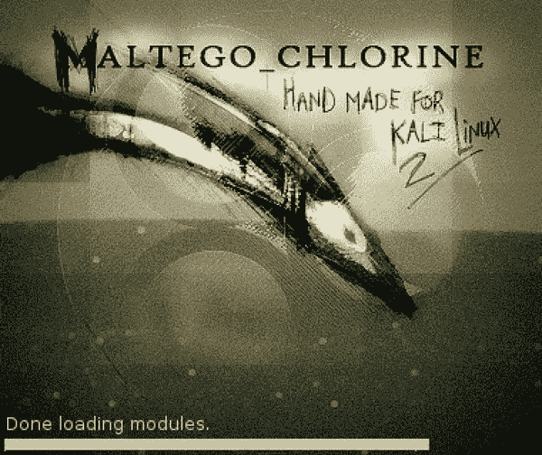

# 使用 Maltego 收集全面的信息

> 原文：<https://medium.com/geekculture/comprehensive-information-gathering-with-maltego-e7532cb48be?source=collection_archive---------9----------------------->

Maltego 是一个智能信息挖掘工具，它为连接分析提供协调图表。该设备用于在线考试，以发现来自互联网上不同来源的数据片段之间的关系。

马尔蒂戈使用*“转换”*来计算机化质疑各种信息来源的方式。