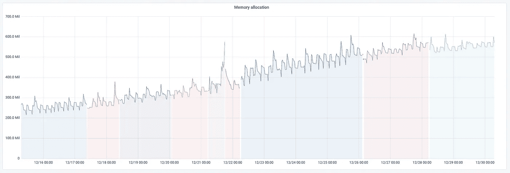

# 将键值数据库压缩 5 倍

> 原文：<https://medium.com/geekculture/compressing-key-value-database-size-5x-3d728ec8fed5?source=collection_archive---------39----------------------->

在一周内，我朋友的 bot 后端的 RAM 消耗几乎翻了一番:

这不是内存泄漏，因为重启后消耗的 RAM 量保持不变(每次颜色变化都是一次重启)，而是后端设计的结果——bot 将整个数据库保存在内存中。因此，预计 RAM 使用量将会增长，但预计不会在一周内达到 200M。