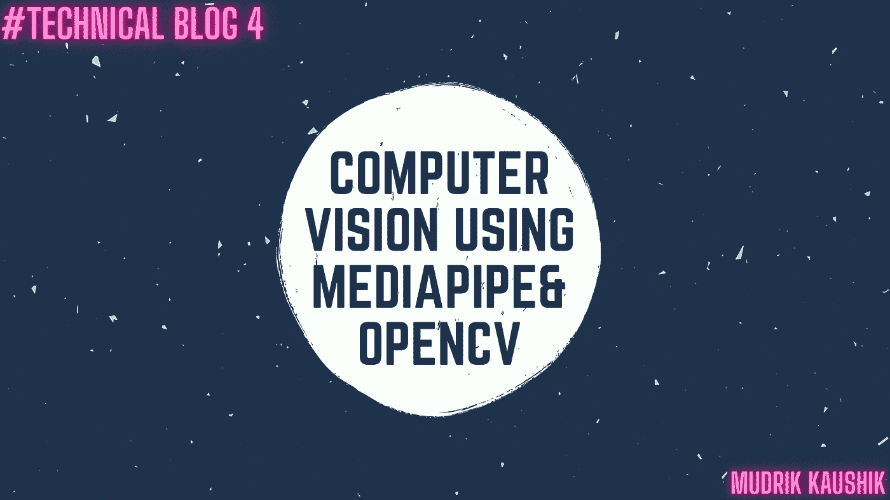
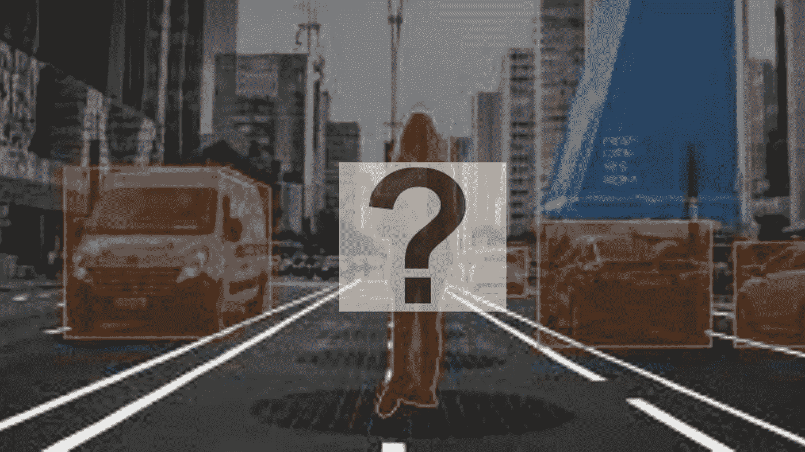
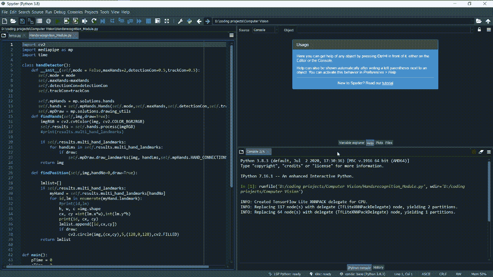
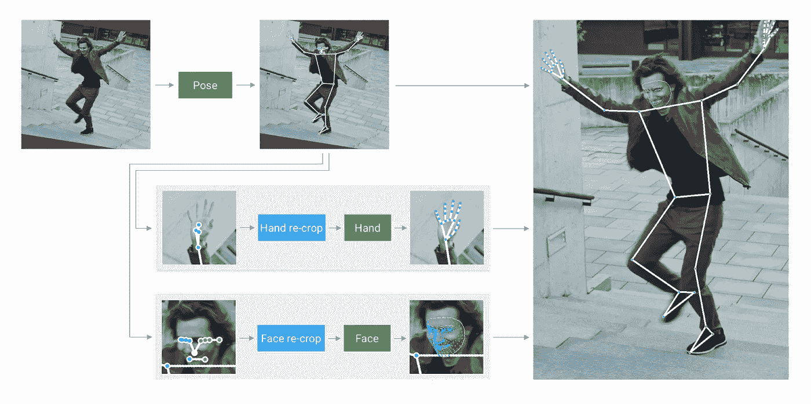
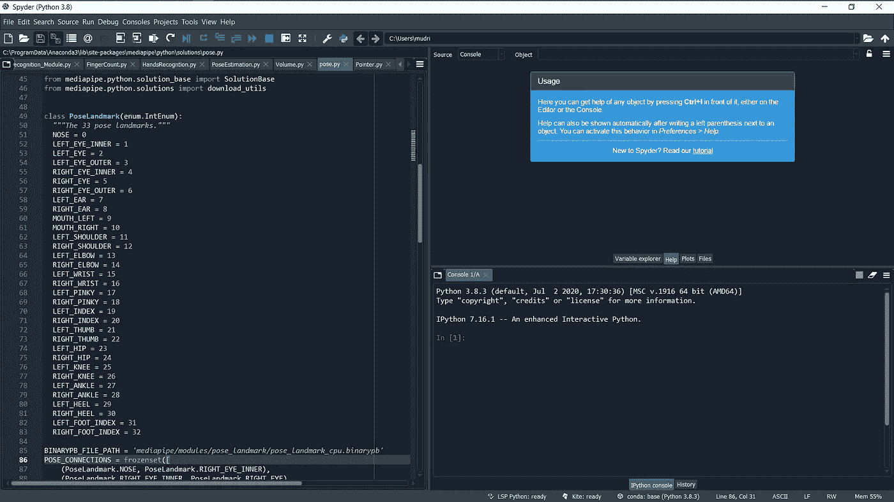
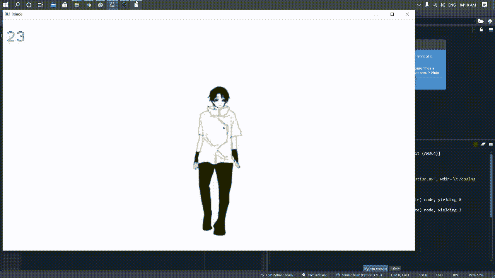
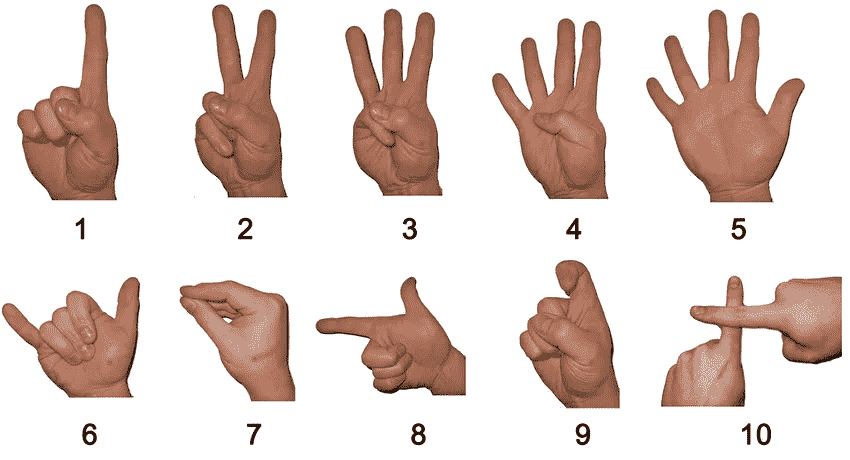
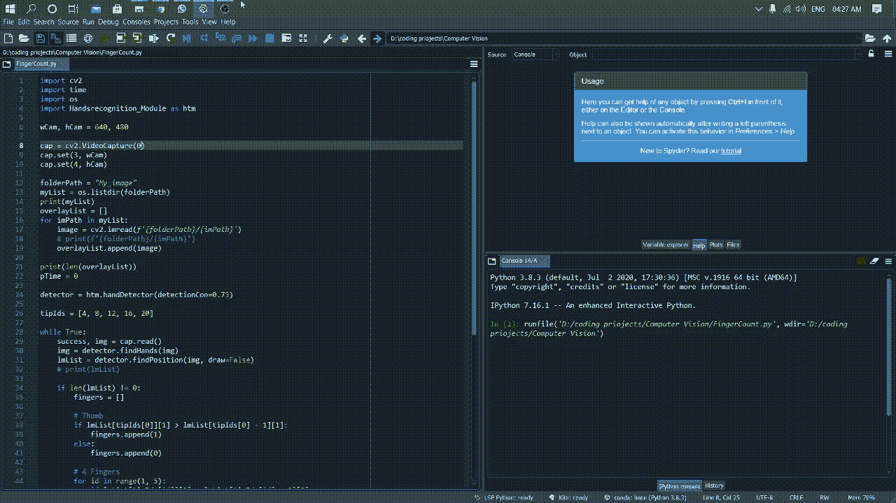

# 使用 Mediapipe 的计算机视觉

> 原文：<https://medium.com/geekculture/computer-vision-using-mediapipe-c0933b743cf5?source=collection_archive---------19----------------------->



# **💻我们对计算机视觉的理解是什么？**



**计算机视觉**可以定义为训练计算机解释和理解视觉世界的人工智能领域。使用来自相机和视频的数字图像以及深度学习模型，机器可以准确地识别和分类对象，然后对他们“看到的”做出反应。
计算机视觉是一个跨学科的科学领域，研究计算机如何从数字图像或视频中获得高层次的理解。
在当今世界，计算机视觉在许多领域非常有用，例如:

****库存管理— :*** 在库存管理的情况下，应用可以在**安全摄像机图像分析**的领域中，其中计算机视觉算法可以生成对商店中可用物品的非常准确的估计。另一个领域是**分析货架空间的使用情况，以确定次优配置**。

* **制造— :** 在制造领域，计算机视觉可以帮助机器的**预测性维护**。

***医疗保健— :** 在医疗保健领域，计算机视觉可用于**医学图像分析。**来自 CT 扫描和 X 射线的图像被分析以发现异常，如肿瘤或寻找神经疾病的迹象。

* **自动驾驶汽车— :** 计算机视觉领域在自动驾驶汽车领域发挥着核心作用，因为它允许它们感知和理解周围的环境，以便正确操作。计算机视觉中最令人兴奋的挑战之一是图像和视频中的目标检测。这涉及到定位不同数量的对象以及对它们进行分类的能力，以便区分对象是交通灯、汽车还是人，如下视频所示。

# 💻什么是 mediaPipe？

MediaPipe 是 PyPI 上预先构建的 Python 包。它还为用户提供了构建自己的解决方案的工具。MediaPipe Python 包在 PyPI 上适用于 Linux、macOS 和 Windows。

在 MediaPipe 的帮助下我们可以做的事情

*   人脸检测和人脸网格
*   姿态和整体检测
*   目标检测和跟踪

在这篇博客中，我解释了以下项目:

*   手部识别
*   姿态估计
*   手指计数
*   卷宗集合

# 💻手部识别


在手识别中，我首先创建了一个检测和跟踪手的脚本，最初我设置了手的阈值，但我们也可以编辑它，增加需要检测的手的数量。我还为这个项目创建了一个模块，这样我们就不必在“手指计数”等其他项目中一遍又一遍地编写整个代码过程。

```
import cv2
import mediapipe as mp
import time
import Handsrecognition_Module as htmcap = cv2.VideoCapture(0)mpHands = mp.solutions.hands
hands = mpHands.Hands()
mpDraw = mp.solutions.drawing_utilspTime = 0
cTime = 0while True:
    success, img = cap.read()
    imgRGB = cv2.cvtColor(img, cv2.COLOR_BGR2RGB)
    results = hands.process(imgRGB)
    print(results.multi_hand_landmarks)

    if results.multi_hand_landmarks:
        for handLms in results.multi_hand_landmarks:
            for id,lm in results.enumerate(handLms.landmarks):
                #print(id,lm)
                h, w, c =img.shape
                cx, cy =int(lm.x*w),int(lm.y*h)
                print(id, cx, cy)
                if id==0:
                    cv2.circle(img,(cx,cy),15,(255,0,255),cv2.FILLED)

            mpDraw.draw_landmarks(img, handLms,mpHands.HAND_CONNECTIONS)
    cTime = time.time()
    fps = 1/(cTime-pTime)
    pTime = cTime
    cv2.putText(img, str(int(fps)),(10,70),cv2.FONT_HERSHEY_PLAIN,3,(255,0,255),3)

    cv2.imshow("Image",img)
    cv2.waitKey(1)
```



# 💻姿态估计



这个项目检测和跟踪物体的位置。我已经在摄像机和 mp4 文件上进行了测试，它们看起来都运行良好。姿势估计基于手和腿跟踪的基本概念。基本上，它的工作原理是，首先我们必须为系统提供姿势标志，这样它就可以检测个人的手和腿，除了面部，我们还提供鼻子、眼睛等的标志



```
import cv2
import mediapipe as mp
import time
mpDraw = mp.solutions.drawing_utils
mpPose = mp.solutions.pose
pose = mpPose.Pose()cap =cv2.VideoCapture('3.mp4')
pT = 0 
while True:
   success, img = cap.read()
   imgRGB=cv2.cvtColor(img, cv2.COLOR_BGR2RGB)
   results = pose.process(imgRGB)
   #print(results.pose_landmarks)
   if results.pose_landmarks:
       mpDraw.draw_landmarks(img,results.pose_landmarks,mpPose.POSE_CONNECTIONS )
       for id,lm in enumerate(results.pose_landmarks.landmark):
           h,w,c=img.shape
           cx, cy =int(lm.x*w),int(lm.y*h)
           cv2.circle(img,(cx,cy),5,(255,0,0),cv2.FILLED)
           #print(id, cx, cy)
   cT =time.time()
   fps = 1/(cT-pT)
   pT = cT
   cv2.putText(img, str(int(fps)),(10,70),cv2.FONT_HERSHEY_PLAIN,3,(255,0,255),3)
   cv2.imshow("Image",img)
   cv2.waitKey(1)
```

在位置估计的情况下，我们有“姿势”功能，如果我们想要模型有所不同，我们必须提供所有的数据。



# 💻手指计数



这是我在计算机视觉领域最喜欢的学习之一
在这个项目中，我创建了一个计算机视觉脚本，它可以识别手的运动，并确定用户正在指示的数字。

```
import cv2
import time
import os
import Handsrecognition_Module as htmwCam, hCam = 640, 480cap = cv2.VideoCapture(0)
cap.set(3, wCam)
cap.set(4, hCam)folderPath = "My_image"
myList = os.listdir(folderPath)
print(myList)
overlayList = []
for imPath in myList:
    image = cv2.imread(f'{folderPath}/{imPath}')
    # print(f'{folderPath}/{imPath}')
    overlayList.append(image)print(len(overlayList))
pTime = 0detector = htm.handDetector(detectionCon=0.75)tipIds = [4, 8, 12, 16, 20]while True:
    success, img = cap.read()
    img = detector.findHands(img)
    lmList = detector.findPosition(img, draw=False)
    # print(lmList)if len(lmList) != 0:
        fingers = []# Thumb
        if lmList[tipIds[0]][1] > lmList[tipIds[0] - 1][1]:
            fingers.append(1)
        else:
            fingers.append(0)# 4 Fingers
        for id in range(1, 5):
            if lmList[tipIds[id]][2] < lmList[tipIds[id] - 2][2]:
                fingers.append(1)
            else:
                fingers.append(0)# print(fingers)
        totalFingers = fingers.count(1)
        print(totalFingers)h, w, c = overlayList[totalFingers - 1].shape
        img[0:h, 0:w] = overlayList[totalFingers - 1]cv2.rectangle(img, (20, 225), (170, 425), (0, 255, 0), cv2.FILLED)
        cv2.putText(img, str(totalFingers), (45, 375), cv2.FONT_HERSHEY_PLAIN,
                    10, (255, 0, 0), 25)cTime = time.time()
    fps = 1 / (cTime - pTime)
    pTime = cTimecv2.putText(img, f'FPS: {int(fps)}', (400, 70), cv2.FONT_HERSHEY_PLAIN,
                3, (255, 0, 0), 3)cv2.imshow("Image", img)
    cv2.waitKey(1)
```

为了让这个脚本最初工作，我们必须创建一个“手识别”模块，这样我们就可以将它的特性导入到我们的代码中。然后，我们将为我们可以创建列表的手定义参数。在我的例子中，我已经创建了一个名为 TipID 的列表，在这个列表中，作为输入，我输入了手的每个指尖的界标号(作为参考，我们可以参考手识别的手界标图)。

```
import cv2
import time
import os
import Handsrecognition_Module as htmwCam, hCam = 640, 480cap = cv2.VideoCapture(0)
cap.set(3, wCam)
cap.set(4, hCam)folderPath = "My_image"
myList = os.listdir(folderPath)
print(myList)
overlayList = []
for imPath in myList:
    image = cv2.imread(f'{folderPath}/{imPath}')
    # print(f'{folderPath}/{imPath}')
    overlayList.append(image)print(len(overlayList))
pTime = 0detector = htm.handDetector(detectionCon=0.75)tipIds = [4, 8, 12, 16, 20]while True:
    success, img = cap.read()
    img = detector.findHands(img)
    lmList = detector.findPosition(img, draw=False)
    # print(lmList)if len(lmList) != 0:
        fingers = []# Thumb
        if lmList[tipIds[0]][1] > lmList[tipIds[0] - 1][1]:
            fingers.append(1)
        else:
            fingers.append(0)# 4 Fingers
        for id in range(1, 5):
            if lmList[tipIds[id]][2] < lmList[tipIds[id] - 2][2]:
                fingers.append(1)
            else:
                fingers.append(0)# print(fingers)
        totalFingers = fingers.count(1)
        print(totalFingers)h, w, c = overlayList[totalFingers - 1].shape
        img[0:h, 0:w] = overlayList[totalFingers - 1]cv2.rectangle(img, (20, 225), (170, 425), (0, 255, 0), cv2.FILLED)
        cv2.putText(img, str(totalFingers), (45, 375), cv2.FONT_HERSHEY_PLAIN,
                    10, (255, 0, 0), 25)cTime = time.time()
    fps = 1 / (cTime - pTime)
    pTime = cTimecv2.putText(img, f'FPS: {int(fps)}', (400, 70), cv2.FONT_HERSHEY_PLAIN,
                3, (255, 0, 0), 3)cv2.imshow("Image", img)
    cv2.waitKey(1)
```



# 💻卷宗集合


在这个音量设置项目中，我将 OpenCV 与操作系统集成在一起，这样我就可以在手势的帮助下改变系统的音量。所以为了完成这个项目，我已经确定并创建了食指和拇指的音量设置标志，因为这两个手指之间的距离相对来说是最大的。

```
import cv2
import time
import numpy as np
import Handsrecognition_Module as htm
import math
from ctypes import cast, POINTER
from comtypes import CLSCTX_ALL
from pycaw.pycaw import AudioUtilities, IAudioEndpointVolumewCam, hCam = 640, 480cap = cv2.VideoCapture(0)
cap.set(3, wCam)
cap.set(4, hCam)
pTime = 0detector = htm.handDetector(detectionCon=0.7)devices = AudioUtilities.GetSpeakers()
interface = devices.Activate(
    IAudioEndpointVolume._iid_, CLSCTX_ALL, None)
volume = cast(interface, POINTER(IAudioEndpointVolume))
# volume.GetMute()
# volume.GetMasterVolumeLevel()
volRange = volume.GetVolumeRange()
minVol = volRange[0]
maxVol = volRange[1]
vol = 0
volBar = 400
volPer = 0
while True:
    success, img = cap.read()
    img = detector.findHands(img)
    lmList = detector.findPosition(img, draw=False)
    if len(lmList) != 0:
        # print(lmList[4], lmList[8])x1, y1 = lmList[4][1], lmList[4][2]
        x2, y2 = lmList[20][1], lmList[20][2]
        cx, cy = (x1 + x2) // 2, (y1 + y2) // 2cv2.circle(img, (x1, y1), 10, (255, 0, 255), cv2.FILLED)
        cv2.circle(img, (x2, y2), 10, (255, 0, 255), cv2.FILLED)
        cv2.line(img, (x1, y1), (x2, y2), (255, 0, 255), 3)
        cv2.circle(img, (cx, cy), 10, (255, 0, 255), cv2.FILLED)length = math.hypot(x2 - x1, y2 - y1)
        # print(length)# Hand range 50 - 300
        # Volume Range -65 - 0vol = np.interp(length, [50, 300], [minVol, maxVol])
        volBar = np.interp(length, [50, 300], [400, 150])
        volPer = np.interp(length, [50, 300], [0, 100])
        print(int(length), vol)
        volume.SetMasterVolumeLevel(vol, None)if length < 50:
            cv2.circle(img, (cx, cy), 15, (0, 255, 0), cv2.FILLED)cv2.rectangle(img, (50, 150), (85, 400), (255, 0, 0), 3)
    cv2.rectangle(img, (50, int(volBar)), (85, 400), (255, 0, 0), cv2.FILLED)
    cv2.putText(img, f'{int(volPer)} %', (40, 450), cv2.FONT_HERSHEY_COMPLEX,
                1, (255, 0, 0), 3)
while True:
    success, img = cap.read()
    imgRGB = cv2.cvtColor(img, cv2.COLOR_BGR2RGB)
    results = hands.process(imgRGB)
    print(results.multi_hand_landmarks)

    if results.multi_hand_landmarks:
        for handLms in results.multi_hand_landmarks:
            for id,lm in results.enumerate(handLms.landmarks):
                #print(id,lm)
                h, w, c =img.shape
                cx, cy =int(lm.x*w),int(lm.y*h)
                print(id, cx, cy)
                if id==0:
                    cv2.circle(img,(cx,cy),15,(255,0,255),cv2.FILLED)

            mpDraw.draw_landmarks(img, handLms,mpHands.HAND_CONNECTIONS)
    cTime = time.time()
    fps = 1/(cTime-pTime)
    pTime = cTime
    cv2.putText(img, str(int(fps)),(10,70),cv2.FONT_HERSHEY_PLAIN,3,(255,0,255),3)

    cv2.imshow("Image",img)
    cv2.waitKey(1)
```

这里是我学到的一些关于 MediaPipe 和 OpenCV
的概念，希望你喜欢这个博客😊
快乐学习🎇🎇🎇