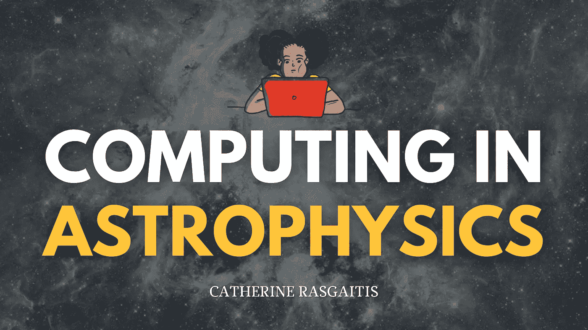

# 天体物理学中的计算

> 原文：<https://medium.com/geekculture/computing-in-astrophysics-f69da88970a9?source=collection_archive---------24----------------------->

## 以太阳的邪恶孪生兄弟为特色

photo by [WikiImages](https://pixabay.com/users/wikiimages-1897/), courtesy of [Pixabay](https://pixabay.com/photos/milky-way-nebula-galaxy-stars-74005/)

天体物理学是天文学的一个特殊分支，研究空间。在天体物理学中，科学家致力于了解天体的物理性质，以及为什么这些天体会以特定的方式运行。

要做到这一点，有两种类型的天文学家一起工作:观测天文学家和理论…