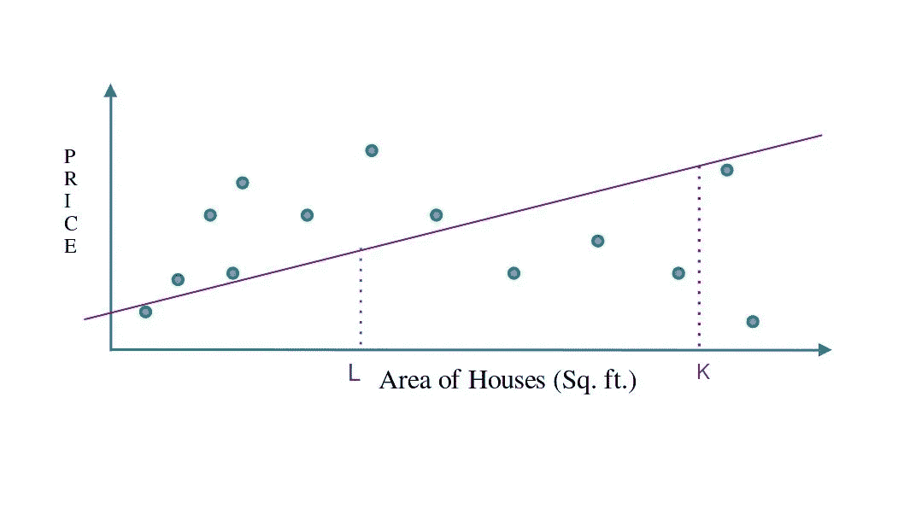
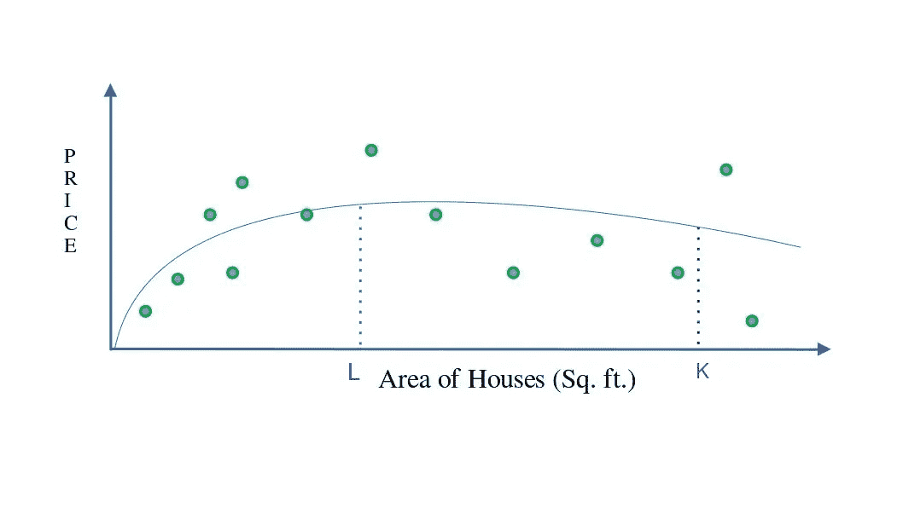
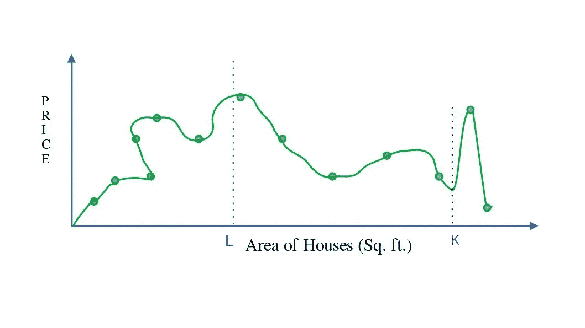
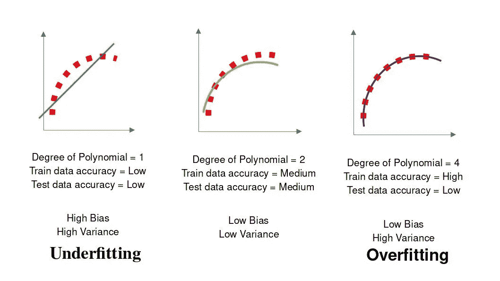
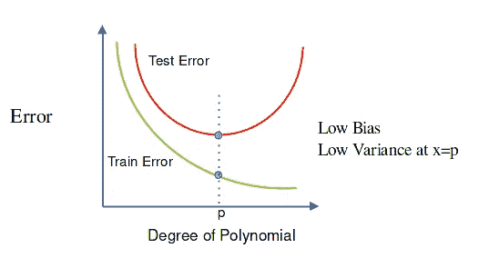

# 机器学习的概念|多项式回归|误差:噪声、偏差和方差|将数据分成训练集和测试集

> 原文：<https://medium.com/geekculture/concept-of-machine-learning-polynomial-regression-errors-noise-bias-and-variance-splitting-222193e2331f?source=collection_archive---------9----------------------->

在上一篇文章中，我写了线性回归、用这样的系数优化误差、梯度下降法、超定方程组等。在这篇文章中，我写的是关于多项式回归和标题中写的其他东西。

这是一个线性回归的图像

**Linear Regression**

## 什么是多项式回归？

多项式回归是一种回归形式，其中自变量和因变量之间的关系是 x 的 nᵗʰ次多项式函数

**Polynomial Regression**

随着 n 的增加，结果将更加精确。更准确的结果是

Polynomial Regression

但是，K 平方英尺的价格。英尺的房子比“L”平方小得多。英尺，所以这不是一个最佳预测。

## 那么什么是最合适的呢😕？

为了找到最佳拟合模型，我们必须将数据集分成训练和测试数据。

## 训练和测试分割

我们必须移除一些测试设备中的房子，剩下的是训练设备。

Train Data & Test Data Split

训练错误:训练数据集 RSS。

测试错误:测试数据集的 RSS。

## 机器学习中的错误类型

1.  噪音
2.  偏见
3.  差异

## 噪音

*   不可约误差。
*   收集数据时出错。

## 偏见

*   偏差与训练集的误差有关。
*   如果训练集的误差(RSS)很高，则称为高偏差，如果很低，则称为低偏差。

如果训练集误差高，则数据欠拟合。

## 差异

*   方差与测试集的误差(RSS)有关(与训练集误差相比，测试集误差有多大)
*   如果测试集误差比训练集误差高得多，那么我们可以说我们有很高的方差。

获得 0.5%的训练集误差和 10%的测试集误差意味着我们的模型不能很好地概括，这意味着我们的模型也是过度拟合的。

Bias, Variance, Over-fitting, Under-fitting in One Picture

## 偏差-方差权衡

> 减少偏差会增加方差&减少方差会增加偏差。因此，我们的目标是在偏差和方差之间找到正确的平衡。这被称为偏差-方差权衡

**Bias Variance tradeoff**

从图中可以看出，随着多项式次数的增加，训练误差减小，但是在某个值(多项式次数= p)之后，测试误差增加。因此，最佳曲线是 p 次多项式。

## 全文系列:

 [## 机器学习的概念文章系列| Ujjwal Kar

### 回归入门|使用梯度下降的简单线性回归优化…

ujjwalkar.netlify.app](https://ujjwalkar.netlify.app/post/concept-of-machine-learning-tutorial-series/)