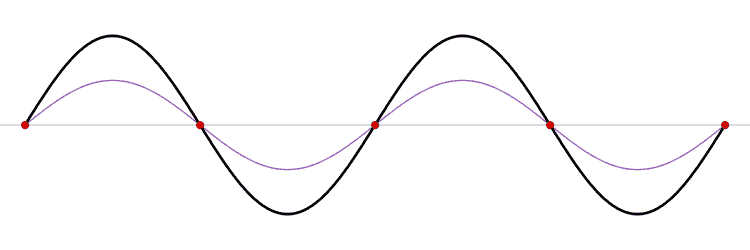
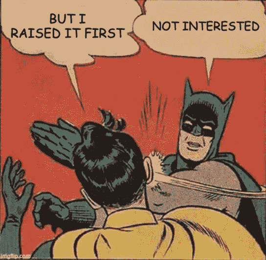
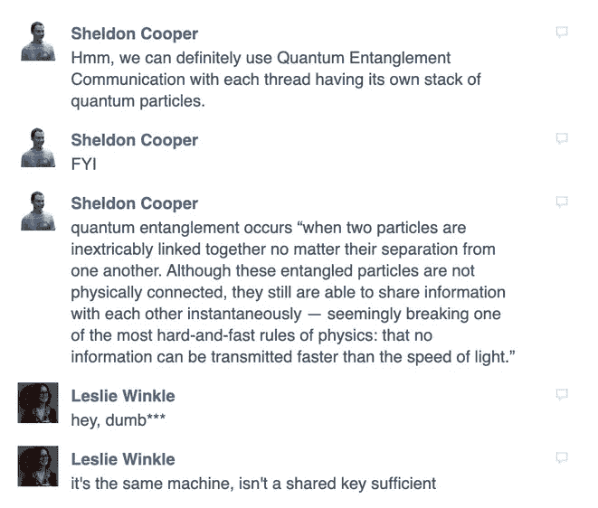
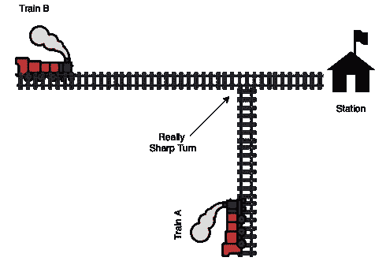
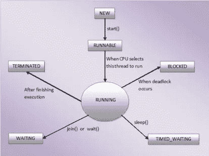

# 并发和线程:现实生活中的例子—第 2 部分

> 原文：<https://medium.com/geekculture/concurrency-and-threads-part-2-51ddef68e364?source=collection_archive---------15----------------------->



**之前，**您看到了多线程系统如何带来复杂性，以及我们如何使用同步来解决这个问题。现在让我们看看线程是如何相互通信的。

我建议那些还没有看过《T2》第一部的人，请浏览一遍，毫无悬念地理解接下来的故事。

然而，这些是我们上次学过的关键概念。

1.  **共享变量:**被多个线程共享的变量。
2.  **临界区:**一段代码，包含一个被多个线程访问的共享变量
3.  **竞态条件:**我们不知道某个临界段上发生的共享变量的最终值的情况。
4.  **同步:**对竞争情况的解决方案，让一个线程一次运行一个临界区。

这里需要理解的一个要点是，只有当不止一个线程更新共享变量时，才会出现与临界区或竞争条件相关的问题。问题不在于多线程读取，而在于多线程写入。

那么，如果我们以某种方式限制对特定对象的更新，我们只返回共享变量的更新副本，而不更新原始副本，会怎么样呢？

这就是**不变性**，这就是我们如何简单地实现它。

```
public class ImmutableValue {private int value = 0;public ImmutableValue(int value){
    this.value = value;
  }public int getValue(){
    return this.value;
  }public ImmutableValue add(int valueToAdd){return new ImmutableValue(this.value + valueToAdd);}
}
```

现在，如果任何线程在这个对象上调用 add 方法，它不会更新内部变量“value ”,但会用更新后的值获得一个新的不可变对象。所以每个线程都有自己的更新变量副本。

我想知道这个什么时候会更新。我想，如果有任何安全的手动过程来更新这个变量，那么我们就可以毫不犹豫地把它作为一个共享变量来使用。

# 我相信我们正在使用的 git 分支策略就是一个典型的例子。

策略是我们从主分支中提取一个特性分支，并且从不直接更新主分支，而是通过一个批准过程。

所以它的伪代码看起来就像这样。

```
public class MasterBranch extends Branch{private Code code ;// Initial setup of the branch
 public MasterBranch(Code code){

    if(this.code != null){
        this.code = code;
    }else{
        throw new Exception("Master branch is already set up")
    }
 }public Code getCode() throws Exception {
     throw new Exception("Operation not supported");
 }// git checkout -b "feature/super-cool-feature"
 public Branch createBranch() {
     Code code = code.clone(); // Deep clone
     return new Branch(code);
 }// git merge feature/super-cool-featurepublic void merge(Branch featureBranch) throws CodeError {if(featureBranch.isApproved()){
        this.code.merge(featureBranch.getCode());
    } else {
        throw new CodeError("");
    }}
}
```

您会注意到这里主分支的代码对象从不更新，除非有人批准了特性分支。

这个批准过程应该负责多个分支更新主分支**一次一个**。

人们一定已经意识到这个批准过程是多么的忙乱，就像等待你的朋友批准你的请求，而他正在审查其他一些拉动式请求。

终于轮到你了。然后他说*‘伙计，我看到你的公关和罗宾的有冲突了*



[https://imgflip.com/i/3tl76e](https://imgflip.com/i/3tl76e)

哎呀，就是这样。即使是一个男人也有这么多复杂的事情。想象一下，当我们实现自动化时会发生什么？

请想一想，如果罗宾在这里告诉蝙蝠侠他正在开发相同的代码库会怎么样。我们绝对可以挽回一巴掌。

**同样，如果两个线程开始相互通信会怎么样。**

**交流线程。哇，真有趣。**



**是啊，你听到莱斯利。我们可以只用一个共享变量。**

那就让我们开始吧。下面是另一个插图，可以更好地理解这个沟通过程。

让我们考虑两列火车 A 和 b 的假设情况。它们在晚上 10 点到达同一个车站，另一列在晚上 10 点 10 分钟后到达。



假设 A 列车在车站平均停留 5 分钟，然后 B 列车经过车站。这是一个简短的模拟代码，其中每个训练就像一个线程。

```
public class Signal {
     public boolean trainAPassed;
}class TrainA extends Threads { private Signal signal; public TrainA(Signal signal){

    this.signal = signal;
    System.out.println("Train A : Run Engine"); }

 [@Override](http://twitter.com/Override)
 public void run() { System.out.println("Train A : Pass from the station"); // Waiting time at the station        
    Thread.sleep(5*60*1000); System.out.println("Train A : Passed from the station");
    Signal.trainAPassed = true;
 }}class TrainB extends Threads { private Signal signal; public TrainB(Signal signal){
     this.signal = signal;
     System.out.println("Train B : Run Engine");
 }

 [@Override](http://twitter.com/Override)
 public void run() { // Wait while the train A is not passed         
     while(!Signal.trainAPassed){
         System.out.println("Waiting for train A to be passed");
     } System.out.println("Train B : Pass from the station");
     System.out.println("Train B : Passed from the station");
 }}
```

现在假设火车 A 到达车站有点晚，比如说在晚上 10:09，但是火车 B 是准时的。在这种情况下会发生什么？

B 列车需要等到晚上 10:14 才能进站对吧。**站前 4 分钟的停顿。**

如果您启动线程，您肯定会看到这条消息，

```
"Waiting for train A to be passed"
```

重复 4 分钟。

这意味着 Train-B 即使在无事可做时也继续运行它的引擎，仍然白白地消耗电力，**换句话说对于一个线程来说，消耗 CPU 时间**。

记住每一个运行的线程都会消耗 CPU 的一些时间，即使它除了打印什么也不做。

这绝对是一个糟糕的设计，用专业术语来说叫做**忙着等待**。为什么列车 B 必须保持发动机运转，而列车 A 却没有通过？对！

我们能不能不要让 Train-B/Thread-B 处于一种不占用 CPU 时间，仍然不会死的状态。一个线程有这样的状态吗？

是的，有这样的状态。它被称为**等待状态**。

Java 和许多其他语言提供了将线程置于这种状态的方法。



这是一篇很好的[文章](https://javaconceptoftheday.com/thread-life-cycle-thread-states-java/)，列出了我们可以实现的所有线程状态。

这是上一篇文章中的图像，显示了一个线程可能达到的所有状态。

所以代码会变成这样

```
class TrainA extends Threads {....
....
....[@Override](http://twitter.com/Override)
public void run() { System.out.println("TrainA : Pass from the station"); Thread.sleep(5*60*1000); System.out.println("TrainA : Passed from the station");

   signal.notify(); }
}class TrainB extends Threads { private Signal signal; public TrainB(Signal signal){
     this.signal = signal;
     System.out.println("TrainB : Run Engine"); }

  [@Override](http://twitter.com/Override)
  public void run() { if(nearby_station){
        System.out.println("Waiting for trainA to be passed");
        signal.wait();
    } System.out.println("TrainB : Pass from the station");
    Thread.sleep(5*60*1000); System.out.println("TrainB : Passed from the station");
  }
}
```

**这里这个信号是什么？现在，让我们把它想象成当火车 B 呼叫 signal.wait()时，它关闭它的引擎，当火车 A 呼叫 signal.notify()时，粘在它末端的绿灯变得活跃，暗示火车 B 现在可以通过了。**

但是，在 3 月 28 日晚上，火车 A 提前了 10 分钟，它在晚上 9 点 50 分到达车站，并在晚上 10 点离开。现在 B 列火车来了，等着 A 列火车过来经过，亮出它最喜欢的绿灯。

但直到晚上 10 点 15 分才出现。

现在列车 B 的乘务人员有两个选择

1.  再等等，听听愤怒的乘客。而他们甚至不知道自己需要等待多久。
2.  第二，向车站移动，考虑与列车 A 相撞的可能性。(*记住，由于* ***急转弯*** ，列车 A 无法在车站检查其他列车)

这就是我们所说的**错过信号！**

那么，你会怎么做？

正确替换信令算法。如果不是列车 A 显示通行灯本身，而是将此责任交给车站管理员。如果列车 A 已经通过，车站管理员会告诉列车 B 的工作人员继续前进。

我们如何在代码中处理这个问题？列车 A 是否已经通过的另一个标志。

```
if(nearby_station && !station_manager_green_flag_present){
             System.out.println("Waiting for trainA to be passed");
             signal.wait();
}
```

# 所以他们做到了！


[https://data.whicdn.com/images/31887220/original.gif](https://data.whicdn.com/images/31887220/original.gif)

现在考虑另一个不幸的情况，忘记之前的情况，如果列车 B 的控制系统发生故障，在车站附近等待列车 A 通过时，它开始自动运行。

**灾难没错！**

这相当于在 JAVA 线程管理系统中的**假唤醒**期间可能出现的情况。

***这是什么意思？***

```
if(nearby_station && !station_manager_green_flag_present){
      System.out.println("Waiting for trainA to be passed");
      signal.wait();
}
```

Train B 的 run 方法上的这个 **signal.wait()** 指令应该在没有给它 notify()信号时暂停 Train B 线程。但有时，在极少数情况下，它无法做到这一点。因此被称为虚假唤醒。

***这个怎么解决？***

只需用 while 循环改变 if 条件。因此，当它在没有任何通知信号的情况下醒来时，它会重新检查状态，如果站点管理器仍然没有给出任何绿色标志，它会重新进入睡眠状态。

```
while(nearby_station && !station_manager_green_flag_present){
      System.out.println("Waiting for trainA to be passed");
      signal.wait();
}
```

在我们的软件场景中，当列车 A 通知列车 B 时，车站管理员需要准备好绿色标志，否则，列车 B 将永远停留在 while 循环中。

你可能会奇怪，为什么我们一开始不雇佣电视台经理来简化流程

当列车 A 准备离开时，车站管理员通知列车 B 启动发动机，并准备好等待他发出的下一个进入信号。或者在列车 B 首先到达车站的情况下，它联系车站管理员，无论列车 A 是否在进入车站的路上。

但是你应该看到车站管理员有很高的责任，否则在这种情况下信号等级的复杂性

**…。如果有 100 次这样的穿越，处理起来会有多困难。**


[https://media.giphy.com/media/pntEStkSm6orC/giphy.gif](https://media.giphy.com/media/pntEStkSm6orC/giphy.gif)

但另一方面，你应该承认，第一种方法如何使车站管理员的工作变得简单，因为他只需要插上一面旗帜，然后回到他美味的三明治上，我们还使所有系统在某种程度上解耦。

是的，火车通过信号互相交谈。很酷不是吗？

我们只需要车站管理员通过一个**简单的绿色标志**来处理像错过信号和虚假唤醒这样的不幸情况。

所以，伙计们，这都是线程信号。总结一下，这就是我们今天学到的东西。

1.  如何实现**的不变性**
2.  如何解除**忙等待**
3.  如何处理**错过的信号**
4.  如何处理**虚假唤醒？**

感谢你从头到尾阅读这篇文章，我打算继续写这个话题，下一节将处理死锁和更多问题。

**敬请期待！！**