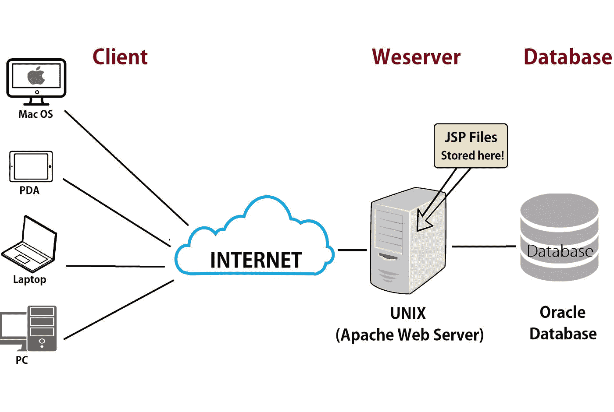

# Golang 中的并发性

> 原文：<https://medium.com/geekculture/concurrency-in-golang-6ea38c1cb323?source=collection_archive---------0----------------------->

一个典型的系统由较小的组件和子系统组成，这些组件和子系统一起工作。软件程序通常也由更小的子程序组成。

例如， [Apache](https://httpd.apache.org/) 这样的 web 服务器处理来自 web 客户端的请求，并提供静态或动态内容或 HTML 网页作为响应。每个请求都像一个小程序一样，在一系列的响应和请求周期中被处理。

对于大型程序来说，独立地同时运行较小的组件是多么理想啊🤔！？

> 同时在一个以上的任务上取得进展被称为并发。

Golang ，在语言层面，提供了一些很棒的并发原语，使得实现并发系统变得极其容易。Go 为并发性提供了丰富的支持

*   Goroutines &
*   渠道。

# 戈鲁廷斯

Goroutine 总是在后台工作。它们是在同一个线程或一组线程中与其他 goroutines 同时执行的函数。为了创建一个 goroutine，我们使用关键字`go`后跟一个函数调用:

每个程序包含至少一个 Goroutine，该 Goroutine 被称为**主 Goroutine** 。

上面的程序由三个 goroutines 组成。第一个 goroutine 是隐式的，它是主函数本身，所有 go routine 都在**主 go routine**下工作。

第二个和第三个 goroutine 是在我们调用函数时创建的；在这种情况下通过调用`go say("Hey") & go say("There")`。

按照惯例，当一个函数被调用时，我们的程序将执行函数中的所有语句，然后返回到调用后的下一行。但是使用 goroutine，我们会立即返回到下一行，而不会等待函数完成。

我们可以通过设置一些延迟来研究这种并发性和程序执行时间。

黑客👨‍💻我发现是用了`sleep`的方法`time.Sleep(time.Second)`。

如果没有这个，程序将在有机会打印所有字符串“hey”和“there”之前退出。

Goroutines 是轻量级的，我们可以很容易地在程序中创建它们。我们可以修改上面的程序来运行 20😃goroutines 通过这样做:

# 频道

通道用于通信，有时也用于两个正在执行的 goroutines 之间的同步。下面是一个使用通道的示例程序:

使用`make`函数和`chan`关键字创建通道，然后传递给对`greeting`函数的调用，该函数接受一个字符串和一个数据类型字符串的通道。for 循环是在主通道中创建的，用于接收和打印每一条传入的消息。

`close()`功能表示关闭一个通道；因此，它不会再发送任何值。这对于向信道的接收者传达完成是有用的。

所以使用这样的通道可以同步两个 goroutines。

# 结论

我简单讲了 Golang 中的基本概念，比如 goroutines 和 channels，它们是并发在 [Go](https://golang.org/) 中的实现。我希望这篇文章能帮助你了解更多关于 Golang 的特性😃。

我很喜欢写这篇文章，希望这篇文章对你有所帮助🤗。随时联系我关于[**Github**](https://github.com/nextwebb)**[**Twitter**](https://twitter.com/i_am_nextwebb)**，以及**[**LinkedIn**](https://www.linkedin.com/in/peterson-oaikhenah-102645144/)**。一定要点赞、评论和分享😌。****

**请务必观看由 *Rob Pike* 制作的 [Go-Routines](https://www.youtube.com/watch?v=oV9rvDllKEg&t=502s) 视频，并享受 Golang 编程的乐趣。**

**直到下一次…**

# **进一步阅读**

*   **[了解更多关于 Go 并发的信息](https://tour.golang.org/concurrency/1)**

***最初发布于*[*https://blog . next Webb . tech*](https://blog.nextwebb.tech/concurrency-in-golang)*。***