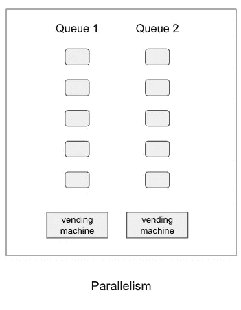
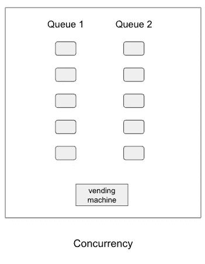
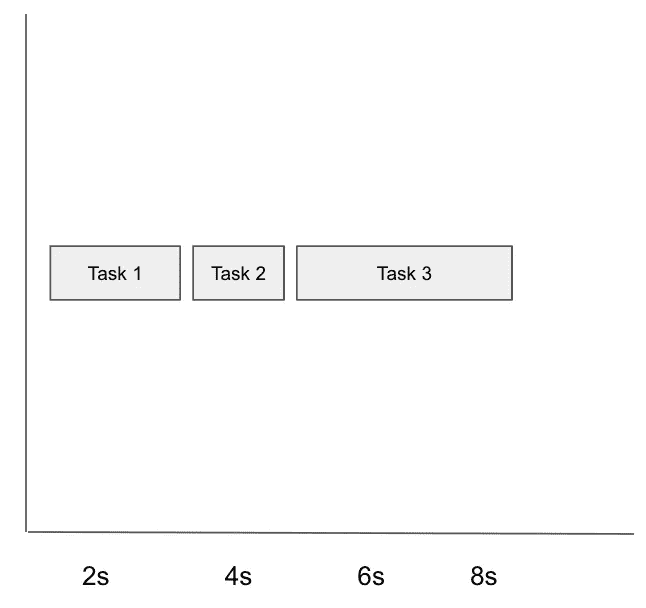
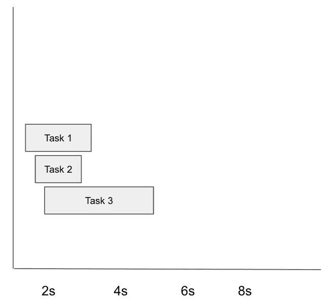
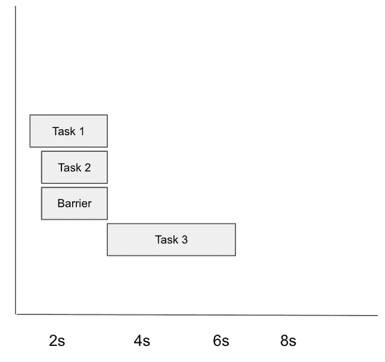

# iOS 中的并发性:GCD

> 原文：<https://medium.com/geekculture/concurrency-in-ios-gcd-c3a69acd7f31?source=collection_archive---------2----------------------->

这将是我第一篇讨论 iOS 中并发性的文章


Photo by [Nicolas Messifet](https://unsplash.com/@nick_brookenheimer?utm_source=medium&utm_medium=referral) on [Unsplash](https://unsplash.com?utm_source=medium&utm_medium=referral)

## 并发性介绍

并发是 iOS 开发人员需要了解的最重要的话题之一。我们可以使用并发来创建流畅、可靠且响应迅速的应用程序。当你程序运行良好时，你的用户很少会欣赏你。但当你的应用程序表现不佳时，你的用户会发出抱怨，甚至会对你在 App Store 上的应用程序评级产生不良影响。所以现在，即使对于初级水平来说，理解并发也是一项必备技能。

从维基百科来看，并发性是*程序、算法或问题的不同部分或单元无序或部分有序执行而不影响最终结果的能力*。最简单的定义是计算机同时执行一个或多个任务的能力。

然而，在单核设备中，它使用一种称为时间切片的技术来执行并发。它在一个线程上运行，然后执行上下文切换到另一个线程，并且在某个时候会再次回到前一个线程。这种技术产生了两个线程同时执行的错觉。在多核设备中，它们可以实现所谓的并行性，可以同时执行多个任务。请看这个简单的插图:



它们之间的关键区别是同时处理多个任务的并发性，而并行性是指同时执行多个任务。

## iOS 中的并发性

为了在 iOS 中实现并发，Apple 实际上推荐我们使用两个低级库，它们是 GCD 和 Operation Queue。那些是什么？我们如何挑选最好的库来实现并发？在本文中，我们将首先讨论 GCD

## 中央调度中心

GCD 或 Grand Central Dispatch 是 Apple 制作的用于管理并发操作的库。它使用队列概念，这意味着第一个到达队列的操作将在其他操作之前被首先执行。

有两种类型的队列，串行队列和并发队列。串行队列确保队列中的所有任务将被逐一执行，等待当前任务完成，然后它将按连续顺序继续执行下一个任务。



另一方面，并发队列将逐个执行所有任务，但不等待当前任务完成，它将继续直接执行下一个任务。



使用并发队列将使我们的应用程序内部的进程比串行队列快得多。但是请记住，当使用并发队列时，我们不能控制任务完成的顺序。这完全取决于操作系统，有很多因素，如延迟、调度算法等。与并发队列相反，串行队列更容易预测输出，因为它保证等待当前任务完成后再继续执行下一个任务。

在 GCD 中，我们可以自己创建一个调度队列对象，也可以使用系统已经提供主队列或全局队列。使用主队列分派的所有任务都将在主线程中执行，是的，它是串行队列，您必须确保您的所有 UI 活动都在主线程上运行。否则它会崩溃。全局队列是并发队列，由操作系统管理。当使用全局队列时，系统将使用服务质量(QoS)来决定任务的优先级。

将任务分派到全局队列时，我们可以使用四种服务质量:

1.  使用`.userInteractive`服务质量的用户交互
    任务需要一个需要立即完成的小负载任务，比如动画或 UI 更新。
2.  用户发起的使用`.userInitiated`服务质量的
    任务是由用户发起的 UI 异步任务。当您需要等待异步任务的即时结果并需要继续 UI 交互时，请使用此服务质量类。系统将使其在全局队列中具有高优先级。例如，当您需要对图像应用复杂滤镜时，请使用此服务质量。
3.  使用`.utility`服务质量的实用程序
    任务通常需要在 UI 端提供一个活动指示器，比如联网，或者执行长时间的计算代码。系统将在全局队列中以低优先级执行该任务。
4.  背景
    该服务质量用于执行用户不必知道进度或结果的任务，如执行维护、清理资源等。系统将在全局队列中以后台优先级执行此任务。

我们可以同步或异步地分派一个关于队列的函数或动作。同步意味着编译器将在当前任务完成后返回控制权。

```
for i in 0...5 {
    print(i)
}print("looping is finished")
// Output
0
1
2
3
4
5
looping is finished
```

上面的代码是同步过程的例子，其中在循环结束后执行“循环结束”的打印语句。

异步进程将使编译器立即返回控制，而不等待当前任务完成。

```
URLSession.shared.dataTask(url: url) { data, response, error in
    print(response)
}.resume()print("is fetching")
```

在上面的代码示例中，print 语句“正在获取”将直接执行，而无需等待会话完全从服务器获取数据。

串行队列和并发队列**与同步和异步**完全不同。请记住，当我们处理串行或并发等术语时，它实际上与系统将使用哪个线程来执行任务有关。而 sync 和 async 是在队列执行级别上决定我们是否应该等待当前任务完成。

## 调度队列

当在您的应用程序中使用 GCD 时，您将使用 DispatchQueue 对象来管理操作。像前面的解释一样，我们可以使用主队列、全局队列，或者我们可以创建一个自定义队列。

```
// perform reload data on the main queue, will executed on the main threadDispatchQueue.main.async {
  self.tableView.reloadData()
}
```

当您想要使用主队列时，可以直接从 DispatchQueue 调用静态属性，并且可以同步或异步地调度一个操作。从上面的示例代码中，我们希望在主队列上从表视图中执行重新加载数据，它将被异步调度，这意味着我们不需要等待重新加载数据首先完成。

永远记住，当你在主队列上工作时，不要同步调度一个动作。如果你这样做，你就阻塞了主线程，很可能会出现死锁的情况，你的应用就会崩溃。

```
func **applyFilter**(to inputImage: UIImage) {
  DispatchQueue.global(qos: .userInitiated).async {
    let finalImage = SomeFilter.**apply**(inputImage)

    DispatchQueue.main.async {
      self.imageView.image = finalImage
    }
  }
}
```

与主队列类似，您可以从 DispatchQueue 调用全局静态属性，并同步或异步执行操作。在上面的代码示例中，我们使用`.userInitiated`服务质量在主线程之外执行过滤操作，通过这种方法，我们的应用程序将运行流畅且响应迅速。当最终图像准备好时，不要忘记通过使用 DispatchQueue 中的 main queue 将 UI 更新分派回主线程。

```
// serial queuelet serialQueue = DispatchQueue(label: "com.example-serialQueue")
serialQueue.async {
  print("1")
}serialQueue.async {
  print("2")
}// concurrent queuelet concurrentQueue = DispatchQueue(label: "com.example-concurrentQueue", attributes: .concurrent)concurrentQueue.async {
  print("3")
}concurrentQueue.async {
  print("4")
}
```

最后，我们可以创建自定义队列。默认情况下，您创建的队列将成为串行队列，除非您将`.concurrent`属性传递给初始化器。

## 分派工作项

正如您在前面的代码示例中看到的，在使用 DispatchQueue 时，它总是使用 closure 来包含我们创建的一些操作。还有另一种向 DispatchQueue 添加操作的方法，即使用 DispatchWorkItem。

```
**let** workItem = DispatchWorkItem {
   print("1")
}DispatchQueue.main.**async**(execute: workItem)
```

这非常简单，最后您将向 DispatchWorkItem 传递一个闭包。然后，您将把工作项作为 DispatchQueue 函数的一个参数。使用 DispatchWorkItem 的好处是可以取消操作。

```
**var** searchWorkItem: DispatchWorkItem?func search(_ query: String) {
    searchWorkItem?.cancel()
    let workItem = DispatchWorkItem {
        // perform search  
    }

    searchWorkItem = workItem        DispatchQueue.main.asyncAfter(deadline: .now() + 0.35, execute: searchWorkItem)
}
```

## 并发问题

虽然我们可以通过实现并发获得很多好处，但是并发有一个主要的敌人，是的，它是共享的可变状态。请记住，并发是指同时处理多个任务，因此我们无法预测并发操作的确切输出。看一下这个样本代码。

```
var someValue: String = ""
let concurrentQueue = DispatchQueue(label: "com.domain.concurrentQueue", attributes: .concurrent)concurrentQueue.async {
    someValue = "A"
}concurrentQueue.async {
    someValue = "B"
}concurrentQueue.async {
    someValue = "C"
}print(someValue)
```

我们有一个名为`someValue`的共享可变状态来保存一个字符串值。然后，我们创建并发队列，并异步执行多个写值操作。当您看到输出时，很可能会打印“C”。但是，如果您运行多次，您可能会发现它将打印“B”而不是“C”。因为竞争条件，这里有不一致的数据。在现实世界中，由于竞争条件，很难再现崩溃问题，这是由于并发而发生的最大问题之一。

线程安全的定义，至少在我看来，是关于共享的可变状态从多线程中被安全访问的地方。因此，有几种方法可以让一个共享的可变状态变得线程安全。首先，我们可以使用同步操作来防止竞争情况，而不是异步调度操作。请记住，在同步操作中，我们将等待当前操作完成，然后才能进行下一个操作。

```
var someValue: String = ""
let concurrentQueue = DispatchQueue(label: "com.domain.concurrentQueue", attributes: .concurrent)concurrentQueue.sync {
    someValue = "A"
}concurrentQueue.sync {
    someValue = "B"
}concurrentQueue.sync {
    someValue = "C"
}print(someValue) // C
```

另一种防止竞争的方法是使用 DispatchBarrier。在并发队列上执行时，DispatchBarrier 会将一个操作作为屏障块。



例如，如果我们将任务 2 分派到带有分派障碍标志的并发队列，它将阻塞另一个任务，直到任务 2 完成，然后继续执行下一个任务。你可以想象一下，如果使用 dispatch barrier，会不会使并发队列有点类似于串行队列。

```
var someValue: String = ""
let concurrentQueue = DispatchQueue(label: "com.domain.concurrentQueue", attributes: .concurrent)concurrentQueue.async(flags: .barrier) {
    someValue = "A"
    print("first write operation: \(someValue)")
}
```

## 从这里去哪里

祝贺您关注这篇文章。我希望现在你已经掌握了基本的并发技能，特别是 iOS 中的 GCD。当您需要对一些任务进行分组时，您可以探索更多关于 DispatchGroup 等未涉及的主题，或者当您需要限制执行线程时，您可能希望了解 DispatchSemaphore。并发性是一个很大的话题，你需要一段时间来思考所有这些问题。谢谢您，下一篇文章再见——可能会谈到 OperationQueue:】。