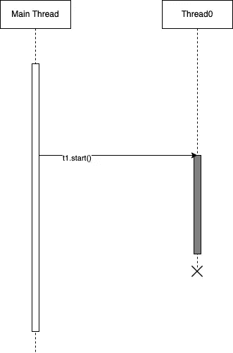
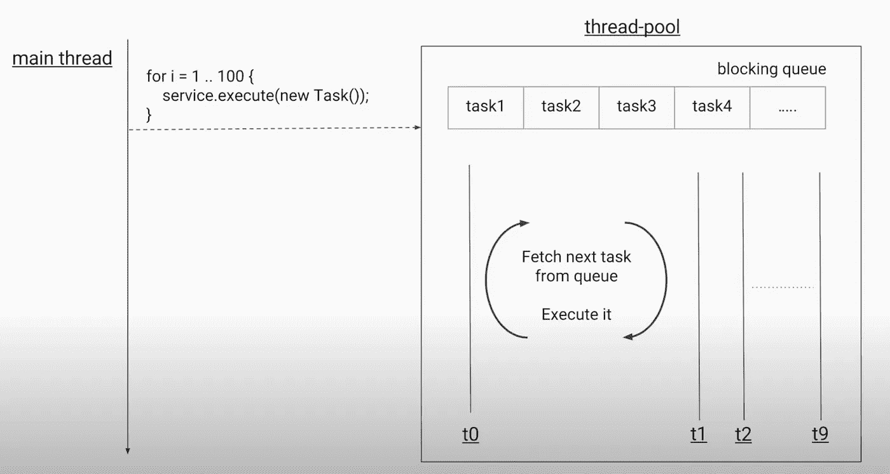
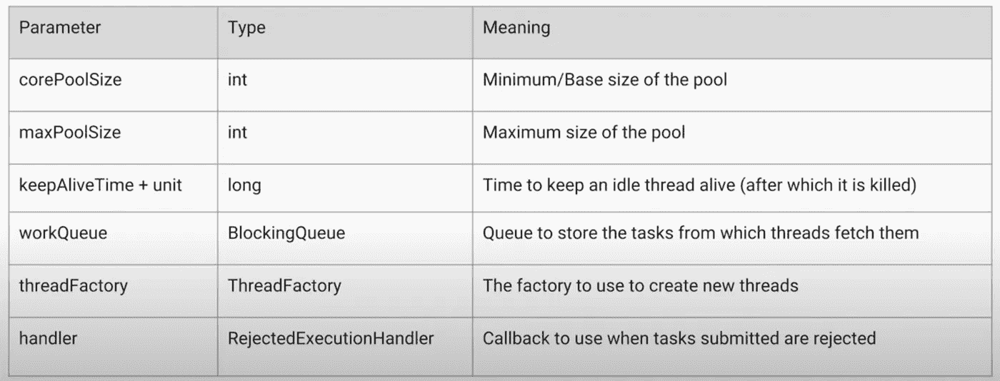
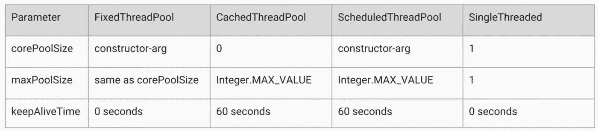
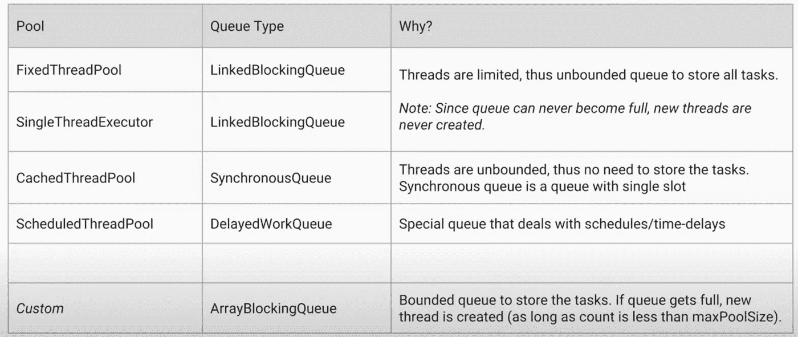
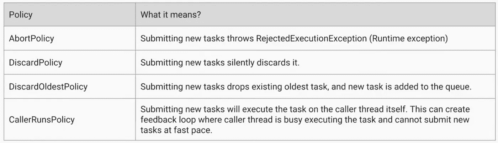

# Java 中的并发性:执行器服务(第 1 部分)

> 原文：<https://medium.com/geekculture/concurrency-in-java-executor-service-part-1-918b5db79c72?source=collection_archive---------1----------------------->

# 概观

Java ExecutorService 是一个 JDK API，它允许用户异步传递要由线程池执行的任务。它可以为执行提交的任务创建和维护一个可重用的线程池。该服务还管理一个队列，用于在任务数量超过线程池中的线程数量时将任务排队。Java ExecutorService 接口存在于 java.util.concurrent 包中。



Async call to thread

# 线程池

如果我们创建一个新的线程来执行每个新的请求，它有几个缺点。创建和销毁线程花费的时间比处理实际请求花费的时间多。创建太多线程会导致系统内存不足。

前面提到的原因需要创建有限数量的线程池，这些线程池是预先创建的，并且可以在任务到来时立即执行。线程创建带来的延迟也被消除了。


Thread Pool

为了使用线程池，我们首先创建一个 ExecutorService 对象，并向它传递一组任务。ThreadPoolExecutor 类允许设置核心和最大池大小。由特定线程运行的可运行程序是按顺序执行的。

可以同时执行的线程数量等于 Java 中 CPU 线程的数量。如果我们有太多与 CPU 内核相当的线程，我们就有一个分时调度。因此，在 CPU 密集型操作的情况下，线程池中有大量线程并不是最佳选择。

另一方面，如果我们从线程中进行 IO 调用(HTTP 调用、db 调用等)。)，我们发出一个调用，需要等待资源的响应。线程停留在等待状态，不依赖于 CPU。所以在这些情况下，我们只需要考虑内存消耗作为参数。

# 阻塞队列

阻塞队列是这样一种队列，当您试图从队列中出列并且队列为空时，或者当您试图向队列中加入项目并且队列已经满了时，该队列会阻塞，类似于*有界信号量*。试图从空队列中出列的线程被阻塞，直到其他线程将一个项目插入到队列中。试图将项目排入满队列的线程会被阻塞，直到其他线程通过将一个或多个项目出队或完全清除队列而在队列中腾出空间。它是在 java.util.concurrent 包中实现的。



# 线程池的类型

Java 支持四种线程池:

*   **固定线程池**:我们有固定数量的线程来执行分配给它的任务。所有任务都存储在线程安全阻塞队列中。
*   **CachedThreadPool** :我们这里没有固定数量的线程。阻塞队列被一个只有一个任务空间的 ***同步队列*** 代替。新请求存储在队列中，同时搜索任何可用的线程。如果没有可用的线程，那么它将创建一个新的线程，并将其添加到池中。它还能够终止空闲时间超过 60 秒的线程。
*   **ScheduledThreadPool** :用于延迟后需要调度的任务。我们可以配置一次性延迟、定期计划，甚至是固定延迟的计划。这里使用了一个 ***延迟队列*** ，因此任务的顺序是不按顺序的。
*   **singlethreaddexecutor**:类似于固定线程执行器，但是阻塞队列的大小是 1。在这种情况下，如果线程由于异常而被终止，则会创建一个新线程。当我们想要确定执行的顺序时，就使用它。

# 实例化执行服务

我们可以用两种方法实例化 ExecutorService:

*   **实现 Executors 类**的工厂方法:创建 *ExecutorService* 最简单的方法是使用 *Executors* 类的工厂方法之一。例如，以下代码行将创建一个包含 10 个线程的线程池:

```
**ExecutorService** executor = Executors.newFixedThreadPool(10);
```

还有其他几种工厂方法来创建满足特定用例的预定义的 *ExecutorService* 。要找到满足您需求的最佳方法，请查阅甲骨文的官方文档。

*   **调用 ExecutorService 的构造函数:**因为 *ExecutorService* 是一个接口，所以可以使用它的任何实现的实例。[*Java . util . concurrent*](https://docs.oracle.com/en/java/javase/11/docs/api/java.base/java/util/concurrent/Executors.html)包中有几个实现可供选择，也可以自己创建。

例如， *ThreadPoolExecutor* 类有几个构造函数，我们可以用它们来配置 Executor 服务及其内部池:

```
**ExecutorService** executorService = 
  new **ThreadPoolExecutor**(1, 1, 0L, TimeUnit.MILLISECONDS,   
  new **LinkedBlockingQueue**<Runnable>());
```

构造函数中有几个参数，可以从源代码定义中看出:

```
public **ThreadPoolExecutor**(int corePoolSize,
                          int maximumPoolSize,
                          long keepAliveTime,
                          TimeUnit unit,
                          BlockingQueue<Runnable> workQueue,
                          RejectedExecutionHandler handler) {
    this(corePoolSize, maximumPoolSize, keepAliveTime, unit, workQueue,
         Executors.defaultThreadFactory(), handler);
```

以下是参数的解释:



所有四种线程池类型的 corePoolSize、maxPoolSize 和 keepAliveTime 的值为:



0 秒的 keepAliveTime 意味着它不适用于这些线程池类型。这是因为我们没有一种机制来杀死 FixedThreadPool 和 SingleThreaded thread pools 中的线程。

类似地，所有这些池类型的队列种类如下:



当队列已满并且请求新任务时，RejectionHandled 开始起作用。我们可以定义在这些场景中会发生什么的策略。这些政策是:



# 关闭线程池

一般来说，当没有任务要处理时， *ExecutorService* 不会被自动销毁。它将保持活力，等待新的工作来做。为了关闭服务，我们有 *shutdown()* 和*shut down now()*API。

***shut down()****方法不会立即销毁 *ExecutorService* 。它将使 *ExecutorService* 停止接受新任务，并在所有正在运行的线程完成当前工作后关闭:*

```
*executorService.shutdown();*
```

****shut down now()***方法试图立即销毁 *ExecutorService* ，但不保证所有正在运行的线程都会同时停止:*

```
*List<Runnable> notExecutedTasks = executorService.shutDownNow();*
```

*此方法返回等待处理的任务列表。由开发人员决定如何处理这些任务。*

*关闭 ExecutorService 的 [*推荐*](https://docs.oracle.com/en/java/javase/11/docs/api/java.base/java/util/concurrent/ExecutorService.html) 方法是两种方法的结合。 *ExecutorService* 可以先停止接受新任务，然后等待一段指定的时间，等待所有任务完成。如果计时器超时，执行将立即停止。这是使用***await termination()***方法实现的。*

**恭喜你坚持到最后！在*[*Twitter*](https://twitter.com/bot_pragmatic)*，*[*GitHub*](https://github.com/abinator-1308/abinator-1308)*，*[*Medium*](/@abhinav.as1308)*，*[*LinkedIn*](https://www.linkedin.com/in/abinator-1308/)*，或者*[*insta gram*](https://www.instagram.com/abinator_1308/)*

**感谢阅读！**

# **参考**

*   **[https://www.youtube.com/watch?v=6Oo-9Can3H8](https://www.youtube.com/watch?v=6Oo-9Can3H8)**
*   **[https://www.baeldung.com/java-executor-service-tutorial](https://www.baeldung.com/java-executor-service-tutorial)**
*   **[https://dzone . com/articles/a-deep-dive-into-the-Java-executor-service](https://dzone.com/articles/a-deep-dive-into-the-java-executor-service)**
*   **【https://www.geeksforgeeks.org/thread-pools-java/ **
*   **[https://www.youtube.com/watch?v=sIkG0X4fqs4](https://www.youtube.com/watch?v=sIkG0X4fqs4)**
*   **[https://dzone.com/articles/java-concurrency-blocking-queu](https://dzone.com/articles/java-concurrency-blocking-queu)**
*   **[https://www.youtube.com/watch?v=Dma_NmOrp1c](https://www.youtube.com/watch?v=Dma_NmOrp1c)**
*   **[https://docs . Oracle . com/javase/8/docs/API/Java/util/concurrent/executorservice . html](https://docs.oracle.com/javase/8/docs/api/java/util/concurrent/ExecutorService.html)**