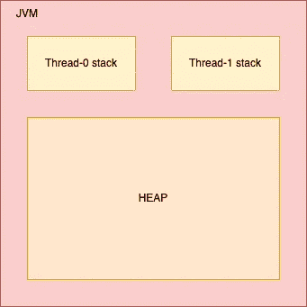

# Java 中的并发性:执行器服务(第 2 部分)

> 原文：<https://medium.com/geekculture/concurrency-in-java-executor-service-part-2-777badd432f7?source=collection_archive---------2----------------------->

这是对
[的继续:Java 中的并发:执行器服务(第一部分)](/geekculture/concurrency-in-java-executor-service-part-1-918b5db79c72)

# Java 中的内存模型

JVM 内部使用的 Java 内存模型在线程堆栈和堆之间划分内存。Java 虚拟机中运行的每个线程都有自己的线程堆栈。线程调用堆栈包含由线程调用以到达当前执行点的方法的历史信息。当线程执行其代码时，调用堆栈会发生变化。

线程调用堆栈还包含执行中使用的局部变量列表。每个线程都有自己的调用栈，不能访问其他线程栈的内存。因此，即使两个不同的线程正在执行相同的代码块，每个线程调用堆栈中也会创建两个局部变量副本。



JVM Memory Management

如果局部变量是基元类型的，它就完全存储在堆栈中。如果不是，那么变量存储在堆中，引用存储在调用堆栈中。静态类变量也和类定义一起存储在堆中。如果两个线程同时在同一个对象上调用一个方法，它们都可以访问对象的成员变量，但是每个线程都有自己的局部变量副本。

JVM 可以利用两种内存:

*   **保留的** —保证主机操作系统可用的大小(但仍未分配，也不能被 JVM 访问)—这只是一个承诺
*   **已提交** —已经被 JVM 获取、访问和分配

# 可调用接口

在 Java 中有两种创建线程的方法，要么扩展 Thread 类，要么实现 Runnable 接口。然而，Runnable 类中缺少的一个特性是 run()方法不能返回值，也就是说，它的返回类型为 null。Callable 解决了这个问题。

可调用接口和可运行接口有两个基本区别:

*   要实现 Runnable 接口，必须实现 run()方法，该方法的返回类型为 null。要实现一个可调用的接口，你需要实现 call()方法，它可以返回一个结果。
*   run()方法不能引发异常。这个特性在可调用接口的 call()方法中也有。

```
public Object call() throws Exception;
```

# 将来的

与 Runnable 类似，Callable 是一个接口，它封装了要在不同线程上运行的任务。但是 Callable 的另一个问题是存储异步处理后到达的结果。未来的界面解决了这个问题。Future 用于存储从不同线程获得的结果，可用于 Runnable 和 Callable 任务。

未来代表异步计算的结果。提供了一些方法来检查计算是否完成、等待计算完成以及检索计算结果。计算完成后，只能使用 get 方法检索结果，如果需要，可以阻塞，直到计算就绪。取消是由 cancel 方法执行的。提供了其他方法来确定任务是正常完成还是被取消。计算一旦完成，就不能取消。如果为了可取消性而使用 Future，但不提供可用的结果，可以声明 Future >形式的类型，并返回 null 作为底层任务的结果。

```
boolean cancel(boolean mayInterruptIfRunning);
boolean isCancelled();
boolean isDone();
V get() throws InterruptedException, ExecutionException;
V get(long timeout, TimeUnit unit)
    throws InterruptedException, ExecutionException, TimeoutException;
```

注意，我们有两个 get()方法的实现。第一个将阻塞执行并无限期等待以获得结果，而另一个将在取消任务执行之前等待特定的时间。

未来任务:可运行界面的未来

FutureTask 类是 Future 的一个实现，它实现了 Runnable，因此可以由执行器执行。例如，上述带有 submit 的结构可以替换为:

future task<String>future = new future task<>(task)；
executor.execute(未来)；

因为 FutureTask 实现了 Runnable，所以可以将 FutureTask 提交给执行器执行。

# 向 ExecutorService 分配任务

*ExecutorService* 可以执行*可运行*和*可调用*任务。我们可以使用几种方法将任务分配给 *ExecutorService* ，包括从 *Executor* 接口继承的 *execute()* ，以及 *submit()* 、 *invokeAny()* 和 *invokeAll()* 。

***execute()*** 方法在未来某个时间执行给定的命令。根据执行器实现的判断，命令可以在新线程、池化线程或调用线程中执行。它有一个返回类型 *void，并且*没有给出任何获得任务执行结果或检查任务状态(它正在运行)的可能性:

```
executorService.execute(runnableTask);
```

***submit()*** 向 *ExecutorService* 提交一个*可调用*或*可运行*任务，并返回一个 *Future 类型的结果。*它提交一个返回值的任务来执行，并返回一个代表任务的未决结果的 Future。未来的 get 方法将在成功完成后返回任务的结果。：

```
Future<String> future = 
  executorService.submit(callableTask);
```

***invokeAny()*** 将一组任务分配给一个 *ExecutorService* ，使每个任务运行，并返回一个任务成功执行的结果(如果有成功的执行)。执行给定的任务，返回一个成功完成的任务的结果(即，没有抛出异常)，如果在给定的超时时间过去之前有任何 do。在正常或异常返回时，未完成的任务将被取消。但是这种方法增加了复杂性。如果在此操作过程中修改了给定的集合，则此方法的结果是未定义的。：

```
**String** result = executorService.invokeAny(callableTasks);
```

***invokeAll()*** 将任务集合分配给 *ExecutorService* ，使每个任务运行，并以 *Future 类型对象列表的形式返回所有任务执行的结果。*用于需要同时执行多个任务的情况。它执行给定的任务，当所有任务完成时，返回一个包含它们的状态和结果的期货列表。***future . isdone***对于返回列表的每个元素都是真。如果在此操作过程中修改了给定的集合，此方法的结果也是未定义的。：

```
List<Future<String>> futures = executorService.invokeAll(callableTasks);
```

# 结论

Java Executor 服务隐藏了大量的复杂性，但也使您可以轻松地钻研和调整内部工作方式。Executors 类提供了许多处理不同用例的工厂方法。

它使开发人员能够控制生成线程的数量和应该由单独线程运行的任务的粒度。ExecutorService 的最佳用例是处理独立的任务，比如根据“一个任务一个线程”的方案处理事务或请求

*恭喜你坚持到最后！在*[*Twitter*](https://twitter.com/bot_pragmatic)*，*[*GitHub*](https://github.com/abinator-1308/abinator-1308)*，*[*Medium*](/@abhinav.as1308)*，*[*LinkedIn*](https://www.linkedin.com/in/abinator-1308/)*或*[*insta gram*](https://www.instagram.com/abinator_1308/)*上随意谈论科技或任何很酷的项目。*

感谢阅读！

# 参考

*   [https://www.youtube.com/watch?v=6Oo-9Can3H8](https://www.youtube.com/watch?v=6Oo-9Can3H8)
*   [https://www.baeldung.com/java-executor-service-tutorial](https://www.baeldung.com/java-executor-service-tutorial)
*   [https://dzone . com/articles/a-deep-dive-into-the-Java-executor-service](https://dzone.com/articles/a-deep-dive-into-the-java-executor-service)
*   【https://www.geeksforgeeks.org/thread-pools-java/ 
*   [https://www.youtube.com/watch?v=sIkG0X4fqs4](https://www.youtube.com/watch?v=sIkG0X4fqs4)
*   [https://www.youtube.com/watch?v=Dma_NmOrp1c](https://www.youtube.com/watch?v=Dma_NmOrp1c)
*   [https://docs . Oracle . com/javase/8/docs/API/Java/util/concurrent/executorservice . html](https://docs.oracle.com/javase/8/docs/api/java/util/concurrent/ExecutorService.html)
*   [https://www.baeldung.com/java-local-variables-thread-safe](https://www.baeldung.com/java-local-variables-thread-safe)
*   [https://dzone . com/articles/how-much-memory-do-a-Java-thread-take](https://dzone.com/articles/how-much-memory-does-a-java-thread-take)
*   [https://www . bael dung . com/Java-Stack-heap #:~:text = Stack % 20 memory % 20 in % 20 Java % 20 is，%2DOut%20(LIFO)%20order。](https://www.baeldung.com/java-stack-heap#:~:text=Stack%20Memory%20in%20Java%20is,%2DOut%20(LIFO)%20order.)